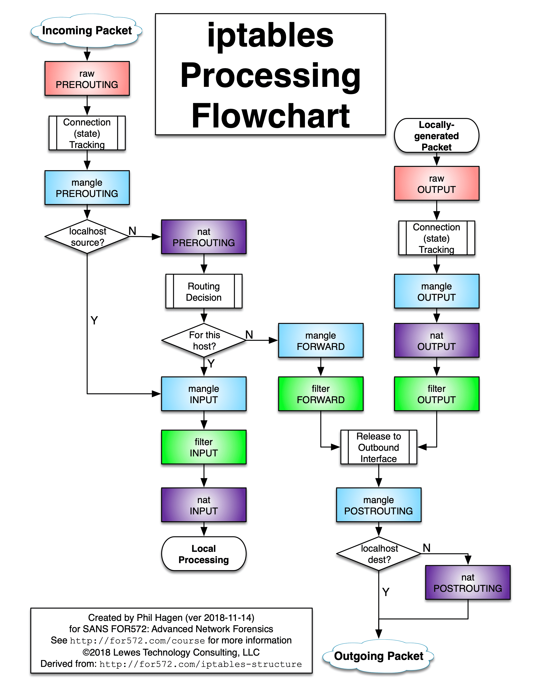
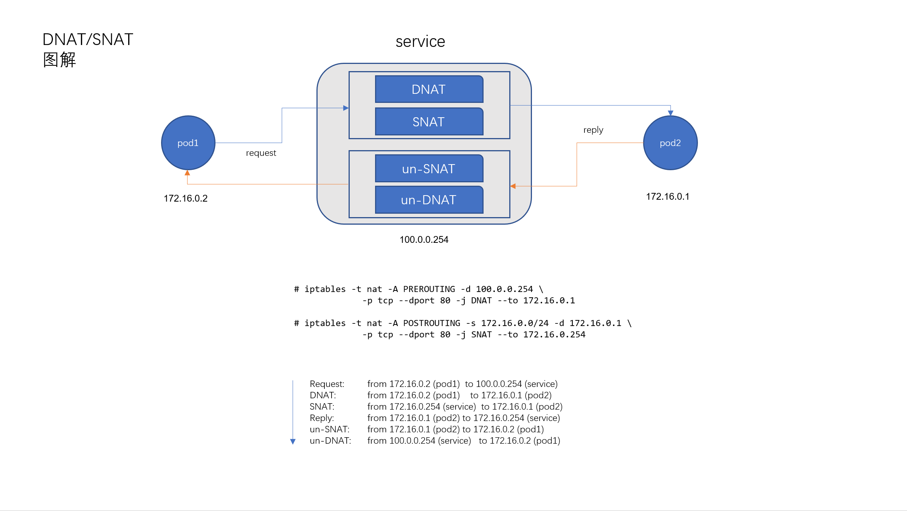
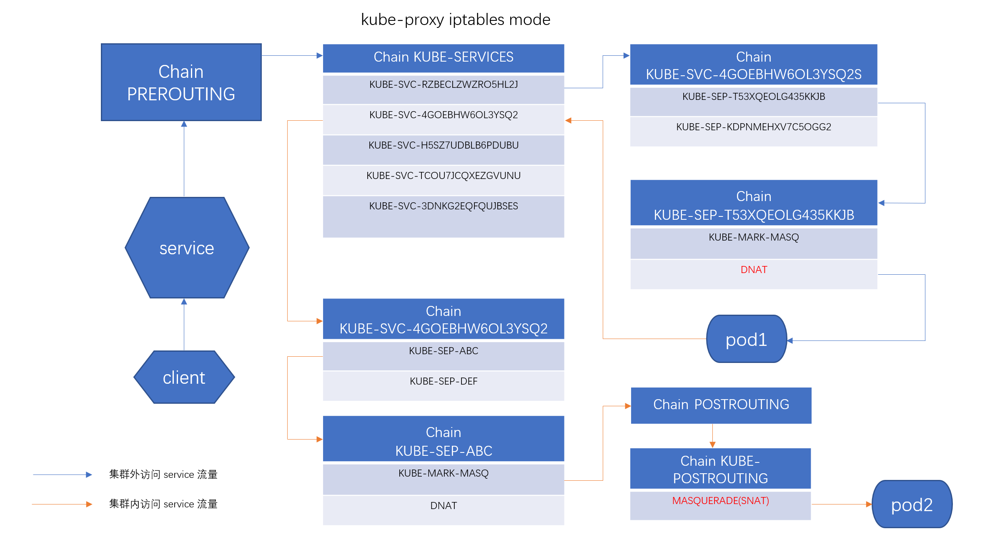
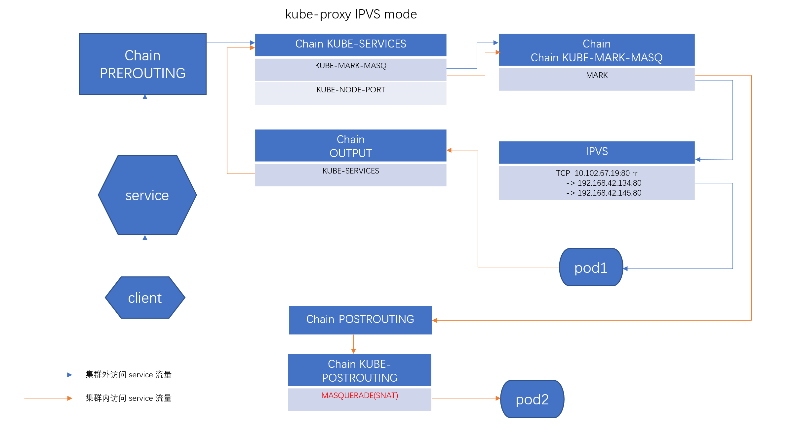

# kube-proxy 工作模式分析


## Services

集群所有 `services` 信息如下：


```
root@kube:~# kubectl get svc --all-namespaces
NAMESPACE     NAME                   TYPE        CLUSTER-IP       EXTERNAL-IP   PORT(S)                        AGE
default       appsvc1                ClusterIP   10.99.235.135    <none>        80/TCP                         42d
default       appsvc2                ClusterIP   10.102.67.19     <none>        80/TCP                         42d
default       coredns                ClusterIP   10.108.180.158   <none>        53/UDP,53/TCP                  19d
default       coredns-headless       ClusterIP   None             <none>        53/UDP,53/TCP                  19d
default       kubernetes             ClusterIP   10.96.0.1        <none>        443/TCP                        62d
ingress       default-backend        ClusterIP   10.100.169.254   <none>        80/TCP                         42d
ingress       nginx-ingress          NodePort    10.97.11.0       <none>        80:30000/TCP,18080:32000/TCP   42d
ingress       nginx-ingress-latest   NodePort    10.105.76.172    <none>        80:30001/TCP,18080:32001/TCP   10d
kube-system   calico-etcd            ClusterIP   10.96.232.136    <none>        6666/TCP                       47h
kube-system   kube-dns               ClusterIP   10.96.0.10       <none>        53/UDP,53/TCP                  62d
kube-system   tiller-deploy          ClusterIP   10.99.131.10     <none> 
```

重点关注 `default/appsvc2 ClusterIP service`：

```
root@kube:~# kubectl describe svc -n=default appsvc2
Name:              appsvc2
Namespace:         default
Labels:            <none>
Annotations:       <none>
Selector:          app=app2
Type:              ClusterIP
IP:                10.102.67.19
Port:              <unset>  80/TCP
TargetPort:        80/TCP
Endpoints:         192.168.42.138:80,192.168.42.189:80
Session Affinity:  None
Events:            <none>
```
和 `ingress/nginx-ingress-latest NodePort service`:


```
root@kube:~# kubectl describe svc -n=ingress nginx-ingress-latest
Name:                     nginx-ingress-latest
Namespace:                ingress
Labels:                   <none>
Annotations:              <none>
Selector:                 app=nginx-ingress-lb-latest
Type:                     NodePort
IP:                       10.105.76.172
Port:                     http  80/TCP
TargetPort:               80/TCP
NodePort:                 http  30001/TCP
Endpoints:                10.0.2.15:80
Port:                     http-mgmt  18080/TCP
TargetPort:               18080/TCP
NodePort:                 http-mgmt  32001/TCP
Endpoints:                10.0.2.15:18080
Session Affinity:         None
External Traffic Policy:  Cluster
Events:                   <none>
```

## iptables 介绍

* `Iptables` 由 `filter`, `nat`, `mangle`, `raw`, `security` 等几个 `table` 组成。一个 `table` 由内置的 `chains` 和 一些用户自定的 `chains` 组成。

* 每个 `chain` 由一系列的用于匹配封包（`packet`）的 `rules` 组成，`rule` 指定了如果一个 `packet 匹配将要执行的操作，也称为 `target`。

* `rules` 是顺序匹配的，如果一条 `rule` 没有匹配，则尝试匹配下一条 `rule`。如果一条 `rule` 匹配了，那么下一条 `rule` 由这一条 `rule` 的 `target` 值指定。`target` 可以为内置的 `ACCEPT`, `DROP`, `LOG` 等，也可以是一条用户自定义 `chain`，或者是 `iptables-extensions(8)` 里定义的扩展。

**`Iptables` 根据流量包是否从外部进入，是否需要转发以及是否从本机生成为封包指定不同的流经路径**，具体描述如下图：




## iptables 模式

### 入流量

**入流量是指由集群外部访问 service 的流量。**

`Iptables` 入流量的 `chain` 路径是 `PREROUTING@nat -> INPUT@nat`。

#### ClusterIP


所有入流量跳转到 `KUBE-SERVICES` target chain:

```
Chain PREROUTING (policy ACCEPT 0 packets, 0 bytes)Chain PREROUTING (policy ACCEPT 0 packets, 0 bytes)
pkts bytes target     prot opt in     out     source               destination
    9   558 KUBE-SERVICES  all  --  *      *       0.0.0.0/0            0.0.0.0/0            /* kubernetes service portals */
```

`KUBE-SERVICES chain` 里为每个 `ClusterIP service` 定义一个名为 `KUBE-SERVICE-XXX` 格式的 `target chain`，匹配条件是 `destination` 为 `service cluster ip` 加上 `dpt` 为 `service port`； 

又为所有 `NodePort services` 定义了一个 `KUBE-NODEPORTS` 的 `target chain`（最后一项），其匹配条件是 `ADDRTYPE match dst-type LOCAL`，即目标地址为集群 `Node` 拥有的地址，符合 `NodePort` 的定义:


```
Chain KUBE-SERVICES (2 references)
pkts bytes target     prot opt in     out     source               destination
    0     0 KUBE-SVC-TCOU7JCQXEZGVUNU  udp  --  *      *       0.0.0.0/0            10.96.0.10           /* kube-system/kube-dns:dns cluster IP */ udp dpt:53
    0     0 KUBE-SVC-4GOEBHW6OL3YSQ2  tcp  --  *      *       0.0.0.0/0            10.102.67.19         /* default/appsvc2: cluster IP */ tcp dpt:80
    0     0 KUBE-SVC-H5SZ7UDBLB6PDUBU  tcp  --  *      *       0.0.0.0/0            10.97.11.0           /* ingress/nginx-ingress:http cluster IP */ tcp dpt:80
    0     0 KUBE-SVC-RZBECLZWZRO5HL2J  tcp  --  *      *       0.0.0.0/0            10.105.76.172        /* ingress/nginx-ingress-latest:http cluster IP */ tcp dpt:80
    0     0 KUBE-SVC-3DNKG2EQFQUJBSES  tcp  --  *      *       0.0.0.0/0            10.105.76.172        /* ingress/nginx-ingress-latest:http-mgmt cluster IP */ tcp dpt:18080
    0     0 KUBE-SVC-K7J76NXP7AUZVFGS  tcp  --  *      *       0.0.0.0/0            10.99.131.10         /* kube-system/tiller-deploy:tiller cluster IP */ tcp dpt:44134
    0     0 KUBE-SVC-PFRDUXZEVBX5AIDC  tcp  --  *      *       0.0.0.0/0            10.108.180.158       /* default/coredns:dns-tcp cluster IP */ tcp dpt:53
    0     0 KUBE-SVC-BA5PBP57CSS4A4H3  tcp  --  *      *       0.0.0.0/0            10.97.11.0           /* ingress/nginx-ingress:http-mgmt cluster IP */ tcp dpt:18080
    0     0 KUBE-SVC-JKXIOCCBPZXMHNK3  udp  --  *      *       0.0.0.0/0            10.108.180.158       /* default/coredns:dns cluster IP */ udp dpt:53
    0     0 KUBE-SVC-BVEYTIW5E7VAUTUJ  tcp  --  *      *       0.0.0.0/0            10.100.169.254       /* ingress/default-backend: cluster IP */ tcp dpt:80
    0     0 KUBE-SVC-ERIFXISQEP7F7OF4  tcp  --  *      *       0.0.0.0/0            10.96.0.10           /* kube-system/kube-dns:dns-tcp cluster IP */ tcp dpt:53
    0     0 KUBE-SVC-JNI67WSAMQHGRFK3  tcp  --  *      *       0.0.0.0/0            10.99.235.135        /* default/appsvc1: cluster IP */ tcp dpt:80
    0     0 KUBE-SVC-NPX46M4PTMTKRN6Y  tcp  --  *      *       0.0.0.0/0            10.96.0.1            /* default/kubernetes:https cluster IP */ tcp dpt:443
    0     0 KUBE-SVC-NTYB37XIWATNM25Y  tcp  --  *      *       0.0.0.0/0            10.96.232.136        /* kube-system/calico-etcd: cluster IP */ tcp dpt:6666
  19  1140 KUBE-NODEPORTS  all  --  *      *       0.0.0.0/0            0.0.0.0/0            /* kubernetes service nodeports; NOTE: this must be the last rule in this chain */ ADDRTYPE match dst-type LOCA
```

先来观察 `ClusterIP service` 的 `target chain`，以 `KUBE-SVC-4GOEBHW6OL3YSQ2S(default/appsvc2)` 举例：

```
Chain KUBE-SVC-4GOEBHW6OL3YSQ2S (1 references)
pkts bytes target     prot opt in     out     source               destination
    0     0 KUBE-SEP-T53XQEOLG435KKJB  all  --  *      *       0.0.0.0/0            0.0.0.0/0            statistic mode random probability 0.50000000000
    0     0 KUBE-SEP-KDPNMEHXV7C5OGG2  all  --  *      *       0.0.0.0/0            0.0.0.0/0
```

这个 `service chain` 里为每个后端 `endpoint` 设置了一条 `target chain`，名为 `KUBE-SEP-XXX` 形式，并定义了每条 `0.5 `的访问比例，也就是 `service` 负载均衡的 `ROUND ROBIN` 策略。


其中一个 `endpoint` 对应的 `chain` 规则如下：

```
Chain KUBE-SEP-T53XQEOLG435KKJB (1 references)
pkts bytes target     prot opt in     out     source               destination
    0     0 KUBE-MARK-MASQ  all  --  *      *       192.168.42.138       0.0.0.0/0
    0     0 DNAT       tcp  --  *      *       0.0.0.0/0            0.0.0.0/0            tcp to:192.168.42.138:80

```

这里虽然定义了两条规则，但此时流量只会匹配到 `DNAT` 这一条规则，匹配条件是 `destination: 192.168.42.138:80`，即目标地址为后端 `endpoint` 地址，其 `target` 是将 `ClusterIP` 的流量使用 `DNAT（Destination NAT）`的方式转发到后端 `endpoint(192.168.42.138:80)`。

#### NodePort

上面提到，所有 `NodePort` 入流量会匹配到 `KUBE-NODEPORTS chain`。这个 `chain` 里为每个 `NodePort service` 定义了两条规则，先关注 `target` 为 `KUBE-SVC-XXX chain` 形式的规则，以 `KUBE-SVC-RZBECLZWZRO5HL2J` 举例，其匹配条件是 `tcp dpt:30001`，即该 `service(ingress/nginx-ingress-latest)` 的 `NodePort`： (注：这里也会同时匹配 KUBE-MARK-MASQ 规则，但是这对封包的流经路径没有影响，见下面的出流量分析。)

```
Chain KUBE-NODEPORTS (1 references)
pkts bytes target     prot opt in     out     source               destination
    0     0 KUBE-MARK-MASQ  tcp  --  *      *       0.0.0.0/0            0.0.0.0/0            /* ingress/nginx-ingress:http */ tcp dpt:30000
    0     0 KUBE-SVC-H5SZ7UDBLB6PDUBU  tcp  --  *      *       0.0.0.0/0            0.0.0.0/0            /* ingress/nginx-ingress:http */ tcp dpt:30000
    0     0 KUBE-MARK-MASQ  tcp  --  *      *       0.0.0.0/0            0.0.0.0/0            /* ingress/nginx-ingress-latest:http */ tcp dpt:30001
    0     0 KUBE-SVC-RZBECLZWZRO5HL2J  tcp  --  *      *       0.0.0.0/0            0.0.0.0/0            /* ingress/nginx-ingress-latest:http */ tcp dpt:30001
    0     0 KUBE-MARK-MASQ  tcp  --  *      *       0.0.0.0/0            0.0.0.0/0            /* ingress/nginx-ingress-latest:http-mgmt */ tcp dpt:32001
    0     0 KUBE-SVC-3DNKG2EQFQUJBSES  tcp  --  *      *       0.0.0.0/0            0.0.0.0/0            /* ingress/nginx-ingress-latest:http-mgmt */ tcp dpt:32001
    0     0 KUBE-MARK-MASQ  tcp  --  *      *       0.0.0.0/0            0.0.0.0/0            /* ingress/nginx-ingress:http-mgmt */ tcp dpt:32000
    0     0 KUBE-SVC-BA5PBP57CSS4A4H3  tcp  --  *      *       0.0.0.0/0            0.0.0.0/0            /* ingress/nginx-ingress:http-mgmt */ tcp dpt:32000
```

`KUBE-SVC-RZBECLZWZRO5HL2J chain` 又跳转到 `KUBE-SEP-B25KHNOUZSX4F53T target`:

```
Chain KUBE-SVC-RZBECLZWZRO5HL2J (2 references)
pkts bytes target     prot opt in     out     source               destination
    0     0 KUBE-SEP-B25KHNOUZSX4F53T  all  --  *      *       0.0.0.0/0            0.0.0.0/0
```

`KUBE-SEP-B25KHNOUZSX4F53T chain` 内容如下，其功能是使用 `DNAT` 将流量转发到后端 `enpoint`，与 `ClusterIP service` 无异:

```
Chain KUBE-SEP-B25KHNOUZSX4F53T (1 references)
pkts bytes target     prot opt in     out     source               destination
    0     0 KUBE-MARK-MASQ  all  --  *      *       10.0.2.15            0.0.0.0/0
    0     0 DNAT       tcp  --  *      *       0.0.0.0/0            0.0.0.0/0            tcp to:10.0.2.15:80
```

综上，**`ClusterIP` 和 `NodePort service` 都是使用 `iptables` 的 `DNAT` 功能将流量导入到后端 `endpoint`**。

### 出流量

出流量是指由集群内的 `pod` 访问 `service` 的流量。

**`Iptables` 出流量的 `chain` 路径是 `OUTPUT@nat -> POSTROUTING@nat`。**

`OUTPUT chain` 如下，与入流量情形一样，也是所有流量跳转到 `KUBE-SERVICES chain`：

```
Chain OUTPUT (policy ACCEPT 24 packets, 1440 bytes)
pkts bytes target     prot opt in     out     source               destination
  804 48270 cali-OUTPUT  all  --  *      *       0.0.0.0/0            0.0.0.0/0            /* cali:tVnHkvAo15HuiPy0 */
  870 52230 KUBE-SERVICES  all  --  *      *       0.0.0.0/0            0.0.0.0/0            /* kubernetes service portals */
  384 23040 DOCKER     all  --  *      *       0.0.0.0/0           !127.0.0.0/8          ADDRTYPE match dst-type LOCAL
```

#### ClusterIP

与入流量类似，`ClusterIP service` 的出流量也会匹配到各自 `service` 的 `target chain:`

```
Chain KUBE-SERVICES (2 references)
pkts bytes target     prot opt in     out     source               destination
    0     0 KUBE-SVC-TCOU7JCQXEZGVUNU  udp  --  *      *       0.0.0.0/0            10.96.0.10           /* kube-system/kube-dns:dns cluster IP */ udp dpt:53
    0     0 KUBE-SVC-4GOEBHW6OL3YSQ2  tcp  --  *      *       0.0.0.0/0            10.102.67.19         /* default/appsvc2: cluster IP */ tcp dpt:80
    0     0 KUBE-SVC-H5SZ7UDBLB6PDUBU  tcp  --  *      *       0.0.0.0/0            10.97.11.0           /* ingress/nginx-ingress:http cluster IP */ tcp dpt:80
    0     0 KUBE-SVC-RZBECLZWZRO5HL2J  tcp  --  *      *       0.0.0.0/0            10.105.76.172        /* ingress/nginx-ingress-latest:http cluster IP */ tcp dpt:80
    0     0 KUBE-SVC-3DNKG2EQFQUJBSES  tcp  --  *      *       0.0.0.0/0            10.105.76.172        /* ingress/nginx-ingress-latest:http-mgmt cluster IP */ tcp dpt:18080
    0     0 KUBE-SVC-K7J76NXP7AUZVFGS  tcp  --  *      *       0.0.0.0/0            10.99.131.10         /* kube-system/tiller-deploy:tiller cluster IP */ tcp dpt:44134
    0     0 KUBE-SVC-PFRDUXZEVBX5AIDC  tcp  --  *      *       0.0.0.0/0            10.108.180.158       /* default/coredns:dns-tcp cluster IP */ tcp dpt:53
    0     0 KUBE-SVC-BA5PBP57CSS4A4H3  tcp  --  *      *       0.0.0.0/0            10.97.11.0           /* ingress/nginx-ingress:http-mgmt cluster IP */ tcp dpt:18080
    0     0 KUBE-SVC-JKXIOCCBPZXMHNK3  udp  --  *      *       0.0.0.0/0            10.108.180.158       /* default/coredns:dns cluster IP */ udp dpt:53
    0     0 KUBE-SVC-BVEYTIW5E7VAUTUJ  tcp  --  *      *       0.0.0.0/0            10.100.169.254       /* ingress/default-backend: cluster IP */ tcp dpt:80
    0     0 KUBE-SVC-ERIFXISQEP7F7OF4  tcp  --  *      *       0.0.0.0/0            10.96.0.10           /* kube-system/kube-dns:dns-tcp cluster IP */ tcp dpt:53
    0     0 KUBE-SVC-JNI67WSAMQHGRFK3  tcp  --  *      *       0.0.0.0/0            10.99.235.135        /* default/appsvc1: cluster IP */ tcp dpt:80
    0     0 KUBE-SVC-NPX46M4PTMTKRN6Y  tcp  --  *      *       0.0.0.0/0            10.96.0.1            /* default/kubernetes:https cluster IP */ tcp dpt:443
    0     0 KUBE-SVC-NTYB37XIWATNM25Y  tcp  --  *      *       0.0.0.0/0            10.96.232.136        /* kube-system/calico-etcd: cluster IP */ tcp dpt:6666
  19  1140 KUBE-NODEPORTS  all  --  *      *       0.0.0.0/0            0.0.0.0/0            /* kubernetes service nodeports; NOTE: this must be the last rule in this chain */ ADDRTYPE match dst-type LOCAL
```
跳转以后，还是以 `KUBE-SVC-4GOEBHW6OL3YSQ2S(default/appsvc2)` 举例，又跳转到 `endpoint` 对应的 `target chain`：

```
Chain KUBE-SVC-4GOEBHW6OL3YSQ2S (1 references)
pkts bytes target     prot opt in     out     source               destination
    0     0 KUBE-SEP-T53XQEOLG435KKJB  all  --  *      *       0.0.0.0/0            0.0.0.0/0            statistic mode random probability 0.50000000000
    0     0 KUBE-SEP-KDPNMEHXV7C5OGG2  all  --  *      *       0.0.0.0/0            0.0.0.0/0
```
在 `endpoint` 对应的 `chain`里，出流量会匹配第一条规则，匹配条件是 `source: 192.168.42.138`，即来源地址是后端 `endpoint`:

```
hain KUBE-SEP-T53XQEOLG435KKJB (1 references)
pkts bytes target     prot opt in     out     source               destination
    0     0 KUBE-MARK-MASQ  all  --  *      *       192.168.42.138       0.0.0.0/0
    0     0 DNAT       tcp  --  *      *       0.0.0.0/0            0.0.0.0/0            tcp to:192.168.42.138:80
```

此时封包进一步跳转进入到 `KUBE-MARK-MASQ chain` 中，其规则就一条，给流量封包打上 `0x4000` 的标记：


```
hain KUBE-MARK-MASQ (25 references)
pkts bytes target     prot opt in     out     source               destination
    0     0 MARK       all  --  *      *       0.0.0.0/0            0.0.0.0/0            MARK or 0x4000
```

至此出流量的 `OUTPUT chain` 走完。接下来进行 `POSTROUTING chain`：

```
Chain POSTROUTING (policy ACCEPT 24 packets, 1440 bytes)
pkts bytes target     prot opt in     out     source               destination
  804 48270 cali-POSTROUTING  all  --  *      *       0.0.0.0/0            0.0.0.0/0            /* cali:O3lYWMrLQYEMJtB5 */
  870 52230 KUBE-POSTROUTING  all  --  *      *       0.0.0.0/0            0.0.0.0/0            /* kubernetes postrouting rules */
    0     0 MASQUERADE  all  --  *      !docker0  172.18.0.0/16        0.0.0.0/0
```


这里出流量跳转到 `KUBE-POSTROUTING chain`： (疑问：`cali-POSTROUTING` 和` KUBE-POSTROUTING` 匹配规则一致，第一条为什么没有屏蔽第二条的执行呢？有待进一步调查。)

```
Chain KUBE-POSTROUTING (1 references)
pkts bytes target     prot opt in     out     source               destination
    0     0 MASQUERADE  all  --  *      *       0.0.0.0/0            0.0.0.0/0            /* kubernetes service traffic requiring SNAT */ mark match 0x4000/0x4000 
```

`KUBE-POSTROUTING chain` 很简单，就是将之前标记过 `0x4000` 的封包进行 `MASQUERADE`。`MASQUERADE` 是一种更健壮的 `SNAT`，即将封包的源地址由后端的 `endpoint` 变更为 `Cluster IP`。之所以在这里进行源地址转换，是因为由 `endpoint(pod1)` 的发出的请求封包， 经过 `service` 的分发到达另一个 `endpoint(pod2)` 时，由于所有的 `endpoints(pods)` 都处于同一子网，根据路由定义在一个子网的流量封包不会经过路由，而是直接返回到请求 `pod`。


请求封包此前不做 `SNAT` 的话，因为请求 `endpoint(pod1)` 访问的地址是 `Cluster IP`，返回封包的源地址却是 `pod2` 的地址，因此这个响应包会被拒绝。 解决办法就是 `pod1` 访问 `service`（会被分发到 pod2）时，使用 `SNAT(MASQUERADE)` 伪装源地址为 `ClusterIP`，这样 `pod2` 的返回封包就会经过 `service `的进一步路由。




#### NodePort


与 `ClusterIP service` 不同，在 `KUBE-SERVICES chain` 中，`NodePort service` 的出流量只会匹配最后一项的 `KUBE-NODEPORTS target`:

```
Chain KUBE-SERVICES (2 references)
pkts bytes target     prot opt in     out     source               destination
    0     0 KUBE-SVC-TCOU7JCQXEZGVUNU  udp  --  *      *       0.0.0.0/0            10.96.0.10           /* kube-system/kube-dns:dns cluster IP */ udp dpt:53
    0     0 KUBE-SVC-4GOEBHW6OL3YSQ2  tcp  --  *      *       0.0.0.0/0            10.102.67.19         /* default/appsvc2: cluster IP */ tcp dpt:80
    0     0 KUBE-SVC-H5SZ7UDBLB6PDUBU  tcp  --  *      *       0.0.0.0/0            10.97.11.0           /* ingress/nginx-ingress:http cluster IP */ tcp dpt:80
    0     0 KUBE-SVC-RZBECLZWZRO5HL2J  tcp  --  *      *       0.0.0.0/0            10.105.76.172        /* ingress/nginx-ingress-latest:http cluster IP */ tcp dpt:80
    0     0 KUBE-SVC-3DNKG2EQFQUJBSES  tcp  --  *      *       0.0.0.0/0            10.105.76.172        /* ingress/nginx-ingress-latest:http-mgmt cluster IP */ tcp dpt:18080
    0     0 KUBE-SVC-K7J76NXP7AUZVFGS  tcp  --  *      *       0.0.0.0/0            10.99.131.10         /* kube-system/tiller-deploy:tiller cluster IP */ tcp dpt:44134
    0     0 KUBE-SVC-PFRDUXZEVBX5AIDC  tcp  --  *      *       0.0.0.0/0            10.108.180.158       /* default/coredns:dns-tcp cluster IP */ tcp dpt:53
    0     0 KUBE-SVC-BA5PBP57CSS4A4H3  tcp  --  *      *       0.0.0.0/0            10.97.11.0           /* ingress/nginx-ingress:http-mgmt cluster IP */ tcp dpt:18080
    0     0 KUBE-SVC-JKXIOCCBPZXMHNK3  udp  --  *      *       0.0.0.0/0            10.108.180.158       /* default/coredns:dns cluster IP */ udp dpt:53
    0     0 KUBE-SVC-BVEYTIW5E7VAUTUJ  tcp  --  *      *       0.0.0.0/0            10.100.169.254       /* ingress/default-backend: cluster IP */ tcp dpt:80
    0     0 KUBE-SVC-ERIFXISQEP7F7OF4  tcp  --  *      *       0.0.0.0/0            10.96.0.10           /* kube-system/kube-dns:dns-tcp cluster IP */ tcp dpt:53
    0     0 KUBE-SVC-JNI67WSAMQHGRFK3  tcp  --  *      *       0.0.0.0/0            10.99.235.135        /* default/appsvc1: cluster IP */ tcp dpt:80
    0     0 KUBE-SVC-NPX46M4PTMTKRN6Y  tcp  --  *      *       0.0.0.0/0            10.96.0.1            /* default/kubernetes:https cluster IP */ tcp dpt:443
    0     0 KUBE-SVC-NTYB37XIWATNM25Y  tcp  --  *      *       0.0.0.0/0            10.96.232.136        /* kube-system/calico-etcd: cluster IP */ tcp dpt:6666
  19  1140 KUBE-NODEPORTS  all  --  *      *       0.0.0.0/0            0.0.0.0/0            /* kubernetes service nodeports; NOTE: this must be the last rule in this chain */ ADDRTYPE match dst-type LOCAL
```

在 `KUBE-NODEPORTS` 中，与入流量的 `NodePort` 服务相同，出流量也会匹配到某个 `KUBE-SERVICE-XXX`，以 `KUBE-SVC-RZBECLZWZRO5HL2J(ingress/nginx-ingress-latest)` 举例，其匹配条件是 `tcp dpt:30001`，即出流量目标端口是该 `service` 的 `NodePort`。 (注：这里也会同时匹配 `KUBE-MARK-MASQ` 规则，直接对封包打标记，原因未知。)

```
Chain KUBE-NODEPORTS (1 references)
pkts bytes target     prot opt in     out     source               destination
    0     0 KUBE-MARK-MASQ  tcp  --  *      *       0.0.0.0/0            0.0.0.0/0            /* ingress/nginx-ingress:http */ tcp dpt:30000
    0     0 KUBE-SVC-H5SZ7UDBLB6PDUBU  tcp  --  *      *       0.0.0.0/0            0.0.0.0/0            /* ingress/nginx-ingress:http */ tcp dpt:30000
    0     0 KUBE-MARK-MASQ  tcp  --  *      *       0.0.0.0/0            0.0.0.0/0            /* ingress/nginx-ingress-latest:http */ tcp dpt:30001
    0     0 KUBE-SVC-RZBECLZWZRO5HL2J  tcp  --  *      *       0.0.0.0/0            0.0.0.0/0            /* ingress/nginx-ingress-latest:http */ tcp dpt:30001
    0     0 KUBE-MARK-MASQ  tcp  --  *      *       0.0.0.0/0            0.0.0.0/0            /* ingress/nginx-ingress-latest:http-mgmt */ tcp dpt:32001
    0     0 KUBE-SVC-3DNKG2EQFQUJBSES  tcp  --  *      *       0.0.0.0/0            0.0.0.0/0            /* ingress/nginx-ingress-latest:http-mgmt */ tcp dpt:32001
    0     0 KUBE-MARK-MASQ  tcp  --  *      *       0.0.0.0/0            0.0.0.0/0            /* ingress/nginx-ingress:http-mgmt */ tcp dpt:32000
    0     0 KUBE-SVC-BA5PBP57CSS4A4H3  tcp  --  *      *       0.0.0.0/0            0.0.0.0/0            /* ingress/nginx-ingress:http-mgmt */ tcp dpt:32000
```
    
`KUBE-SVC-RZBECLZWZRO5HL2J chain` 又跳转到 `KUBE-SEP-B25KHNOUZSX4F53T target`:

```
Chain KUBE-SVC-RZBECLZWZRO5HL2J (2 references)
pkts bytes target     prot opt in     out     source               destination
    0     0 KUBE-SEP-B25KHNOUZSX4F53T  all  --  *      *       0.0.0.0/0            0.0.0.0/0
```


在上面入流量的分析中有提到，入流量会匹配这里的 `DNAT` 规则，而出流量只会匹配到 `KUBE-MARK-MASQ` 这条规则，其匹配条件是来源地址为 `source: 10.0.2.15`，即来源地址为 `endpoint` 地址。

```
Chain KUBE-SEP-B25KHNOUZSX4F53T (1 references)
pkts bytes target     prot opt in     out     source               destination
    0     0 KUBE-MARK-MASQ  all  --  *      *       10.0.2.15            0.0.0.0/0
    0     0 DNAT       tcp  --  *      *       0.0.0.0/0            0.0.0.0/0            tcp to:10.0.2.15:80
```

跳转后进入的 `KUBE-MARK-MASQ chain` 其规则就一条，给流量封包打上 `0x4000` 的标记：

```
Chain KUBE-MARK-MASQ (25 references)
pkts bytes target     prot opt in     out     source               destination
    0     0 MARK       all  --  *      *       0.0.0.0/0            0.0.0.0/0            MARK or 0x4000
```

至此出流量的 `OUTPUT chain` 走完。接下来进行 `POSTROUTING chain`：

```
Chain POSTROUTING (policy ACCEPT 24 packets, 1440 bytes)
pkts bytes target     prot opt in     out     source               destination
  804 48270 cali-POSTROUTING  all  --  *      *       0.0.0.0/0            0.0.0.0/0            /* cali:O3lYWMrLQYEMJtB5 */
  870 52230 KUBE-POSTROUTING  all  --  *      *       0.0.0.0/0            0.0.0.0/0            /* kubernetes postrouting rules */
    0     0 MASQUERADE  all  --  *      !docker0  172.18.0.0/16        0.0.0.0/0
```


很简单，出流量跳转到 `KUBE-POSTROUTING chain`：

```
Chain KUBE-POSTROUTING (1 references)
pkts bytes target     prot opt in     out     source               destination
    0     0 MASQUERADE  all  --  *      *       0.0.0.0/0            0.0.0.0/0            /* kubernetes service traffic requiring SNAT */ mark match 0x4000/0x4000 
```

`KUBE-POSTROUTING chain` 也很简单，就是将之前标记过 `0x4000` 的封包进行 `MASQUERADE`。`MASQUERADE` 类似于 `SNAT`，即将封包的源地址由后端的 `backend `转换为 `Node ip`，需要 `MASQUERADE` 原因见上面分析。





## IPVS 模式

### 入流量

入流量是指由集群外部访问 `service` 的流量。

`Iptables` 入流量的 `chain` 路径是 `PREROUTING@nat -> INPUT@nat`。

#### ClusterIP

`Iptables` 入流量的 `chain` 路径是 `PREROUTING@nat -> INPUT@nat`。

在 `PREROUTING` 阶段，流量跳转到 `KUBE-SERVICES target chain`:

```
Chain PREROUTING (policy ACCEPT 0 packets, 0 bytes)
pkts bytes target     prot opt in     out     source               destination
  11   652 cali-PREROUTING  all  --  *      *       0.0.0.0/0            0.0.0.0/0            /* cali:6gwbT8clXdHdC1b1 */
  12   881 KUBE-SERVICES  all  --  *      *       0.0.0.0/0            0.0.0.0/0            /* kubernetes service portals */
    3   140 DOCKER     all  --  *      *       0.0.0.0/0            0.0.0.0/0            ADDRTYPE match dst-type LOCAL
```

`KUBE-SERVICES chain` 如下：

```
Chain KUBE-SERVICES (2 references)
pkts bytes target     prot opt in     out     source               destination
    0     0 KUBE-MARK-MASQ  all  --  *      *       0.0.0.0/0            0.0.0.0/0            /* Kubernetes service cluster ip + port for masquerade purpose */ match-set KUBE-CLUSTER-IP src,dst
    8   480 KUBE-NODE-PORT  all  --  *      *       0.0.0.0/0            0.0.0.0/0            ADDRTYPE match dst-type LOCAL
    0     0 ACCEPT     all  --  *      *       0.0.0.0/0            0.0.0.0/0            match-set KUBE-CLUSTER-IP dst,dst
```

`ClusterIP service` 的访问流量会匹配 `KUBE-MARK-MASQ`，其匹配规则是 `match-set KUBE-CLUSTER-IP src,dst`，即封包的 `src` 或者 `dest` 地址匹配内核中名为 `KUBE-CLUSTER-IP` 的 `ipset`。

```
Chain KUBE-MARK-MASQ (3 references)
pkts bytes target     prot opt in     out     source               destination
    0     0 MARK       all  --  *      *       0.0.0.0/0            0.0.0.0/0            MARK or 0x4000
```

**与 `iptables` 模式不同的是，此时封包在 `iptables` 的路径已经走完，并没有后续的 `DNAT` 到后端 `endpoint` 的流程，这一步的工作交由 `IPVS` 来完成。**


对于 `default/appsvc2 ClusterIP service`，其 `IPVS` 配置如下：

```
root@kube:~# ipvsadm -ln
IP Virtual Server version 1.2.1 (size=4096)
Prot LocalAddress:Port Scheduler Flags
  -> RemoteAddress:Port           Forward Weight ActiveConn InActConn
TCP  10.102.67.19:80 rr
  -> 192.168.42.134:80            Masq    1      0          0
  -> 192.168.42.145:80            Masq    1      0          0
```

#### NodePort

对于访问 `NodePort service` 来说，其流量第一步依然是经由 `PREROUTING chain`，而后跳转到 `KUBE-SERVICES chain`。

在这里封包会匹配到 `KUBE-NODE-PORT target chain`，其匹配条件是 `ADDRTYPE match dst-type LOCAL`，即目标地址类型是 `Node` 配置的地址，这符合 `NodePort` 的定义。


```
Chain KUBE-SERVICES (2 references)
pkts bytes target     prot opt in     out     source               destination
    0     0 KUBE-MARK-MASQ  all  --  *      *       0.0.0.0/0            0.0.0.0/0            /* Kubernetes service cluster ip + port for masquerade purpose */ match-set KUBE-CLUSTER-IP src,dst
    8   480 KUBE-NODE-PORT  all  --  *      *       0.0.0.0/0            0.0.0.0/0            ADDRTYPE match dst-type LOCAL
    0     0 ACCEPT     all  --  *      *       0.0.0.0/0            0.0.0.0/0            match-set KUBE-CLUSTER-IP dst,dst
```

`KUBE-NODE-PORT chain` 配置如下，其会匹配符合 `KUBE-NODE-PORT-TCP/UDP` 的 `ipset` 的封包：

```
Chain KUBE-NODE-PORT (1 references)
pkts bytes target     prot opt in     out     source               destination
    0     0 KUBE-MARK-MASQ  tcp  --  *      *       0.0.0.0/0            0.0.0.0/0            /* Kubernetes nodeport TCP port for masquerade purpose */ match-set KUBE-NODE-PORT-TCP dst
```

跳转后进入 `KUBE-MARK-MASQ chain`，定义如下：

```
Chain KUBE-MARK-MASQ (3 references)
pkts bytes target     prot opt in     out     source               destination
    0     0 MARK       all  --  *      *       0.0.0.0/0            0.0.0.0/0            MARK or 0x4000
```

至此封包在 `iptables` 的路径走完，后面交由 `IPVS` 来完成 `ClusterIP` 到 `endpoint` 的映射。


对于 `ingress/ingress-nginx-latest NodePort service`，其 `IPVS` 配置如下：


```
root@kube:~# ipvsadm -ln
IP Virtual Server version 1.2.1 (size=4096)
Prot LocalAddress:Port Scheduler Flags
  -> RemoteAddress:Port           Forward Weight ActiveConn InActConn
TCP  172.17.8.111:30001 rr
  -> 10.0.2.15:80                 Masq    1      0          0
```

### 出流量

出流量是指由集群内的 `pod` 访问 `service` 的流量。

`Iptables` 出流量的 `chain` 路径是 `OUTPUT@nat -> POSTROUTING@nat`。

`OUTPUT chain` 如下，与入流量情形一样，也是所有流量跳转到 `KUBE-SERVICES chain`：


```
Chain OUTPUT (policy ACCEPT 15 packets, 900 bytes)
pkts bytes target     prot opt in     out     source               destination
  607 36468 cali-OUTPUT  all  --  *      *       0.0.0.0/0            0.0.0.0/0            /* cali:tVnHkvAo15HuiPy0 */
  687 41156 KUBE-SERVICES  all  --  *      *       0.0.0.0/0            0.0.0.0/0            /* kubernetes service portals */
  274 16328 DOCKER     all  --  *      *       0.0.0.0/0           !127.0.0.0/8          ADDRTYPE match dst-type LOCAL
```

而后的动作与入流量一致，不论 `ClusterIP service` 还是 `NodePort service`，都是为封包打上 `0x4000` 的标记。区别是至此入流量的 `iptables` 流程走完，而出流量还需要经过 `nat` 表的 `POSTROUTING chain`，其定义如下：


```
Chain POSTROUTING (policy ACCEPT 14 packets, 840 bytes)
pkts bytes target     prot opt in     out     source               destination
  610 36640 cali-POSTROUTING  all  --  *      *       0.0.0.0/0            0.0.0.0/0            /* cali:O3lYWMrLQYEMJtB5 */
  690 41328 KUBE-POSTROUTING  all  --  *      *       0.0.0.0/0            0.0.0.0/0            /* kubernetes postrouting rules */
    0     0 MASQUERADE  all  --  *      !docker0  172.18.0.0/16        0.0.0.0/0
```

进一步跳转到 `KUBE-POSTROUTING chain：Chain KUBE-POSTROUTING` (1 references)


```
Chain KUBE-POSTROUTING (1 references)
pkts bytes target     prot opt in     out     source               destination
    0     0 MASQUERADE  all  --  *      *       0.0.0.0/0            0.0.0.0/0            /* kubernetes service traffic requiring SNAT */ mark match 0x4000/0x4000
    1    60 MASQUERADE  all  --  *      *       0.0.0.0/0            0.0.0.0/0            /* Kubernetes endpoints dst ip:port, source ip for solving hairpin purpose */ match-set KUBE-LOOP-BACK dst,dst,src
```

在这里，会为之前打上 0x4000 标记的出流量封包执行 `MASQUERADE target`，即类似于 `SNAT` 的一种操作，将其来源 `IP` 变更为 `ClusterIP `或 `Node ip`。





## 结论


**`kube-proxy IPVS` 模式依然会使用 `iptables` 来做封包 `MASQUERADE`，但是其使用 `ipset match` 的方式保持了 `iptables` 规则数量恒定（几条），随着 `service` 的数量增多，不会出现 `iptables` 规则过多以及线性匹配的性能瓶颈。**


**这里使用 `iptables` 与否不是关键，`iptalbes` 与 `IPVS` 理论上都是内核 `netfilter` 模块的客户端，`IPVS `这里只是借用 `iptables` 方便地设置 `netfilter` 转发。**


