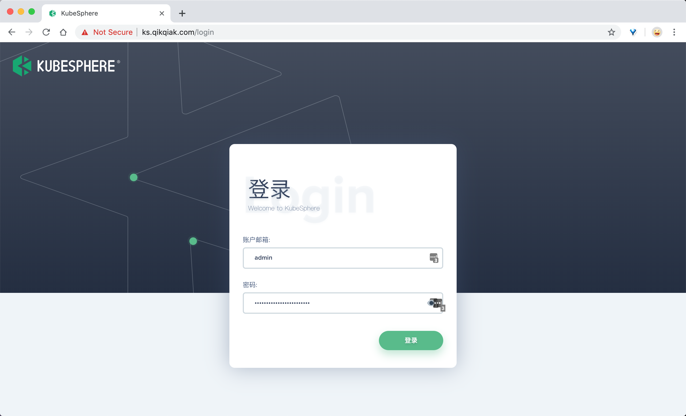
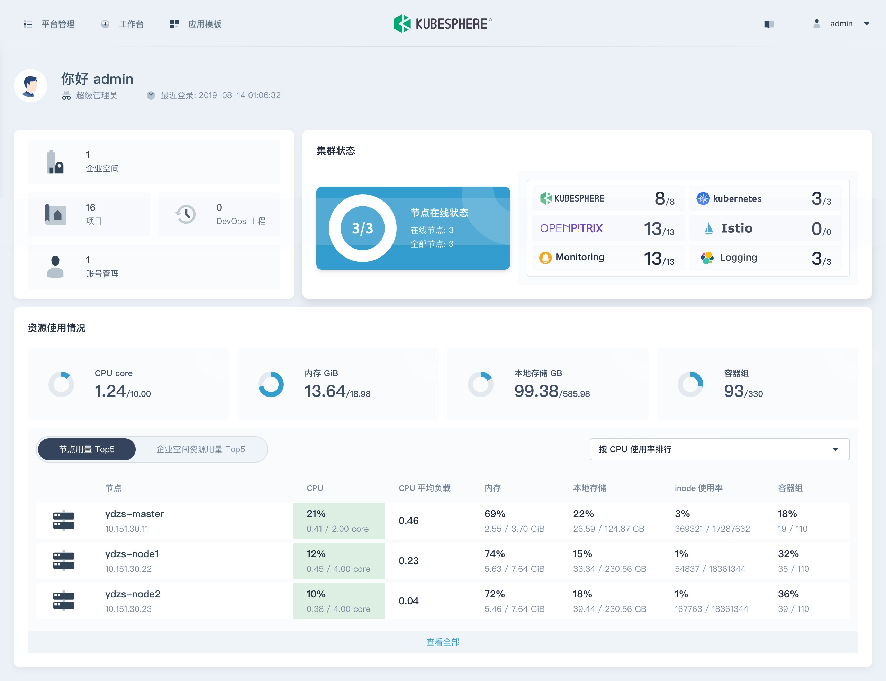
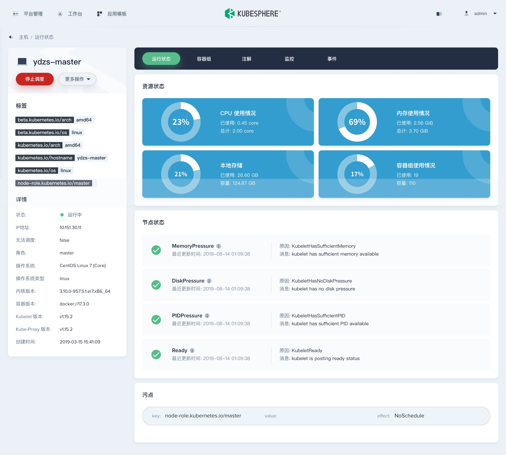

# 在现有 `Kubernetes` 集群上安装 `KubeSphere`

[KubeSphere](https://kubesphere.io) 是在 `Kubernetes` 之上构建的企业级分布式多租户容器管理平台，提供简单易用的操作界面以及向导式操作方式，在降低用户使用容器调度平台学习成本的同时，极大减轻开发、测试、运维的日常工作的复杂度，旨在解决 `Kubernetes` 本身存在的存储、网络、安全和易用性等痛点。

除此之外，平台已经整合并优化了多个适用于容器场景的功能模块，以完整的解决方案帮助企业轻松应对敏捷开发与自动化运维、微服务治理、多租户管理、工作负载和集群管理、服务与网络管理、应用编排与管理、镜像仓库管理和存储管理等业务场景。

`KubeSphere` 一开始就推出了开源的[社区版本](https://github.com/kubesphere/kubesphere)，只是之前提供的安装方式比较单一，在已有的 Kubernetes 集群上要想安装相对较麻烦，本文将为你演示如何在已有的 Kubernetes 集群上安装 KubeSphere。


## 环境准备

本文安装 `KubeSphere` 使用到的相关环境及工具如下：

* 使用 `kubeadm` 搭建的 `Kubernetes 1.15.2` 版本集群
* `Helm v2.14.1` 版本
* 使用 `NFS` 作为集群存储后端
* 使用到的安装脚本地址：[https://github.com/kubesphere/ks-installer](https://github.com/kubesphere/ks-installer)


首先需要确保集群中有一个默认的 StorageClass 资源对象，关于 `StorageClass` 的使用可以查看前面的文章介绍：


```
apiVersion: storage.k8s.io/v1
kind: StorageClass
metadata:
  name: dynamic-data
  annotations:
    storageclass.kubernetes.io/is-default-class: "true"
provisioner: fuseim.pri/ifs
```

其中 `annotations` 下面的 `storageclass.kubernetes.io/is-default-class: “true”` 是必须的：

```
$ kubectl get sc
NAME                     PROVISIONER      AGE
dynamic-data (default)   fuseim.pri/ifs   4h41m
```

## 安装

首先将上面安装仓库 `Clone` 到 `Kubernetes` 集群中的 `master` 节点上，因为我们需要使用到 `master` 节点上的一些证书文件。

1.首先，在集群中创建名为 `kubesphere-system` 和 `kubesphere-monitoring-system` 的`namespace`：

```
$ cat <<EOF | kubectl create -f -
---
apiVersion: v1
kind: Namespace
metadata:
  name: kubesphere-system
---
apiVersion: v1
kind: Namespace
metadata:
  name: kubesphere-monitoring-system
EOF
```

2.创建集群`ca`证书`secret`

> 注：按照当前集群 `ca.crt` 和 `ca.key` 证书路径创建（`kubeadm` 创建集群的证书路径一般为`/etc/kubernetes/pki`）

```
$ kubectl -n kubesphere-system create secret generic kubesphere-ca  \
--from-file=ca.crt=/etc/kubernetes/pki/ca.crt  \
--from-file=ca.key=/etc/kubernetes/pki/ca.key 
```

3.创建`etcd`证书`secret`

> 注：以集群实际 `etcd` 证书位置创建；若 `etcd` 没有配置证书，则创建空`secret`

```
$ kubectl -n kubesphere-monitoring-system create secret generic kube-etcd-client-certs  \
--from-file=etcd-client-ca.crt=/etc/kubernetes/pki/etcd/ca.crt  \
--from-file=etcd-client.crt=/etc/kubernetes/pki/etcd/healthcheck-client.crt  \
--from-file=etcd-client.key=/etc/kubernetes/pki/etcd/healthcheck-client.key
```

* 由于我这里使用的是 kubeadm 搭建的集群，所以我们可以查看 `etcd` 的资源清单文件：

```
$ cat /etc/kubernetes/manifests/etcd.yaml
......
livenessProbe:
  exec:
    command:
    - /bin/sh
    - -ec
    - ETCDCTL_API=3 etcdctl --endpoints=https://[127.0.0.1]:2379 --cacert=/etc/kubernetes/pki/etcd/ca.crt
        --cert=/etc/kubernetes/pki/etcd/healthcheck-client.crt --key=/etc/kubernetes/pki/etcd/healthcheck-client.key
        get foo
......
```

从这里我们就可以获得 `etcd` 集群相关的证书。

* 如何获取 k8s-docker-desktop 的集群相关的证书

```
$ kubectl describe pod kube-apiserver-docker-desktop -n kube-system
$ kubectl exec kube-apiserver-docker-desktop -n kube-system -it sh
```
```
# ca
ls /run/config/pki/

# etcd
ls /run/config/pki/etcd/

# copy to local and create
kubectl -n kubesphere-system create secret generic kubesphere-ca  \
--from-file=ca.crt=/Users/i515190/k8s_sap/test/KubeSphere/ca.crt  \
--from-file=ca.key=/Users/i515190/k8s_sap/test/KubeSphere/ca.key 

kubectl -n kubesphere-monitoring-system create secret generic kube-etcd-client-certs  \
--from-file=--etcd-cafile=/Users/i515190/k8s_sap/test/KubeSphere/etcd/ca.crt \
--from-file=etcd-client.crt=/Users/i515190/k8s_sap/test/KubeSphere/etcd/healthcheck-client.crt  \
--from-file=etcd-client.key=/Users/i515190/k8s_sap/test/KubeSphere/etcd/healthcheck-client.key
```

4.修改部署文件 由于 `KubeSphere` 部署过程中涉及到的组件非常多，所以安装过程中难免会有一些奇奇怪怪的问题，下面是我在安装过程中遇到的一些问题：

* 问题1：`openldap` 这个组件启动报错，因为 `ks-account` 组件又是依赖 `openldap` 这个组件的，所以同样启动报错，在安装过程中 `openldap` 出现了类似如下错误信息。

```
......
rm: cannot remove ‘/container/service/slapd/assets/config/bootstrap/ldif/readonly-user’: Directory not empty 
rm: cannot remove ‘/container/service/slapd/assets/config/bootstrap/schema/mmc’: Directory not empty 
rm: cannot remove ‘/container/service/slapd/assets/config/replication’: Directory not empty 
rm: cannot remove ‘/container/service/slapd/assets/config/tls’: Directory not empty *** /container/run/startup/slapd 

failed with status 1
```

解决方法：修改配置文件`roles/ks-core/prepare/templates/ks-account-init.yaml.j2`文件，在 `openldap` 这个 `Deployment` 下面容器中添加启动参数`--copy-service`

```
......
image: {{ openldap_repo }}:{{ openldap_tag }}
imagePullPolicy: IfNotPresent
args:   # 添加该启动参数
- --copy-service 
name: openldap
......
```

* 问题2：如果现有集群中已经安装有 `metrics_server`，需要在配置文件中将 `metrics_server_enable` 设置为 `False`


* 问题3：在安装过程中卡死在`Waitting for ks-sonarqube port to become open`部分，节点上通过 `NodePort` 已经可以正常访问 `sonarqube` ，该问题没有解决，由于是一个不影响全局安装的一个操作，所以同样在配置文件中将 `sonarqube_enable` 设置为 `False`


* 问题4：在安装过程中 `istio` 安装不上，由于我当前的集群资源不是很足，所以也临时取消掉 `istio` 的安装，后续在开启 `istio` 的支持。


最终用于安装 `KubeSphere` 的配置文件如下所示：(`deploy/kubesphere.yaml`)

```
---
apiVersion: v1
data:
  ks-config.yaml: |
    kube_apiserver_host: 10.151.30.11:6443
    etcd_tls_enable: True
    etcd_endpoint_ips: 10.151.30.11
    disableMultiLogin: True
    elk_prefix: logstash
    metrics_server_enable: False
    sonarqube_enable: False
    istio_enable: False
kind: ConfigMap
metadata:
  name: kubesphere-config
  namespace: kubesphere-system
......
```

只需要修改 `ConfigMap` 的值即可，其中 `kube_apiserver_host` 就是现有集群的 `APIServer` 地址，`etcd_endpoint_ips` 就是 `etcd` 的所在节点 `IP`，默认端口为 `2379`，如果你是集群模式 `etcd`，这里可以填写多个节点 `IP`，中间用`,`隔开，下面就是不需要安装的组件设置为 `False`。

到这里执行安装命令即可：

```
$ kubectl apply -f deploy/kubesphere.yaml
$ kubectl get pods -n kubesphere-system
NAME                                     READY   STATUS      RESTARTS   AGE
ks-account-575d4fd8f-r5476               1/1     Running     0          44m
ks-apigateway-5c56f79976-jxmd4           1/1     Running     0          44m
ks-apiserver-5d56bc8976-678hj            1/1     Running     0          41m
ks-console-75b6cb84c-ldsn7               1/1     Running     0          42m
ks-console-75b6cb84c-pzqcx               1/1     Running     0          42m
ks-controller-manager-78bfd56fbf-dtcg2   1/1     Running     0          43m
ks-docs-65bd89559b-58lpp                 1/1     Running     0          3h16m
kubesphere-installer-x7q8z               0/1     Completed   0          45m
openldap-5bd67c84c6-gw8f5                1/1     Running     0          114m
redis-6cf6fc98b5-nsqfn                   1/1     Running     0          3h19m
```

在安装过程中可能会因为拉取镜像过慢导致安装校验失败，这种情况我们可以先手动在节点上拉取镜像，然后再重新创建一个新的用于安装的 `Job` 即可。通过如下命令可以查看部署过程中的完整日志：


```
$ kubectl logs -n kubesphere-system $(kubectl get pod -n kubesphere-system -l job-name=kubesphere-installer -o jsonpath='{.items[0].metadata.name}') -f
```

如果上面用于安装的 `Job` 是完成状态的话，证明 `KubeSphere` 已经安装成功了。

最后，可以创建一个 `Ingress` 对象来访问 `KubeSphere：(kubesphere-ingress.yaml)`

```
$ apiVersion: extensions/v1beta1
kind: Ingress
metadata:
  name: kubesphere
  namespace: kubesphere-system
  annotations:
    kubernetes.io/ingress.class: nginx
spec:
  rules:
  - host: ks.qikqiak.com
    http:
      paths:
      - path:
        backend:
          serviceName: ks-console
          servicePort: 80
```

直接创建即可：

```
$ kubectl create -f kubesphere-ingress.yaml
```

最后做好域名解析，在浏览器中就可以访问了：




默认的登录信息为：

* 用户名：`admin`
* 密码：`P@88w0rd`





`KubeSphere` 中有一些自己的概念，需要我们去理解




* 更多的信息可以查看官方文档：[https://kubesphere.io/docs/](https://kubesphere.io/docs/)
* [ks-installer](https://github.com/kubesphere/ks-installer)
