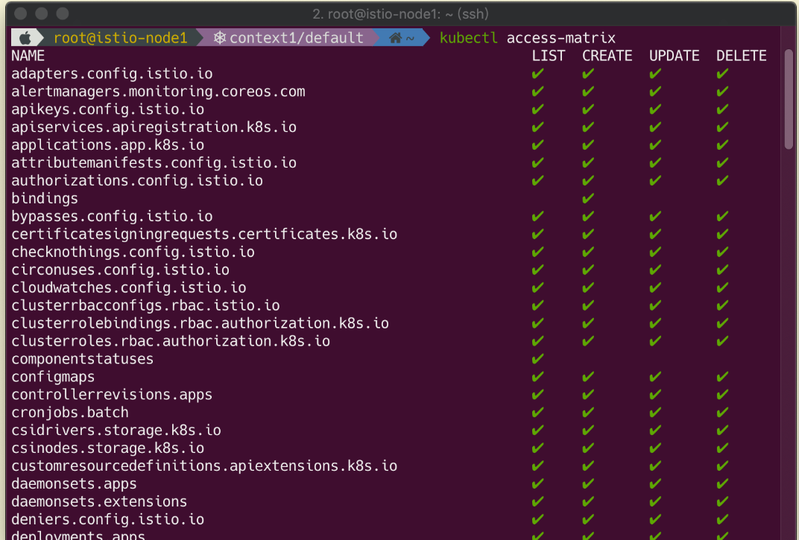
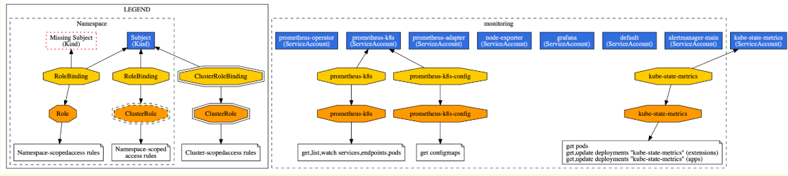
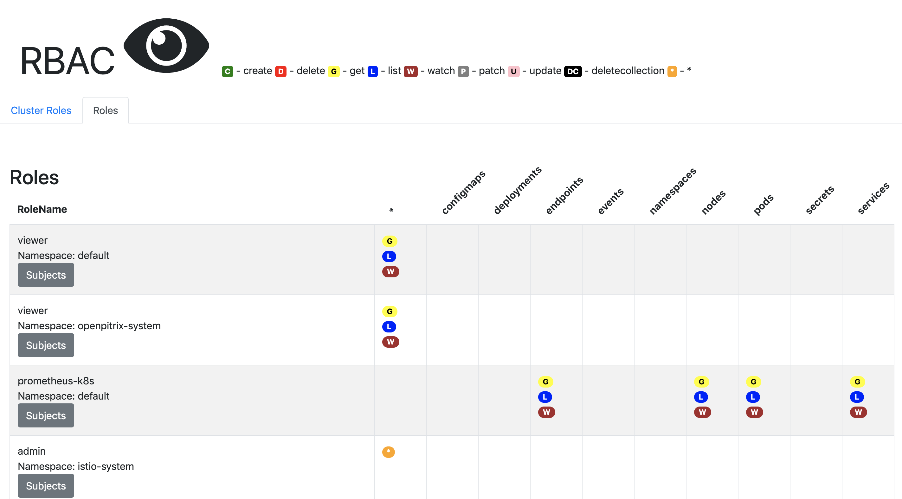

# 这些用来审计 Kubernetes RBAC 策略

认证与授权对任何安全系统来说都至关重要，`Kubernetes` 也不例外。即使我们不是安全工作人员，也需要了解我们的 `Kubernetes` 集群是否具有足够的访问控制权限。`Kubernetes` 社区也越来越关注容器的安全评估（包括渗透测试，配置审计，模拟攻击），如果你是应用安全工程师，或者是安全感知的 `DevOps` 工程师，最好了解一下 `Kubernetes` 的授权模型。

`Kubernetes` 的授权控制原则与大多数系统一样：在授予访问权限时采用最小授权原则。例如，如果某个 `Pod` 使用了特定的 `serviceAccount`，那么该 `Pod` 被限定为只能拥有指定的权限，只能访问特定的资源。

`Kubernetes` 从 `1.6` 开始支持基于角色的访问控制机制（`Role-Based Access，RBA`C），集群管理员可以对用户或服务账号的角色进行更精确的资源访问控制。先简单回顾一下 RBAC 的原理。


## 1. RBAC 基础概念

`RBAC` 授权策略会创建一系列的 `Role` 和 `ClusterRole` 来绑定相应的资源实体（`serviceAccount` 或 `group`），以此来限制其对集群的操作。每一个 `Role` 都基于 `Create`, `Read`, `Update`, `Delete（CRUD）`模型来构建，并使用“动词”来应用相应的权限。例如，动词 `get` 表示能够获取特定资源的详细信息。如果你想获取对 `Secrets` 的访问权限，可以创建如下的 `ClusterRole`：

```
apiVersion: rbac.authorization.k8s.io/v1
kind: ClusterRole
metadata:
  name: secret-reader
rules:
- apiGroups: [""]
  resources: ["secrets"]
  verbs: ["get", "watch", "list"]
```

## 2. RBAC 实践

`RBAC` 授权模型为我们提供了一种精确的访问控制机制，但随着环境越来越复杂，这些 `RBAC` 配置也越来越难维护。`RBAC` 配置可能包含了 `Roles`, `RoleBindings`, `ClusterRoles`, `ClusterRoleBindings`, `ServiceAccounts` 和 `Groups` 等，想要跟踪它们之间的关系非常困难。

举个栗子，先创建一个名叫 `helm` 的 `ServiceAccount`，然后创建相应的 `Role` 绑定 `“tiller-world” namespace`，**该 `Role` 只拥有 `list pods` 的权限，最后通过创建 `RoleBinding` 将该 `Role` 与之前创建的 `ServiceAccount` 绑定**。

```
apiVersion: v1
kind: ServiceAccount
metadata:
  name: helm
  namespace: helm-world
---
apiVersion: rbac.authorization.k8s.io/v1
kind: Role
metadata:
  name: tiller-user
  namespace: tiller-world
rules:
- apiGroups:
  - ""
  resources:
  - pods/portforward
  verbs:
  - create
- apiGroups:
  - ""
  resources:
  - pods
  verbs:
  - list
---
apiVersion: rbac.authorization.k8s.io/v1
kind: RoleBinding
metadata:
  name: tiller-user-binding
  namespace: tiller-world
roleRef:
  apiGroup: rbac.authorization.k8s.io
  kind: Role
  name: tiller-user
subjects:
- kind: ServiceAccount
  name: helm
  namespace: helm-world
```

**Rules for role**

```
rules:
- apiGroups:
  - ""
  resources:
  - pods/portforward
  verbs:
  - create
- apiGroups:
  - ""
  resources:
  - pods
  verbs:
  - list
```

**如果你想知道新创建的授权对象是否仅被授予必要的访问权限，就需要审查这些对象及其在集群中的关系。有时候还需要确保其仅对特定的资源实例具有访问权限，不允许访问所有的资源实例。**

例如，如果你不想让上面的 `ServiceAccount` 访问所有的 `Secret`，只允许它访问特定的 `Secret`，可以使用 `resourceNames` 字段指定：

```
rules:
- apiGroups: [""]
  resources: ["secrets"]
  resourceNames: ["my-pod-secrets"]
  verbs: ["get", "watch", "list"]
```

这个方法的问题在于无法过滤集群中不存在的资源，这意味着如果资源的名称是动态变化的，那么就无法创建相应的 `Role`，除非在创建 `Role` 的同时创建资源。

## 3. 审计很重要

为了查看每个 `Role` 的作用以及每个资源对象应该能做哪些事情，我们不得不进行一些审计工作。最简单的审计就是确认某个 `Service Account` 是否拥有 `Cluster Admin` 的权限，再复杂一点，确认某个 `CI/CD Service Account` 在指定的 `namespace` 内是否拥有 `Update Pod` 的权限。

基于审计的目标，大致可以分为两种审计模式：

* 资源审计：识别风险最高的资源对象，并查看谁可以访问它们。
* 账户审计：查看账户的有效权限并确保它们的合理性。

账户审计比较彻底，但很耗时；资源审计可以更快发现问题，但可能会有所遗漏。举例：

* 资源审计：查看谁能访问某个 `Secret` 资源，并确保其是否遵循最小授权原则。
* 账户审计：遍历所有的 `user`，`group`，`Service Account` 和 `RoleBinding`，确保它们是否被授予正确的访问权限，并只限定在特定的 `namespace` 内。

下面提供几种命令行工具来帮助大家更方便地审计 RBAC。

##  Kubectl Can-I

某些生产环境不允许安装额外的服务，只能使用 `kubectl`，我们可以使用 `kubectl` 的内置命令 `kubectl auth can-i` 来查看 `RBAC` 权限。

例如，查看你是否拥有 `get pod` 的权限

```
$ kubectl auth can-i get pods
yes
```

查看你是否拥有 `cluster-admin` 的权限：

```
$ kubectl auth can-i "*" "*"
yes
```

列出你在某个 `namesapce` 中拥有的所有权限：

```
$ kubectl auth can-i --list --namespace=kube-public
Resources                                       Non-Resource URLs   Resource Names   Verbs
*.*                                             []                  []               [*]
                                                [*]                 []               [*]
selfsubjectaccessreviews.authorization.k8s.io   []                  []               [create]
selfsubjectrulesreviews.authorization.k8s.io    []                  []               [create]
                                                [/api/*]            []               [get]
                                                [/api]              []               [get]
                                                [/apis/*]           []               [get]
                                                [/apis]             []               [get]
                                                [/healthz]          []               [get]
                                                [/healthz]          []               [get]
                                                [/openapi/*]        []               [get]
                                                [/openapi]          []               [get]
                                                [/version/]         []               [get]
                                                [/version/]         []               [get]
                                                [/version]          []               [get]
                                                [/version]          []               [get]
```

来点更有趣的，我们还可以通过 `Kubernetes` 的 `Impersonation API` 来查看其他账户是否拥有访问特定资源的权限。例如，查看名为 `unprivileged-service-account` 的 `Service Account` 是否拥有 `get pod` 的权限：

```
$ kubectl auth can-i get pod \
  --as system:serviceaccount:secure:unprivileged-service-account
yes
```

**`--as` 参数用来指定账户名称，类似的参数还有 `--as-group`，背后的原理实际上是一组传递给 `API Server` 的请求头。**


`Kubernetes` 中除了有 `Service Account` 之外还会有 `User`，每创建一个 `Service Account`，都会[自动创建一个对应的 `User`](https://github.com/eBay/Kubernetes/blob/master/docs/admin/authorization.md#abac-mode)，名称格式为：`system:serviceaccount:<namespace><serviceaccount>`。想知道某个 `Service Account` 的 `username` 可以通过它的 `yaml `文件来推算：

```
$ kubectl get serviceaccount unprivileged-service-account -o yaml

apiVersion: v1
kind: ServiceAccount
metadata:
  creationTimestamp: "2019-07-23T17:44:31Z"
  name: unprivileged-service-account
  namespace: default
  resourceVersion: "98089"
  selfLink: /api/v1/namespaces/default/serviceaccounts/unprivileged-service-account
secrets:
- name: unprivileged-service-account-token-9cggz
```

**通过将 `verbs` 字段的值指定为 [impersonate](https://kubernetes.io/docs/reference/access-authn-authz/authentication/#user-impersonation)，可以让某个用户拥有其他用户的权限，即可以模拟其他用户。** 例如，管理员可以使用此功能通过暂时模拟其他用户并查看请求是否被拒绝来调试授权策略。

例如，如果你想让非 `Cluster Admin` 账户能够模拟其他用户，可以创建如下的 `ClusterRole`：

```
apiVersion: rbac.authorization.k8s.io/v1
kind: ClusterRole
metadata:
  name: impersonator
rules:
- apiGroups: [""]
  resources: ["users", "groups", "serviceaccounts"]
  verbs: ["impersonate"]
```

## 5. Kubectl Who Can

下面介绍的这款工具是 `kubectl` 的插件，插件名叫 `who-can`，顾名思义，用来显示哪些账户拥有访问特定资源的权限。安装方法很简单，可以通过 `kubectl` 的插件管理框架 `Krew` 来安装：

* 安装 `krew`。参考 [https://github.com/kubernetes-sigs/krew/](https://github.com/kubernetes-sigs/krew/)
* 安装 `who-can`：

```
 $ kubectl krew install who-can
```                                         

假设 `secure namespace` 中有一个 `Secret` 名为 `cluster-admin-creds`，你想查看谁拥有访问它的权限：                

```

$ kubectl who-can get secret cluster-admin-creds -n secure

ROLEBINDING            NAMESPACE       SUBJECT                               TYPE            SA-NAMESPACE
unpriv_sa_binding      secure          unprivileged-service-account          ServiceAccount  secure


CLUSTERROLEBINDING     SUBJECT             TYPE            SA-NAMESPACE
cluster-admin          system:masters      Group
```

输出信息也很一目了然，没什么可说的。提醒一下，该工具只支持查看 `create`、`update` 和 `delete` 这几个访问权限，不支持 `use`。`use` 用来将 `Pod Security Policy` 绑定到相应的` Role`。                               
                              
## 6.Rakkess

`rakkess` 与 `who-can` 类似，可以列出某个账户对所有资源的访问权限，可以通过 krew 来安装。

使用方法也很简单，如果想查看当前用户对所有资源的访问权限，可使用如下命令：

如果想查看某个特定的 `Service Account` 对所有资源的访问权限，可以使用如下命令：

```
$ kubectl access-matrix
```



如果想查看某个特定的 `Service Account` 对所有资源的访问权限，可以使用如下命令：

```
$ kubectl access-matrix --as system:serviceaccount:kube-ovn:ovn -n kube-ovn
```

更多用例可以参考官方文档。


## 7. RBack

[rack](https://github.com/team-soteria/rback) 用来对 `kubectl` 的输出结果进行可视化展示，可以输出为 `.dot` 格式，也可以输出为 `.png` 或任何格式。

例如：

```
$ kubectl get sa,roles,rolebindings \
  -n monitoring -o json | rback > rback.dot
```

或者保存为 png：

```
$ kubectl get sa,roles,rolebindings \
  -n monitoring -o json \
  | rback | dot -Tpng > rback.png
```




## 8. RBAC-View

[rbac-view](https://github.com/jasonrichardsmith/rbac-view) 也可以用来可视化账户与权限之间的关系，但与 rback 不同，它是一个 web 应用，安装方法参考官方文档。

使用方式：

```
$ kubectl rbac-view
serving RBAC View and http://localhost:8800
```

在浏览器中打开链接 `http://localhost:8800`。





## 9. 终极测试

预防攻击最好的方法是模拟攻击，我们可以模拟一个黑客进入其中的某个 Pod，看看能否执行一些不可描述的操作。步骤如下：

* 创建一个 Service Account。

```
$ kubectl create serviceaccount ncc-sa
```

* 创建相应的角色。

```
    $ cat <<EOF | kubectl apply -f -
   apiVersion: rbac.authorization.k8s.io/v1
   kind: Role
   metadata:
     namespace: default
     name: pod-reader
   rules:
   - apiGroups: [""] 
     resources: ["pods"]
     verbs: ["get", "watch", "list"]
   EOF
```

* 将 Role 与 Service Account 绑定。

```
   $ cat <<EOF | kubectl apply -f -
   apiVersion: rbac.authorization.k8s.io/v1
   kind: RoleBinding
   metadata:
     name: read-pods
     namespace: default
   subjects:
   - kind: ServiceAccount
     name: ncc-sa 
     namespace: default
   roleRef:
     kind: Role 
     name: pod-reader 
   apiGroup: rbac.authorization.k8s.io
   EOF

``` 

* 创建一个测试 `Pod`，`serviceAccountName` 指定为 `ncc-sa`。 

```
   $ cat <<EOF | kubectl apply -f -
   apiVersion: v1
   kind: Pod
   metadata:
     name: ncc-pod
   spec:
     serviceAccountName: ncc-sa
     containers:
     - name: busybox
       image: busybox
       args:
       - sleep
       - "1000000"
```

* 进入该 Pod

```
   $ kubectl exec -it ncc-pod sh
   $ wget https://storage.googleapis.com/kubernetes-release/release/v1.15.0/bin/linux/amd64/kubectl && chmod +x
   $ install kubectl /bin
```

* 验证是否具有 `get pod` 的权限。

```
$ kubectl get pod
```

## 11. 总结

随着集群环境越来越复杂，`RBAC Role` 与其相关资源对象之间关系的复杂性也会呈指数级增长。如果 `Role` 太多，那么运维人员可能很难选择正确的 `Role`，容易犯错；如果 `Role` 太少，运维人员可能会被迫选择默认的` Role`，这会导致某些 `Pod` 权限过大。所以我们需要找到一个平衡点，通常的做法是通过 `ansible` 或 `terraform` 将某些部署策略抽象出来变成模板，将 RBAC 策略写到模板中，这样可以大大减轻开发人员的压力。


