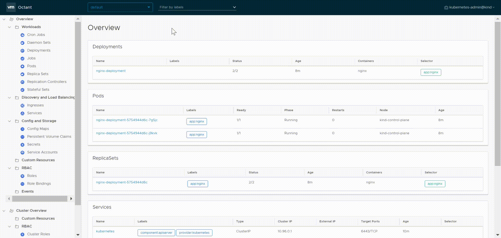
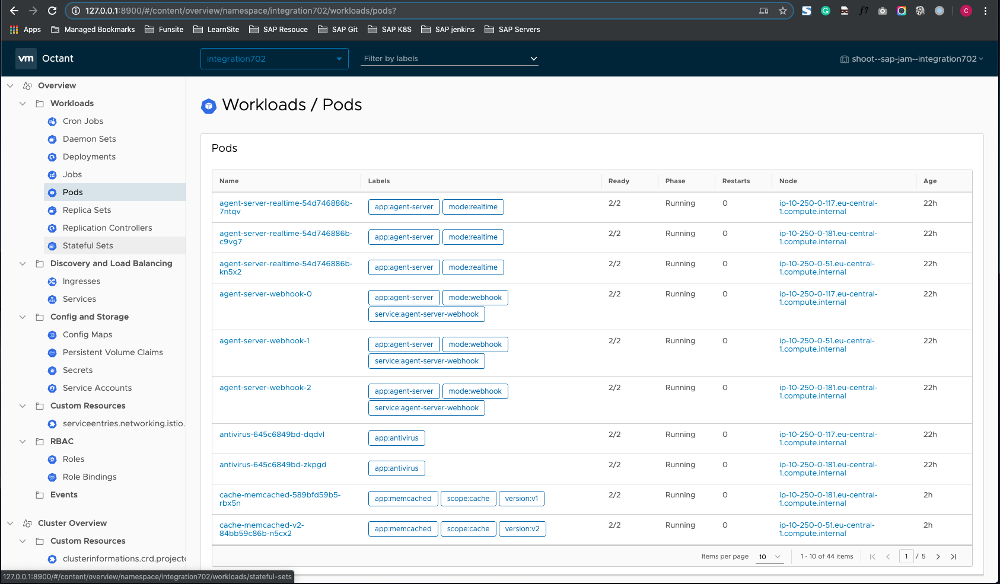
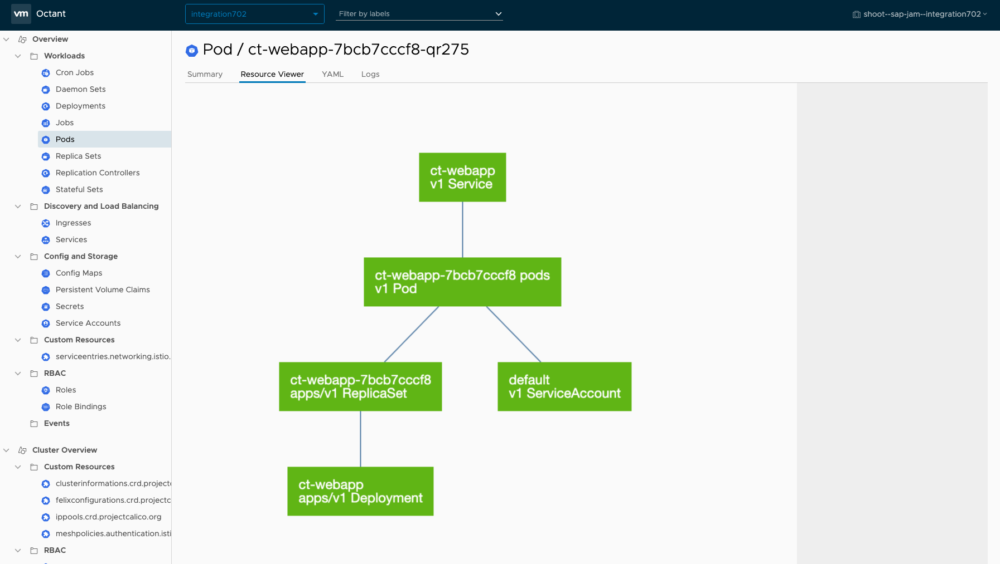
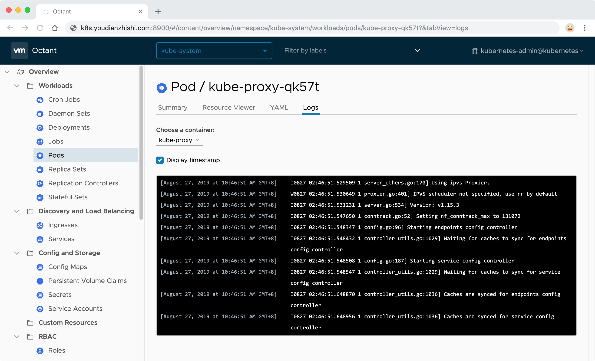

# VMWare 开源的 Kubernetes 可视化工具 Octant


上午看新闻发现 VMWare 开源了一款 `Kubernetes Dashboard` 的可视化工具 [Octant](https://github.com/vmware/octant) ，这是一款帮助开发人员了解应用程序在 `Kubernetes` 集群中如何运行的工具。它通过可视化的方式，呈现 `Kubernetes` 对象的依赖关系，可将本地端口请求转发到正在运行的 `pod`，查看 `pod` 日志，浏览不同的集群。此外，用户还可以通过安装或编写插件来扩展 `Octant` 的功能。

在第一时间体验了 `Octant` 过后，感觉和现在大部分的 `Dashboard` 功能差不多，也和他们提到的“并没有想把 `Octant` 做成一个仪表板，而是作为 `kubectl` 的一个可视化补充”比较符合，可能最大的亮点还是可以自己编写插件来扩展 `Octant` 功能吧，这倒是给 `Octant` 提供了更多的可能。

对应 `Linux` 用户来说现在可以直接通过`.deb`或者`.rpm`包来进行安装，当然也可以直接在 `GitHub Release` 页面下载编译好的二进制包直接运行即可，更多的安装方式可以参考 `Octant` 的 `GitHub` 页面文档：[https://github.com/vmware/octant](https://github.com/vmware/octant)。


## Octant 安装

### 安装在`Centos`

我们这里直接在 `Kubernetes` 集群的 `master` 节点上来安装体验下 `Octant`，我们这里是 `centos` 系统，所以在节点上下载 `rpm` 包即可：

```
$ wget https://github.com/vmware/octant/releases/download/v0.6.0/octant_0.6.0_Linux-64bit.rpm
......
100%[=====================================================================================>] 21,798,100  33.6KB/s   in 8m 50s

2019-09-03 10:31:02 (40.2 KB/s) - ‘octant_0.6.0_Linux-64bit.rpm’ saved [21798100/21798100]
```

然后使用`rpm`命令直接安装：

```
$ sudo yum install octant_0.6.0_Linux-64bit.rpm
Loaded plugins: fastestmirror, langpacks
Examining octant_0.6.0_Linux-64bit.rpm: octant-0.6.0-1.x86_64
Marking octant_0.6.0_Linux-64bit.rpm to be installed
Resolving Dependencies
--> Running transaction check
---> Package octant.x86_64 0:0.6.0-1 will be installed
--> Finished Dependency Resolution
......

Installed:
  octant.x86_64 0:0.6.0-1

Complete!
```

```
$ octant
...
Warning
...
```
```
sudo yum install xdg-utils
```

### 安装在`Mac`

```
$ brew install octant
```


## StartUp Octant

安装完成后直接执行`octant`命令即可启动，但是需要注意的是我们这里需要来读取访问集群的 `KUBECONFIG` 文件，而且需要通过域名来访问 `Octant`，所以需要设置一些环境变量，如下所示：

### Environment Variables

Octant is configurable through environment variables defined at runtime.

* `KUBECONFIG` - set to non-empty location if you want to set **KUBECONFIG** with an environment variable.
* `OCTANT_DISABLE_OPEN_BROWSER` - set to a non-empty value if you don't the browser launched when the dashboard start up **`True/False`**.
* `OCTANT_LISTENER_ADDR` - set to address you want dashboard service to start on. (e.g. `localhost:8080`)
* `OCTANT_ACCEPTED_HOSTS` - set to comma-separated string of hosts to be accepted. (e.g. `demo.octant.example.com,awesome.octant.zr`)
* `OCTANT_VERBOSE_CACHE` - set to a non-empty value to view cache actions
* `OCTANT_LOCAL_CONTENT` - set to a directory and dash will serve content responses from here. An example directory lives in `examples/content`
* `OCTANT_PLUGIN_PATH` - add a plugin directory or multiple directories separated by `:`. Plugins will load by default from `$HOME/.config/octant/plugins`

```
$ OCTANT_ACCEPTED_HOSTS=k8s.youdianzhishi.com KUBECONFIG=~/.kube/config OCTANT_LISTENER_ADDR=0.0.0.0:8900 octant
```

### On my Mac

```
OCTANT_DISABLE_OPEN_BROWSER=True OCTANT_LISTENER_ADDR=127.0.0.1:8900 KUBECONFIG=~/.kube/integration702 octant
2019-09-03T15:40:15.628+0800	INFO	module/manager.go:75	registering action	{"component": "module-manager", "actionPath": "deployment/configuration", "module-name": "overview"}
2019-09-03T15:40:15.628+0800	INFO	api/content.go:52	Registering routes for overview
2019-09-03T15:40:15.629+0800	INFO	api/content.go:52	Registering routes for cluster-overview
2019-09-03T15:40:15.629+0800	INFO	api/content.go:52	Registering routes for configuration
2019-09-03T15:40:15.629+0800	INFO	dash/dash.go:332	Dashboard is available at http://127.0.0.1:8900
```
我们这里通过设置`KUBECONFIG`环境变量设置了访问集群的 `kubeconfig` 文件, 这样我们就可以在浏览器中通过`127.0.0.1:8900`来访问 Octant 了：









我们可以看到功能基本上和官方的 `Dashboard` 区别不大，不过确实插件功能带来的想象空间就比较大了，插件是 `Octant` 的一个核心模块，一个插件可以读取资源对象允许用户自己添加组件到 `Octant` 的视图上面。更多关于插件的信息可以查看文档：[docs/plugins](https://github.com/vmware/octant/tree/master/docs/plugins)。

