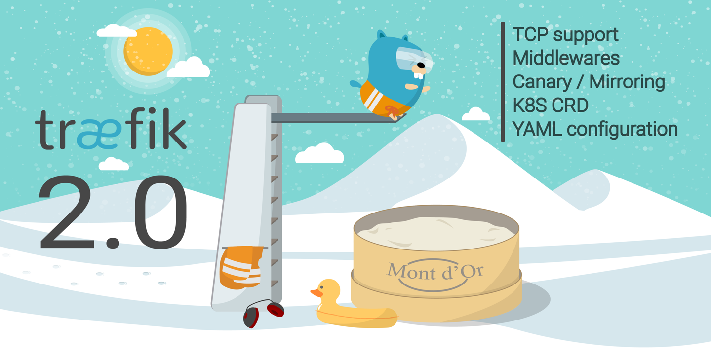
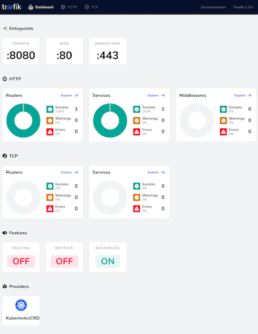
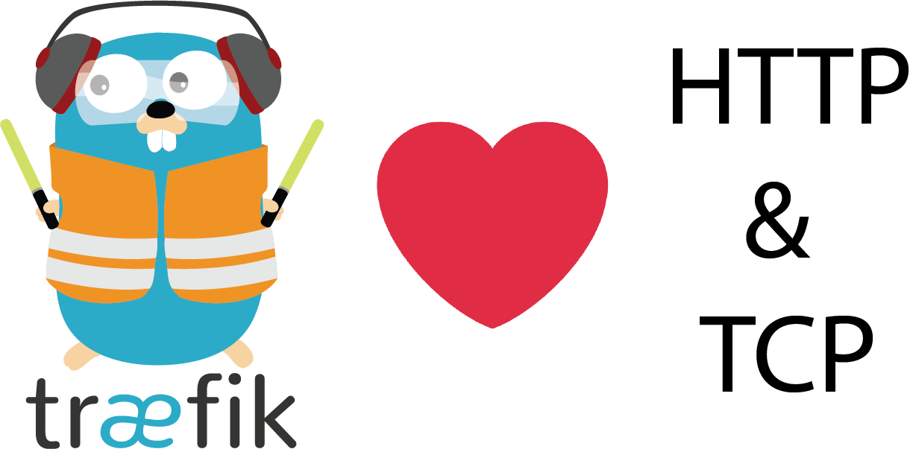
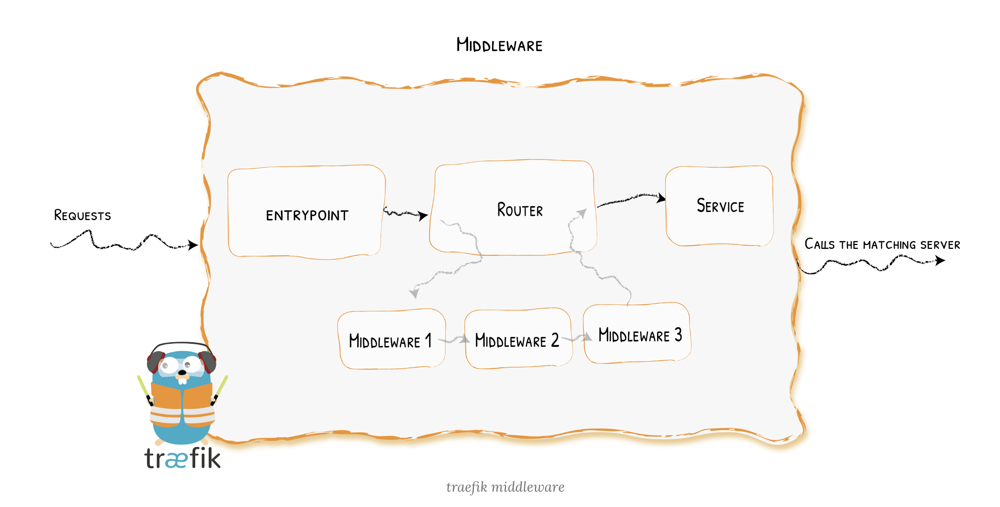
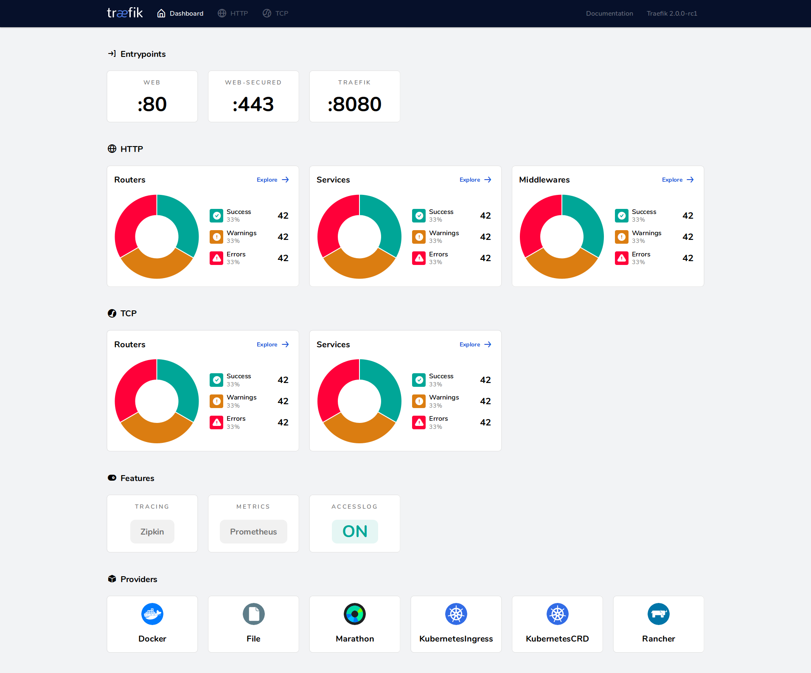
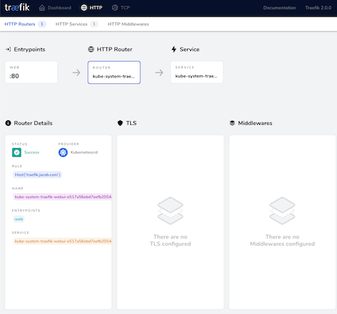
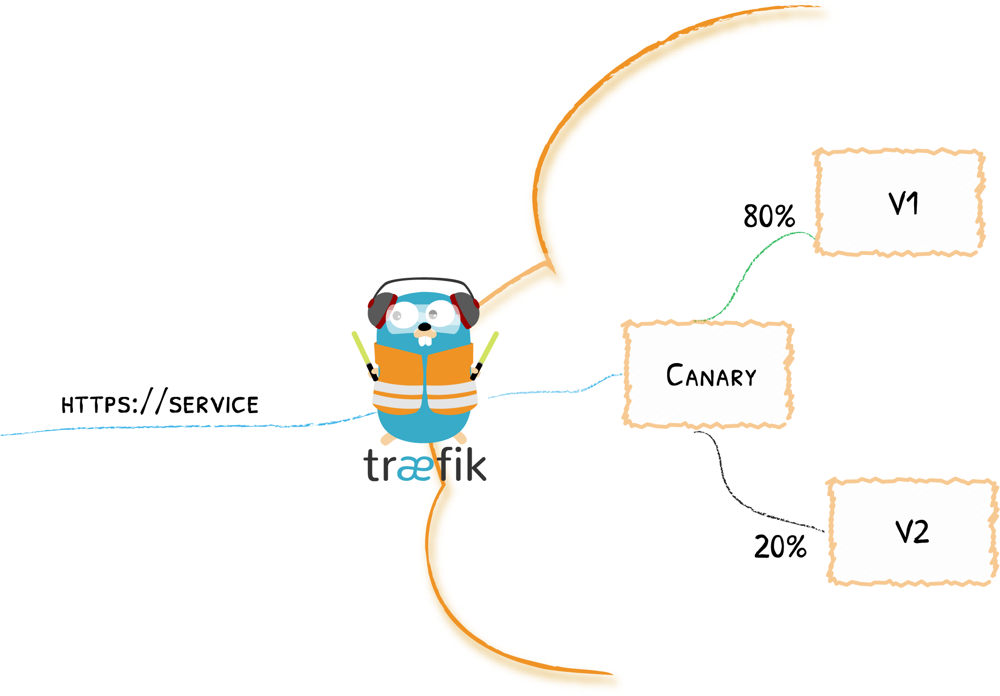
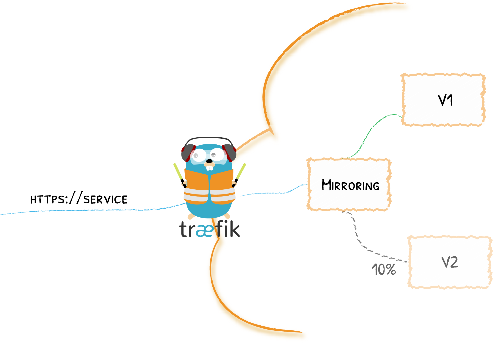

# Traefik 2.0 正式版发布

寄予厚望的 [Traefik 2.0](https://traefik.io/) 经过了一年的等待，今天终于正式发布了，此次大版本的更新添加了许多新功能，特别是大家都期望的支持 `TCP` 的功能。接下来我们就来探索下 `Traefik 2.0` 中有哪些新增的功能呢？

## 快速安装即实现

### 1. Crd(crd.yaml)

```
apiVersion: apiextensions.k8s.io/v1beta1
kind: CustomResourceDefinition
metadata:
  name: ingressroutes.traefik.containo.us

spec:
  group: traefik.containo.us
  version: v1alpha1
  names:
    kind: IngressRoute
    plural: ingressroutes
    singular: ingressroute
  scope: Namespaced

---
apiVersion: apiextensions.k8s.io/v1beta1
kind: CustomResourceDefinition
metadata:
  name: ingressroutetcps.traefik.containo.us

spec:
  group: traefik.containo.us
  version: v1alpha1
  names:
    kind: IngressRouteTCP
    plural: ingressroutetcps
    singular: ingressroutetcp
  scope: Namespaced

---
apiVersion: apiextensions.k8s.io/v1beta1
kind: CustomResourceDefinition
metadata:
  name: middlewares.traefik.containo.us

spec:
  group: traefik.containo.us
  version: v1alpha1
  names:
    kind: Middleware
    plural: middlewares
    singular: middleware
  scope: Namespaced

---
apiVersion: apiextensions.k8s.io/v1beta1
kind: CustomResourceDefinition
metadata:
  name: tlsoptions.traefik.containo.us

spec:
  group: traefik.containo.us
  version: v1alpha1
  names:
    kind: TLSOption
    plural: tlsoptions
    singular: tlsoption
  scope: Namespaced
```

### 2. RBAC (rbac.yaml)

```
apiVersion: v1
kind: ServiceAccount
metadata:
  name: traefik-ingress-controller
  namespace: kube-system
---
kind: ClusterRole
apiVersion: rbac.authorization.k8s.io/v1beta1
metadata:
  name: traefik-ingress-controller
rules:
  - apiGroups:
      - ""
    resources:
      - services
      - endpoints
      - secrets
    verbs:
      - get
      - list
      - watch
  - apiGroups:
      - extensions
    resources:
      - ingresses
    verbs:
      - get
      - list
      - watch
  - apiGroups:
      - extensions
    resources:
      - ingresses/status
    verbs:
      - update
  - apiGroups:
      - traefik.containo.us
    resources:
      - middlewares
    verbs:
      - get
      - list
      - watch
  - apiGroups:
      - traefik.containo.us
    resources:
      - ingressroutes
    verbs:
      - get
      - list
      - watch
  - apiGroups:
      - traefik.containo.us
    resources:
      - ingressroutetcps
    verbs:
      - get
      - list
      - watch
  - apiGroups:
      - traefik.containo.us
    resources:
      - tlsoptions
    verbs:
      - get
      - list
      - watch
---
kind: ClusterRoleBinding
apiVersion: rbac.authorization.k8s.io/v1beta1
metadata:
  name: traefik-ingress-controller
roleRef:
  apiGroup: rbac.authorization.k8s.io
  kind: ClusterRole
  name: traefik-ingress-controller
subjects:
- kind: ServiceAccount
  name: traefik-ingress-controller
  namespace: kube-system
```


### 3. traefik.yaml

```
kind: Deployment
apiVersion: extensions/v1beta1
metadata:
  name: traefik
  namespace: kube-system
  labels:
    k8s-app: traefik-ingress-lb
spec:
  selector:
    matchLabels:
      k8s-app: traefik-ingress-lb
  template:
    metadata:
      labels:
        k8s-app: traefik-ingress-lb
        name: traefik-ingress-lb
    spec:
      serviceAccountName: traefik-ingress-controller
      tolerations:
      - operator: "Exists"
      nodeSelector:
        kubernetes.io/hostname: jabox   #选择你的node
      containers:
      - image: traefik:v2.0
        name: traefik-ingress-lb
        ports:
        - name: web
          containerPort: 80
          hostPort: 80
        - name: websecure
          containerPort: 443
          hostPort: 443
        - name: admin
          containerPort: 8080
        args:
        - --entrypoints.web.Address=:80
        - --entrypoints.websecure.Address=:443
        - --api.insecure=true
        - --providers.kubernetescrd
        - --api
        - --api.dashboard=true
        - --accesslog

---

kind: Service
apiVersion: v1
metadata:
  name: traefik
  namespace: kube-system
spec:
  selector:
    k8s-app: traefik-ingress-lb
  ports:
    - protocol: TCP
      port: 8080
      name: admin
```

```
$ kubectl get pod -n=kube-system
traefik-c75588fcf-nlrf2                    1/1     Running   0          3h48m

$ kubectl get svc -n kube-system
traefik                ClusterIP   10.110.176.34    <none>        8080/TCP                 3h49m

$ kubectl get crd | grep traefik
ingressroutes.traefik.containo.us             2019-09-01T01:12:10Z
ingressroutetcps.traefik.containo.us          2019-09-01T01:12:29Z
middlewares.traefik.containo.us               2019-09-01T01:12:30Z
tlsoptions.traefik.containo.us                2019-09-01T01:12:34Z
```

### Create `ingressroute` for `traefik web ui`

```
$ kubectl get nodes -o custom-columns='NodeIP:status.addresses[0].address,NodeName:metadata.name'
NodeIP         NodeName
10.151.30.11   jabox
10.151.30.22   jabox-node1
10.151.30.23   jabox-node2
```
**IngressRoute.yaml**

```
apiVersion: traefik.containo.us/v1alpha1
kind: IngressRoute
metadata:
  name: traefik-webui
  namespace: kube-system
spec:
  entryPoints:
    - web
  routes:
  - match: Host(`traefik.jacob.com`)  #注意修改
    kind: Rule
    services:
    - name: traefik
      port: 8080
```

**On my localhost**

```
$ sudo vi /etc/hosts
$ 10.151.30.11 traefik.jacob.com traefik.jacob.com
```

打开浏览器访问 `traefik.jacob.com` 即可得到



## 支持 SNI 路由和多协议端口的 TCP



在之前 2.0 alpha 声明中就讨论过这个最重要的功能，但实际上这个功能是第10个 feature request，所以花了很长时间来讨论并实现这个新功能。

下面是一个简单的示例配置 - 使用最新支持的 `YAML` 文件格式，**将请求路由到一个数据库上面去**：

```
tcp:
  routers:
    to-database:
      entrypoints:
      - database-entrypoint
      rule: HostSNI(`*`)
      service: database-service
  services:     
    database-service:
      loadBalancer:
        servers:
        - address: xx.xx.xx.xx:xx
```

**上面这个配置示例表示每个以 `database-entrypoint` 结尾的请求都将被路由到 `database-service` 这个服务上去.**

此外通过 `TLS`，`Traefik` 还可以根据 `SNI` 来路由 `TCP` 请求。在下面示例中，`Traefik` 就将根据 `SNI` 将请求路由到两个数据库：

**What is Transport Layer Security (TLS)**
> TLS is a staple security protocol that, despite being more efficient and effective than SSL, has suffered some major breaches. But TLS 1.3 vastly improves both the privacy and performance of secure web communications.

**What Is SNI? How TLS Server Name Indication Works**
> SNI, or Server Name Indication, is an addition to the TLS encryption protocol that enables a client device to specify the domain name it is trying to reach in the first step of the TLS handshake, preventing common name mismatch errors.

```
tcp:
  routers:
    to-db-1:
      entrypoints:
      - web-secure
      rule: "HostSNI(`db1.domain`)"
      service: "db1"
      tls: {} 
    to-db-2:
      entrypoints:
      - web-secure
      rule: "HostSNI(`db2.domain`)"
      service: "db2"
      tls: {}
```

**另外 `Traefik` 还是支持 `HTTP` 和 `TCP` 在同一个端口上，如果你希望获得相同的入口的同时获取 `HTTP` 和 `TCP` 请求，那么 `Traefik` 可以很完美的来处理它**。


```
tcp:
  routers:
    to-db-1:
      entrypoints:
      - web-secure
      rule: "HostSNI(`db1.domain`)"
      service: "db-1"
      tls: {}
http:
  routers:
    to-db1-dashboard:
      entrypoints:
      - web-secure
      rule: "Host(`dashboard.db1.domain`)"
      service: "db1-dashboard"
      tls: {}
```

比如上面这个示例中，

* `dashboard.db1.domain` 上的 `HTTP` 请求将路由到数据库的 `Dashboard` 服务上，
* 而上面的 `db1.domain` 上的 `TCP` 请求将路由到数据库上面去，这个功能是不是非常赞

## 使用中间件完全自定义路由



在 Traefik 2.0 中还引入了[中间件](https://docs.traefik.io/v2.0/middlewares/overview/)功能，可以用于将请求路由到目的地之前或之后来调整请求。

首先我们可以声明一个中间件，在任意数量的路由上面都可以重用它们。下面我们来演示下如何配置中间件，声明一个 [BasicAuth](https://docs.traefik.io/v2.0/middlewares/basicauth/) 中间件来控制对我们服务的访问（这次使用 TOML 来配置）：

```
# 为两个用户声明一个 basicauth 的中间件
[http.middlewares.test-auth.basicAuth]
  users = ["user1:hashed", "user2:hashed"]
# 将上面的中间件应用到路由上面去
[http.routers.my-router.to-service]
  rule = "host(`my-protected.domain`)"
  middlewares = ["test-auth"]
  service = "service1"
```


此外可以声明一个链来组合绑定这些中间件，并反复使用它们，对于 Kubernetes 用户来说，还可以使用 Traefik 的新 CRD 来进行更加清晰明了的配置，而不需要复杂的注解。（可以在文档中找到有关 [IngressRoute 对象](https://docs.traefik.io/v2.0/providers/kubernetes-crd/#traefik-ingressroute-definition)的更多信息。）如下所示：


```
apiVersion: traefik.containo.us/v1alpha1
kind: IngressRoute
metadata:
  name: test
  namespace: default
spec:
  entryPoints:
    - web
  routes:
    - match: Host(`mydomain`)
      kind: Rule
      services:
        - name: whoami
          port: 80
      middlewares:
        - name: secured
---
apiVersion: traefik.containo.us/v1alpha1
kind: Middleware
metadata:
  name: secured
spec:
  chain:
    middlewares:
    - name: https-only
    - name: known-ips
    - name: auth-users
---
apiVersion: traefik.containo.us/v1alpha1
kind: Middleware
metadata:
  name: auth-users
spec:
  basicAuth:
    secret: secretUsers # 兼容 K8S secrets 对象
---
apiVersion: traefik.containo.us/v1alpha1
kind: Middleware
metadata:
  name: https-only
spec:
  redirectScheme:
    scheme: https
---
apiVersion: traefik.containo.us/v1alpha1
kind: Middleware
metadata:
  name: known-ips
spec:
  ipWhiteList:
    sourceRange:
    - 192.168.1.7
    - 127.0.0.1/32
```

**上面示例中 secured 这个中间件就是有 `https-only`、`know-ips`、`auth-users` 这3个中间件组成的一个链式中间件**。

而且在 Traefik 中内置了许多中间件：路径操作、多种身份验证机制、缓冲、断路器、重试、压缩、错误处理、headers、IP 白名单、限速、重定向等。此外官方还重新设计了代码架构，可以让开发者更加容易提供第三方的中间件。

## 全新的 Dashboard




由于和之前版本的使用流程发生了很大变化，所以希望能够在 WebUI 上面可以显示服务的详细配置信息。





## 金丝雀发布



另外一个期待已久的功能特性 - 金丝雀发布、`A/B` 测试，现在在 `Traefik 2.0` 中以服务负载均衡的形式进行了支持。可以将服务负载均衡器看成负责将请求转发到实际服务的虚拟服务，下面让我们来看一个经典的场景，现在有一个路由到一个 API：

```
http:
  routers:
    my-route:
      rule: "Host(`my.domain`)"
      service: my-api-v1
  services:
    my-api-v1:
      loadBalancer:
        servers:
        - url: "http://private-ip-server-1/
```

现在我们要部署该服务的一个新版本，但是希望可以逐步部署，比如先部署大约`1/3`的请求。我们这里就需要使用一个新的` ID`（这里可以用 `my-api-v2`）来部署一个新的服务:


```
http:
  services:
    my-api-v2:
      loadBalancer:
        servers:
        - url: "http://private-ip-server-2/"
```

**然后我们需要定义一个服务负载均衡器（我们这里叫 `cannary-api`），并定义每个版本的比例，而不是直接指向新版本**：

```
http:
  services:
    canary-api:
      weighted:
        services:
        - name: my-api-v1
          weight: 3
        - name: my-api-v2
          weight: 1
```

之后，我们不需要重新部署真正的服务就可以更新权重，当然还可以对它们进行扩容，这都不会对金丝雀部署本身产生任何的影响。

## 流量复制



金丝雀部署并不是服务系列功能中唯一的一种可以使用的功能，Traefik 2.0 还引入了镜像服务，一种可以将流入流量复制并同时将其发送给其他服务的方法，镜像服务可以获得给定百分比的请求同时也会忽略这部分请求的响应:

```
[http.services.mirrored-api]
    [http.services.mirrored-api.mirroring]
      service = "api"
    [[http.services.mirrored-api.mirroring.mirrors]]
      name = "api-v2"
      percent = 10
[http.services.api]
    [http.services.api.loadBalancer]
      [[http.services.api.loadBalancer.servers]]
        url = "http://private-ip-server-1/"
[http.services.api-v2]
    [http.services.api-v2.loadBalancer]
      [[http.services.api-v2.loadBalancer.servers]]
        url = "http://private-ip-server-2/"
```

上面这个示例中，我们就可以复制10%的请求发送给镜像。


当然除了上面提到的这些新特性之外，Traefik 2.0 还有很多新的特性和增强功能，我们这里就不一一列举了，更多的信息我们可以查看官方文档了解更多：https://docs.traefik.io/v2.0/。


## 迁移


Traefik 2.0 有了这么多的新功能和增强功能，为了帮助用户可以从 1.x 版本过渡到新版本，官方提供了一个迁移指南，地址：[https://docs.traefik.io/v2.0/migration/v1-to-v2/](https://docs.traefik.io/v2.0/migration/v1-to-v2/)。

对于 `Kubernetes` 用户，还提供了一个迁移工具来帮助你将 `Ingress` 对象转换成新的 `IngressRoute` 格式，工具地址：[https://github.com/containous/traefik-migration-tool](对于 Kubernetes 用户，还提供了一个迁移工具来帮助你将 Ingress 对象转换成新的 IngressRoute 格式，工具地址：[https://github.com/containous/traefik-migration-tool](https://github.com/containous/traefik-migration-tool)。

