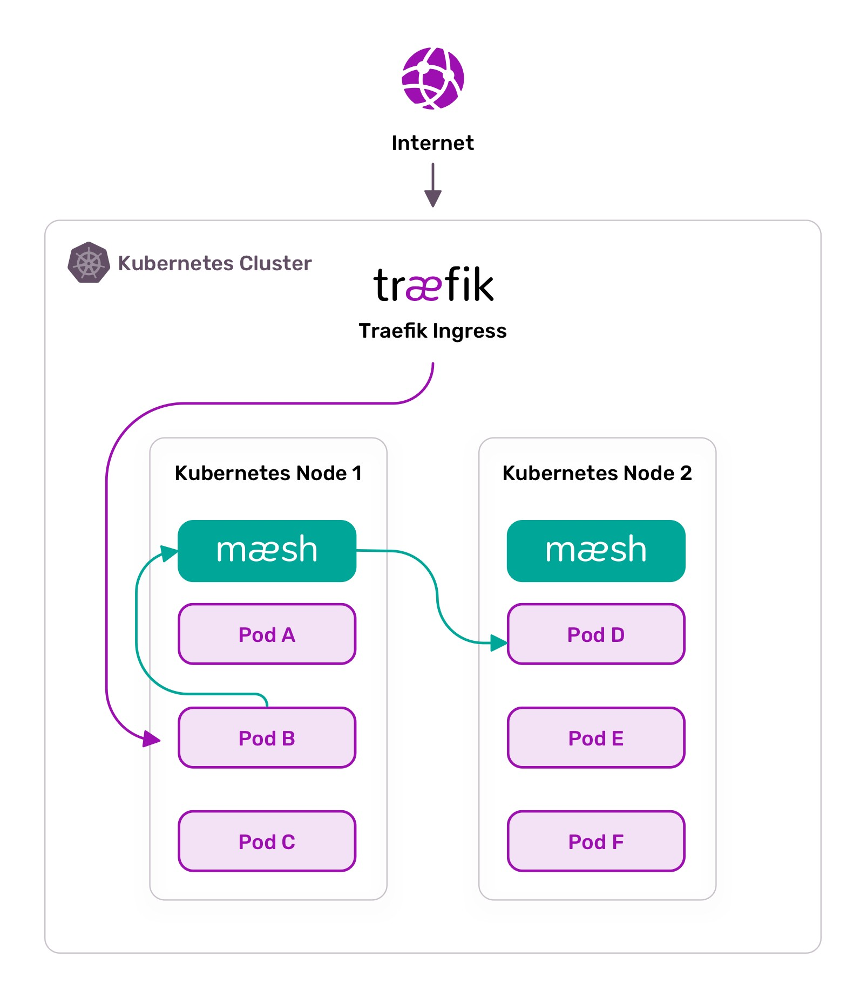

# `Traefik` 团队开源的轻量级 `Service Mesh` 工具 `Maesh`

Containous（Traefik 团队）推出了全新设计的轻量级 `service mesh`（服务网格）工具：[Maesh](https://mae.sh)，`Maesh` 允许对 `Kubernetes` 集群内流动的流量进行管理，这与入流量和出流量同样很重要。

`Maesh` 构建在 `Traefk` 之上，是一个简单但功能齐全的服务网格，支持最新的服务网格接口规范 [`SMI`](https://smi-spec.io/)，有助于与现有的一些解决方案进行集成。

**此外，Maesh 默认是需要开启使用的，这意味着在你决定将它们添加到网格之前，你的现有服务不会受到影响。**

## 非侵入性服务网格

**`Maesh` 没有使用任何的 `sidecar` 容器，而是通过每个节点上运行的代理服务进行路由。**

网格控制器运行在一个专用的 Pod 中，用来处理所有的配置解析和代理节点的 `deployment`。`Maesh` 支持多种配置选项：

**用户服务对象和 `SMI` 对象上的注解。不使用 `sidecar` 意味着 `Maesh` 不会修改你的 `Kubernetes` 对象，也不会在你不知情的情况下篡改你的流量，只需要使用 `Maesh` 服务即可。**




## 依赖 Kubernetes DNS

`Maesh` 使用 `Kubernetes` 中默认安装的`CoreDNS`。


它允许用户使用 `Maesh` 服务（而不是标准的 `Kubernetes Service`），`Maesh` 服务和用户服务一起运行：你可以自己选择是否使用它们。这就为用户提供了更多的使用信心了，因为用户知道他们可以测试使用 `Maesh`，也可以恢复到原来的服务。

**此外，在安装 `Meash` 的时候对 `CoreDNS` 的更改是非常小的也是非侵入性的，可以很容易移除。**


## 多个网络层

`Maesh` 可以在 `TCP` 和 `HTTP` 模式下运行。

* 在 `HTTP` 模式下，`Maesh` 利用 `Traefik` 的特性在 `virtual-host`、`path`、`headers`、`cookies` 上集成更加丰富的路由。
* **使用 `TCP` 模式可以无缝轻松地与 `SNI` 路由集成。**


在同一群集中可以同时使用这两种模式，然后可以通过服务上的注解进行配置。

## 构建在 Traefik 之上

Maesh 建立在 Traefik之上，提供了大部分用户期望的功能：`OpenTracing`、`HTTP 负载均衡`、`GRPC`、`WebSocket`、`TCP`、丰富的路由规则、重试和故障接管，当然也包括了访问控制、速率限制和断路器等等功能。

## 安装使用简单

将 `Maesh` 安装到您的 `Kubernetes` 集群上是很简单的：

* 直接安装 `Helm chart` 包即可，因为没有额外的程序，没有要安装的 `CRD`，也没有新的词汇表供用户学习。

如果用户了解 `Pod` 和 `Service` 的工作方式，那么你就可以很容易理解和使用 Maesh。


使用以下命令安装 `Maesh`：

```
$ helm3 repo list
NAME  	URL
stable	https://kubernetes-charts.storage.googleapis.com
local 	http://127.0.0.1:8879/charts

$ helm repo add maesh https://containous.github.io/maesh/charts
$ helm repo update 
$ helm install --name=maesh --namespace=maesh maesh/maesh
```
**这样我们就在集群中安装好了 Maesh，并且我们可以在任何正在运行的应用程序上使用 Maesh**：

```
$ kubectl annotate service web-application maesh.containo.us/traffic-type=http
```

**如果我们的应用程序是使用的 TCP 协议（不是HTTP），那么可以使用下面的命令来开启**：


```
$ kubectl annotate service mongo-database maesh.containo.us/traffic-type=tcp
```

这就是安装和使用 Maesh 的方法，是不是比 Istio 简单很多啊 😄


