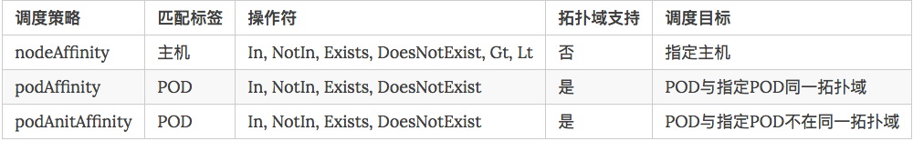

# 理解 Kubernetes 的亲和性调度

### `nodeSelector`、`nodeAffinity`、`podAffinity`、`Taints`以及`Tolerations`用法

一般情况下我们部署的 `POD` 是通过集群自动调度选择某个节点的，默认情况下调度器考虑的是资源足够，并且负载尽量平均，

**但是有的时候我们需要能够更加细粒度的去控制 `POD` 的调度，比如我们内部的一些服务 `gitlab` 之类的也是跑在`Kubernetes`集群上的，我们就不希望对外的一些服务和内部的服务跑在同一个节点上了，害怕内部服务对外部的服务产生影响；**

有的时候呢我们两个服务直接交流比较频繁，又希望能够将这两个服务的 `POD` 调度到同样的节点上。这就需要用到 

### `Kubernetes` 里面的一个概念：亲和性，亲和性主要分为两类：`nodeAffinity`和`podAffinity`。

## nodeSelector

我们知道`label`是`kubernetes`中一个非常重要的概念，用户可以非常灵活的利用 `label` 来管理集群中的资源，比如最常见的一个就是 `service` 通过匹配 `label` 去选择 `POD `的。而 `POD` 的调度也可以根据节点的 `label` 进行特定的部署。

我们可以通过下面的命令查看我们的 `node` 的 `label`：

```
$ kubectl get nodes --show-labels
NAME            STATUS    ROLES     AGE       VERSION   LABELS
192.168.1.170   Ready     <none>    1d        v1.8.2    beta.kubernetes.io/arch=amd64,beta.kubernetes.io/os=linux,kubernetes.io/hostname=192.168.1.170
```

现在我们先给节点192.168.1.170增加一个`source=qikqiak`的标签，命令如下：

```
$ kubectl label nodes 192.168.1.170 source=qikqiak
node "192.168.1.170" labeled
```

我们可以通过上面的`--show-labels`参数可以查看上述标签是否生效。当 `node` 被打上了相关标签后，在调度的时候就可以使用这些标签了，只需要在 `PO`D 的 `spec` 字段中添加`nodeSelector`字段，里面是我们需要被调度的节点的 `label`。例如，下面是我们之前的一个默认的 `busybox POD`的 `YAML` 文件：

```
$ kubectl get nodes --show-labels
NAME            STATUS    ROLES     AGE       VERSION   LABELS
192.168.1.170   Ready     <none>    1d        v1.8.2    beta.kubernetes.io/arch=amd64,beta.kubernetes.io/os=linux,kubernetes.io/hostname=192.168.1.170,source=qikqiak
```

```
apiVersion: v1
kind: Pod
metadata:
  labels:
    app: busybox-pod
  name: test-busybox
spec:
  containers:
  - command:
    - sleep
    - "3600"
    image: busybox
    imagePullPolicy: Always
    name: test-busybox
```

**然后我需要让上面的 `POD` 被调度到`170`的节点上，那么最简单的方法就是去匹配`170`上面的 `label`，如下：**

```
apiVersion: v1
kind: Pod
metadata:
  labels:
    app: busybox-pod
  name: test-busybox
spec:
  containers:
  - command:
    - sleep
    - "3600"
    image: busybox
    imagePullPolicy: Always
    name: test-busybox
  nodeSelector:
    source: qikqiak
```

然后我们可以通过 `describe` 命令查看调度结果：

```
$ vi test-busybox-nodeSelecor.yaml
$ kubectl create -f test-busybox-nodeSelecor.yaml
pod "test-busybox" created
```

然后我们可以通过 describe 命令查看调度结果：

```
$ kubectl describe pod test-busybox
Name:         test-busybox
Namespace:    default
Node:         192.168.1.170/192.168.1.170
Start Time:   Thu, 13 Sep 2018 07:41:40 +0000
Labels:       app=busybox-pod
Annotations:  <none>
Status:       Running
IP:           172.17.0.17
Containers:
  test-busybox:
    Container ID:  docker://ed3a004a00a42c4dddfea65d994e220f833a57e52ec9c1c89a3870e581c11588
    Image:         busybox
    Image ID:      docker-pullable://busybox@sha256:cb63aa0641a885f54de20f61d152187419e8f6b159ed11a251a09d115fdff9bd
    Port:          <none>
    Command:
      sleep
      3600
    State:          Running
      Started:      Thu, 13 Sep 2018 07:41:48 +0000
    Ready:          True
    Restart Count:  0
    Environment:    <none>
    Mounts:
      /var/run/secrets/kubernetes.io/serviceaccount from default-token-hgmcr (ro)
Conditions:
  Type           Status
  Initialized    True
  Ready          True
  PodScheduled   True
Volumes:
  default-token-hgmcr:
    Type:        Secret (a volume populated by a Secret)
    SecretName:  default-token-hgmcr
    Optional:    false
QoS Class:       BestEffort
Node-Selectors:  source=qikqiak
Tolerations:     <none>
Events:
  Type    Reason                 Age   From                    Message
  ----    ------                 ----  ----                    -------
  Normal  Scheduled              22s   default-scheduler       Successfully assigned test-busybox to 192.168.1.170
  Normal  SuccessfulMountVolume  21s   kubelet, 192.168.1.170  MountVolume.SetUp succeeded for volume "default-token-hgmcr"
  Normal  Pulling                20s   kubelet, 192.168.1.170  pulling image "busybox"
  Normal  Pulled                 15s   kubelet, 192.168.1.170  Successfully pulled image "busybox"
  Normal  Created                15s   kubelet, 192.168.1.170  Created container
  Normal  Started                14s   kubelet, 192.168.1.170  Started container
```

我们可以看到 `Events` 下面的信息，上面的 POD 被正确的调度到了`170`节点。通过上面的例子我们可以感受到`nodeSelector`的方式比较直观，但是还够灵活，控制粒度偏大，下面我们再看另外一种更加灵活的方式：`nodeAffinity`。

## nodeAffinity

上节课我们了解了 `kubernetes` 调度器的一个调度流程，我们知道默认的调度器在使用的时候，经过了 `predicates` 和 `priorities` 两个阶段，但是在实际的生产环境中，往往我们需要根据自己的一些实际需求来控制 `pod` 的调度，

### `nodeAffinity`就是节点亲和性，相对应的是`Anti-Affinity`，就是`反亲和性`，这种方法比上面的`nodeSelector`更加灵活，它可以进行一些简单的逻辑组合了，

不只是简单的相等匹配。 调度可以分成`软策略`和`硬策略`两种方式，

* `软策略`就是如果你没有满足调度要求的节点的话，POD 就会忽略这条规则，继续完成调度过程，说白了就是满足条件最好了，没有的话也无所谓了的策略；
* `硬策略`就比较强硬了，如果没有满足条件的节点的话，就不断重试直到满足条件为止，简单说就是你必须满足我的要求，不然我就不干的策略。

`nodeAffinity`就有两上面两种策略：`preferredDuringSchedulingIgnoredDuringExecution`和`requiredDuringSchedulingIgnoredDuringExecution`，前面的就是软策略，后面的就是硬策略。

如下例子：（**test-node-affinity.yaml**）

```
apiVersion: v1
kind: Pod
metadata:
  name: with-node-affinity
  labels:
    app: node-affinity-pod
spec:
  containers:
  - name: with-node-affinity
    image: nginx
  affinity:
    nodeAffinity:
      requiredDuringSchedulingIgnoredDuringExecution:          # 硬策略
        nodeSelectorTerms:
        - matchExpressions:
          - key: kubernetes.io/hostname
            operator: NotIn
            values:
            - 192.168.1.140
            - 192.168.1.161
      preferredDuringSchedulingIgnoredDuringExecution:         # 软策略
      - weight: 1
        preference:
          matchExpressions:
          - key: source
            operator: In
            values:
            - qikqiak
```

上面这个 `POD` 首先是要求 `POD` 不能运行在`140`和`161`两个节点上，如果有个节点满足`source=qikqiak`的话就优先调度到这个节点上，同样的我们可以使用`descirbe`命令查看具体的调度情况是否满足我们的要求。这里的匹配逻辑是 `label` 的值在某个列表中，现在`Kubernetes`提供的操作符有下面的几种：

* In：label 的值在某个列表中
* NotIn：label 的值不在某个列表中
* Gt：label 的值大于某个值
* Lt：label 的值小于某个值
* Exists：某个 label 存在
* DoesNotExist：某个 label 不存在


* 如果`nodeSelectorTerms`下面有多个选项的话，满足任何一个条件就可以了；
* 如果`matchExpressions`有多个选项的话，则必须同时满足这些条件才能正常调度 `POD`。


## podAffinity

### 上面两种方式都是让 `POD` 去选择节点的，有的时候我们也希望能够根据 `POD` 之间的关系进行调度，`Kubernetes`在`1.4`版本引入的`podAffinity`概念就可以实现我们这个需求。

**`pod` 亲和性主要解决 `pod` 可以和哪些 `pod` 部署在同一个拓扑域中的问题（其中拓扑域用主机标签实现，可以是单个主机，也可以是多个主机组成的 cluster、zone 等等），而 `pod` 反亲和性主要是解决 `pod` 不能和哪些 `pod` 部署在同一个拓扑域中的问题，它们都是处理的 `pod` 与 `pod` 之间的关系，比如一个 `pod` 在一个节点上了，那么我这个也得在这个节点，或者你这个 `pod` 在节点上了，那么我就不想和你待在同一个节点上。**

和`nodeAffinity`类似，`podAffinity`也有`requiredDuringSchedulingIgnoredDuringExecution` 和 `preferredDuringSchedulingIgnoredDuringExecution` 两种调度策略，唯一不同的是如果要使用互斥性，我们需要使用`podAntiAffinity`字段。 如下例子，我们希望`with-pod-affinity`和`busybox-pod`能够就近部署，而不希望和`node-affinity-pod`部署在同一个拓扑域下面：（`test-pod-affinity.yaml`）

```
apiVersion: v1
kind: Pod
metadata:
  name: with-pod-affinity
  labels:
    app: pod-affinity-pod
spec:
  containers:
  - name: with-pod-affinity
    image: nginx
  affinity:
    podAffinity:
      requiredDuringSchedulingIgnoredDuringExecution:
      - labelSelector:
          matchExpressions:
          - key: app
            operator: In
            values:
            - busybox-pod
        topologyKey: kubernetes.io/hostname
    podAntiAffinity:
      preferredDuringSchedulingIgnoredDuringExecution:
      - weight: 1
        podAffinityTerm:
          labelSelector:
            matchExpressions:
            - key: app
              operator: In
              values:
              - node-affinity-pod
          topologyKey: kubernetes.io/hostname
```


上面这个例子中的 `POD` 需要调度到某个指定的主机上，至少有一个节点上运行了这样的 `POD`：这个 `POD` 有一个`app=busybox-pod`的 `label`。`podAntiAffinity`则是希望最好不要调度到这样的节点：这个节点上运行了某个 `POD`，而这个 `POD` 有`app=node-affinity-pod`的 `label`。根据前面两个 `POD` 的定义，我们可以预见上面这个 `POD` 应该会被调度到`140`的节点上，因为`busybox-pod`被调度到了`140`节点，而`node-affinity-pod`被调度到了`140`以为的节点，正好满足上面的需求。通过describe查看：

```
$ kubectl describe pod with-pod-affinity
......
Events:
  Type    Reason                 Age   From                    Message
  ----    ------                 ----  ----                    -------
  Normal  Scheduled              8s    default-scheduler       Successfully assigned with-pod-affinity to 192.168.1.140
  Normal  SuccessfulMountVolume  7s    kubelet, 192.168.1.140  MountVolume.SetUp succeeded for volume "default-token-lcl77"
  Normal  Pulling                7s    kubelet, 192.168.1.140  pulling image "nginx"
```

上面的事件信息也验证了我们的想法。

在`labelSelector`和 `topologyKey`的同级，还可以定义 `namespaces` 列表，表示匹配哪些 `namespace` 里面的 `pod`，默认情况下，会匹配定义的 `pod` 所在的 
`namespace`；如果定义了这个字段，但是它的值为空，则匹配所有的 `namespaces`。

查看上面我们定义的3个 POD 结果：

```
$ kubectl get po -o wide
NAME                 READY     STATUS    RESTARTS   AGE       IP             NODE
test-busybox         1/1       Running   0          8m        172.30.95.18   192.168.1.140
with-node-affinity   1/1       Running   0          10m       172.30.81.25   192.168.1.172
with-pod-affinity    1/1       Running   0          8m        172.30.95.17   192.168.1.140
```
## podAntiAffinity

这就是 `pod` 亲和性的用法，而 `pod` 反亲和性则是反着来的，比如一个节点上运行了某个 `pod`，那么我们的 `pod` 则希望被调度到其他节点上去，同样我们把上面的 `podAffinity` 直接改成 `podAntiAffinity`，(`pod-antiaffinity-demo.yaml`)

```
apiVersion: apps/v1beta1
kind: Deployment
metadata:
  name: affinity
  labels:
    app: affinity
spec:
  replicas: 3
  revisionHistoryLimit: 15
  template:
    metadata:
      labels:
        app: affinity
        role: test
    spec:
      containers:
      - name: nginx
        image: nginx:1.7.9
        ports:
        - containerPort: 80
          name: nginxweb
      affinity:
        podAntiAffinity:
          requiredDuringSchedulingIgnoredDuringExecution:  # 硬策略
          - labelSelector:
              matchExpressions:
              - key: app
                operator: In
                values:
                - busybox-pod
            topologyKey: kubernetes.io/hostname
```
这里的意思就是如果一个节点上面有一个`app=busybox-pod`这样的 `pod` 的话，那么我们的 `pod` 就别调度到这个节点上面来，上面我们把`app=busybox-pod`这个 `pod` 固定到了 `node03` 这个节点上面来，所以正常来说我们这里的 `pod` 不会出现在 `node03` 节点上：

```
$ kubectl create -f pod-antiaffinity-demo.yaml
deployment.apps "affinity" created
$ kubectl get pods -o wide
NAME                                      READY     STATUS      RESTARTS   AGE       IP             NODE
affinity-bcbd8854f-br8z8                  1/1       Running     0          5s        10.244.4.222   node02
affinity-bcbd8854f-cdffh                  1/1       Running     0          5s        10.244.4.223   node02
affinity-bcbd8854f-htb52                  1/1       Running     0          5s        10.244.4.224   node02
test-busybox                              1/1       Running     0          23m       10.244.2.10    node03
```


### 亲和性/反亲和性调度策略比较如下：



### 亲和性/反亲和性应用实例：

* 硬策略反亲和性

```
affinity:
	podAffinity:
	  requiredDuringSchedulingIgnoredDuringExecution:
	  - labelSelector:
	      matchExpressions:
	      - key: app
	        operator: In
	        values:
	        - prometheus
	    topologyKey: kubernetes.io/hostname
	    namespaces: ["monitoring"]    😘  
```

* 硬策略反亲和性(多values, 多namespaces)

```
affinity:
	podAntiAffinity:
	  requiredDuringSchedulingIgnoredDuringExecution:
	  - labelSelector:
	      matchExpressions:
	      - key: app
	        operator: In
	        values:
	        - prometheus
	        - metrics-server
	    topologyKey: kubernetes.io/hostname
	    namespaces: ["monitoring","kube-system"]
```

* 软策略策略反亲和性(多values, 多namespaces)

```
affinity:
	podAntiAffinity:
	  preferredDuringSchedulingIgnoredDuringExecution:
	  - weight: 100     👌
	    podAffinityTerm:
	      labelSelector:
	        matchExpressions:
	        - key: app
	          operator: In
	          values:
	          - prometheus
	          - metrics-server
	      topologyKey: kubernetes.io/hostname
	      namespaces: ["monitoring","kube-system"] 
```

[Scheduler affinities through examples](https://banzaicloud.com/blog/k8s-affinities/)

**So what’s a good advice for setting `weight` in the range `1-100`? It’s simple: you won’t be able to calculate the priority score in advance for each of the nodes, so as a rule of thumb, the more you want your preference to be fulfilled, the higher weight you’ll need to set**.


## 污点（Taints）与容忍（tolerations）

对于`nodeAffinity`无论是**硬策略还是软策略方式**，都是调度 `POD` 到预期节点上，而`Taints`恰好与之相反，如果一个节点标记为 `Taints` ，除非 `POD` 也被标识为可以容忍污点节点，否则该 `Taints` 节点不会被调度`pod`。

比如用户希望把 `Master` 节点保留给 `Kubernetes` 系统组件使用，或者把一组具有特殊资源预留给某些 `POD`，则污点就很有用了，`POD` 不会再被调度到 `taint` 标记过的节点。我们使用 `kubeadm`搭建的集群默认就给 `master` 节点添加了一个污点标记，所以我们看到我们平时的 `pod` 都没有被调度到 `master` 上去：

```
$ kubectl describe node master
Name:               master
Roles:              master
Labels:             beta.kubernetes.io/arch=amd64
                    beta.kubernetes.io/os=linux
                    kubernetes.io/hostname=master
                    node-role.kubernetes.io/master=
......
Taints:             node-role.kubernetes.io/master:NoSchedule
Unschedulable:      false
......

```
我们可以使用上面的命令查看 master 节点的信息，其中有一条关于 `Taints` 的信息：`node-role.kubernetes.io/master:NoSchedule`，就表示给 master 节点打了一个污点的标记，其中影响的参数是 `NoSchedule`，表示 `pod` 不会被调度到标记为 `taints` 的节点，除了 `NoSchedule` 外，还有另外两个选项：

* `PreferNoSchedule`：`NoSchedule` 的软策略版本，表示尽量不调度到污点节点上去
* `NoExecute`：该选项意味着一旦 Taint 生效，如该节点内正在运行的 `pod` 没有对应 `Tolerate` 设置，会直接被逐出

`taint` 标记节点举例如下：

```
$ kubectl taint nodes node02 test=node02:NoSchedule
node "node02" tainted
```

上面的命名将 `node02` 节点标记为了污点，影响策略是 `NoSchedule`，只会影响新的 `pod `调度，如果仍然希望某个 `pod` 调度到 `tain`t 节点上，则必须在 `Spec` 中做出 `Toleration`定义，才能调度到该节点，比如现在我们想要将一个 `pod` 调度到 `master` 节点：(`taint-demo.yaml`)

```
apiVersion: apps/v1beta1
kind: Deployment
metadata:
  name: taint
  labels:
    app: taint
spec:
  replicas: 3
  revisionHistoryLimit: 10
  template:
    metadata:
      labels:
        app: taint
    spec:
      containers:
      - name: nginx
        image: nginx:1.7.9
        ports:
        - name: http
          containerPort: 80
      tolerations:
      - key: "node-role.kubernetes.io/master"
        operator: "Exists"
        effect: "NoSchedule"
```

由于 `master` 节点被标记为了污点节点，所以我们这里要想 `pod` 能够调度到 `master` 节点去，就需要增加容忍的声明：

```
tolerations:
- key: "node-role.kubernetes.io/master"
  operator: "Exists"
  effect: "NoSchedule"
```
然后创建上面的资源，查看结果：

```
$ kubectl create -f taint-demo.yaml
deployment.apps "taint" created
$ kubectl get pods -o wide
NAME                        READY     STATUS             RESTARTS   AGE       IP             NODE
......
taint-845d8bb4fb-57mhm      1/1       Running            0          1m        10.244.4.247   node02
taint-845d8bb4fb-bbvmp      1/1       Running            0          1m        10.244.0.33    master
taint-845d8bb4fb-zb78x      1/1       Running            0          1m        10.244.4.246   node02
......
```
我们可以看到有一个 `pod` 副本被调度到了 `master` 节点，这就是容忍的使用方法。

对于 `tolerations` 属性的写法，其中的 `key`、`value`、`effect` 与 `Node` 的 `Taint` 设置需保持一致， 还有以下几点说明：

1. 如果 operator 的值是 Exists，则 value 属性可省略
2. 如果 operator 的值是 Equal，则表示其 key 与 value 之间的关系是 equal(等于)
3. 如果不指定 operator 属性，则默认值为 Equal

另外，还有两个特殊值：

1. 空的 `key` 如果再配合 `Exists` 就能匹配所有的 `key` 与 `value`，也是是能容忍所有 `node` 的所有 `Taints`
2. 空的 `effect` 匹配所有的 `effect`

`effect` 共有三个可选项，可按实际需求进行设置：

* `NoSchedule`：POD 不会被调度到标记为 `taints `节点。
* `PreferNoSchedule`：`NoSchedule` 的软策略版本。
* `NoExecute`：该选项意味着一旦 `Taint` 生效，如该节点内正在运行的 `POD` 没有对应 `Tolerate` 设置，会直接被逐出。

最后，如果我们要取消节点的污点标记，可以使用下面的命令

```
$ kubectl taint nodes node02 test-
node "node02" untainted
```

这就是污点和容忍的使用方法。

## 参考资料

* [https://kubernetes.io/docs/concepts/configuration/assign-pod-node/](https://kubernetes.io/docs/concepts/configuration/assign-pod-node/)
* [https://kubernetes.io/docs/concepts/configuration/taint-and-toleration/](https://kubernetes.io/docs/concepts/configuration/taint-and-toleration/)
* [https://coreos.com/fleet/docs/latest/affinity.html](https://coreos.com/fleet/docs/latest/affinity.html)