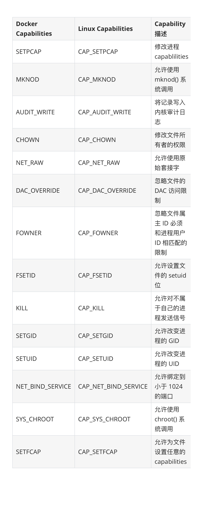
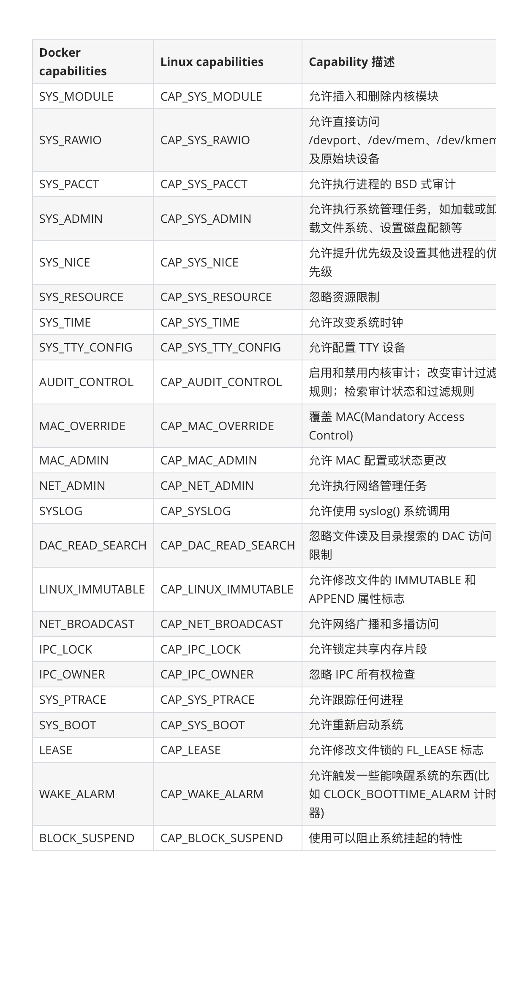

# 在 `Kubernetes` 中配置 `Container Capabilities`

我们在使用 `Kubernetes` 过程中，偶尔会遇到如下所示的一段配置：

```
securityContext:
  capabilities:
    drop:
    - ALL
    add:
    - NET_BIND_SERVICE
```

实际上这是配置对应的容器的 `Capabilities`，在我们使用 `docker run` 的时候可以通过 `--cap-add` 和 `--cap-drop` 命令来给容器添加 `Linux Capabilities`。对于大部分同学可能又要疑问 `Linux Capabilities` 是什么呢？

## Linux Capabilities


要了解 `Linux Capabilities`，这就得从 `Linux` 的权限控制发展来说明。在 `Linux 2.2` 版本之前，当内核对进程进行权限验证的时候，`Linux` 将进程划分为两类：

* **特权进程（UID=0，也就是超级用)** 和**非特权进程（UID!=0）**，**特权进程拥有所有的内核权限，而非特权进程则根据进程凭证（`effective UID, effective GID，supplementary group` 等）进行权限检查**。

比如我们以常用的 `passwd` 命令为例，修改用户密码需要具有 `roots` 权限，而普通用户是没有这个权限的。但是实际上普通用户又可以修改自己的密码，这是怎么回事呢？在 `Linux` 的权限控制机制中，有一类比较特殊的权限设置，比如 `SUID(Set User ID on execution`，允许用户以可执行文件的 `owner` 的权限来运行可执行文件。因为程序文件 `/bin/passwd` 被设置了 `SUID` 标识，所以普通用户在执行 `passwd` 命令时，进程是以 `passwd` 的所有者，也就是 `root` 用户的身份运行，从而就可以修改密码了。

但是使用 `SUID` 却带来了新的安全隐患，当我们运行设置了 `SUID` 的命令时，通常只是需要很小一部分的特权，但是 `SUID` 却给了它 `roo`t 具有的全部权限，一旦 被设置了 `SUID` 的命令出现漏洞，是不是就很容易被利用了。

**为此 `Linux` 引入了 `Capabilities` 机制来对 `root` 权限进行了更加细粒度的控制，实现按需进行授权，这样就大大减小了系统的安全隐患**。


## 什么是 Capabilities


从内核 2.2 开始，`Linux` 将传统上与超级用户 `root` 关联的特权划分为不同的单元，称为 `capabilites`。

`Capabilites` 每个单元都可以独立启用和禁用。这样当系统在作权限检查的时候就变成了：在执行特权操作时，如果进程的有效身份不是 **`root`**，就去检查是否具有该特权操作所对应的 `capabilites`，并以此决定是否可以进行该特权操作。比如如果我们要设置系统时间，就得具有 `CAP_SYS_TIME` 这个 `capabilites`。

下面是从 `capabilities man page` 中摘取的 `capabilites` 列表：


## 如何使用 Capabilities

**我们可以通过 `getcap` 和 `setcap` 两条命令来分别查看和设置程序文件的 `capabilities` 属性。**

比如当前我们是`zuiapp`这个用户，使用 `getcap` 命令查看 `ping` 命令目前具有的 `capabilities`：

```
$ ll /bin/ping
-rwxr-xr-x. 1 root root 66176 Aug  4  2017 /bin/ping
```

我们可以看到具有 `cap_net_admin` 这个属性，所以我们现在可以执行 `ping` 命令：

```
$ ping www.baidu.com
PING www.a.shifen.com (112.80.248.75) 56(84) bytes of data.
64 bytes from 112.80.248.75 (112.80.248.75): icmp_seq=1 ttl=128 time=21.9 ms
64 bytes from 112.80.248.75 (112.80.248.75): icmp_seq=2 ttl=128 time=30.1 ms
64 bytes from 112.80.248.75 (112.80.248.75): icmp_seq=3 ttl=128 time=24.5 ms
^C
--- www.a.shifen.com ping statistics ---
3 packets transmitted, 3 received, 0% packet loss, time 2265ms
rtt min/avg/max/mdev = 21.925/25.572/30.195/3.446 ms
```

但是如果我们把命令的 `capabilities` 属性移除掉：

```
$ sudo setcap cap_net_admin,cap_net_raw-p /bin/ping
$ getcap /bin/ping
/bin/ping =
```

这个时候我们执行 `ping` 命令可以发现已经没有权限了：

```
$ ping www.baidu.com
ping: socket: Operation not permitted
```

**因为 `ping` 命令在执行时需要访问网络，所需的 `capabilities` 为 `cap_net_admin` 和 `cap_net_raw`，所以我们可以通过 `setcap` 命令可来添加它们**：

```
$ sudo setcap cap_net_admin,cap_net_raw+p /bin/ping
$ getcap /bin/ping
/bin/ping = cap_net_admin,cap_net_raw+p
$ ping www.baidu.com
PING www.a.shifen.com (112.80.248.75) 56(84) bytes of data.
64 bytes from 112.80.248.75 (112.80.248.75): icmp_seq=1 ttl=128 time=21.9 ms
64 bytes from 112.80.248.75 (112.80.248.75): icmp_seq=2 ttl=128 time=30.1 ms
64 bytes from 112.80.248.75 (112.80.248.75): icmp_seq=3 ttl=128 time=24.5 ms
```

* 命令中的 `p` 表示 `Permitted` 集合(接下来会介绍)，
* `+` 号表示把指定的`capabilities` 添加到这些集合中，
* `- `号表示从集合中移除。

对于可执行文件的属性中有三个集合来保存三类 `capabilities`，它们分别是：

* `Permitted`：在进程执行时，`Permitted` 集合中的 `capabilites` 自动被加入到进程的 `Permitted` 集合中。
* `Inheritable`：`Inheritable` 集合中的 `capabilites` 会与进程的 `Inheritable` 集合执行与操作，以确定进程在执行 `execve` 函数后哪些 `capabilites` 被继承。
* `Effective`：`Effective` 只是一个 `bit`。如果设置为开启，那么在执行 `execve` 函数后，`Permitted` 集合中新增的 `capabilities` 会自动出现在进程的 `Effective` 集合中。

对于进程中有五种 `capabilities` 集合类型，相比文件的 `capabilites`，进程的 `capabilities` 多了两个集合，分别是 `Bounding `和 `Ambient`我们可以通过下面的命名来查看当前进程的 capabilities 信息：

```
$ cat /proc/7029/status | grep 'Cap'  #7029为PID
CapInh:	0000000000000000
CapPrm:	0000000000000000
CapEff:	0000000000000000
CapBnd:	0000001fffffffff
CapAmb:	0000000000000000
```

然后我们可以使用 `capsh` 命令把它们转义为可读的格式，这样基本可以看出进程具有的 `capabilities` 了：

```
$ capsh --decode=0000001fffffffff
0x0000001fffffffff=cap_chown,cap_dac_override,cap_dac_read_search,cap_fowner,cap_fsetid,cap_kill,cap_setgid,cap_setuid,cap_setpcap,cap_linux_immutable,cap_net_bind_service,cap_net_broadcast,cap_net_admin,cap_net_raw,cap_ipc_lock,cap_ipc_owner,cap_sys_module,cap_sys_rawio,cap_sys_chroot,cap_sys_ptrace,cap_sys_pacct,cap_sys_admin,cap_sys_boot,cap_sys_nice,cap_sys_resource,cap_sys_time,cap_sys_tty_config,cap_mknod,cap_lease,cap_audit_write,cap_audit_control,cap_setfcap,cap_mac_override,cap_mac_admin,cap_syslog,35,36
```

## Docker Container Capabilities

我们说 `Docker` 容器本质上就是一个进程，所以理论上容器就会和进程一样会有一些默认的开放权限，默认情况下 `Docker` 会删除必须的 `capabilities` 之外的所有 `capabilities`，因为在容器中我们经常会以 `root` 用户来运行，使用 `capabilities `现在后，容器中的使用的 `roo`t 用户权限就比我们平时在宿主机上使用的 root 用户权限要少很多了，这样即使出现了安全漏洞，也很难破坏或者获取宿主机的 `root` 权限，所以 `Docker` 支持 `Capabilities` 对于容器的安全性来说是非常有必要的。

不过我们在运行容器的时候可以通过指定 `--privileded` 参数来开启容器的超级权限，这个参数一定要慎用，因为他会获取系统 `root` 用户所有能力赋值给容器，并且会扫描宿主机的所有设备文件挂载到容器内部，所以是非常危险的操作。

但是如果你确实需要一些特殊的权限，我们可以通过 `--cap-add` 和 `--cap-drop` 这两个参数来动态调整，可以最大限度地保证容器的使用安全。下面表格中列出的 `Capabilities` 是 `Docker` 默认给容器添加的，我们可以通过 `--cap-drop` 去除其中一个或者多个：



**下面表格中列出的 `Capabilities` 是 `Docker` 默认删除的，我们可以通过`--cap-add`添加其中一个或者多个**：



> `--cap-add`和`--cap-drop `这量参数都支持`ALL`值，比如如果你想让某个容器拥有除了`MKNOD`之外的所有内核权限，那么可以执行下面的命令： 
> `$ sudo docker run --cap-add=ALL --cap-drop=MKNOD` 


比如现在我们需要修改网络接口数据，默认情况下是没有权限的，因为需要的 `NET_ADMIN` 这个 `Capabilities` 默认被移除了：

```
$ docker run -it --rm busybox /bin/sh
/ # ip link add dummy0 type dummy
ip: RTNETLINK answers: Operation not permitted
/ #
```

所以在不使用 `--privileged` 的情况下（不建议）我们可以使用 `--cap-add=NET_ADMIN` 将这个 `Capabilities` 添加回来：

```
$ docker run -it --rm --cap-add=NET_ADMIN busybox /bin/sh
/ # ip link add dummy0 type dummy
/ # 
```

## Kubernetes 配置 Capabilities


上面我介绍了在 `Docker` 容器下如何来配置 `Capabilities`，在 `Kubernetes` 中也可以很方便的来定义，我们只需要添加到 `Pod` 定义的 `spec.containers.sercurityContext.capabilities`中即可，也可以进行 `add` 和 `drop` 配置，同样上面的示例，我们要给 `busybox` 容器添加 `NET_ADMIN` 这个 `Capabilities`，对应的 `YAML` 文件可以这样定义：(`cpb-demo.yam`)


```
apiVersion: v1
kind: Pod
metadata:
  name: cpb-demo
spec:
  containers:
  - name: cpb
    image: busybox
    args:
    - sleep
    - "3600"
    securityContext:
      capabilities:
        add: # 添加
        - NET_ADMIN
        drop:  # 删除
        - KILL
```

我们在 `securityContext` 下面添加了 `capabilities` 字段，其中添加了 `NET_ADMIN ` 并且删除了 `KILL` 这个默认的容器 `Capabilities`，这样我们就可以在 `Pod` 中修改网络接口数据了：


```
$ kubectl apply -f cpb-demo.yaml
$ kubectl get pods
NAME                      READY   STATUS    RESTARTS   AGE
cpb-demo                  1/1     Running   0          2m9s
$ kubectl exec -it cpb-demo /bin/sh
/ # ip link add dummy0 type dummy
/ #
```

在 `Kubernetes` 中通过 `sercurityContext.capabilities` 进行配置容器的 `Capabilities`，当然最终还是通过 `Docker` 的 `libcontainer` 去借助 `Linux kernel capabilities` 实现的权限管理。
