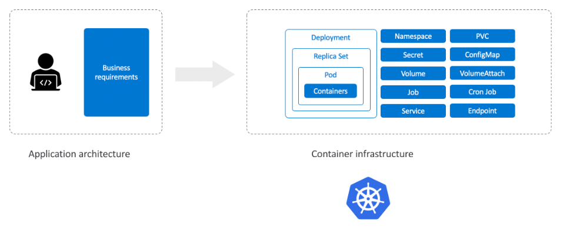
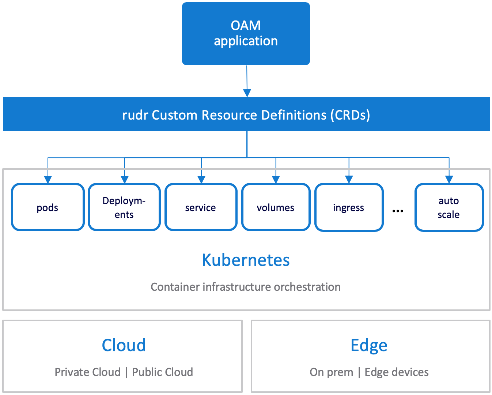
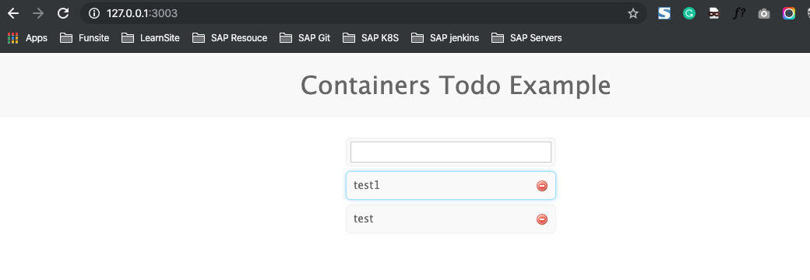

# 使用 OAM 部署 Kubernetes 应用

前段时间阿里云和微软云联合发布了 `Open Application Model（OAM`，简单来说就是利用一个规范对应用程序进行建模以区分开发和运维人员的职责。

开发人员负责描述微服务或组件的功能，以及如何配置它；

运维负责配置其中一个或多个微服务的运行时环境；基础设施工程师负责建立和维护应用程序运行的基础设施。其中 [Rudr](https://github.com/oam-dev/rudr) 是针对 `Kubernetes` 上面的 `OAM` 的参考实现。





`Rudr` 的应用程序有三个元素：

* `Components（组件）`
* `Configuration（配置）`
* `Traits（特征）`：

* 组件定义一个或多个面向操作系统的容器镜像以及硬件需求，如 CPU、内存和存储等
* 配置处理运行时的参数，比如环境变量
* 特征声明运行时的属性，比如 `Volume`、`Ingress`、伸缩等等。

下面我们来用一个简单的示例演示下 `Rudr` 的使用，`Rudr` 也是通过 `Kubernetes CRD` 实现的，将 `OAM` 规范中的属性映射成 `Kubernetes` 对象，继续操作之前，首先确保有一个 `Kubernetes` 集群，文章中使用到的应用源代码可以从 [GitHub 仓库](https://github.com/oam-dev/rudr)上获取，我们可以自己制作一个 `Docker` 镜像，当然也可以使用我们这里推送到 `Docker Hub` 上面的镜像。

```
$ kubectl version
Client Version: version.Info{Major:"1", Minor:"15", GitVersion:"v1.15.1", GitCommit:"4485c6f18cee9a5d3c3b4e523bd27972b1b53892", GitTreeState:"clean", BuildDate:"2019-07-18T09:18:22Z", GoVersion:"go1.12.5", Compiler:"gc", Platform:"darwin/amd64"}
Server Version: version.Info{Major:"1", Minor:"15", GitVersion:"v1.15.5", GitCommit:"20c265fef0741dd71a66480e35bd69f18351daea", GitTreeState:"clean", BuildDate:"2019-10-15T19:07:57Z", GoVersion:"go1.12.10", Compiler:"gc", Platform:"linux/amd64"}
```

我们这里的应用是一个 `Node.js` 的 `Web` 应用程序和一个对应的 `MongoDB` 容器组件，作为环境变量来配置 `MongoDB` 的连接地址就是我们的配置，

> 最后再配置一个 `Ingress` 作为我们的一个特征（`Traits`）。

## 安装 Rudr

关于 `Rudr` 的安装，[官方文档]()中提到的是用 `Helm3` 来安装，我们这里同样用 `Helm3` 进行安装，`Helm3` 已经去除掉了 `Tiller Server`，所以我们只需要下载 `Helm3` 客户端，然后在使用的节点上配置好 `kubectl` 就可以正常使用了。

从 [GitHub Release](https://get.helm.sh/helm-v3.0.0-darwin-amd64.tar.gz) 页面下载最新版本的 `Helm3`，然后解压放置到 `PATH `路径下面即可：

```
brew install helm
```

```
$ helm version
version.BuildInfo{Version:"v3.0.0", GitCommit:"e29ce2a54e96cd02ccfce88bee4f58bb6e2a28b6", GitTreeState:"clean", GoVersion:"go1.13.4"}
```

然后 `Clone Rudr` 代码仓库到本地，然后使用 `Helm` 直接安装即可：

```
$  git clone https://github.com/oam-dev/rudr.git
Cloning into 'rudr'...
remote: Enumerating objects: 34, done.
remote: Counting objects: 100% (34/34), done.
remote: Compressing objects: 100% (30/30), done.
remote: Total 3275 (delta 8), reused 11 (delta 4), pack-reused 3241
Receiving objects: 100% (3275/3275), 3.68 MiB | 639.00 KiB/s, done.
Resolving deltas: 100% (2149/2149), done.

$ cd rudr
```


```
[Jacob:~/k8s_sap/test/OAM/rudr]$ helm install rudr ./charts/rudr --wait --set image.tag=v1.0.0-alpha.1
NAME: rudr
LAST DEPLOYED: Tue Nov 26 17:43:16 2019
NAMESPACE: default
STATUS: deployed
REVISION: 1
TEST SUITE: None
NOTES:
Rudr is a Kubernetes controller to manage Configuration CRDs.

It has been successfully installed.
```

安装过后，可以使用如下命令来校验 `CRD` 和 `Pod` 是否已经安装成功：

```
$ kubectl get crds -l app.kubernetes.io/part-of=core.oam.dev
NAME                                     CREATED AT
applicationconfigurations.core.oam.dev   2019-11-26T09:43:13Z
componentinstances.core.oam.dev          2019-11-26T09:43:13Z
componentschematics.core.oam.dev         2019-11-26T09:43:13Z
healthscopes.core.oam.dev                2019-11-26T09:43:13Z
scopes.core.oam.dev                      2019-11-26T09:43:13Z
traits.core.oam.dev                      2019-11-26T09:43:13Z


$ kubectl get deployment rudr
NAME   READY   UP-TO-DATE   AVAILABLE   AGE
rudr   1/1     1            1           2m
```

## 部署应用


`Rudr` 安装成功后，现在我们可以来声明一个资源清单，我们这里的应用是一个简单的 `TODO` 应用，基于后端存储 `MongoDB` 的 `Express` 框架实现，所以我们这里可以声明一个 `MongoDB` 组件和 `Web `应用组件，将他们分别称为后端和前端组件：(`components.yaml`)

```
apiVersion: core.oam.dev/v1alpha1
kind: ComponentSchematic
metadata:
  name: backend
  annotations:
    version: "1.0.0"
    description: Mongodb Backend
spec:
  workloadType: core.oam.dev/v1alpha1.SingletonServer
  containers:
    - name: backend
      ports:
        - containerPort: 27017
          name: mongo
      image: mongo

---

apiVersion: core.oam.dev/v1alpha1
kind: ComponentSchematic
metadata:
  name: frontend
  annotations:
    version: "1.0.0"
    description: Todo Web Frontend
spec:
  workloadType: core.oam.dev/v1alpha1.Server
  parameters:
    - name: database
      type: string
      required: false  
  containers:
    - name: frontend
      ports:
        - containerPort: 3000
          name: http
      image: cnych/todo:v1
      env:
        - name: DB
          value: db
          fromParam: database
```


对于上面的资源清单文件，

* 首先我们需要关注的是`workloadType` 字段，用来表示工作负载类型，由于我们这里的两个服务都是监听特定端口长期运行的服务，所以它们都被定义为了 `Server`，但是 `MongoDB` 只需要运行一个 `Pod` 即可，因为是有状态的，多个副本需要很复杂的集群配置，所以为了简单我们这里始终运行一个 `Pod` 副本，所以这里使用的是一个 `SingletonServer`，表示单实例的服务。

```
workloadType: core.oam.dev/v1alpha1.Server
```

我们的 `Node` 服务会优先检查环境变量 `DB`，如果该变量值为空，则将使用使用字符串 `db` 作为默认的值，上面资源清单中我们在 `web` 应用程序中声明了 `parameters `部分，这个部分其实一般是开发定义的，但是运行运维后续来进行覆盖，所以这里的用途就是告诉运维人员哪些参数可以被覆盖掉，我们这里的意思就是默认值为 `db`，当然也可以被运维来覆盖掉这个值。


现在我们需要的两个组件定义完成后，就可以来定义配置和特征了。如下资源清单是我们这里声明的一个应用配置：(`configuration.yaml`)

```
apiVersion: core.oam.dev/v1alpha1
kind: ApplicationConfiguration
metadata:
  name: todo-app
spec:
  components:
    - name: backend
      instanceName: mongo
    - name: frontend
      instanceName: fe
      parameterValues:
        - name: database
          value: mongo
      # traits:
      #   - name: ingress
      #     parameterValues:
      #       - name: hostname
      #         value: todo.jxi.com
      #       - name: service_port
      #         value: 3000
      #       - name: path
      #         value: / 
```

这个配置资源清单我们做了两件事情，

为每个组件定义一个实例名称以及 `Web` 应用程序需要的环境变量，比如我们这里定义了 `backend` 的组件实例 `mongo`，`frontend` 组件的实例 `fe`，并且还用 `backend` 的实例名来覆盖 `database` 这个参数，也就是 `Web` 应用程序中对应的 `DB` 这个环境变量。

> 后面我们可以还配置了一个 `Ingress` 特征入口，其实就是定义 `Ingress` 对象的一些字段。

然后接下来我们就可以部署组件、配置和特征了。首先创建组件：

```
$  kubectl apply -f components.yaml
componentschematic.core.oam.dev/backend created
componentschematic.core.oam.dev/frontend created
```

创建组件并不会创建 `Kubernetes Pods` 对象，只有在部署了与组件相关的 `Rudr` 配置后才会部署：

```
$ kubectl apply -f configuration.yaml
applicationconfiguration.core.oam.dev/todo-app created
```

这个时候我们去查看下当前命名空间下面的 Pods：

```
$ kubectl get pods
NAME                                   READY   STATUS    RESTARTS   AGE
fe-699f7fb7f9-d9lrk                    1/1     Running   0          4m48s
mongo-6dd5b9c8fd-xzvk7                 1/1     Running   0          4m48s
prometheus-demo-app-8585d447c6-77st2   1/1     Running   0          8d
rudr-7cfbbb488-4pqbj                   1/1     Running   0          10m
```

我们可以看到已经在开始部署 `Pod` 资源了，`default` 命名空间下面有三个 `Pod`：
`rudr`、`frontend`、`backend`。另外由于我们在配置中添加了 `Ingress` ，所以也可以找到对象的 `Service` 和 `Ingress` 对象和我们的 `frontend` 应用关联：


### 使用`Port-forward`暴露服务

```
kubectl port-forward fe-699f7fb7f9-d9lrk 3003:3000
```

```
localhost:3003
```


