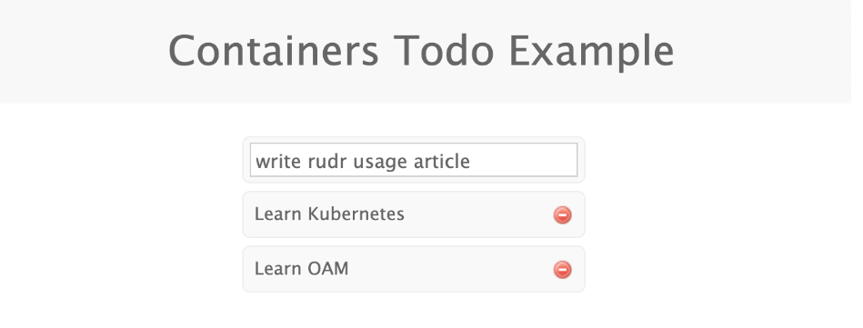
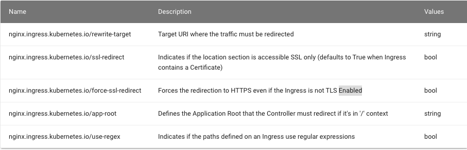
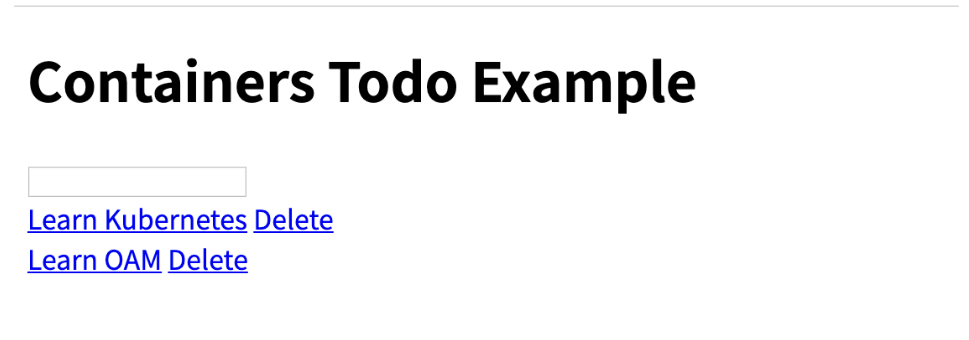
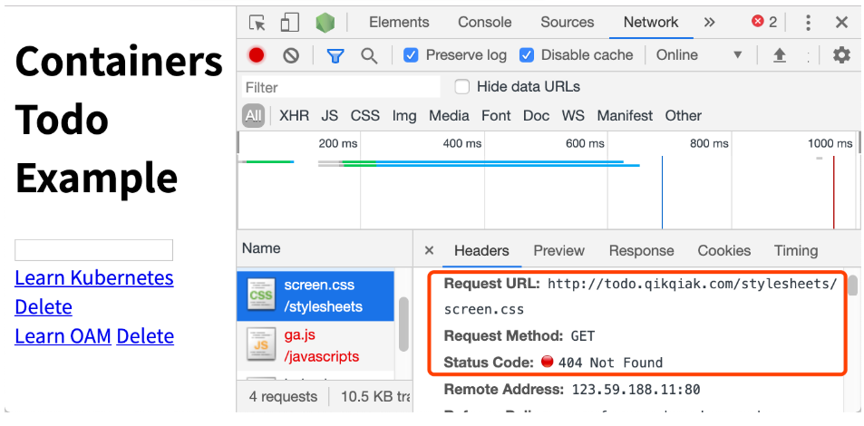
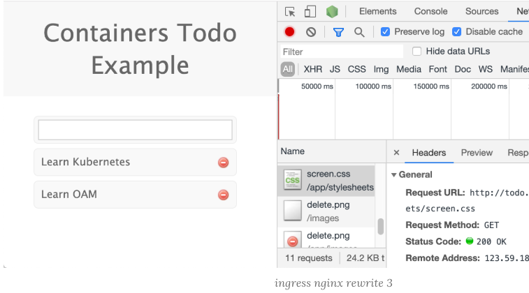

# ingress-nginx 中 Rewrite 的使用


由于 `nginx` 的优秀性能表现，所以很多企业在 Kubernetes 中选择 Ingress Controller 的时候依然会选择基于 `nginx` 的 `ingress-nginx`，前面文章中我们更多的是介绍更加云原生配置更加灵活的 `Traefik`，特别是 `Traefik 2.0` 版本新增中间件概念以后，在配置上就更加方便了，各种需求都可以通过中间件来实现，

对于 `ingress-nginx` 来说配置就稍微麻烦一点，一些复杂的需求需要通过 `Ingress` 的 `annotation` 来实现，比如我们现在需要实现一个 `url rewrite` 的功能，

**简单来说就是我们之前的应用在 `todo.jxi.com` 下面，现在我们需要通过 `todo.jxi.com/app/` 来进行访问。**

最原始的 Ingress 对象如下所示：

```
apiVersion: extensions/v1beta1
kind: Ingress
metadata:
  name: fe
  namespace: default
  annotations:
    kubernetes.io/ingress.class: "nginx"
spec:
  rules:
  - host: todo.jxi.com
    http:
      paths:
      - backend:
          serviceName: fe
          servicePort: 3000
        path: /
```

就是一个很常规的 `Ingress` 对象，部署该对象后，将域名解析后就可以正常访问到应用：

```
$ kubectl apply -f ingress.yaml
```

```
$ kubectl get ingress
NAME   HOSTS          ADDRESS   PORTS   AGE
fe     todo.jxi.com             80      20m
```



按照需求我们需要对访问的 URL 路径做一个 Rewrite，在 [ingress-nginx 官方文档](https://kubernetes.github.io/ingress-nginx/examples/rewrite/)中也给出了说明:



按照要求我们需要在 `path` 中匹配前缀 `app`，然后通过 `rewrite-target` 指定目标，修改后的 `Ingress` 对象如下所示：

```
apiVersion: extensions/v1beta1
kind: Ingress
metadata:
  name: fe
  namespace: default
  annotations:
    kubernetes.io/ingress.class: "nginx"
    nginx.ingress.kubernetes.io/rewrite-target: /$2
spec:
  rules:
  - host: todo.jxi.com
    http:
      paths:
      - backend:
          serviceName: fe
          servicePort: 3000
        path: /app(/|$)(.*)
```

更新后，我们可以遇见到直接访问域名肯定是不行了，因为我们没有匹配 `/` 的 `path` 路径：


但是我们带上 `app` 的前缀再去访问:

**`todo.jxi.com/app`**

**我们可以看到已经可以访问到页面内容了，这是因为我们在 `path` 中通过正则表达式 `/app(/|$)(.*)` 将匹配的路径设置成了 `rewrite-target` 的目标路径了**




**所以我们访问 `todo.jxi.com/app` 的时候实际上相当于访问的就是后端服务的 `/` 路径，但是我们也可以发现现在页面的样式没有了**



这是因为应用的静态资源路径是在 `/stylesheets` 路径下面的，现在我们做了 u`rl rewrite` 过后，要正常访问也需要带上前缀才可以：`http://todo.jxi.com/stylesheets/screen.css`，对于图片或者其他静态资源也是如此，

**当然我们去更改页面引入静态资源的方式为相对路径也是可以的，但是毕竟要修改代码，这个时候我们可以借助 `ingress-nginx` 中的 `configuration-snippet` 来对静态资源做一次跳转，如下所示**：

```
apiVersion: extensions/v1beta1
kind: Ingress
metadata:
  name: fe
  namespace: default
  annotations:
    kubernetes.io/ingress.class: "nginx"
    nginx.ingress.kubernetes.io/rewrite-target: /$2
    nginx.ingress.kubernetes.io/configuration-snippet: |
      rewrite ^/stylesheets/(.*)$ /app/stylesheets/$1 redirect;  # 添加 /app 前缀
      rewrite ^/images/(.*)$ /app/images/$1 redirect;  # 添加 /app 前缀
spec:
  rules:
  - host: todo.jxi.com
    http:
      paths:
      - backend:
          serviceName: fe
          servicePort: 3000
        path: /app(/|$)(.*)
```

更新 Ingress 对象后，这个时候我们刷新页面可以看到已经正常了：



**要解决我们访问主域名出现 `404` 的问题，我们可以给应用设置一个 `app-root` 的注解，这样当我们访问主域名的时候会自动跳转到我们指定的 `app-root` 目录下面**，如下所示：

```
apiVersion: extensions/v1beta1
kind: Ingress
metadata:
  name: fe
  namespace: default
  annotations:
    kubernetes.io/ingress.class: "nginx"
    nginx.ingress.kubernetes.io/app-root: /app/
    nginx.ingress.kubernetes.io/rewrite-target: /$2
    nginx.ingress.kubernetes.io/configuration-snippet: |
      rewrite ^/stylesheets/(.*)$ /app/stylesheets/$1 redirect;  # 添加 /app 前缀
      rewrite ^/images/(.*)$ /app/images/$1 redirect;  # 添加 /app 前缀
spec:
  rules:
  - host: todo.jxi.com
    http:
      paths:
      - backend:
          serviceName: fe
          servicePort: 3000
        path: /app(/|$)(.*)
```

这个时候我们更新应用后访问主域名 `http://todo.jxi.com` 就会自动跳转到 `http://todo.jxi.com/app/` 路径下面去了。

但是还有一个问题是我们的 `path` 路径其实也匹配了 `/app` 这样的路径，可能我们更加希望我们的应用在最后添加一个 `/` 这样的 `slash`，同样我们可以通过 `configuration-snippet` 配置来完成，如下 `Ingress` 对象：

```
apiVersion: extensions/v1beta1
kind: Ingress
metadata:
  name: fe
  namespace: default
  annotations:
    kubernetes.io/ingress.class: "nginx"
    nginx.ingress.kubernetes.io/app-root: /app/
    nginx.ingress.kubernetes.io/rewrite-target: /$2
    nginx.ingress.kubernetes.io/configuration-snippet: |
      rewrite ^(/app)$ $1/ redirect;
      rewrite ^/stylesheets/(.*)$ /app/stylesheets/$1 redirect;
      rewrite ^/images/(.*)$ /app/images/$1 redirect;
spec:
  rules:
  - host: todo.jxi.com
    http:
      paths:
      - backend:
          serviceName: fe
          servicePort: 3000
        path: /app(/|$)(.*)
```

更新后我们的应用就都会以` / `这样的 `slash` 结尾了。这样就完成了我们的需求，如果你原本对 `nginx `的配置就非常熟悉的话应该可以很快就能理解这种配置方式了，当然如果你还是喜欢更加简单明了的方式的话可以推荐使用`Traefik` 。

