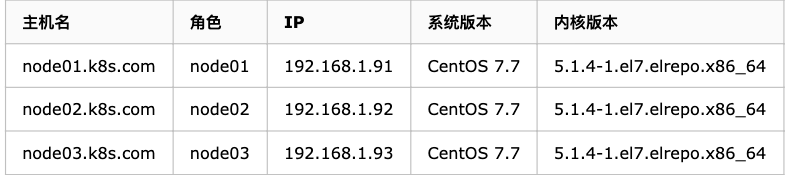

# CentOS 7 ETCD集群配置大全

## 前言

`Etcd` 是 `CoreOS` 基于 Raft 开发的分布式 key-value 存储，可用于服务发现、共享配置以及一致性保障（如数据库选主、分布式锁等）

本次环境，是用于`k8`s集群，由于在二进制部署 `k8s` 中，由于 `Etcd` 集群导致各种各样的问题，特意抽出时间来研究 Etcd 集群。

**Etcd 集群配置分为三种**:

* 静态发现
* Etcd 动态发现
* `DNS` 动态发现通过`DNS`的`SRV`解析动态发现集群

**本次主要基于 `静态发现` 和 `DNS动态发现` 两种，并结合自签的TLS证书来创建集群。**

### 环境准备


此环境实际用于 k8s 中的ETCD集群使用，用于本次文档




### 安装

**在三台机器上均执行**

```
[root@node01 ~]# yum install etcd -y
[root@node01 ~]# rpm -qa etcd
etcd-3.3.11-2.el7.centos.x86_64
```

创建`Etcd`所需目录，在三台机器上均执行

```
mkdir /data/k8s/etcd/{data,wal} -p
mkdir -p /etc/kubernetes/cert
chown -R etcd.etcd /data/k8s/etcd
```

## 静态集群

### 配置

**node01 配置文件**

```
ETCD_DATA_DIR="/data/k8s/etcd/data"
ETCD_WAL_DIR="/data/k8s/etcd/wal"
ETCD_LISTEN_PEER_URLS="http://192.168.1.91:2380"
ETCD_LISTEN_CLIENT_URLS="http://192.168.1.91:2379"
ETCD_MAX_SNAPSHOTS="5"
ETCD_MAX_WALS="5"
ETCD_NAME="etcd1"
ETCD_SNAPSHOT_COUNT="100000"
ETCD_HEARTBEAT_INTERVAL="100"
ETCD_ELECTION_TIMEOUT="1000"

ETCD_INITIAL_ADVERTISE_PEER_URLS="http://192.168.1.91:2380"
ETCD_ADVERTISE_CLIENT_URLS="http://192.168.1.91:2379"

ETCD_INITIAL_CLUSTER="etcd1=http://192.168.1.91:2380,etcd2=http://192.168.1.92:2380,etcd3=http://192.168.1.93:2380"
ETCD_INITIAL_CLUSTER_TOKEN="etcd-cluster"
ETCD_INITIAL_CLUSTER_STATE="new"
```

**node02 配置文件**

```
ETCD_DATA_DIR="/data/k8s/etcd/data"
ETCD_WAL_DIR="/data/k8s/etcd/wal"
ETCD_LISTEN_PEER_URLS="http://192.168.1.92:2380"
ETCD_LISTEN_CLIENT_URLS="http://192.168.1.92:2379"
ETCD_MAX_SNAPSHOTS="5"
ETCD_MAX_WALS="5"
ETCD_NAME="etcd2"
ETCD_SNAPSHOT_COUNT="100000"
ETCD_HEARTBEAT_INTERVAL="100"
ETCD_ELECTION_TIMEOUT="1000"

ETCD_INITIAL_ADVERTISE_PEER_URLS="http://192.168.1.92:2380"
ETCD_ADVERTISE_CLIENT_URLS="http://192.168.1.92:2379"

ETCD_INITIAL_CLUSTER="etcd1=http://192.168.1.91:2380,etcd2=http://192.168.1.92:2380,etcd3=http://192.168.1.93:2380"
ETCD_INITIAL_CLUSTER_TOKEN="etcd-c
```

**node03 配置文件**

```
ETCD_DATA_DIR="/data/k8s/etcd/data"
ETCD_WAL_DIR="/data/k8s/etcd/wal"
ETCD_LISTEN_PEER_URLS="http://192.168.1.93:2380"
ETCD_LISTEN_CLIENT_URLS="http://192.168.1.93:2379"
ETCD_MAX_SNAPSHOTS="5"
ETCD_MAX_WALS="5"
ETCD_NAME="etcd3"
ETCD_SNAPSHOT_COUNT="100000"
ETCD_HEARTBEAT_INTERVAL="100"
ETCD_ELECTION_TIMEOUT="1000"

ETCD_INITIAL_ADVERTISE_PEER_URLS="http://192.168.1.93:2380"
ETCD_ADVERTISE_CLIENT_URLS="http://192.168.1.93:2379"

ETCD_INITIAL_CLUSTER="etcd1=http://192.168.1.91:2380,etcd2=http://192.168.1.92:2380,etcd3=http://192.168.1.93:2380"
ETCD_INITIAL_CLUSTER_TOKEN="etcd-cluster"
ETCD_INITIAL_CLUSTER_STATE="new"
```

**启动测试**

```
[root@node01 etcd]# systemctl start etcd
[root@node01 etcd]# systemctl status etcd
● etcd.service - Etcd Server
   Loaded: loaded (/usr/lib/systemd/system/etcd.service; disabled; vendor preset: disabled)
   Active: active (running) since Thu 2019-11-07 09:28:54 CST; 5s ago
 Main PID: 1546 (etcd)
    Tasks: 8
   Memory: 41.3M
   CGroup: /system.slice/etcd.service
           └─1546 /usr/bin/etcd --name=etcd1 --data-dir=/data/k8s/etcd/data --listen-client-urls=http://192.168.1.91:2379

Nov 07 09:28:54 node01.k8s.com etcd[1546]: 3b8b38de05e2c497 [term: 1] received a MsgVote message with higher term from 9c64fba479c5e94 [term: 2]
Nov 07 09:28:54 node01.k8s.com etcd[1546]: 3b8b38de05e2c497 became follower at term 2
Nov 07 09:28:54 node01.k8s.com etcd[1546]: 3b8b38de05e2c497 [logterm: 1, index: 3, vote: 0] cast MsgVote for 9c64fba479c5e94 [logterm: 1, index: 3] at term 2
Nov 07 09:28:54 node01.k8s.com etcd[1546]: raft.node: 3b8b38de05e2c497 elected leader 9c64fba479c5e94 at term 2
Nov 07 09:28:54 node01.k8s.com etcd[1546]: published {Name:etcd1 ClientURLs:[http://192.168.1.91:2379]} to cluster 19456f0bfd57284e
Nov 07 09:28:54 node01.k8s.com etcd[1546]: ready to serve client requests
Nov 07 09:28:54 node01.k8s.com etcd[1546]: serving insecure client requests on 192.168.1.91:2379, this is strongly discouraged!
Nov 07 09:28:54 node01.k8s.com systemd[1]: Started Etcd Server.
Nov 07 09:28:54 node01.k8s.com etcd[1546]: set the initial cluster version to 3.3
Nov 07 09:28:54 node01.k8s.com etcd[1546]: enabled capabilities for version 3.3
```

查看 `/var/log/message` 日志中，会有日下体现：

```
Nov  7 09:28:53 node02 etcd: added member 9c64fba479c5e94 [http://192.168.1.92:2380] to cluster 19456f0bfd57284e
Nov  7 09:28:53 node02 etcd: added member 3b8b38de05e2c497 [http://192.168.1.91:2380] to cluster 19456f0bfd57284e
Nov  7 09:28:53 node02 etcd: added member 76ea8679db7365b3 [http://192.168.1.93:2380] to cluster 19456f0bfd57284e
```

**查看集群状态**

```
[root@node01 etcd]# ETCDCTL_API=3 etcdctl --endpoints=http://192.168.1.91:2379,http://192.168.1.92:2379,http://192.168.1.93:2379 endpoint health
http://192.168.1.92:2379 is healthy: successfully committed proposal: took = 1.103545ms
http://192.168.1.93:2379 is healthy: successfully committed proposal: took = 2.122478ms
http://192.168.1.91:2379 is healthy: successfully committed proposal: took = 2.690215ms
```

## 生成TLS证书


使用自签证书

> CA(Certificate Authority)是自签名的根证书，用来签名后续创建的其他证书。本文章使用CloudFlare的PKI工具cfssl创建所有证书。


### etcd证书创建


整个证书的创建过程均在 `node01` 上操作;

**安装cfssl工具集**

```
mkdir -p /opt/k8s/cert && cd /opt/k8s
wget https://pkg.cfssl.org/R1.2/cfssl_linux-amd64
mv cfssl_linux-amd64 /opt/k8s/bin/cfssl
wget https://pkg.cfssl.org/R1.2/cfssljson_linux-amd64
mv cfssljson_linux-amd64 /opt/k8s/bin/cfssljson
wget https://pkg.cfssl.org/R1.2/cfssl-certinfo_linux-amd64
mv cfssl-certinfo_linux-amd64 /opt/k8s/bin/cfssl-certinfo
chmod +x /opt/k8s/bin/*
echo 'export PATH=/opt/k8s/bin:$PATH' >> ~/.bash_profile
source ~/.bash_profile
```

### 生成证书

**创建根证书 (CA)**

```
CA证书是集群所有节点共享的，只需要创建一个CA证书，后续创建的所有证书都是由它签名
```

**创建配置文件**

> CA配置文件用于配置根证书的使用场景(profile)和具体参数
> (usage、过期时间、服务端认证、客户端认证、加密等)


```
cd /opt/k8s/work
cat > ca-config.json <<EOF
{
  "signing": {
    "default": {
      "expiry": "87600h"
    },
    "profiles": {
      "kubernetes": {
        "usages": [
            "signing",
            "key encipherment",
            "server auth",
            "client auth"
        ],
        "expiry": "87600h"
      }
    }
  }
}
EOF


######################
signing 表示该证书可用于签名其它证书，生成的ca.pem证书找中CA=TRUE
server auth 表示client可以用该证书对server提供的证书进行验证
client auth 表示server可以用该证书对client提供的证书进行验证
```

**创建证书签名请求文件**

```
cd /opt/k8s/work
cat > ca-csr.json <<EOF
{
  "CN": "kubernetes",
  "key": {
    "algo": "rsa",
    "size": 2048
  },
  "names": [
    {
      "C": "CN",
      "ST": "BeiJing",
      "L": "BeiJing",
      "O": "k8s",
      "OU": "4Paradigm"
    }
  ],
  "ca": {
    "expiry": "876000h"
 }
}
EOF


#######################
CN CommonName,kube-apiserver从证书中提取该字段作为请求的用户名(User Name)，浏览器使用该字段验证网站是否合法
O Organization,kube-apiserver 从证书中提取该字段作为请求用户和所属组(Group)
kube-apiserver将提取的User、Group作为RBAC授权的用户和标识
```

**生成CA证书和私钥**

```
cd /opt/k8s/work
cfssl gencert -initca ca-csr.json | cfssljson -bare ca
ls ca*
```

创建etcd证书和私钥

```
cd /opt/k8s/work
cat > etcd-csr.json <<EOF
{
  "CN": "etcd",
  "hosts": [
    "127.0.0.1",
    "192.168.1.91",
    "192.168.1.92",
    "192.168.1.93",
    "k8s.com",
    "etcd1.k8s.com",
    "etcd2.k8s.com",
    "etcd3.k8s.com"
  ],
  "key": {
    "algo": "rsa",
    "size": 2048
  },
  "names": [
    {
      "C": "CN",
      "ST": "BeiJing",
      "L": "BeiJing",
      "O": "k8s",
      "OU": "4Paradigm"
    }
  ]
}
EOF

#host字段指定授权使用该证书的etcd节点IP或域名列表，需要将etcd集群的3个节点都添加其中
```

**生成证书和私钥**

```
cd /opt/k8s/work

cfssl gencert -ca=/opt/k8s/work/ca.pem \
    -ca-key=/opt/k8s/work/ca-key.pem \
    -config=/opt/k8s/work/ca-config.json \
    -profile=kubernetes etcd-csr.json | cfssljson -bare etcd
    
ls etcd*pem -l
-rw------- 1 root root 1675 Nov  7 09:52 etcd-key.pem
-rw-r--r-- 1 root root 1444 Nov  7 09:52 etcd.pem
```

etcd 使用的TLS证书创建完成

分发证书到各节点上

要做所有节点上创建对应的目录

```
mkdir /data/k8s/etcd/{data,wal} -p
mkdir -p /etc/kubernetes/cert
chown -R etcd.etcd /data/k8s/etcd
```

**分发证书**

```
cd /opt/k8s/work
scp ca*.pem ca-config.json 192.168.1.91:/etc/kubernetes/cert
scp ca*.pem ca-config.json 192.168.1.92:/etc/kubernetes/cert 
scp ca*.pem ca-config.json 192.168.1.93:/etc/kubernetes/cert
scp etcd*pem 192.168.1.91:/etc/etcd/cert/
scp etcd*pem 192.168.1.92:/etc/etcd/cert/
scp etcd*pem 192.168.1.93:/etc/etcd/cert/
```

**在所有节点上执行:**

```
chown -R etcd.etcd /etc/etcd/cert
```

## 静态TLS集群

**etcd 配置**

**node01 配置文件**

```
ETCD_DATA_DIR="/data/k8s/etcd/data"
ETCD_WAL_DIR="/data/k8s/etcd/wal"
ETCD_LISTEN_PEER_URLS="https://192.168.1.91:2380"
ETCD_LISTEN_CLIENT_URLS="https://192.168.1.91:2379"
ETCD_MAX_SNAPSHOTS="5"
ETCD_MAX_WALS="5"
ETCD_NAME="etcd1"
ETCD_SNAPSHOT_COUNT="100000"
ETCD_HEARTBEAT_INTERVAL="100"
ETCD_ELECTION_TIMEOUT="1000"

ETCD_INITIAL_ADVERTISE_PEER_URLS="https://192.168.1.91:2380"
ETCD_ADVERTISE_CLIENT_URLS="https://192.168.1.91:2379"
ETCD_INITIAL_CLUSTER="etcd1=https://192.168.1.91:2380,etcd2=https://192.168.1.92:2380,etcd3=https://192.168.1.93:2380"
ETCD_INITIAL_CLUSTER_TOKEN="etcd-cluster"
ETCD_INITIAL_CLUSTER_STATE="new"

ETCD_CERT_FILE="/etc/etcd/cert/etcd.pem"
ETCD_KEY_FILE="/etc/etcd/cert/etcd-key.pem"
ETCD_CLIENT_CERT_AUTH="true"
ETCD_TRUSTED_CA_FILE="/etc/kubernetes/cert/ca.pem"
ETCD_AUTO_TLS="true"
ETCD_PEER_CERT_FILE="/etc/etcd/cert/etcd.pem"
ETCD_PEER_KEY_FILE="/etc/etcd/cert/etcd-key.pem"
ETCD_PEER_CLIENT_CERT_AUTH="true"
ETCD_PEER_TRUSTED_CA_FILE="/etc/kubernetes/cert/ca.pem"
ETCD_PEER_AUTO_TLS="true"
```

**node02 配置文件**

```
ETCD_DATA_DIR="/data/k8s/etcd/data"
ETCD_WAL_DIR="/data/k8s/etcd/wal"
ETCD_LISTEN_PEER_URLS="https://192.168.1.92:2380"
ETCD_LISTEN_CLIENT_URLS="https://192.168.1.92:2379"
ETCD_MAX_SNAPSHOTS="5"
ETCD_MAX_WALS="5"
ETCD_NAME="etcd2"
ETCD_SNAPSHOT_COUNT="100000"
ETCD_HEARTBEAT_INTERVAL="100"
ETCD_ELECTION_TIMEOUT="1000"

ETCD_INITIAL_ADVERTISE_PEER_URLS="https://192.168.1.92:2380"
ETCD_ADVERTISE_CLIENT_URLS="https://192.168.1.92:2379"
ETCD_INITIAL_CLUSTER="etcd1=https://192.168.1.91:2380,etcd2=https://192.168.1.92:2380,etcd3=https://192.168.1.93:2380"
ETCD_INITIAL_CLUSTER_TOKEN="etcd-cluster"
ETCD_INITIAL_CLUSTER_STATE="new"

ETCD_CERT_FILE="/etc/etcd/cert/etcd.pem"
ETCD_KEY_FILE="/etc/etcd/cert/etcd-key.pem"
ETCD_CLIENT_CERT_AUTH="true"
ETCD_TRUSTED_CA_FILE="/etc/kubernetes/cert/ca.pem"
ETCD_AUTO_TLS="true"
ETCD_PEER_CERT_FILE="/etc/etcd/cert/etcd.pem"
ETCD_PEER_KEY_FILE="/etc/etcd/cert/etcd-key.pem"
ETCD_PEER_CLIENT_CERT_AUTH="true"
ETCD_PEER_TRUSTED_CA_FILE="/etc/kubernetes/cert/ca.pem"
ETCD_PEER_AUTO_TLS="true"
```

**node03 配置文件**

```
ETCD_DATA_DIR="/data/k8s/etcd/data"
ETCD_WAL_DIR="/data/k8s/etcd/wal"
ETCD_LISTEN_PEER_URLS="https://192.168.1.93:2380"
ETCD_LISTEN_CLIENT_URLS="https://192.168.1.93:2379"
ETCD_MAX_SNAPSHOTS="5"
ETCD_MAX_WALS="5"
ETCD_NAME="etcd3"
ETCD_SNAPSHOT_COUNT="100000"
ETCD_HEARTBEAT_INTERVAL="100"
ETCD_ELECTION_TIMEOUT="1000"

ETCD_INITIAL_ADVERTISE_PEER_URLS="https://192.168.1.93:2380"
ETCD_ADVERTISE_CLIENT_URLS="https://192.168.1.93:2379"
ETCD_INITIAL_CLUSTER="etcd1=https://192.168.1.91:2380,etcd2=https://192.168.1.92:2380,etcd3=https://192.168.1.93:2380"
ETCD_INITIAL_CLUSTER_TOKEN="etcd-cluster"
ETCD_INITIAL_CLUSTER_STATE="new"

ETCD_CERT_FILE="/etc/etcd/cert/etcd.pem"
ETCD_KEY_FILE="/etc/etcd/cert/etcd-key.pem"
ETCD_CLIENT_CERT_AUTH="true"
ETCD_TRUSTED_CA_FILE="/etc/kubernetes/cert/ca.pem"
ETCD_AUTO_TLS="true"
ETCD_PEER_CERT_FILE="/etc/etcd/cert/etcd.pem"
ETCD_PEER_KEY_FILE="/etc/etcd/cert/etcd-key.pem"
ETCD_PEER_CLIENT_CERT_AUTH="true"
ETCD_PEER_TRUSTED_CA_FILE="/etc/kubernetes/cert/ca.pem"
ETCD_PEER_AUTO_TLS="true"
```

### 启动测试

```
[root@node01 work]# systemctl start etcd
[root@node01 work]# systemctl status etcd
● etcd.service - Etcd Server
   Loaded: loaded (/usr/lib/systemd/system/etcd.service; disabled; vendor preset: disabled)
   Active: active (running) since Thu 2019-11-07 10:15:58 CST; 5s ago
 Main PID: 2078 (etcd)
    Tasks: 8
   Memory: 28.9M
   CGroup: /system.slice/etcd.service
           └─2078 /usr/bin/etcd --name=etcd1 --data-dir=/data/k8s/etcd/data --listen-client-urls=https://192.168.1.91:2379

Nov 07 10:15:58 node01.k8s.com etcd[2078]: 2a40d8ba966d12fe [term: 1] received a MsgVote message with higher term from af05139f75a68867 [term: 2]
Nov 07 10:15:58 node01.k8s.com etcd[2078]: 2a40d8ba966d12fe became follower at term 2
Nov 07 10:15:58 node01.k8s.com etcd[2078]: 2a40d8ba966d12fe [logterm: 1, index: 3, vote: 0] cast MsgVote for af05139f75a68867 [logterm: 1, index: 3] at term 2
Nov 07 10:15:58 node01.k8s.com etcd[2078]: raft.node: 2a40d8ba966d12fe elected leader af05139f75a68867 at term 2
Nov 07 10:15:58 node01.k8s.com etcd[2078]: published {Name:etcd1 ClientURLs:[https://192.168.1.91:2379]} to cluster f3e9c54e1aafb3c1
Nov 07 10:15:58 node01.k8s.com etcd[2078]: ready to serve client requests
Nov 07 10:15:58 node01.k8s.com etcd[2078]: serving client requests on 192.168.1.91:2379
Nov 07 10:15:58 node01.k8s.com systemd[1]: Started Etcd Server.
Nov 07 10:15:58 node01.k8s.com etcd[2078]: set the initial cluster version to 3.3
```

**查看 `/var/log/message` 日志中，会有日下体现**：

```
Nov  7 10:15:57 node01 etcd: added member 2a40d8ba966d12fe [https://192.168.1.91:2380] to cluster f3e9c54e1aafb3c1
Nov  7 10:15:57 node01 etcd: added member af05139f75a68867 [https://192.168.1.92:2380] to cluster f3e9c54e1aafb3c1
Nov  7 10:15:57 node01 etcd: added member c3bab7c20fba3f60 [https://192.168.1.93:2380] to cluster f3e9c54e1aafb3c1
```

### 检查TLS集群状态*

```
ETCDCTL_API=3 etcdctl \
    --endpoints=https://etcd1.k8s.com:2379,https://etcd2.k8s.com:2379,https://etcd3.k8s.com:2379 \
    --cacert=/etc/kubernetes/cert/ca.pem \
    --cert=/etc/etcd/cert/etcd.pem \
    --key=/etc/etcd/cert/etcd-key.pem endpoint health

# 输出
https://192.168.1.92:2379 is healthy: successfully committed proposal: took = 1.317022ms
https://192.168.1.91:2379 is healthy: successfully committed proposal: took = 1.59958ms
https://192.168.1.93:2379 is healthy: successfully committed proposal: took = 1.453049ms
```

```
etcdctl \
--endpoint=https://etcd1.k8s.com:2379 \
--ca-file=/etc/kubernetes/cert/ca.pem \
--cert-file=/etc/etcd/cert/etcd.pem \
--key-file=/etc/etcd/cert/etcd-key.pem cluster-health

# 输出
member 40a8f19a5db99534 is healthy: got healthy result from https://etcd2.k8s.com:2379
member 9888555207dbf0e0 is healthy: got healthy result from https://etcd3.k8s.com:2379
member a0d541999e9eb3b3 is healthy: got healthy result from https://etcd1.k8s.com:2379
cluster is healthy
```


## `ETCD` 动态集群基于DNS的SRV解析自动发现

`需要局域网内部有DNS服务器`

### 添加SRV解析

目前常用的内部DNS服务有两种，`bind`、`dnsmasq`

**在下面都会列出具体的配置，但只需要配置其中之一即可**

### 方法一: 使用bind配置`SRV`解析

如果内部没有`bind`服务，可以参考部署文档文章: `https://www.cnblogs.com/winstom/p/11806962.html`


使用域名为 : `k8s.com`，在bind的zone文件中添加如下解析:

```
etcd1   IN      A       192.168.1.91
etcd2   IN      A       192.168.1.92
etcd3   IN      A       192.168.1.93
_etcd-server._tcp.k8s.com.  IN      SRV     10    10       2380     etcd1
_etcd-server._tcp.k8s.com.  IN      SRV     10    10       2380     etcd2
_etcd-server._tcp.k8s.com.  IN      SRV     10    10       2380     etcd3
_etcd-client._tcp.k8s.com.  IN      SRV     10    10       2379     etcd1
_etcd-client._tcp.k8s.com.  IN      SRV     10    10       2379     etcd2
_etcd-client._tcp.k8s.com.  IN      SRV     10    10       2379     etcd3
```

修改之后重新加载配置文件:


```
[root@jenkins named]# named-checkzone k8s.com k8s.com.zone 
zone k8s.com/IN: loaded serial 0
OK
[root@jenkins named]# rndc reload
server reload successful
```

### 方法二: 使用`dnsmasq`配置SRV解析


如果内部没有`dnsmasq`服务，可以参考部署文档文章: https://www.cnblogs.com/winstom/p/11809066.html

使用域名为 : `k8s.com`，具体修改如下:

在`/etc/dnsmasq_hosts`新增下面内容

```
192.168.1.91 etcd1 etcd1.k8s.com
192.168.1.92 etcd2 etcd2.k8s.com
192.168.1.93 etcd3 etcd3.k8s.com
```

在 `/etc/dnsmasq.conf` 文件中增加下面SRV解析内容

```
srv-host=_etcd-server._tcp.k8s.com,etcd1.k8s.com,2380,0,100
srv-host=_etcd-server._tcp.k8s.com,etcd2.k8s.com,2380,0,100
srv-host=_etcd-server._tcp.k8s.com,etcd3.k8s.com,2380,0,100
srv-host=_etcd-client._tcp.k8s.com,etcd1.k8s.com,2379,0,100
srv-host=_etcd-client._tcp.k8s.com,etcd2.k8s.com,2379,0,100
srv-host=_etcd-client._tcp.k8s.com,etcd3.k8s.com,2379,0,100
```


修改之后重启服务 `systemctl restart dnsmasq`

**验证SRV解析是否正常**

**查询SRV记录**

```
[root@node01 ~]# dig @192.168.1.122 +noall +answer SRV _etcd-server._tcp.k8s.com
_etcd-server._tcp.k8s.com. 3600 IN  SRV 2380 0 100 etcd2.k8s.com.
_etcd-server._tcp.k8s.com. 3600 IN  SRV 2380 0 100 etcd1.k8s.com.
_etcd-server._tcp.k8s.com. 3600 IN  SRV 2380 0 100 etcd3.k8s.com.
```

**查询域名解析结果**

```
[root@node01 ~]# dig @192.168.1.122 +noall +answer etcd1.k8s.com etcd2.k8s.com etcd3.k8s.com
etcd1.k8s.com.      86400   IN  A   192.168.1.91
etcd2.k8s.com.      86400   IN  A   192.168.1.92
etcd3.k8s.com.      86400   IN  A   192.168.1.93
```

如上述显示，则表示SRV解析正常

### 配置ETCD


node01 配置文件

```
ETCD_DATA_DIR="/data/k8s/etcd/data"
ETCD_WAL_DIR="/data/k8s/etcd/wal"
ETCD_LISTEN_PEER_URLS="http://192.168.1.91:2380"
ETCD_LISTEN_CLIENT_URLS="http://192.168.1.91:2379"
ETCD_MAX_SNAPSHOTS="5"
ETCD_MAX_WALS="5"
ETCD_NAME="etcd1"
ETCD_SNAPSHOT_COUNT="100000"
ETCD_HEARTBEAT_INTERVAL="100"
ETCD_ELECTION_TIMEOUT="1000"

ETCD_INITIAL_ADVERTISE_PEER_URLS="http://etcd1.k8s.com:2380"
ETCD_ADVERTISE_CLIENT_URLS="http://etcd1.k8s.com:2379"
ETCD_DISCOVERY_SRV="k8s.com"

ETCD_INITIAL_CLUSTER_TOKEN="etcd-cluster"
ETCD_INITIAL_CLUSTER_STATE="new"
```

node02 配置文件

```
ETCD_DATA_DIR="/data/k8s/etcd/data"
ETCD_WAL_DIR="/data/k8s/etcd/wal"
ETCD_LISTEN_PEER_URLS="http://192.168.1.92:2380"
ETCD_LISTEN_CLIENT_URLS="http://192.168.1.92:2379"
ETCD_MAX_SNAPSHOTS="5"
ETCD_MAX_WALS="5"
ETCD_NAME="etcd2"
ETCD_SNAPSHOT_COUNT="100000"
ETCD_HEARTBEAT_INTERVAL="100"
ETCD_ELECTION_TIMEOUT="1000"

ETCD_INITIAL_ADVERTISE_PEER_URLS="http://etcd2.k8s.com:2380"
ETCD_ADVERTISE_CLIENT_URLS="http://etcd2.k8s.com:2379"
ETCD_DISCOVERY_SRV="k8s.com"

ETCD_INITIAL_CLUSTER_TOKEN="etcd-cluster"
ETCD_INITIAL_CLUSTER_STATE="new"
```

node03 配置文件

```
ETCD_DATA_DIR="/data/k8s/etcd/data"
ETCD_WAL_DIR="/data/k8s/etcd/wal"
ETCD_LISTEN_PEER_URLS="http://192.168.1.93:2380"
ETCD_LISTEN_CLIENT_URLS="http://192.168.1.93:2379"
ETCD_MAX_SNAPSHOTS="5"
ETCD_MAX_WALS="5"
ETCD_NAME="etcd3"
ETCD_SNAPSHOT_COUNT="100000"
ETCD_HEARTBEAT_INTERVAL="100"
ETCD_ELECTION_TIMEOUT="1000"

ETCD_INITIAL_ADVERTISE_PEER_URLS="http://etcd3.k8s.com:2380"
ETCD_ADVERTISE_CLIENT_URLS="http://etcd3.k8s.com:2379"
ETCD_DISCOVERY_SRV="k8s.com"

ETCD_INITIAL_CLUSTER_TOKEN="etcd-cluster"
ETCD_INITIAL_CLUSTER_STATE="new"
```

### 启动并测试


```
[root@node01 etcd]# systemctl start etcd
[root@node01 etcd]# systemctl status etcd
● etcd.service - Etcd Server
   Loaded: loaded (/usr/lib/systemd/system/etcd.service; disabled; vendor preset: disabled)
   Active: active (running) since Thu 2019-11-07 11:25:29 CST; 4s ago
 Main PID: 14203 (etcd)
    Tasks: 8
   Memory: 16.9M
   CGroup: /system.slice/etcd.service
           └─14203 /usr/bin/etcd --name=etcd1 --data-dir=/data/k8s/etcd/data --listen-client-urls=http://192.168.1.91:2379

Nov 07 11:25:29 node01.k8s.com etcd[14203]: d79e9ae86b2a1de1 [quorum:2] has received 2 MsgVoteResp votes and 0 vote rejections
Nov 07 11:25:29 node01.k8s.com etcd[14203]: d79e9ae86b2a1de1 became leader at term 2
Nov 07 11:25:29 node01.k8s.com etcd[14203]: raft.node: d79e9ae86b2a1de1 elected leader d79e9ae86b2a1de1 at term 2
Nov 07 11:25:29 node01.k8s.com etcd[14203]: published {Name:etcd1 ClientURLs:[http://etcd1.k8s.com:2379 http://etcd1.k8s.com:4001]} to cluster 42cecf80e3791d6c
Nov 07 11:25:29 node01.k8s.com etcd[14203]: ready to serve client requests
Nov 07 11:25:29 node01.k8s.com etcd[14203]: serving insecure client requests on 192.168.1.91:2379, this is strongly discouraged!
Nov 07 11:25:29 node01.k8s.com systemd[1]: Started Etcd Server.
Nov 07 11:25:29 node01.k8s.com etcd[14203]: setting up the initial cluster version to 3.3
Nov 07 11:25:29 node01.k8s.com etcd[14203]: set the initial cluster version to 3.3
Nov 07 11:25:29 node01.k8s.com etcd[14203]: enabled capabilities for version 3.3
```

日志 `vim /var/log/messages` 表现如下:

```
Nov  7 11:25:27 node01 etcd: got bootstrap from DNS for etcd-server at 0=http://etcd3.k8s.com:2380
Nov  7 11:25:27 node01 etcd: got bootstrap from DNS for etcd-server at 1=http://etcd2.k8s.com:2380
Nov  7 11:25:27 node01 etcd: got bootstrap from DNS for etcd-server at etcd1=http://etcd1.k8s.com:2380
Nov  7 11:25:27 node01 etcd: resolving etcd1.k8s.com:2380 to 192.168.1.91:2380
Nov  7 11:25:27 node01 etcd: resolving etcd1.k8s.com:2380 to 192.168.1.91:2380
Nov  7 11:25:28 node01 etcd: name = etcd1
Nov  7 11:25:28 node01 etcd: data dir = /data/k8s/etcd/data
Nov  7 11:25:28 node01 etcd: member dir = /data/k8s/etcd/data/member
Nov  7 11:25:28 node01 etcd: dedicated WAL dir = /data/k8s/etcd/wal
Nov  7 11:25:28 node01 etcd: heartbeat = 100ms
Nov  7 11:25:28 node01 etcd: election = 1000ms
Nov  7 11:25:28 node01 etcd: snapshot count = 100000
Nov  7 11:25:28 node01 etcd: advertise client URLs = http://etcd1.k8s.com:2379,http://etcd1.k8s.com:4001
Nov  7 11:25:28 node01 etcd: initial advertise peer URLs = http://etcd1.k8s.com:2380
Nov  7 11:25:28 node01 etcd: initial cluster = 0=http://etcd3.k8s.com:2380,1=http://etcd2.k8s.com:2380,etcd1=http://etcd1.k8s.com:2380
```
测试：

```
[root@node01 etcd]# etcdctl --endpoints=http://192.168.1.91:2379 cluster-health
member 184beca37ca32d75 is healthy: got healthy result from http://etcd2.k8s.com:2379
member d79e9ae86b2a1de1 is healthy: got healthy result from http://etcd1.k8s.com:2379
member f7662e609b7e4013 is healthy: got healthy result from http://etcd3.k8s.com:2379
cluster is healthy
```

## ETCD TLS动态集群基于DNS的SRV解析自动发现

> 需要局域网内部有DNS服务器

### 添加SRV解析

目前常用的内部DNS服务有两种，bind、dnsmasq


在下面都会列出具体的配置，但只需要配置其中之一即可；

### 方法一: 使用bind配置SRV解析

如果内部没有`bind`服务，可以参考部署文档文章: https://www.cnblogs.com/winstom/p/11806962.html

使用域名为 : `k8s.com`，在bind的zone文件中添加如下解析:

```
etcd1   IN      A       192.168.1.91
etcd2   IN      A       192.168.1.92
etcd3   IN      A       192.168.1.93
_etcd-server-ssl._tcp.k8s.com.  IN      SRV     10    10       2380     etcd1
_etcd-server-ssl._tcp.k8s.com.  IN      SRV     10    10       2380     etcd2
_etcd-server-ssl._tcp.k8s.com.  IN      SRV     10    10       2380     etcd3
_etcd-client-ssl._tcp.k8s.com.  IN      SRV     10    10       2379     etcd1
_etcd-client-ssl._tcp.k8s.com.  IN      SRV     10    10       2379     etcd2
_etcd-client-ssl._tcp.k8s.com.  IN      SRV     10    10       2379     etcd3
```

修改之后重新加载配置文件:

```
[root@jenkins named]# named-checkzone k8s.com k8s.com.zone 
zone k8s.com/IN: loaded serial 0
OK
[root@jenkins named]# rndc reload
server reload successful
```

### 方法二: 使用`dnsmasq`配置SRV解析

如果内部没有`dnsmasq`服务，可以参考部署文档文章: https://www.cnblogs.com/winstom/p/11809066.html


使用域名为 : `k8s.com`，具体修改如下:

在`/etc/dnsmasq_hosts`新增下面内容

```
192.168.1.91 etcd1 etcd1.k8s.com
192.168.1.92 etcd2 etcd2.k8s.com
192.168.1.93 etcd3 etcd3.k8s.com
```

在 `/etc/dnsmasq.conf` 文件中增加下面SRV解析内容

```
srv-host=_etcd-server-ssl._tcp.k8s.com,etcd1.k8s.com,2380,0,100
srv-host=_etcd-server-ssl._tcp.k8s.com,etcd2.k8s.com,2380,0,100
srv-host=_etcd-server-ssl._tcp.k8s.com,etcd3.k8s.com,2380,0,100
srv-host=_etcd-client-ssl._tcp.k8s.com,etcd1.k8s.com,2379,0,100
srv-host=_etcd-client-ssl._tcp.k8s.com,etcd2.k8s.com,2379,0,100
srv-host=_etcd-client-ssl._tcp.k8s.com,etcd3.k8s.com,2379,0,100
```

修改之后重启服务 `systemctl restart dnsmasq`

**验证SRV解析是否正常**

```
[root@node01 etcd]# dig @192.168.1.122 +noall +answer SRV _etcd-server-ssl._tcp.k8s.com
_etcd-server-ssl._tcp.k8s.com. 3600 IN  SRV 2380 0 100 etcd3.k8s.com.
_etcd-server-ssl._tcp.k8s.com. 3600 IN  SRV 2380 0 100 etcd2.k8s.com.
_etcd-server-ssl._tcp.k8s.com. 3600 IN  SRV 2380 0 100 etcd1.k8s.com.
```

**查询域名解析结果**

```
[root@node01 ~]# dig @192.168.1.122 +noall +answer etcd1.k8s.com etcd2.k8s.com etcd3.k8s.com
etcd1.k8s.com.      86400   IN  A   192.168.1.91
etcd2.k8s.com.      86400   IN  A   192.168.1.92
etcd3.k8s.com.      86400   IN  A   192.168.1.93
```

## ETCD 配置


node01 配置文件

```
ETCD_DATA_DIR="/data/k8s/etcd/data"
ETCD_WAL_DIR="/data/k8s/etcd/wal"
ETCD_LISTEN_PEER_URLS="https://192.168.1.91:2380"
ETCD_LISTEN_CLIENT_URLS="https://192.168.1.91:2379"
ETCD_MAX_SNAPSHOTS="5"
ETCD_MAX_WALS="5"
ETCD_NAME="etcd1"
ETCD_SNAPSHOT_COUNT="100000"
ETCD_HEARTBEAT_INTERVAL="100"
ETCD_ELECTION_TIMEOUT="1000"

ETCD_INITIAL_ADVERTISE_PEER_URLS="https://etcd1.k8s.com:2380"
ETCD_ADVERTISE_CLIENT_URLS="https://etcd1.k8s.com:2379,https://etcd1.k8s.com:4001"
ETCD_DISCOVERY_SRV="k8s.com"
ETCD_INITIAL_CLUSTER_TOKEN="etcd-cluster"
ETCD_INITIAL_CLUSTER_STATE="new"

ETCD_CERT_FILE="/etc/etcd/cert/etcd.pem"
ETCD_KEY_FILE="/etc/etcd/cert/etcd-key.pem"
ETCD_CLIENT_CERT_AUTH="true"
ETCD_TRUSTED_CA_FILE="/etc/kubernetes/cert/ca.pem"
ETCD_AUTO_TLS="true"
ETCD_PEER_CERT_FILE="/etc/etcd/cert/etcd.pem"
ETCD_PEER_KEY_FILE="/etc/etcd/cert/etcd-key.pem"
ETCD_PEER_CLIENT_CERT_AUTH="true"
ETCD_PEER_TRUSTED_CA_FILE="/etc/kubernetes/cert/ca.pem"
ETCD_PEER_AUTO_TLS="true"
```

node02 配置文件

```
ETCD_DATA_DIR="/data/k8s/etcd/data"
ETCD_WAL_DIR="/data/k8s/etcd/wal"
ETCD_LISTEN_PEER_URLS="https://192.168.1.92:2380"
ETCD_LISTEN_CLIENT_URLS="https://192.168.1.92:2379"
ETCD_MAX_SNAPSHOTS="5"
ETCD_MAX_WALS="5"
ETCD_NAME="etcd2"
ETCD_SNAPSHOT_COUNT="100000"
ETCD_HEARTBEAT_INTERVAL="100"
ETCD_ELECTION_TIMEOUT="1000"

ETCD_INITIAL_ADVERTISE_PEER_URLS="https://etcd2.k8s.com:2380"
ETCD_ADVERTISE_CLIENT_URLS="https://etcd2.k8s.com:2379"
ETCD_DISCOVERY_SRV="k8s.com"
ETCD_INITIAL_CLUSTER_TOKEN="etcd-cluster"
ETCD_INITIAL_CLUSTER_STATE="new"

ETCD_CERT_FILE="/etc/etcd/cert/etcd.pem"
ETCD_KEY_FILE="/etc/etcd/cert/etcd-key.pem"
ETCD_CLIENT_CERT_AUTH="true"
ETCD_TRUSTED_CA_FILE="/etc/kubernetes/cert/ca.pem"
ETCD_AUTO_TLS="true"
ETCD_PEER_CERT_FILE="/etc/etcd/cert/etcd.pem"
ETCD_PEER_KEY_FILE="/etc/etcd/cert/etcd-key.pem"
ETCD_PEER_CLIENT_CERT_AUTH="true"
ETCD_PEER_TRUSTED_CA_FILE="/etc/kubernetes/cert/ca.pem"
ETCD_PEER_AUTO_TLS="true"
```

node03 配置文件

```
ETCD_DATA_DIR="/data/k8s/etcd/data"
ETCD_WAL_DIR="/data/k8s/etcd/wal"
ETCD_LISTEN_PEER_URLS="https://192.168.1.93:2380"
ETCD_LISTEN_CLIENT_URLS="https://192.168.1.93:2379"
ETCD_MAX_SNAPSHOTS="5"
ETCD_MAX_WALS="5"
ETCD_NAME="etcd3"
ETCD_SNAPSHOT_COUNT="100000"
ETCD_HEARTBEAT_INTERVAL="100"
ETCD_ELECTION_TIMEOUT="1000"

ETCD_INITIAL_ADVERTISE_PEER_URLS="https://etcd3.k8s.com:2380"
ETCD_ADVERTISE_CLIENT_URLS="https://etcd3.k8s.com:2379"
ETCD_DISCOVERY_SRV="k8s.com"
ETCD_INITIAL_CLUSTER_TOKEN="etcd-cluster"
ETCD_INITIAL_CLUSTER_STATE="new"

ETCD_CERT_FILE="/etc/etcd/cert/etcd.pem"
ETCD_KEY_FILE="/etc/etcd/cert/etcd-key.pem"
ETCD_CLIENT_CERT_AUTH="true"
ETCD_TRUSTED_CA_FILE="/etc/kubernetes/cert/ca.pem"
ETCD_AUTO_TLS="true"
ETCD_PEER_CERT_FILE="/etc/etcd/cert/etcd.pem"
ETCD_PEER_KEY_FILE="/etc/etcd/cert/etcd-key.pem"
ETCD_PEER_CLIENT_CERT_AUTH="true"
ETCD_PEER_TRUSTED_CA_FILE="/etc/kubernetes/cert/ca.pem"
ETCD_PEER_AUTO_TLS="true"
```

### 启动测试


```
[root@node03 etcd]# systemctl restart etcd
[root@node03 etcd]# systemctl status etcd
● etcd.service - Etcd Server
   Loaded: loaded (/usr/lib/systemd/system/etcd.service; disabled; vendor preset: disabled)
   Active: active (running) since Thu 2019-11-07 12:38:37 CST; 4s ago
 Main PID: 13460 (etcd)
    Tasks: 8
   Memory: 16.6M
   CGroup: /system.slice/etcd.service
           └─13460 /usr/bin/etcd --name=etcd3 --data-dir=/data/k8s/etcd/data --listen-client-urls=https://192.168.1.93:2379

Nov 07 12:38:36 node03.k8s.com etcd[13460]: established a TCP streaming connection with peer 40a8f19a5db99534 (stream Message writer)
Nov 07 12:38:36 node03.k8s.com etcd[13460]: established a TCP streaming connection with peer 40a8f19a5db99534 (stream MsgApp v2 writer)
Nov 07 12:38:37 node03.k8s.com etcd[13460]: 9888555207dbf0e0 [term: 92] received a MsgVote message with higher term from a0d541999e9eb3b3 [term: 98]
Nov 07 12:38:37 node03.k8s.com etcd[13460]: 9888555207dbf0e0 became follower at term 98
Nov 07 12:38:37 node03.k8s.com etcd[13460]: 9888555207dbf0e0 [logterm: 92, index: 9, vote: 0] cast MsgVote for a0d541999e9eb3b3 [logterm: 92, index: 9] at term 98
Nov 07 12:38:37 node03.k8s.com etcd[13460]: raft.node: 9888555207dbf0e0 elected leader a0d541999e9eb3b3 at term 98
Nov 07 12:38:37 node03.k8s.com etcd[13460]: published {Name:etcd3 ClientURLs:[https://etcd3.k8s.com:2379]} to cluster f445a02ce3dc6a02
Nov 07 12:38:37 node03.k8s.com etcd[13460]: ready to serve client requests
Nov 07 12:38:37 node03.k8s.com etcd[13460]: serving client requests on 192.168.1.93:2379
Nov 07 12:38:37 node03.k8s.com systemd[1]: Started Etcd Server.
```

**日志体现**

```
Nov  7 12:38:36 node01 etcd: added member 40a8f19a5db99534 [https://etcd2.k8s.com:2380] to cluster f445a02ce3dc6a02
Nov  7 12:38:36 node01 etcd: starting peer 40a8f19a5db99534...
Nov  7 12:38:36 node01 etcd: started HTTP pipelining with peer 40a8f19a5db99534
Nov  7 12:38:36 node01 etcd: started streaming with peer 40a8f19a5db99534 (writer)
Nov  7 12:38:36 node01 etcd: started peer 40a8f19a5db99534
Nov  7 12:38:36 node01 etcd: added peer 40a8f19a5db99534
Nov  7 12:38:36 node01 etcd: added member 9888555207dbf0e0 [https://etcd3.k8s.com:2380] to cluster f445a02ce3dc6a02
Nov  7 12:38:36 node01 etcd: starting peer 9888555207dbf0e0...
Nov  7 12:38:36 node01 etcd: started HTTP pipelining with peer 9888555207dbf0e0
Nov  7 12:38:36 node01 etcd: started peer 9888555207dbf0e0
Nov  7 12:38:36 node01 etcd: added peer 9888555207dbf0e0
Nov  7 12:38:36 node01 etcd: added member a0d541999e9eb3b3 [https://etcd1.k8s.com:2380] to cluster f445a02ce3dc6a02
```

测试集群状态：

```
ETCDCTL_API=3 etcdctl --endpoints=https://etcd1.k8s.com:2379,https://etcd2.k8s.com:2379,https://etcd3.k8s.com:2379 \
    --cacert=/etc/kubernetes/cert/ca.pem \
    --cert=/etc/etcd/cert/etcd.pem \
    --key=/etc/etcd/cert/etcd-key.pem endpoint health

# 输出
https://etcd1.k8s.com:2379 is healthy: successfully committed proposal: took = 4.269468ms
https://etcd3.k8s.com:2379 is healthy: successfully committed proposal: took = 1.58797ms
https://etcd2.k8s.com:2379 is healthy: successfully committed proposal: took = 1.622151ms
```

```
etcdctl \
--endpoint=https://etcd1.k8s.com:2379 \
--ca-file=/etc/kubernetes/cert/ca.pem \
--cert-file=/etc/etcd/cert/etcd.pem \
--key-file=/etc/etcd/cert/etcd-key.pem cluster-health

# 输出
member 40a8f19a5db99534 is healthy: got healthy result from https://etcd2.k8s.com:2379
member 9888555207dbf0e0 is healthy: got healthy result from https://etcd3.k8s.com:2379
member a0d541999e9eb3b3 is healthy: got healthy result from https://etcd1.k8s.com:2379
cluster is healthy
```

## 报错解决

### 1. 证书报错 bad certificate


**日志中报错:**

```
Nov  7 12:37:03 node01 etcd: rejected connection from "192.168.1.93:46294" (error "remote error: tls: bad certificate", ServerName "k8s.com")
```

**解决**

报错的意思是在生成ETCD的TLS证书的时候，没有把对应的域名加进去

**在创建ETCD的TLS证书请求的文件中加入对应的域名**

```
cd /opt/k8s/work
cat > etcd-csr.json <<EOF
{
  "CN": "etcd",
  "hosts": [
    "127.0.0.1",
    "192.168.1.91",
    "192.168.1.92",
    "192.168.1.93",
    "k8s.com",          # 这里的域名查看是否正确
    "etcd1.k8s.com",
    "etcd2.k8s.com",
    "etcd3.k8s.com"
  ],
  "key": {
    "algo": "rsa",
    "size": 2048
  },
  "names": [
    {
      "C": "CN",
      "ST": "BeiJing",
      "L": "BeiJing",
      "O": "k8s",
      "OU": "4Paradigm"
    }
  ]
}
EOF
```

### 2. `DNS` 的 `SRV` 解析报错 `cannot find local etcd member "etcd1"` in `SRV records`

DNS 如果配置有问题，会有如下报错:

```
etcd: error setting up initial cluster: cannot find local etcd member "etcd1" in SRV records
```

这里是表示DNS在配置SRV解析的时候报错，请仔细查看解析配置:

SRV解析分为两种，一种是http不带证书的解析，一种是https带证书的解析，是有区别的，如果配置错误就会包上述错误

**http不带证书解析如下**

bind 的解析

编辑 `/var/named/k8s.com.zone` 文件

```
etcd1   IN      A       192.168.1.91
etcd2   IN      A       192.168.1.92
etcd3   IN      A       192.168.1.93
_etcd-server._tcp.k8s.com.  IN      SRV     10    10       2380     etcd1
_etcd-server._tcp.k8s.com.  IN      SRV     10    10       2380     etcd2
_etcd-server._tcp.k8s.com.  IN      SRV     10    10       2380     etcd3
_etcd-client._tcp.k8s.com.  IN      SRV     10    10       2379     etcd1
_etcd-client._tcp.k8s.com.  IN      SRV     10    10       2379     etcd2
_etcd-client._tcp.k8s.com.  IN      SRV     10    10       2379     etcd3
```

**dnsmasq 的解析**

在`/etc/dnsmasq_hosts`新增下面内容

```
192.168.1.91 etcd1 etcd1.k8s.com
192.168.1.92 etcd2 etcd2.k8s.com
192.168.1.93 etcd3 etcd3.k8s.com
```

在 `/etc/dnsmasq.conf` 文件中增加下面SRV解析内容

```
srv-host=_etcd-server._tcp.k8s.com,etcd1.k8s.com,2380,0,100
srv-host=_etcd-server._tcp.k8s.com,etcd2.k8s.com,2380,0,100
srv-host=_etcd-server._tcp.k8s.com,etcd3.k8s.com,2380,0,100
srv-host=_etcd-client._tcp.k8s.com,etcd1.k8s.com,2380,0,100
srv-host=_etcd-client._tcp.k8s.com,etcd2.k8s.com,2380,0,100
srv-host=_etcd-client._tcp.k8s.com,etcd3.k8s.com,2380,0,100
```

**https带证书解析如下**

bind 的解析

编辑 `/var/named/k8s.com.zone` 文件

```
etcd1   IN      A       192.168.1.91
etcd2   IN      A       192.168.1.92
etcd3   IN      A       192.168.1.93
_etcd-server-ssl._tcp.k8s.com.  IN      SRV     10    10       2380     etcd1
_etcd-server-ssl._tcp.k8s.com.  IN      SRV     10    10       2380     etcd2
_etcd-server-ssl._tcp.k8s.com.  IN      SRV     10    10       2380     etcd3
_etcd-client-ssl._tcp.k8s.com.  IN      SRV     10    10       2379     etcd1
_etcd-client-ssl._tcp.k8s.com.  IN      SRV     10    10       2379     etcd2
_etcd-client-ssl._tcp.k8s.com.  IN      SRV     10    10       2379     etcd3
```

dnsmasq 的解析

在`/etc/dnsmasq_hosts`新增下面内容


```
192.168.1.91 etcd1 etcd1.k8s.com
192.168.1.92 etcd2 etcd2.k8s.com
192.168.1.93 etcd3 etcd3.k8s.com
```

在 `/etc/dnsmasq.conf` 文件中增加下面SRV解析内容


```
srv-host=_etcd-server-ssl._tcp.k8s.com,etcd1.k8s.com,2380,0,100
srv-host=_etcd-server-ssl._tcp.k8s.com,etcd2.k8s.com,2380,0,100
srv-host=_etcd-server-ssl._tcp.k8s.com,etcd3.k8s.com,2380,0,100
srv-host=_etcd-client-ssl._tcp.k8s.com,etcd1.k8s.com,2379,0,100
srv-host=_etcd-client-ssl._tcp.k8s.com,etcd2.k8s.com,2379,0,100
srv-host=_etcd-client-ssl._tcp.k8s.com,etcd3.k8s.com,2379,0,100
```


