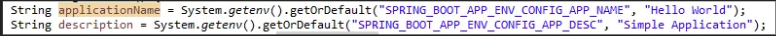
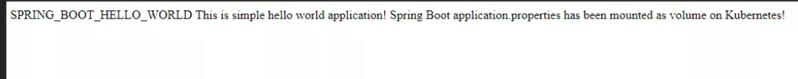

# 两种方法上手ConfigMap(环境变量/挂载文件)

属性配置文件在任何应用程序中都非常重要。它们不仅可以让应用程序具备灵活性，还能够根据文件中配置的值产生不同的功能。实际上，在staging、开发、测试、UAT或生产环境中，我们都使用属性配置文件来驱动不同的行为。

**通常情况下，属性配置文件会与代码一起打包，并且整个程序包都部署在执行环境中。这一方法中，如果你想更改任何配置（即便配置文件中也发生了更改），你需要重新发布代码**。

尽管这种方法行之有效，但是对于现在而言，效率还是太低了。因此我们需要一种外部化的配置。

在本文中，我将阐述`Kubernetes`如何为容器提供外部化、灵活的配置以及可移植性。

ConfigMap主要是为了让应用程序的配置和部署解耦，这一功能可以让容器化应用程序具备可移植性。

如果你对`Spring Cloud`的生态很熟悉，那么接下来你会发现`ConfigMap`与`Spring Cloud server`十分类似。这里有两种使用`ConfigMap`的方法：

1. **将`ConfigMap`作为一种环境变量**
2. **将`ConfigMap`挂载为文件**

## 将`ConfigMap作`为一种环境变量


在本例中，我们将在`Kubernetes`中创建一个新的环境变量，并将其用于代码中。

**在`Java`中，可以通过`System.getenv(String) API`在代码中使用环境变量。**

在常规`Java`应用程序中，可以在`J2EE`应用程序容器（如`Oracle WLS`或`IBM WAS`）中设置环境变量，也可以在`OS`中设置环境变量。然而，在`Kubernetes`中情况并不相同。要使用环境变量，我们必须根据`literal`创建配置映射。

```
$ kubectl create configmap app-env-config --from-literal=app.name="SPRING_BOOT_HELLO_WORLD" --from-literal=app.desc="This is simple world application" 
configmap/app-env-config created
```

通过`kubectl create configmap` 命令，我们创建了两个环境变量：`app.name` 和 `app.desc`。


我们来了解一下这背后发生了什么。

```
$ kubectl get cm app-env-config -o yaml
apiVersion: v1
data:
  app.desc: This is simple world application
  app.name: SPRING_BOOT_HELLO_WORLD
kind: ConfigMap
metadata:
  creationTimestamp: "2019-12-27T02:42:29Z"
  name: app-env-config
  namespace: default
  resourceVersion: "1122714"
  selfLink: /api/v1/namespaces/default/configmaps/app-env-config
  uid: f0b993bd-dec1-4928-ab81-2e7bd4aa3f1d
```

现在注意数据部分，在数据部分下，你会找到键值对。

从技术上来说，`ConfigMap`仅仅是键值存储。

**属性的名称是键，属性的值是值**。

应用程序的代码会要求你查找这些键值对。

为了在Java代码中使用此环境变量，我们需要编写以下代码：



```
String applicationName = System.getenv().getOrDefault("SPRING_BOOT_APP_ENV_CONFIG_APP_NAME", "Hello World");
        String description = System.getenv().getOrDefault("SPRING_BOOT_APP_ENV_CONFIG_APP_DESC", "Simple Application");
```

下面的代码段定义了两个K8s环境变量，分别为`“SPRING_BOOT_HELLO_WORLD_APP_NAME”`和`“ SPRING_BOOT_HELLO_WORLD_DESC”`。

这些变量将从`ConfigMap app-env-config`获取值。需要重点关注的是键。


```
env:
        # Define the environment variable
        - name: SPRING_BOOT_APP_ENV_CONFIG_APP_NAME
          valueFrom:
            configMapKeyRef:
              # The ConfigMap containing the value you want to assign to SPRING_BOOT_APP_ENV_CONFIG_APP_NAME
              name: app-env-config
              # Specify the key associated with the value
              key: app.name              
        - name: SPRING_BOOT_APP_ENV_CONFIG_APP_DESC
          valueFrom:
            configMapKeyRef:
              # The ConfigMap containing the value you want to assign to SPRING_BOOT_APP_ENV_CONFIG_APP_DESC
              name: app-env-config
              # Specify the key associated with the value
              key: app.desc    
```

属性配置文件可以在单个文件中保存很多个属性，以在不同环境中运行应用程序。在Spring Boot应用程序中，属性保存在`classpath`下的`application.properties`文件中。我们来看一下打包在应用程序`jar`包中的`application.properties`文件。

```
welcome.message=%s %s! Welcome To Spring Boot Hello World App!
```

现在让我们查看完整的代码。

**`HelloWorldConfigMapController.java`**

```
package com.nik.tutorial.microservices.HelloWorldConfigMap;

import org.slf4j.Logger;
import org.slf4j.LoggerFactory;
import org.springframework.beans.factory.annotation.Value;
import org.springframework.web.bind.annotation.RequestMapping;
import org.springframework.web.bind.annotation.RestController;

@RestController
public class HelloWorldConfigMapController {
	private static final Logger logger = LoggerFactory.getLogger(HelloWorldConfigMapController.class);

	@Value("${welcome.message:Welcome to our app}")
	private String welcomeMessage;
	
	@RequestMapping("/welcome")
	private String welcome() {
        String applicationName = System.getenv().getOrDefault("SPRING_BOOT_APP_ENV_CONFIG_APP_NAME", "Hello World");
        String description = System.getenv().getOrDefault("SPRING_BOOT_APP_ENV_CONFIG_APP_DESC", "Simple Application");
		logger.info("\napplication_name is {}",applicationName);
		logger.info("\ndescription is {}",description);
        return String.format(welcomeMessage,applicationName, description);
	}
}
```

## 将ConfigMap挂载为文件

在本节中，我将说明如何使用`ConfigMap`挂载文件以外部化配置。在此示例中，我将使用`ConfigMap`来外部化`application.properties`文件。即使默认文件打包在jar中，也位于`src/main/resources`下。简单来说，我们将通过ConfigMap所提供的文件来覆盖默认文件。

第一步是从`application.properties`创建`ConfigMap`。让我们了解如何在K8s中存储此`ConfigMap`。

```
$ kubectl get cm app-env-config -o yaml
apiVersion: v1
data:
  app.desc: This is simple world application
  app.name: SPRING_BOOT_HELLO_WORLD
kind: ConfigMap
metadata:
  creationTimestamp: "2019-12-27T02:42:29Z"
  name: app-env-config
  namespace: default
  resourceVersion: "1122714"
  selfLink: /api/v1/namespaces/default/configmaps/app-env-config
  uid: f0b993bd-dec1-4928-ab81-2e7bd4aa3f1d
 ```
 
 通过`ConfigMap`，我们将挂载`application.properties`文件到K8s集群中，并且可以在应用程序中使用它。
 
 **请注意，数据部分包含了`application.properties`的内容，键是文件名**。

**现在，为了覆盖默认配置文件，我们需要（通过`ConfigMap`）将`application.properties`挂载到应用程序的`classpath`中。**

`Spring Boot`通过提供不同的选项来提供这一功能。`SpringApplication`在以下位置从`application.properties`文件加载属性，并将它们添加到`Spring Environment`：

* 当前目录的`/config `子目录
* 当前目录
* `classpath/config`包
* `The classpath root`

最简单，最好的方法是将`application.properties`挂载在`“/config”`目录中。

```
 volumeMounts:
    - name: spring-boot-app-env-config-volume
      mountPath: "/config"
  volumes:
    - name: spring-boot-app-env-config-volume
      configMap:
        name: app-file-config
        items:
        - key: application.properties
          path: application.properties
```
**仔细检查挂载路径，请注意`ConfigMap`的名称应与我们在上面创建的`app-file-configmap`完全相同，键为文件名。另外，请确保将`volume mount`配置的名称更改为`volume`配置的名称。**

```
@Value("${welcome.message:Welcome to our app}")
private String welcomeMessage;
```
这段代码说明了如何在`application.properties`文件中定义属性。如果使用`Spring`推荐的标准方法的话，这十分简单。具体而言，就是使用`@Value `注释将属性值注入到变量中。


现在，我们可以继续进行ConfigMap示例应用程序了。我们来看一下完整的代码段。

```
package com.nik.tutorial.microservices.HelloWorldConfigMap;

import org.slf4j.Logger;
import org.slf4j.LoggerFactory;
import org.springframework.beans.factory.annotation.Value;
import org.springframework.web.bind.annotation.RequestMapping;
import org.springframework.web.bind.annotation.RestController;

@RestController
public class HelloWorldConfigMapController {
	private static final Logger logger = LoggerFactory.getLogger(HelloWorldConfigMapController.class);

	@Value("${welcome.message:Welcome to our app}")
	private String welcomeMessage;
	
	@RequestMapping("/welcome")
	private String welcome() {
        String applicationName = System.getenv().getOrDefault("SPRING_BOOT_APP_ENV_CONFIG_APP_NAME", "Hello World");
        String description = System.getenv().getOrDefault("SPRING_BOOT_APP_ENV_CONFIG_APP_DESC", "Simple Application");
		logger.info("\napplication_name is {}",applicationName);
		logger.info("\ndescription is {}",description);
        return String.format(welcomeMessage,applicationName, description);
	}
}
```

让我们创建一个`Docker`镜像并将其上传到`Dockerhub`。在本例中，镜像名称`是k8s-springboot-helloworld-configmap—app`。


以下是K8S pod配置文件：


**`pod_config_map.yaml`**

```
apiVersion: v1
kind: Pod
metadata:
  name: hello-world-app-configmap-pod
  labels:
    app: hello-world-app-configmap
spec:
  containers:
  - name: hello-world-webapp-configmap
    image: nikbhi15docker/k8s-springboot-helloworld-configmap-app
    imagePullPolicy: Always
    env:
        # Define the environment variable
        - name: SPRING_BOOT_APP_ENV_CONFIG_APP_NAME
          valueFrom:
            configMapKeyRef:
              # The ConfigMap containing the value you want to assign to SPRING_BOOT_APP_ENV_CONFIG_APP_NAME
              name: app-env-config
              # Specify the key associated with the value
              key: app.name              
        - name: SPRING_BOOT_APP_ENV_CONFIG_APP_DESC
          valueFrom:
            configMapKeyRef:
              # The ConfigMap containing the value you want to assign to SPRING_BOOT_APP_ENV_CONFIG_APP_DESC
              name: app-env-config
              # Specify the key associated with the value
              key: app.desc      
    volumeMounts:
    - name: spring-boot-app-env-config-volume
      mountPath: "/config"
  volumes:
    - name: spring-boot-app-env-config-volume
      configMap:
        name: app-file-config
        items:
        - key: application.properties
          path: application.properties
  restartPolicy: Always 
```


现在我们使用NodePort服务类型创建服务，以便可以从K8S集群外部使用Welcome服务。

**`service_config_map.yaml`**

```
piVersion: v1
kind: Service
metadata:
  name: hello-world-app-configmap-service

spec:
  # This defines which pods are going to be represented by this Service
  # The service becomes a network endpoint for either other services
  # or maybe external users to connect to (eg browser)
  selector:
    app: hello-world-app-configmap

  ports:
    - name: http
      port: 8080
      nodePort: 30880

  type: NodePort
```

现在，让我们把这些更改应用于K8S。

认真观察输出，返回的字符串是：




同时，检查代码中硬编码的环境变量的默认值，以及打包在`jar`中的`application.properties`的`property`默认值。你发现从`ConfigMap`中获取了环境变量和`application.properties`的值。

### Rerference

https://github.com/nikhilbhide/MicroServicesTutorial/tree/master/k8s_spring_boot_hello_world_config_map


