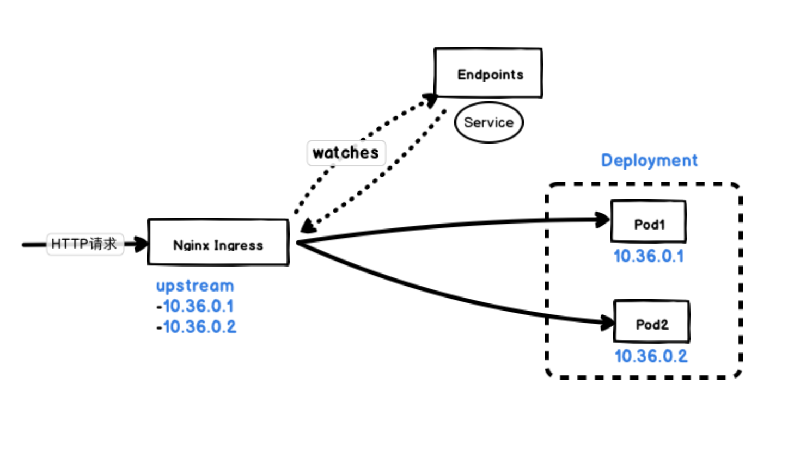
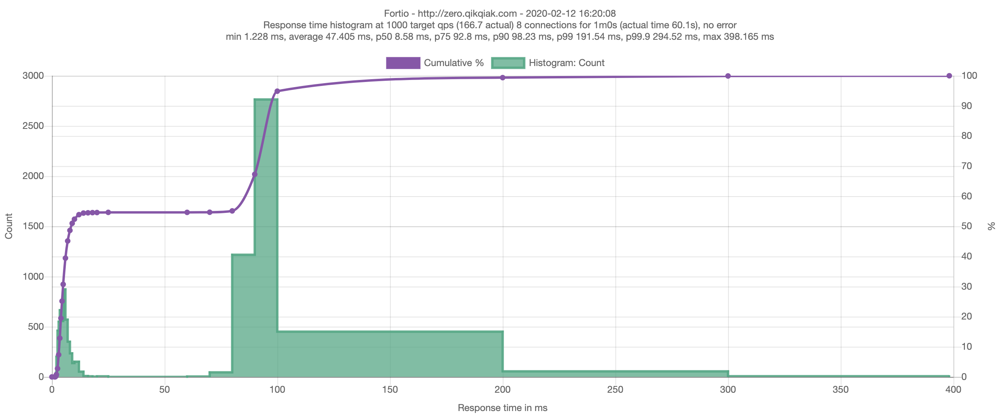

# Kubernetes 零宕机滚动更新

软件世界的发展比以往任何时候都快，为了保持竞争力需要尽快推出新的软件版本，而又不影响在线得用户。许多企业已将工作负载迁移到了 Kubernetes 集群，Kubernetes 集群本身就考虑到了一些生产环境的实践，但是要让 Kubernetes 实现真正的零停机不中断或丢失请求，我们还需要做一些额外的操作才行。

## 滚动更新

默认情况下，`Kubernetes` 的 `Deployment` 是具有滚动更新的策略来进行 `Pod` 更新的，该策略可以在任何时间点更新应用的时候保证某些实例依然可以正常运行来防止应用 `down` 掉，当新部署的 `Pod` 启动并可以处理流量之后，才会去杀掉旧的 `Pod`。

在使用过程中我们还可以指定 `Kubernetes` 在更新期间如何处理多个副本的切换方式，比如我们有一个3副本的应用，在更新的过程中是否应该立即创建这`3`个新的 `Pod` 并等待他们全部启动，或者杀掉一个之外的所有旧的 `Pod`，或者还是要一个一个的 `Pod` 进行替换？下面示例是使用默认的滚动更新升级策略的一个 `Deployment` 定义，在更新过程中最多可以有一个超过副本数的容器（`maxSurge`），并且在更新过程中没有不可用的容器。

```
apiVersion: apps/v1
kind: Deployment
metadata:
  name: zero-downtime
  labels:
    app: zero-downtime
spec:
  replicas: 3
  selector:
    matchLabels:
      app: zero-downtime
  strategy:
    type: RollingUpdate
    rollingUpdate:
      maxSurge: 1
      maxUnavailable: 0
  template:
    # with image nginx
    # ...
```

```
 strategy:
    type: RollingUpdate
    rollingUpdate:
      maxSurge: 1
      maxUnavailable: 0
```    

上面的 `zero-downtime` 这个应用使用 `nginx` 这个镜像创建`3`个副本，该 `Deployment` 执行滚动更新的方式：首先创建一个新版本的 `Pod`，等待 `Pod` 启动并准备就绪，然后删除一个旧的 `Pod`，然后继续下一个新的 `Pod`，直到所有副本都已替换完成。


为了让 `Kubernetes` 知道我们的 `Pod` 何时可以准备处理流量请求了，我们还需要配置上 `liveness` 和 `readiness` 探针。下面展示的就是新旧 `Pod` 替换的输出信息：

```
$ kubectl get pods

$ kubectl get pods
NAME                            READY   STATUS              RESTARTS   AGE
zero-downtime-d449b5cc4-k8b27   1/1     Running             0          3m9s
zero-downtime-d449b5cc4-n2lc4   1/1     Running             0          3m9s
zero-downtime-d449b5cc4-sdw8b   1/1     Running             0          3m9s
zero-downtime-d569474d4-q9khv   0/1     ContainerCreating   0          12s
...

zero-downtime-d449b5cc4-n2lc4   1/1     Running             0          3m9s
zero-downtime-d449b5cc4-sdw8b   1/1     Running             0          3m9s
zero-downtime-d449b5cc4-k8b27   1/1     Terminating         0          3m29s
zero-downtime-d569474d4-q9khv   1/1     Running             0          1m
...

zero-downtime-d449b5cc4-n2lc4   1/1     Running             0          5m
zero-downtime-d449b5cc4-sdw8b   1/1     Running             0          5m
zero-downtime-d569474d4-q9khv   1/1     Running             0          1m
zero-downtime-d569474d4-2c7qz   0/1     ContainerCreating   0          10s
```

## 可用性检测

如果我们从旧版本到新版本进行滚动更新，只是简单的通过输出显示来判断哪些 Pod 是存活并准备就绪的，那么这个滚动更新的行为看上去肯定就是有效的，但是往往实际情况就是从旧版本到新版本的切换的过程并不总是十分顺畅的，应用程序很有可能会丢弃掉某些客户端的请求。

为了测试是否存在请求被丢弃，特别是那些针对即将要退出服务的实例的请求，我们可以使用一些负载测试工具来连接我们的应用程序进行测试。我们需要关注的重点是所有的 `HTTP` 请求，包括 `keep-alive` 的 `HTTP`连接是否都被正确处理了，所以我们这里可以使用 [Apache Bench（AB Test）](http://httpd.apache.org/docs/current/programs/ab.html) 或者 [Fortio（Istio 测试工具）](https://fortio.org/) 这样的测试工具来测试。

我们使用多个线程以并发的方式去连接到正在运行的应用程序，我们关心的是响应的状态和失败的连接，而不是延迟或吞吐量之类的信息。我们这里使用 `Fortio` 这个测试工具，比如每秒 `500` 个请求和 `8` 个并发的 `keep-alive` 连接的测试命令如下所示(使用域名`zero.test.com`代理到上面的3个 Pod)：

```
$ fortio load -a -c 8 -qps 500 -t 60s "http://zero.test.com/"
```
> 关于 fortio 的具体使用可以查看官方文档：https://github.com/fortio/fortio

使用 `-a` 参数可以将测试报告保存为网页的形式，这样我们可以直接在浏览器中查看测试报告。如果我们在进行滚动更新应用的过程中启动测试，则可能会看到一些请求无法连接的情况：


```
Starting at 1000 qps with 8 thread(s) [gomax 2] for 1m0s : 7500 calls each (total 60000)
Ended after 1m0.006243654s : 5485 calls. qps=91.407
Aggregated Sleep Time : count 5485 avg -17.626081 +/- 15 min -54.753398956 max 0.000709054 sum -96679.0518
[...]
Code 200 : 5463 (99.6 %)
Code 502 : 20 (0.4 %)
Response Header Sizes : count 5485 avg 213.14166 +/- 13.53 min 0 max 214 sum 1169082
Response Body/Total Sizes : count 5485 avg 823.18651 +/- 44.41 min 0 max 826 sum 4515178
[...]
```

从上面的输出可以看出有部分请求处理失败了（`502`），我们可以运行几种通过不同方式连接到应用程序的测试场景，比如通过` Kubernetes Ingress` 或者直接从集群内部通过 `Service` 进行连接。

我们会看到在滚动更新过程中的行为可能会有所不同，具体的还是需要取决于测试的配置参数，和通过 `Ingress` 的连接相比，从集群内部连接到服务的客户端可能不会遇到那么多的失败连接。

## 原因分析

现在的问题是需要弄明白当应用在滚动更新期间重新路由流量时，从旧的 Pod 实例到新的实例究竟会发生什么，首先让我们先看看` Kubernetes` 是如何管理工作负载连接的。

如果我们执行测试的客户端直接从集群内部连接到 `zero-downtime` 这个 `Service`，

那么

1. **首先会通过集群的` DNS `服务解析到 `Service` 的 `ClusterIP`**，
2. **然后转发到 `Service` 后面的 `Pod` 实例**，
3. **这是每个节点上面的 `kube-proxy` 通过更新 `iptables` 规则来实现的。**


`Kubernetes` 会根据 `Pods` 的状态去更新 `Endpoints` 对象，这样就可以保证 `Endpoints` 中包含的都是准备好处理请求的 `Pod`。

但是 `Kubernetes Ingress` 连接到实例的方式稍有不同，这就是为什么当客户端通过 `Ingresss` 连接到应用程序的时候，我们会在滚动更新过程中查看到不同的宕机行为。

大部分` Ingress Controller`，比如 `nginx-ingress`、`traefik `都是通过直接 `watch Endpoints `对象来直接获取` Pod` 的地址的，而不用通过` iptables` 做一层转发了。



无论我们如何连接到应用程序，`Kubernetes` 的目标都是在滚动更新的过程中最大程度地减少服务的中断。一旦新的 `Pod` 处于活动状态并准备就绪后，`Kubernetes` 就将会停止就的 `Pod`，从而将 `Pod` 的状态更新为 `“Terminating”`，然后从 `Endpoints` 对象中移除，并且发送一个 `SIGTERM` 信号给 `Pod` 的主进程。

**`SIGTERM` 信号就会让容器以正常的方式关闭，并且不接受任何新的连接。`Pod` 从 `Endpoints` 对象中被移除后，前面的负载均衡器就会将流量路由到其他（新的）`Pod `中去。**

这个也是造成我们的应用可用性差距的主要原因，因为在负责均衡器注意到变更并更新其配置之前，终止信号就会去停用 `Pod`，而这个重新配置过程又是异步发生的，所以并不能保证正确的顺序，所以就可能导致很少的请求会被路由到终止的 `Pod` 上去。

## 零宕机

那么如何增强我们的应用程序以实现真正的零宕机迁移呢？

首先，要实现这个目标的先决条件是我们的容器要正确处理终止信号，在 `SIGTERM` 信号上实现优雅关闭。**下一步需要添加 `readiness` 可读探针，来检查我们的应用程序是否已经准备好来处理流量了**。

可读探针只是我们平滑滚动更新的起点，为了解决 `Pod` 停止的时候不会阻塞并等到负载均衡器重新配置的问题，我们需要使用 `preStop` 这个生命周期的钩子，在容器终止之前调用该钩子。

生命周期钩子函数是同步的，所以必须在将最终终止信号发送到容器之前完成，在我们的示例中，我们使用该钩子简单的等待，然后 `SIGTERM` 信号将停止应用程序进程。同时，`Kubernetes` 将从 `Endpoints` 对象中删除该 `Pod`，**所以该 `Pod` 将会从我们的负载均衡器中排除，基本上来说我们的生命周期钩子函数等待的时间可以确保在应用程序停止之前重新配置负载均衡器**。

这里我们在 `zero-downtime `这个 `Deploymen`t 中添加一个 `preStop` 钩子：

```
apiVersion: apps/v1
kind: Deployment
metadata:
  name: zero-downtime
  labels:
    app: zero-downtime
spec:
  replicas: 3
  selector:
    matchLabels:
      app: zero-downtime
  template:
    spec:
      containers:
      - name: zero-downtime
        image: nginx
        livenessProbe:
          # ...
        readinessProbe:
          # ...
        lifecycle:
          preStop:
            exec:
              command: ["/bin/bash", "-c", "sleep 20"]
  strategy:
    # ...
```

**我们这里使用 `preStop` 设置了一个 `20s` 的宽限期，`Pod `在真正销毁前会先 `sleep` 等待 `20s`，这就相当于留了时间给 `Endpoints` 控制器和 `kube-proxy` 更新去 `Endpoints` 对象和转发规则，这段时间 `Pod` 虽然处于 `Terminating` 状态，即便在转发规则更新完全之前有请求被转发到这个 `Terminating` 的 `Pod`，依然可以被正常处理，因为它还在` sleep`，没有被真正销毁**。



```
Starting at 1000 qps with 8 thread(s) [gomax 2] for 1m0s : 7500 calls each (total 60000)
Ended after 1m0.091439891s : 10015 calls. qps=166.66
Aggregated Sleep Time : count 10015 avg -23.316213 +/- 14.52 min -50.161414028 max 0.001811225 sum -233511.876
[...]
Code 200 : 10015 (100.0 %)
Response Header Sizes : count 10015 avg 214 +/- 0 min 214 max 214 sum 2143210
Response Body/Total Sizes : count 10015 avg 826 +/- 0 min 826 max 826 sum 8272390
Saved result to data/2020-02-12-162008_Fortio.json 
All done 10015 calls 47.405 ms avg, 166.7 qps
```