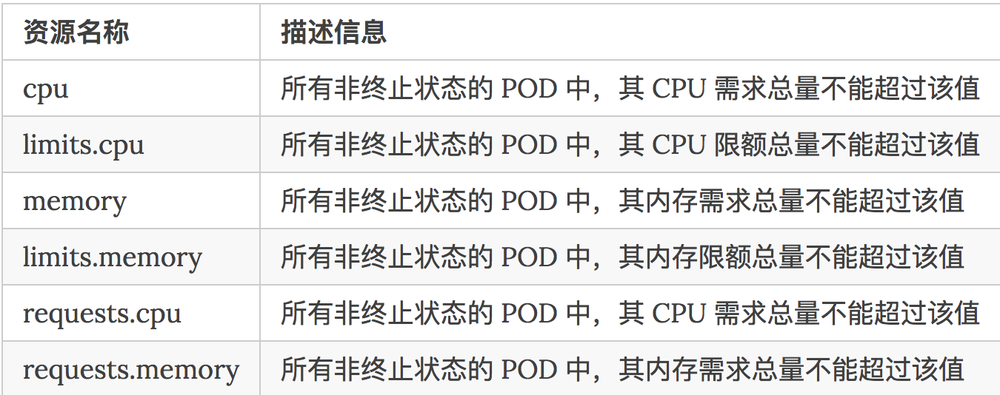

# kubernetes 的资源配额控制器

有很多团队在使用`kubernetes`的时候是将一个`namespace`当成一个租户的，所以对namespace的权限控制，资源控制就很重要了，你总是会担心你的某个租户使用的资源就超出了应有的配额。幸运的是`kubernetes`本身就为我们提供了解决这一问题的工具：资源配额控制器(`ResourceQuotaController`)

资源配额控制器确保了指定的资源对象始终不会超过配置的资源，能够有效的降低整个系统宕机的机率，增强系统的鲁棒性，对整个集群的稳定性有非常重要的作用。


## 介绍

`kubernetes`主要有3个层级的资源配额控制：

* `容器`：可以对 `CPU` 和 `Memory` 进行限制
* `POD`：可以对一个 `POD` 内所有容器的的资源进行限制
* `Namespace`：为一个命名空间下的资源进行限制

其中容器层次主要利用容器本身的支持，比如 

* `Docker` 对 `CPU`、`内存`等的支持；
* `POD` 方面可以限制系统内创建 `POD` 的资源范围，比如最大或者最小的 `CPU`、`memory` 需求； 
* `Namespace` 层次就是对用户级别的资源限额了，包括 `CPU`、内存，还可以限定 `POD`、`RC`、`Service` 的数量。

要使用资源配额的话需要确保`apiserver`的`--admission-control`参数中包含`ResourceQuota`，当 `namespace` 中存在一个 `ResourceQuota`对象时，该 `namespace` 即开始实施资源配额的管理工作了，另外需要注意的是一个 `namespace` 中最多只应存在一个 `ResourceQuota` 对象。

### `ResourceQuotaController`支持的配额控制资源主要包括：

**计算资源配额、存储资源配额、对象数量资源配额以及配额作用域，**

下面我们来分别看看这些资源的具体信息：

## 计算资源配额

用户可以对给定 `namespace` 下的计算资源总量进行限制，`ResourceQuotaController`所支持的资源类型如下：




示例如下：

```
cat <<EOF > compute-resources.yaml
apiVersion: v1
kind: ResourceQuota
metadata:
  name: compute-resources
  namespace: myspace
spec:
  hard:
    requests.cpu: "1"
    requests.memory: 256Mi
    limits.cpu: "2"
    limits.memory: 256Mi
EOF

$ kubectl create -f compute-resources.yaml
Error from server (NotFound): error when creating "compute-resources.yaml": namespaces "myspace" not found
```

```
$ vi myspace.yaml

apiVersion: v1
kind: Namespace
metadata:
  name: myspace
```

```
$ kubectl create -f myspace.yaml
namespace "myspace" created

$ kubectl create -f compute-resources.yaml
resourcequota "compute-resources" created

$ kubectl get quota --all-namespaces
NAMESPACE   NAME                AGE
myspace     compute-resources   22s

```


```
$ kubectl describe quota compute-resources -n myspace
Name:            compute-resources
Namespace:       myspace
Resource         Used  Hard
--------         ----  ----
limits.cpu       0     2
limits.memory    0     256Mi
requests.cpu     0     1
requests.memory  0     256Mi
```


另外需要注意的是：如果 namespace 下的计算资源 （如 cpu 和 memory）的配额被启用，则用户必须为这些资源设定请求值（request） 和约束值（limit），否则配额系统将拒绝Pod的创建；或者也可以为资源设置默认的资源限制，如下 yaml 文件：（同样需要在`--admission-control`参数中设置值`LimitRanger`）


```
apiVersion: v1
kind: LimitRange
metadata:
  name: limits
spec:
  limits:
  - default:
    cpu: 200m
    memory: 200Mi
  type: Container
```

## 存储资源配额

用户可以对给定 `namespace` 下的存储资源总量进行限制，此外，还可以根据相关的存储类（`Storage Class`）来限制存储资源的消耗。


## 对象数量配额

给定类型的对象数量可以被限制。 支持以下类型：


示例如下：

```
$ cat <<EOF > object-counts.yaml
apiVersion: v1
kind: ResourceQuota
metadata:
  name: object-counts
  namespace: myspace
spec:
  hard:
    pods: "40"
    configmaps: "10"
    replicationcontrollers: "20"
    secrets: "10"
    services: "10"
    services.nodeports: "2"
EOF

$ kubectl create -f object-counts.yaml
resourcequota "object-counts" created
```

同样可以查看上面创建的资源限额对象：

```
$ kubectl describe quota object-counts -n myspace
Name:                   object-counts
Namespace:              myspace
Resource                Used  Hard
--------                ----  ----
configmaps              0     10
pods                    0     40
replicationcontrollers  0     20
secrets                 1     10
services                0     10
services.nodeports      0     2
```

## 配额作用域

每个配额都有一组相关的作用域（`scope`），配额只会对作用域内的资源生效。当一个作用域被添加到配额中后，它会对作用域相关的资源数量作限制。 如配额中指定了允许（作用域）集合之外的资源，会导致验证错误。


其中`BestEffort` 作用域限制配额跟踪以下资源： PODS

`Terminating`、 `NotTerminating` 和 `NotBestEffort`限制配额跟踪以下资源：`cpu`、`limits.cpu`、`limits.memory`、`memory`、`pods`、`requests.cpu`、`requests.memory`。

## 总结

物理资源 `CPU` 和内存受到 `namespace` 资源配额管理器的控制，几乎所有使用到的资源都能够被简单的调整，我们可以结合我们自身的业务和物理资源实际情况来进行分配配额，所以这里没有一个完全通用的配额方案，需要根据实际情况来定，因为只有你自己最清楚你的集群的整体情况了。

## 参考资料

* [https://kubernetes.io/docs/tasks/administer-cluster/quota-memory-cpu-namespace/](https://kubernetes.io/docs/tasks/administer-cluster/quota-memory-cpu-namespace/)
* [https://kubernetes.io/docs/tasks/administer-cluster/quota-api-object/](https://kubernetes.io/docs/tasks/administer-cluster/quota-api-object/)
