# 图解 K8S 控制器 Node 生命周期管理

## 1. 基础概念 

### 1.1 心跳机制


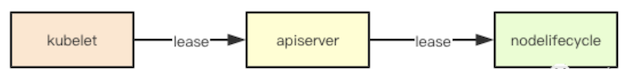

心跳机制是分布式调度系统中常见的设计, `kubernetes`中通过`Lease`这种资源来进行实现心跳信息的传递，

* **其在`kubelet`上运行`nodelease`的线程定时向`apiserver`更新自己的心跳信息**, 
* **同时`controller`控制器中的`nodelifecycle`会通过`informer`来监听集群中的`lease`信息**

### 1.2 node状态

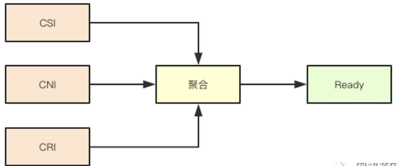

Node的状态除了相关资源压力、网络不可达之外，其实只有一个`Ready`状态， 对应的`Status`则同其他资源一样三种：`ConditionTrue`、`conditionFalse`、`conditionUnknown`,那什么时候会是一个`ready`状态呢， 

<span style="color:red">**其实在kubernetes中我们有三大列资源: `CRI`、`CNI`、`CSI`,如果任一一个运行时出现错误，则当前节点就不是Ready状态**</span>

### 1.3 Taint和Toleration

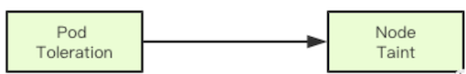

`Taint(污点)`和`Toleration`(容忍)是`kubernetes`中的调度约束的一种实现，其通过一种打标签的方式，来进行调度约束，

* 当一个`Node`节点被打上了一个`Taint`则调度器在进行调度的时候，如果发现当前调度的`pod`没有容忍这种污点，则当前节点就不能调度过去， 
* 其次如果发现对应节点上已经运行的`pod`不能容忍`node`新标记的`Taint`, 则可能会被从当前节点中驱逐

### 1.4 基于心跳/Taint/Toleration的故障转移

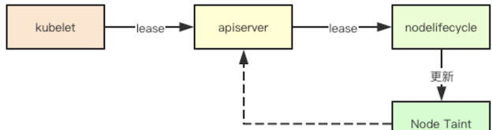

`kubernetes`中针对`Node`节点`down`机的故障转移的实现,其实就是记住这几个机制来进行的，在发现无法接收到对应节点的心跳之后，`kubernetes`就会给对应节点打上一些异常的`Taint`, 并且根据之前缓存的节点上的`Pod来`进行检查，**如果发现没有对应的`Toleration`，则就会尝试驱逐这些`Pod`, 然后由对应的控制器发现`Pod`的删除, 就开始重新进行补偿, 然后经过调度器选择新的节点运行**


## 2. 容忍与驱逐设计剖析

### 2.1 Node的Taints由来

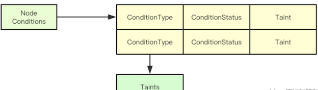

在`node`生命周期控制器中，`Node`为了实现驱逐节点的目标，**主要是通过为`Node`生成对应的`taints`来进行，那`Node`中的`taints`除了运维为指定节点赋予的之外，其余的则是通过`Status`里面的`Conditions`来进行计算而来**

```
nodeConditionToTaintKeyStatusMap = map[v1.NodeConditionType]map[v1.ConditionStatus]string{
        v1.NodeReady: {
            v1.ConditionFalse:   v1.TaintNodeNotReady,
            v1.ConditionUnknown: v1.TaintNodeUnreachable,
        },
        v1.NodeMemoryPressure: {
            v1.ConditionTrue: v1.TaintNodeMemoryPressure,
        },
        v1.NodeDiskPressure: {
            v1.ConditionTrue: v1.TaintNodeDiskPressure,
        },
        v1.NodeNetworkUnavailable: {
            v1.ConditionTrue: v1.TaintNodeNetworkUnavailable,
        },
        v1.NodePIDPressure: {
            v1.ConditionTrue: v1.TaintNodePIDPressure,
        },
    }
```

这里是一个对应表,当节点的`Status`里面的状态还有`CoditionType`的值来决定为其添加哪个对应的`Taint`

### 2.2 Node Taints增量更新

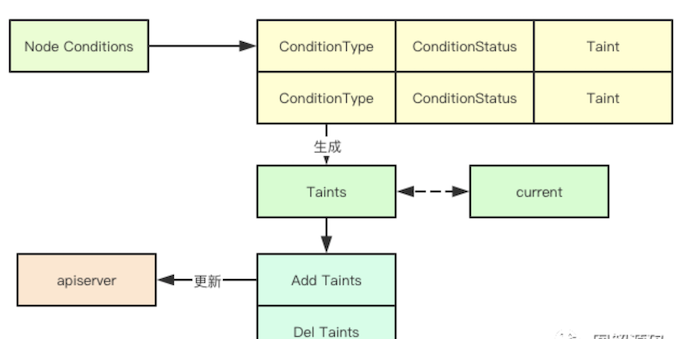

上面通过`Condition`状态计算出节点需要增加或者删除的`Taint`之后，其实就会调用对应的`apiserver`当前`node`的最新的`Taints,` 至此`node controller`完成了第一阶段的工作, 即根据当前的状态来进行更新对应的`Taint,` 有了这些`Taint`别的组件就可以进行`Pod`的驱逐了

### 2.3 Pod状态更新

那如果`Pod`的状态更新,我也需要关注吗或者说`node controller`关注了`Pod`主要会做什么呢?

其实这是一个联动操作，如果发现一个`pod`当前是`Ready`状态，但是`node`已经不是`Ready`状态了，则此时就要立马更新`pod`的`Status`，其实就是为了通知对应的`endpoints`摘除对应的`pod`因为他所在的`node`已经出现问题了

### 2.4 Taint管理器

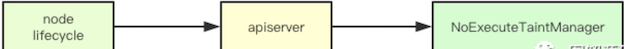

前面我们提到`k8s`中会根据`conditionType`计算出要为`node`添加的`Taints`, 然后就直接更新`apiserver`了，**<span style="color:red">其实剩下的工作都是交给`NoExecuteTaintManager`这个组件来完成的</span>**，这个组件是干什么的呢，从名字就可以看出`NoExecute`就跟我们自己给`Node`添加 `Taint`一样，立即驱逐不满足的`Pod`

### 2.5 容忍检测与驱逐

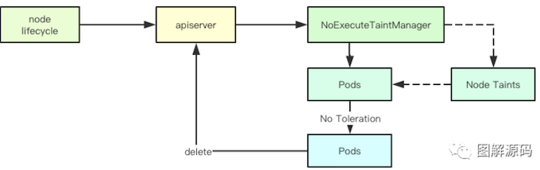

当一个`Node`更新的时候，首先会获取当前`Node上`面所有`Taint`的`Effect`为`NoExecute`的`Taints`，然后会去获取当`node`上面的所有`Pod`然后逐个检测`Pod`是否有对应的`Tolerations,` 然后没有就通过定时器创建一个驱逐的任务延迟执行

如果一个节点可以正常反馈状态，通过如上步骤其实就可以不断的进行对比那些不能容忍节点`Taint`的`Pod`从而达到驱逐的目的，但是如果无法反馈信息呢，则就需要靠心跳检测模块来进行

## 3. 心跳检测

**心跳检测主要是根据当前缓存的`node`信息来确定在过去一段时间内, `node`是否正常发送信息, 如果没有发生，则对应的`node`可能就已经挂了，针对这部分`node`我们就要进行处理**

### 3.1 自我保护

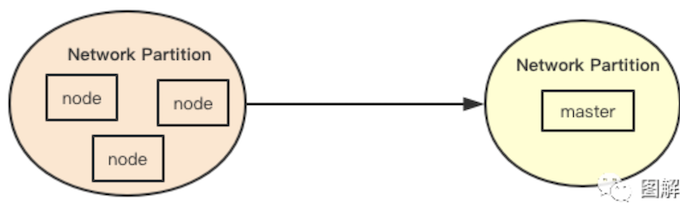

自我保护是分布式系统里面比较常见的一种机制，其核心是为了防止当发生网络分区的时候，因为主节点被隔离而导致正常节点的心跳全部失效，从而触发异常处理流程，自我保护就是如果发生大面积心跳中断的情况下，集群的一种保护机制

### 3.2 zone

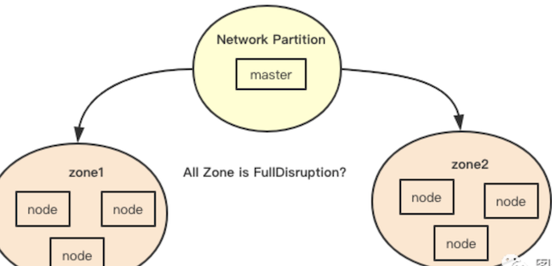

上面提到的自我保护那么如何判断是否达到自我保护的条件呢, 在`k8s`中通过`zone`来将`node`分区,中断则是判断如果发现当前`zone`里面一个`ready`的节点都没有，但是却发现有没有`ready`节点, 这样就可以知道一个的`zone`对应的状态，如果遍历当前的所有`zone`发现全都这样，则就会开启保护关闭中断

### 3.3 限速队列

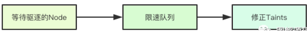

清除`Node`上面`Pod`的这个操作可不算小, 在`kubernetes`中以一种比较保守的数值在做这件事情， 官方文档上也有说明， **<span style="color:blue">限速主要是为了保证系统的稳定性，因为其实清除任务是可以被取消的，比如说节点升级的时候，可能几十秒就起来了，那其上的`pod`还可以依旧运行，没有必要全部转移**</span>，

通过限速队列可以让删除节点的操作慢下来，从而容忍更多的超时时间，注意这里的限速队列是每个`zone`都会有一个

### 3.4 中断标签

```
node.kubernetes.io/exclude-disruption
```

在`k8s`中的`node`可以打上一个特殊的`label`标签如上，当发现该标签的时候，**`node controller`就不会对对应的`node`进行检测，这种情况下，除非对应的`Pod/Node`重新发送事件来驱动整个系统，否则就好比一座孤岛**

### 3.5 中断控制

在真正健康检查之前，

* `node controller`首先会过滤掉前面提到的中断标签，
* 然后对剩余的`node`这里我们称为当前的`zone`的`node`集合，
* **然后对当前的`zone`下面的状态进行检测，检测上面提到的`zone`的自我保护，即是当前的中断状态**

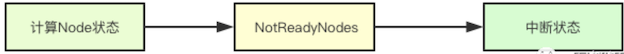

```
 switch {
    case readyNodes == 0 && notReadyNodes > 0:
        //全部中断
        return notReadyNodes, stateFullDisruption
    case notReadyNodes > 2 && float32(notReadyNodes)/float32(notReadyNodes+readyNodes) >= nc.unhealthyZoneThreshold: //0.55
        // 部分中断
        return notReadyNodes, statePartialDisruption
    default:
        return notReadyNodes, stateNormal
    }
```

其次还会对之前的状态做一个检测(每次计算完都会讲之前的zone的结果进行保存)，**在这两次检测中会去检测一个关键的状态即`stateFullDisruption`,即是是否发生全部中断，这里为什么要进行前后状态的检测呢，其实是为了状态的转移，即进入和退出`FullDIsruption`**
  
### 3.6 完全中断的幕后任务


因为是完全中断所以当前节点的之前所有的驱逐任务都要被取消，其次还要关闭后续的健康检查，怎么关闭呢？答案其实就是用到之前的限速队列，让其值为0，这样就不会继续进行健康检查了

### 3.7 Node健康检查之检查

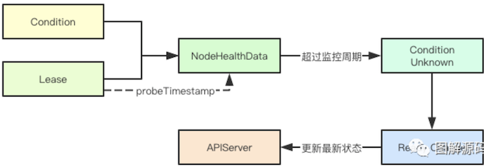

前面主要了解了`Node`健康检查的整体的设计，那究竟是怎么确定一个`Node`的状态呢，

**答案其实就是`Lease`和`probeTimestamp`, 在每次获取到一个新的`Lease`的时候，都会更新`probeTimestamp`即探测时间为当前时间，检测的时候如果发现`probeTimestamp`加上延迟时间小于当前时间，则就会为其更新对应的`Condition`的`Type`和`status`字段， 并且会缓存当前的数据， 同时如果发现节点前后的`ready`状态发生改变还会更新`apiserver`**

### 3.8 根据观测状态进行状态转移

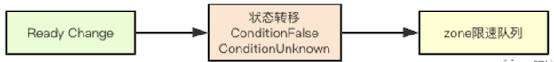

状态转移主要是指的根据观察到的`ReadCondition`的状态来进行转移，如果发现对应的`Read`y状态为`ConditionFalse`和`ConditionUnknown`则就会将其加入到对应`zone`的`map`中的等待后续处理，如果`Ready`为`ConditionTrue`则会移除对应的`taint`从而正常调度`pod`

## 4. 设计总结

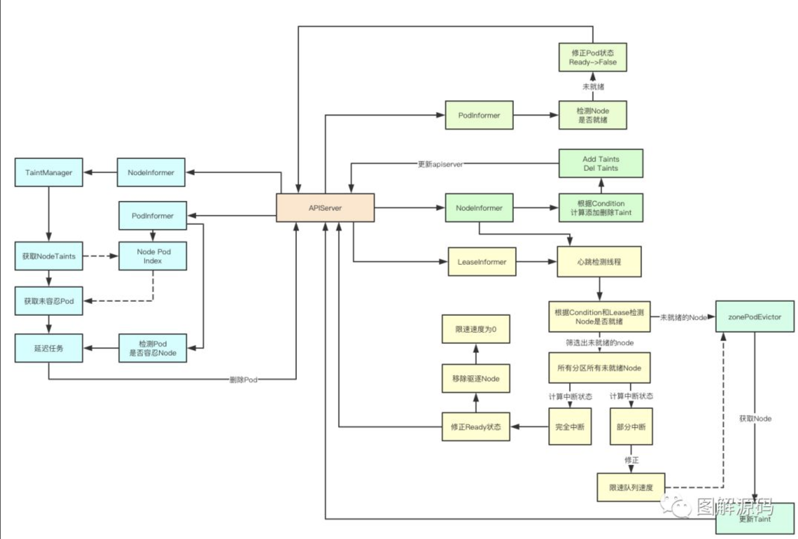

看完了全部的设计,那如果我们要做一个Node升级的管理器该怎么做呢？我们需要从如下几个点去考虑

1. 从上面的设计里面我们可以看出如果`Node`的状态为`Ready`则表明至少我们的`CRI/CNI/CSI`组件没有问题,从这个角度至少证明这个`Node`已经基本正常
2. 一个`Node`要被使用则至少需要被`apiserver/scheduler/controller`所感知,我们可以结合`Node`的驱逐机制来去通过一个特殊的`Taint`和一个特殊的`Pod`进行调度,这样就可以证明这个Node在集群中是一个可用的状态
3 .通过上面两种办法我们可以基本证明单台机器基本可用, 则剩下的其实就是怎么加快这个流程,这个其实可以通过设定当前集群的低水位来实现，从而决定当前集群最多可以允许同时灰度多少`Node`

