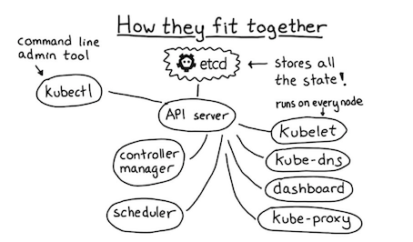
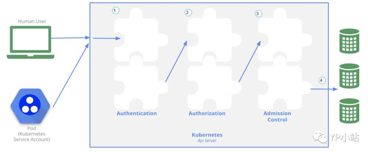
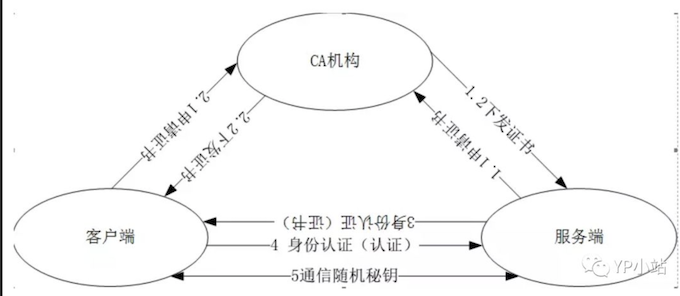
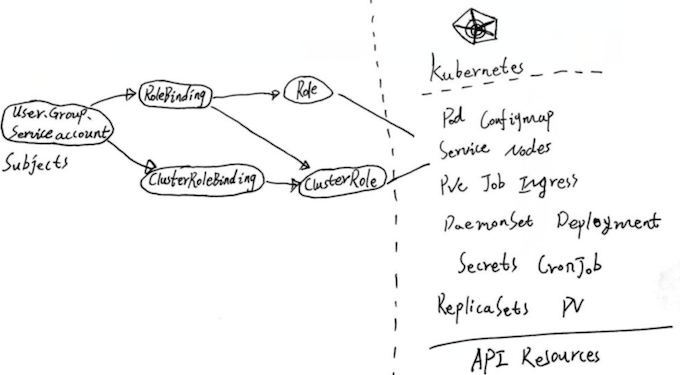
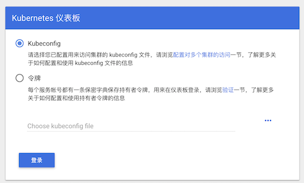

# Kubernetes 集群安全机制详解 

## 前言

本文主要介绍 Kubernetes 的安全机制，如何使用一系列概念、技术点、机制确保集群的访问是安全的，涉及到的关键词有：**`api-server`，认证，授权，准入控制，`RBAC`，`Service Account`，客户端证书认证，`Kubernetes` 用户，`Token` 认证等等**。

虽然涉及到的技术点比较琐碎，比较多，但是了解整个机制后就很容易将其串起来，从而能很好地理解 Kubernetes 集群安全机制。本文结构如下：

* `Kubernetes api-server` 安全访问机制；
* `Kubernetes` 认证方式之客户端证书（`TLS`）；
* `Kubernetes` 授权方式之 `RBAC` 介绍；
* `Kubernetes `中两种账号类型介绍；
* 实践：基于客户端证书认证方式新建 `Kubeconfig` 访问集群；
* 实践：`Kubeconfig` 或 `token` 方式登陆 `Kubernetes dashboard`；

## Kubernetes api-server 安全访问机制

`kube-apiserver `是 `k8s` 整个集群的入口，是一个 `REST API`  服务，提供的 `API` 实现了 `Kubernetes` 各类资源对象（如 `Pod`，`RC`，`Service` 等）的增、删、改、查，`API Server `也是集群内各个功能模块之间交互和通信的枢纽，是整个集群的总线和数据中心。



由此可见 `API Server` 的重要性了，我们用 `kubectl`、各种语言提供的客户端库或者发送 `REST` 请求和集群交互，其实底层都是以 `HTTP REST` 请求的方式同 `API Server` 交互，那么访问的安全机制是如何保证的呢，总不能随便来一个请求都能接受并响应吧。


`API Server `为此提供了一套特有的、灵活的安全机制，每个请求到达 API Server 后都会经过：

**认证(`Authentication)`–>授权(`Authorization`)–>准入控制(`Admission Control`) 三道安全关卡**，通过这三道安全关卡的请求才给予响应：



### 认证(`Authentication`)

**认证阶段的工作是识别用户身份，支持的认证方式有很多，比如：`HTTP Base`，`HTTP token`，`TLS`，`Service Account`，`OpenID Connect` 等.**

`API Server `启动时可以同时指定多种认证方式，会逐个使用这些方法对客户请求认证，只要通过任意一种认证方式，`API Server` 就会认为 `Authentication` 成功。

高版本的 `Kubernetes` 默认认证方式是 `TLS`。在 `TLS` 认证方案中，每个用户都拥有自己的 `X.509` 客户端证书，`API` 服务器通过配置的证书颁发机构（`CA`）验证客户端证书。

### 授权(Authorization)

授权阶段判断请求是否有相应的权限，授权方式有多种：`AlwaysDeny`，`AlwaysAllow`，`ABAC`，`RBAC`，`Node` 等。

`API Server` 启动时如果多种授权模式同时被启用，`Kubernetes` 将检查所有模块，如果其中一种通过授权，则请求授权通过。如果所有的模块全部拒绝，则请求被拒绝(`HTTP`状态码`403`)。高版本 `Kubernetes` 默认开启的授权方式是 `RBAC `和 `Node`。

### 准入控制(Admission Control)

准入控制判断操作是否符合集群要求，准入控制配备有一个“准入控制器”的列表，发送给 `API Server `的每个请求都需要通过每个准入控制器的检查，检查不通过，则 `API Server` 拒绝调用请求，有点像 `Web` 编程的拦截器的意思。具体细节在这里不进行展开了，如想进一步了解见这里：`Using Admission Controllers`。


## Kubernetes 认证方式之客户端证书（TLS）

通过上一节介绍我们知道 `Kubernetes `认证方式有多种，这里我们简单介绍下客户端证书（`TLS`）认证方式，**也叫 `HTTPS` 双向认证**。

**一般我们访问一个 `https` 网站，认证是单向的，只有客户端会验证服务端的身份，服务端不会管客户端身份如何**。我们来大概看下 `HTTPS` 握手过程（单向认证）：

* (1) 客户端发送 `Client Hello` 消息给服务端；
* (2) 服务端回复 `Server Hello` 消息和自身证书给客户端；
* (3) 客户端检查服务端证书的合法性，证书检查通过后根据双方发送的消息生成 `Premaster Key`，然后用服务端的证书里面的公钥加密 `Premaster Key` 并发送给服务端 ；
* (4) 服务端通过自己的私钥解密得到 `Premaster Key`，然后通过双方协商的算法和交换的消息生成 `Session Key`（后续双方数据加密用的对称密钥，客户端也能通过同样的方法生成同样的 Key），然后回复客户端一个消息表明握手结束，后续发送的消息会以协商的对称密钥加密。

<span style="color:red">**`HTTPS` 双向认证的过程就是在上述第 3 步的时候同时回复自己的证书给服务端，然后第 4 步服务端验证收到客户端证书的合法性，从而达到了验证客户端的目的**。</span>

在 `Kubernetes` 中就是用了这样的机制，只不过相关的 `CA` 证书是自签名的：



## Kubernetes 授权方式之 RBAC 介绍

基于角色的访问控制（`Role-Based Access Control`, 即 `RBAC`），是 `k8s` 提供的一种授权策略，也是新版集群默认启用的方式。

`RBAC` 将角色和角色绑定分开，角色指的是一组定义好的操作集群资源的权限，而角色绑定是将角色和用户、组或者服务账号实体绑定，从而赋予这些实体权限。可以看出 RBAC 这种授权方式很灵活，要赋予某个实体权限只需要绑定相应的角色即可。

针对 `RBAC` 机制，`k8s` 提供了四种 `API` 资源：`Role`、`ClusterRole`、`RoleBinding`、`ClusterRoleBinding`。



* Role: 只能用于授予对某一单一命名空间中资源的访问权限，因此在定义时必须指定 `namespace`；以下示例描述了 `default` 命名空间中的一个 `Role` 对象的定义，用于授予对 `pod` 的读访问权限：

```
apiVersion:rbac.authorization.k8s.io/v1beta1
kind:Role
metadata:
  namespace:default
  name:pod-reader
rules:
- apiGroups:[""]# 空字符串""表明使用core API  group
  resources:["pods"]
  verbs:["get","watch","list"]
```

* `ClusterRole`：针对集群范围的角色，能访问整个集群的资源；下面示例中的 `ClusterRole` 定义可用于授予用户对某一特定命名空间，或者所有命名空间中的 `secret`（取决于其绑定方式）的读访问权限：

```
apiVersion:rbac.authorization.k8s.io/v1beta1
kind:ClusterRole
metadata:
  # 鉴于ClusterRole是集群范围对象，所以这里不需要定义"namespace"字段
  name:secret-reader
rules:
- apiGroups:[""]
  resources:["secrets"]
  verbs:["get","watch","list"]
```

* **`RoleBinding`：将 `Role` 和用户实体绑定，从而赋予用户实体命名空间内的权限，同时也支持 `ClusterRole `和用户实体的绑定；**


下面示例中定义的 `RoleBinding` 对象在 `default` 命名空间中将 `pod-reader` 角色授予用户 jane。这一授权将允许用户 jane 从 default 命名空间中读取pod：

```
# 以下角色绑定定义将允许用户"jane"从"default"命名空间中读取pod。
kind:RoleBinding
apiVersion:rbac.authorization.k8s.io/v1beta1
metadata:
  name:read-pods
  namespace:default
subjects:
- kind:User
  name:jane
  apiGroup:rbac.authorization.k8s.io
roleRef:
  kind:Role
  name:pod-reader
  apiGroup:rbac.authorization.k8s.io
```

* `ClusterRoleBinding`：将 `ClusterRole` 和用户实体绑定，从而赋予用户实体集群范围的权限；下面示例中所定义的 `ClusterRoleBinding` 允许在用户组 `manager` 中的任何用户都可以读取集群中任何命名空间中的 `secret`：

```
# 以下`ClusterRoleBinding`对象允许在用户组"manager"中的任何用户都可以读取集群中任何命名空间中的secret。
kind:ClusterRoleBinding
apiVersion:rbac.authorization.k8s.io/v1beta1
metadata:
  name:read-secrets-global
subjects:
- kind:Group
  name:manager
  apiGroup:rbac.authorization.k8s.io
roleRef:
  kind:ClusterRole
  name:secret-reader
  apiGroup:rbac.authorization.k8s.io
```

## Kubernetes 中两种账号类型介绍

K8S中有两种用户(`User)`：

<span style="color:red">**服务账号(`ServiceAccount)`和普通的用户(`User`)。**</span>

`ServiceAccount `是由` k8s` 管理的，而 `User` 账号是在外部管理，`k8s` 不存储用户列表，也就是说针对用户的增、删、该、查都是在集群外部进行，`k8s `本身不提供普通用户的管理。

两种账号的区别：

* `ServiceAccount` 是 `k8s `内部资源，而普通用户是存在于 `k8s` 之外的；
* `ServiceAccount` 是属于某个命名空间的，不是全局的，而普通用户是全局的，不归某个 `namespace` 特有；
* `ServiceAccount` 一般用于集群内部 `Pod` 进程使用，和 `api-server` 交互，而普通用户一般用于 `kubectl` 或者 `REST` 请求使用；

### ServiceAccount 的实际应用

`ServiceAccount `可以用于 `Pod` 访问 `api-server`，其对应的 `Token` 可以用于 `kubectl `访问集群，或者登陆 `kubernetes dashboard`

### 普通用户的实际应用

* `X509` 客户端证书客户端证书验证通过为`API Server` 指定 `–client-ca-file=xxx` 选项启用，`API Server`通过此 `ca `文件来验证 `API` 请求携带的客户端证书的有效性，一旦验证成功，`API Server` 就会将客户端证书 `Subject` 里的 `CN` 属性作为此次请求的用户名。关于客户端证书方式的用户后面会有专门的实践介绍。
* 静态`token`文件通过指定`–token-auth-file=SOMEFILE` 选项来启用 `bearer token` 验证方式，引用的文件是一个包含了 `token`,用户名,用户ID 的csv文件，请求时，带上 `Authorization: Bearer xxx` 头信息即可通过 `bearer token ` 验证；
* 静态密码文件通过指定 `--basic-auth-file=SOMEFILE` 选项启用密码验证，引用的文件是一个包含 **密码,用户名,用户ID 的csv文件**，请求时需要将 `Authorization` 头设置为 `Basic BASE64ENCODED(USER:PASSWORD)`；

## 实践：基于客户端证书认证方式新建 Kubeconfig 访问集群

### `Kubeconfig` 文件详解

我们知道在安装完 k8s 集群后会生成 `$HOME/.kube/config` 文件，这个文件就是 `kubectl ` 命令行工具访问集群时使用的认证文件，也叫 `Kubeconfig` 文件。这个 `Kubeconfig` 文件中有很多重要的信息，文件大概结构是这样，这里说明下每个字段的含义：

```
apiVersion:v1
clusters:
- cluster:
    certificate-authority-data:...
    server:https://192.168.26.10:6443
  name:kubernetes
contexts:
- context:
    cluster:kubernetes
    user:kubernetes-admin
  name:kubernetes-admin@kubernetes
current-context:kubernetes-admin@kubernetes
kind:Config
preferences:{}
users:
- name:kubernetes-admin
  user:
    client-certificate-data:...
    client-key-data:...
```

可以看出文件分为三大部分：clusters、contexts、users

**clusters 部分:**

定义集群信息，包括 `api-server` 地址、`certificate-authority-data`: 用于服务端证书认证的自签名 CA 根证书（`master 节点 /etc/kubernetes/pki/ca.crt` 文件内容 ）。

**contexts 部分**

集群信息和用户的绑定，`kubectl` 通过上下文提供的信息连接集群。

**users 部分**

多种用户类型，默认是客户端证书（`x.509` 标准的证书）和证书私钥，也可以是` ServiceAccount Token`。这里重点说下前者：

* `client-certificate-data: base64` 加密后的**客户端证书**；
* `client-key-data: base64` 加密后的**证书私钥**；

一个请求在通过 `api-server` 的认证关卡后，`api-server ` 会从收到客户端证书中取用户信息，然后用于后面的授权关卡，这里所说的用户并不是服务账号，而是客户端证书里面的 `Subject` 信息：

`O` 代表用户组，`CN` 代表用户名。

**为了证明，可以使用 `openssl` 手动获取证书中的这个信息：**

首先，将 `Kubeconfig` 证书的 `user` 部分 **`client-certificate-data`** 字段内容进行 `base64` 解密，保存文件为 `client.crt`，然后使用 `openssl` 解析证书信息即可看到 `Subject` 信息：

```
$ openssl x509 -in client.crt -text
```

解析集群默认的 `Kubeconfig` 客户端证书得到的 `Subject` 信息是：

```
$ Subject: O=system:masters, CN=kubernetes-admin
```

可以看出该证书绑定的用户组是 `system:masters`，用户名是 `kubernetes-admin`，而集群中默认有个 `ClusterRoleBinding` 叫 `cluster-admin`，它将名为 `cluster-admin` 的 `ClusterRole` 和用户组 `system:masters` 进行了绑定，而名为 `cluster-admin` 的 `ClusterRole` 有集群范围的 `Superadmin` 权限，这也就理解了为什么默认的 Kubeconfig 能拥有极高的权限来操作 k8s 集群了。

### 新建具有只读权限的 Kubeconfig 文件

上面我们已经解释了为什么默认的` Kubeconfig` 文件具有 `Superadmin` 权限，这个权限比较高，有点类型 `Linux `系统的 `Root` 权限。有时我们会将集群访问权限开放给其他人员，比如供研发人员查看 `Pod` 状态、日志等信息，这个时候直接用系统默认的 Kubeconfig 就不太合理了，权限太大，集群的安全性没有了保障。更合理的做法是给研发人员一个只读权限的账号，避免对集群进行一些误操作导致故障。

**我们以客户端证书认证方式创建 `Kubeconfig` 文件，所以需要向集群自签名 `CA` 机构（master 节点）申请证书，然后通过 `RBAC` 授权方式给证书用户授予集群只读权限**，具体方法如下：

> 假设我们设置证书的用户名为：`developer` – 证书申请时 -`subj` 选项 `CN` 参数。

### 生成客户端 TLS 证书

**1. 创建证书私钥**

```
$ openssl genrsa -out developer.key 2048
```

**2.用上面私钥创建一个 `csr`(证书签名请求)文件，其中我们需要在 `subject` 里带上用户信息(`CN`为用户名，`O`为用户组)**

```
$ openssl req -new -key developer.key -out developer.csr -subj "/CN=developer"
```

> 其中`/O`参数可以出现多次，即可以有多个用户组

3.找到 `k8s` 集群(`API Server`)的 `CA` 根证书文件，其位置取决于安装集群的方式，通常会在 `master` 节点的 `/etc/kubernetes/pki/` 路径下，会有两个文件，一个是` CA` 根证书(`ca.crt`)，一个是 `CA` 私钥(`ca.key`) 。

4.通过集群的 `CA` 根证书和第 `2` 步创建的 `csr` 文件，来为用户颁发证书

```
$ openssl x509 -req -in developer.csr -CA /etc/kubernetes/pki/ca.crt -CAkey /etc/kubernetes/pki/ca.key -CAcreateserial -out developer.crt -days 365
```

> 至此，客户端证书颁发完成，我们后面会用到文件是 `developer.key` 和 `developer.crt`

**基于 RBAC 授权方式授予用户只读权限**

在 `k8s` 集群中已经有个默认的名为 `view` 只读 `ClusterRole` 了，我们只需要将该 `ClusterRole` 绑定到 `developer` 用户即可：

```
$ kubectl create clusterrolebinding kubernetes-viewer --clusterrole=view --user=developer
```

**基于客户端证书生成 Kubeconfig 文件**

前面已经生成了客户端证书，并给证书里的用户赋予了集群只读权限，接下来基于客户端证书生成 `Kubeconfig` 文件：拷贝一份 `$HOME/.kube.config`，假设名为 `developer-config`，在其基础上做修改：

1. `contexts` 部分 `user `字段改为 `developer`，`name` 字段改为 `developer@kubernetes`。（这些改动随意命名，只要前后统一即可）；
2. `users` 部分 `name` 字段改为 `developer`，`client-certificate-data` 字段改为 `developer.crt base64` 加密后的内容，`client-key-data` 改为 `developer.key base64` 加密后的内容

> 注意：证书 base64 加密时指定 `–wrap=0` 参数

```
$ cat developer.crt | base64 –wrap=0
$ cat developer.key | base64 –wrap=0
```

接下来测试使用新建的 Kubeconfig 文件:

```
[root@master ~]# kubectl –kubeconfig developer-config –context=developer@kubernetes get pod
NAME READY STATUS RESTARTS AGE
nginx-deployment-5754944d6c-dqsdj 1/1 Running 0 5d9h
nginx-deployment-5754944d6c-q675s 1/1 Running 0 5d9h

[root@master ~]# kubectl –kubeconfig developer-config –context=developer@kubernetes delete pod nginx-deployment-5754944d6c-dqsdj
Error from server (Forbidden): pods “nginx-deployment-5754944d6c-dqsdj” is forbidden: User “developer” cannot delete resource “pods” in API group “” in the namespace “default”
```

可以看出新建的 `Kubeconfig` 文件可以使用，写权限是被 `forbidden` 的，说明前面配的 `RBAC` 权限机制是起作用的。

## 实践：Kubeconfig 或 token 方式登陆 Kubernetes dashboard

我们打开 kubernetes dashboard 访问地址首先看到的是登陆认证页面，有两种登陆认证方式可供选择：`Kubeconfig` 和 `Token` 方式



**其实两种方式都需要服务账号的 `Token`，<span style="color:red">对于 `Kubeconfig` 方式直接使用集群默认的 `Kubeconfig: $HOME/.kube/config `文件不能登陆，因为文件中缺少 `Token` 字段，所以直接选择本地的 `Kubeconfig `文件登陆会报错。**</span>

正确的使用方法是获取某个服务账号的 `Token`，然后将 `Token` 加入到 `$HOME/.kube/config` 文件。下面具体实践下两种登陆 `dashboard` 方式：

### 准备工作

首先，两种方式都需要服务账号，所以我们先创建一个服务账号，然后为了测试，给这个服务账号一个查看权限（`RBAC` 授权），到时候登陆 dashboard 后只能查看，不能对集群中的资源做修改。

1. 创建一个服务账号（在 default 命名空间下）；

```
$ kubectl create serviceaccount kube-dashboard-reader
```

2.  将系统自带的` ClusterRole：view `角色绑定到上一步创建的服务账号，授予集群范围的资源只读权限；

```
$ kubectl create clusterrolebinding kube-dashboard-reader --clusterrole=view --serviceaccount=default:kube-dashboard-reader
```

3. 获取服务账号的 `token`；

```
$ kubectl get secret `kubectl get secret -n default | grep kube-dashboard-reader | awk '{print $1}'` -o jsonpath={.data.token} -n default | base64 -d
```

### Kubeconfig 方式登陆 dashboard

拷贝一份 `$HOME/.kube/config`，修改内容，将准备工作中获取的 `Token` 添加入到文件中：在 `Kubeconfig` 的 `Users` 下 `User` 部分添加，类型下面这样:

```
...
users:
- name:kubernetes-admin
  user:
    client-certificate-data:...
    client-key-data:...
    token:<这里为上面获取的Token...>
```

然后登陆界面选择 `Kubeconfig` 单选框，选择该文件即可成功登陆 `dashboard`。

### Token 方式登陆 dashboard

登陆界面选择 `Token` 单选框，将准备工作中获取的` Token` 粘贴进去即可成功登陆。


