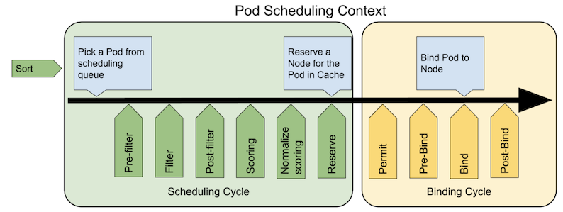

# Kubernetes 集群均衡器 Descheduler

> 通过 `Descheduler` 实现 `Kubernetes` 的二次调度

在介绍 Kubernetes 集群均衡器之前我们还是非常有必要再来回顾下 `kube-scheduler` 组件的概念。

我们知道基本上所有的分布式系统都需要一个流程或应用来调度集群中的任务来执行，同样 `Kubernetes` 也需要这样一个调度器来执行任务，我们熟知的 `kube-scheduler` 组件就是扮演这个角色的，该组件是作为 `Kubernetes` 整个控制面板的一部分来运行的，并监听所有未分配节点新创建的 `Pod`，为其选择一个最合适的节点绑定运行。`kube-scheduler` 是如何来选择最合适的节点的呢？

## 调度器

前面我们在 [调度器介绍](k8s_adv25_kube-scheduler.md) 和 [自定义调度器](https://www.qikqiak.com/post/custom-kube-scheduler/) 的文章中就介绍过，整个调度器执行调度的过程需要两个阶段：`过滤` 和 `打分`。

* **过滤**：找到所有可以满足 `Pod`要求的节点集合，该阶段属于强制性规则，满足邀请的节点集合会输入给第二阶段，如果过滤处理的节点集合为空，**则 `Pod` 将会处于 `Pending` 状态，期间调度器会不断尝试重试，直到有节点满足条件**。
* **打分**：该阶段对上一阶段输入的节点集合根据优先级进行排名，最后选择优先级最高的节点来绑定 Pod。**一旦 `kube-scheduler` 确定了最优的节点，它就会通过绑定通知 `APIServer`。**

根据 [K8S 调度框架文档描述](https://kubernetes.io/docs/concepts/configuration/scheduling-framework/)，在 K8S 调度框架中将调度过程和绑定过程合在一起，称之为调度上下文（`scheduling context`）。

**调度框架**是 `K8S` 调度程序的一种新的可插拔调度框架，可以用来简化自定义调度程序，需要注意的是调度过程是同步运行的（同一时间点只为一个 Pod 进行调度），绑定过程可异步运行（同一时间点可并发为多个 Pod 执行绑定）。

下图展示了调度框架中的调度上下文及其中的扩展点，一个扩展可以注册多个扩展点，以便可以执行更复杂的有状态的任务。



## 为什么需要集群均衡器

从 `kube-scheduler` 的角度来看，它通过各种算法计算出最佳节点去运行 `Pod` 是非常完美的，当出现新的 `Pod` 进行调度时，调度程序会根据其当时对 Kubernetes 集群的资源描述做出最佳调度决定。

但是 `Kubernetes` 集群是非常动态的，由于整个集群范围内的变化，比如一个节点为了维护，我们先执行了驱逐操作，这个节点上的所有 `Pod` 会被驱逐到其他节点去，

<span style="color:red">**但是当我们维护完成后，之前的 	`Pod` 并不会自动回到该节点上来，因为 `Pod` 一旦被绑定了节点是不会触发重新调度的，由于这些变化，`Kubernetes` 集群在一段时间内就出现了不均衡的状态，所以需要均衡器来重新平衡集群。**</span>

## 解决方案

要解决这个问题，当然我们可以去手动做一些集群的平衡，**比如手动去删掉某些 Pod，触发重新调度就可以了，但是显然这是一个繁琐的过程，也不是解决问题的方式**。

要解决这个问题我们

* 首先需要根据集群新的状态去确定有哪些 `Pod` 是需要被重新调度的，
* 然后再重新找出最佳节点去调度这些 Pod。

对于第二部分是不是 `kube-schedule`r 的打分阶段就已经解决了这个问题，所以我们只需要找出被错误调度的 `Pod` 然后将其移除就可以。原理是这样的吧？

**这里就需要引出本文的主人公：**

[`Descheduler` 项目了](https://github.com/kubernetes-sigs/descheduler)，该项目本身就是属于 `kubernetes sigs `的项目，所以完全不用担心项目的问题。

`Descheduler` 可以根据一些规则和配置策略来帮助我们重新平衡集群状态，当前项目实现了五种策略：`RemoveDuplicates`、`LowNodeUtilization`、`RemovePodsViolatingInterPodAntiAffinity`、`RemovePodsViolatingNodeAffinity` 和 `RemovePodsViolatingNodeTaints`，这些策略都是可以启用或者禁用的，作为策略的一部分，也可以配置与策略相关的一些参数，默认情况下，所有策略都是启用的。

### RemoveDuplicates

该策略确保只有一个和 `Pod` 关联的 `RS`、`RC`、`Deployment` 或者 `Job` 资源对象运行在同一节点上。

如果还有更多的 `Pod` 则将这些重复的 `Pod `进行驱逐，以便更好地在集群中分散 `Pod`。

如果某些节点由于某些原因崩溃了，这些节点上的 `Pod` 漂移到了其他节点，导致多个与 `RS` 或者 `RC` 关联的 `Pod` 在同一个节点上运行，就有可能发生这种情况，**<span style="color:red">一旦出现故障的节点再次准备就绪，就可以启用该策略来驱逐这些重复的 `Pod`**</span>，当前，没有与该策略关联的参数，要禁用该策略，也很简单，只需要配置成 `false` 即可：

```
apiVersion: "descheduler/v1alpha1"
kind: "DeschedulerPolicy"
strategies:
  "RemoveDuplicates":
     enabled: false
```

### LowNodeUtilization

该策略查找未充分利用的节点，并从其他节点驱逐 `Pod`，以便 `kube-scheudler` 重新将它们调度到未充分利用的节点上。该策略的参数可以通过字段 `nodeResourceUtilizationThresholds` 进行配置。

节点的利用率不足可以通过配置 `thresholds` 阈值参数来确定，可以通过 `CPU`、内存和 `Pod` 数量的百分比进行配置。**如果节点的使用率均低于所有阈值，则认为该节点未充分利用**。

**此外，还有一个可配置的阈值 `targetThresholds`，该阈值用于计算可从中驱逐 `Pod` 的那些潜在节点，对于所有节点 `thresholds` 和 `targetThresholds` 之间的阈值被认为是合理使用的，不考虑驱逐。**

`targetThresholds `阈值也可以针对 CPU、内存和 Pod 数量进行配置。`thresholds` 和 `targetThresholds` 可以根据你的集群需求进行动态调整，如下所示示例：

```
apiVersion: "descheduler/v1alpha1"
kind: "DeschedulerPolicy"
strategies:
  "LowNodeUtilization":
     enabled: true
     params:
       nodeResourceUtilizationThresholds:
         thresholds:
           "cpu" : 20
           "memory": 20
           "pods": 20
         targetThresholds:
           "cpu" : 50
           "memory": 50
           "pods": 50
```

和 `LowNodeUtilization` 策略关联的另一个参数是 **<span style="color:red">`numberOfNodes`，只有当未充分利用的节点数大于该配置值的时候，才可以配置该参数来激活该策略，该参数对于大型集群非常有用，其中有一些节点可能会频繁使用或短期使用不足，默认情况下，`numberOfNodes` 为`0`**</span>。


### RemovePodsViolatingNodeTaints

该策略可以确保从节点中删除违反 `NoSchedule `污点的 `Pod`。

**比如有一个名为 `podA` 的 `Pod`，通过配置容忍 `key=value:NoSchedule` 允许被调度到有该污点配置的节点上，如果节点的污点随后被更新或者删除了，则污点将不再被 `Pods` 的容忍满足，然后将被驱逐**，如下所示配置策略：

```
apiVersion: "descheduler/v1alpha1"
kind: "DeschedulerPolicy"
strategies:
  "RemovePodsViolatingNodeTaints":
    enabled: true
```

### RemovePodsViolatingNodeAffinity

该策略确保从节点中删除违反节点亲和性的 `Pod`。

**比如名为` podA `的 `Pod`被调度到了节点` nodeA`，`podA` 在调度的时候满足了节点亲和性规则 `requiredDuringSchedulingIgnoredDuringExecution`，但是随着时间的推移，节点 `nodeA` 不再满足该规则了，那么如果另一个满足节点亲和性规则的节点 `nodeB` 可用，则 `podA` 将被从节点 `nodeA` 驱逐**，

如下所示的策略配置示例：

```
apiVersion: "descheduler/v1alpha1"
kind: "DeschedulerPolicy"
strategies:
  "RemovePodsViolatingNodeAffinity":
    enabled: true
    params:
      nodeAffinityType:
      - "requiredDuringSchedulingIgnoredDuringExecution"
```

### RemovePodsViolatingInterPodAntiAffinity

该策略可以确保从节点中删除违反 `Pod` 反亲和性的 `Pod`。

比如某个节点上有 `podA` 这个 Pod，**并且 `podB` 和 `podC`（在同一个节点上运行）具有禁止它们在同一个节点上运行的反亲和性规则**，则 `podA` 将被从该节点上驱逐，以便 `podB` 和 `podC` 运行正常运行。

当 `podB` 和 `podC` 已经运行在节点上后，**反亲和性规则被创建就会发送这样的问题，目前没有和该策略相关联的配置参数，要禁用该策略**，同样配置成 `false `即可：

```
apiVersion: "descheduler/v1alpha1"
kind: "DeschedulerPolicy"
strategies:
  "RemovePodsViolatingInterPodAntiAffinity":
     enabled: false
```

### RemovePodsHavingTooManyRestarts

该策略可以确保从节点中删除重启次数过多对的 Pod 

例如： 一个有`AWS EBS/GCE PD`挂载的pod如果所在的节点一直无法挂载上`volume/disk`，需要重新调度到其他节点上

```
apiVersion: "descheduler/v1alpha1"
kind: "DeschedulerPolicy"
strategies:
  "RemovePodsHavingTooManyRestarts":
     enabled: true
     params:
       podsHavingTooManyRestarts:
         podRestartThreshold: 100
         includingInitContainers: true
```

### PodLifeTime

这个策略将会驱逐生命时常大于`.strategies.PodLifeTime.params.maxPodLifeTimeSeconds`的pod

```
apiVersion: "descheduler/v1alpha1"
kind: "DeschedulerPolicy"
strategies:
  "PodLifeTime":
     enabled: true
     params:
        maxPodLifeTimeSeconds: 86400
```


## 测试

通过 [Descheduler](https://github.com/kubernetes-sigs/descheduler) 项目 `Github` 仓库中的 `README` 文档介绍，**我们可以在 `Kubernetes` 集群内部通过 `Job` 或者 `CronJob` 的形式来运行 `Deschduler`，这样可以多次运行而无需用户手动干预，此外` Descheduler `的 `Pod` 在 `kube-system `命名空间下面以 `critical pod` 的形式运行，可以避免被自身或者 `kubelet` 驱逐了**。

首先定义如下所示的 RBAC 资源对象：（rbac.yaml）

```
kind: ClusterRole
apiVersion: rbac.authorization.k8s.io/v1
metadata:
  name: descheduler-cluster-role
  namespace: kube-system
rules:
- apiGroups: [""]
  resources: ["events"]
  verbs: ["create", "update"]
- apiGroups: [""]
  resources: ["nodes"]
  verbs: ["get", "watch", "list"]
- apiGroups: [""]
  resources: ["pods"]
  verbs: ["get", "watch", "list", "delete"]
- apiGroups: [""]
  resources: ["pods/eviction"]
  verbs: ["create"]
---
apiVersion: v1
kind: ServiceAccount
metadata:
  name: descheduler-sa
  namespace: kube-system
---
apiVersion: rbac.authorization.k8s.io/v1
kind: ClusterRoleBinding
metadata:
  name: descheduler-cluster-role-binding
  namespace: kube-system
roleRef:
  apiGroup: rbac.authorization.k8s.io
  kind: ClusterRole
  name: descheduler-cluster-role
subjects:
  - name: descheduler-sa
    kind: ServiceAccount
    namespace: kube-system
```

然后我们可以通过 `ConfigMap` 资源对象来定义 `Descheduler` 的均衡策略：(`configmap.yaml`)

```
apiVersion: v1
kind: ConfigMap
metadata:
  name: descheduler-policy-configmap
  namespace: kube-system
data:
  policy.yaml: |
    apiVersion: "descheduler/v1alpha1"
    kind: "DeschedulerPolicy"
    strategies:
      "RemoveDuplicates":
         enabled: true
      "RemovePodsViolatingInterPodAntiAffinity":
         enabled: true
      "LowNodeUtilization":
         enabled: true
         params:
           nodeResourceUtilizationThresholds:
             thresholds:
               "cpu" : 20
               "memory": 20
               "pods": 20
             targetThresholds:
               "cpu" : 50
               "memory": 50
               "pods": 50
```

最后可以通过 `Job` 或者 `CronJob` 资源对象来运行 `Descheduler`，这里我们以 `Job` 为例进行说明：(`job.yaml`)

```
---
apiVersion: batch/v1
kind: Job
metadata:
  name: descheduler-job
  namespace: kube-system
spec:
  parallelism: 1
  completions: 1
  template:
    metadata:
      name: descheduler-pod
    spec:
      priorityClassName: system-cluster-critical
      containers:
        - name: descheduler
          image: us.gcr.io/k8s-artifacts-prod/descheduler/descheduler:v0.18.0
          volumeMounts:
          - mountPath: /policy-dir
            name: policy-volume
          command:
            - "/bin/descheduler"
          args:
            - "--policy-config-file"
            - "/policy-dir/policy.yaml"
            - "--v"
            - "3"
      restartPolicy: "Never"
      serviceAccountName: descheduler-sa
      volumes:
      - name: policy-volume
        configMap:
          name: descheduler-policy-configmap
```

确保集群中有 `system-cluster-critical` 这个 `priorityclass`，否则去掉该字段：

```
$ kubectl get priorityclass
NAME                      VALUE        GLOBAL-DEFAULT   AGE
system-cluster-critical   2000000000   false            7d12h
system-node-critical      2000001000   false            7d12h
```

直接创建上面的3个资源对象即可：

```
$ kubectl create -f rbac.yaml
$ kubectl create -f configmap.yaml
$ kubectl create -f job.yaml
```

运行成功后可以查看 Descheduler 的 Job 任务的日志：

[https://github.com/kubernetes-sigs/descheduler/releases](https://github.com/kubernetes-sigs/descheduler/releases)

```
$ kubectl get pods -n kube-system -l job-name=descheduler-job
NAME                    READY   STATUS      RESTARTS   AGE
descheduler-job-94nmz   0/1     Completed   0          10s

$ kubectl logs -f descheduler-job-94nmz -n kube-system
I0316 04:07:37.226628       1 reflector.go:153] Starting reflector *v1.Node (1h0m0s) from pkg/mod/k8s.io/client-go@v0.17.0/tools/cache/reflector.go:108
I0316 04:07:37.226916       1 reflector.go:188] Listing and watching *v1.Node from pkg/mod/k8s.io/client-go@v0.17.0/tools/cache/reflector.go:108
I0316 04:07:37.326830       1 duplicates.go:50] Processing node: "jxi-master"
I0316 04:07:37.521882       1 duplicates.go:50] Processing node: "jxi-node1"
I0316 04:07:37.559308       1 duplicates.go:50] Processing node: "jxi-node2"
I0316 04:07:37.608759       1 duplicates.go:50] Processing node: "jxi-node3"
I0316 04:07:37.643679       1 duplicates.go:50] Processing node: "jxi-node4"
I0316 04:07:37.841509       1 duplicates.go:50] Processing node: "jxi-node5"
I0316 04:07:37.888281       1 duplicates.go:50] Processing node: "jxi-node6"
I0316 04:07:38.392268       1 lownodeutilization.go:147] Node "jxi-master" is appropriately utilized with usage: api.ResourceThresholds{"cpu":42.5, "memory":7.589289022953152, "pods":7.2727272727272725}
I0316 04:07:38.392390       1 lownodeutilization.go:149] allPods:8, nonRemovablePods:8, bePods:0, bPods:0, gPods:0
I0316 04:07:38.392541       1 lownodeutilization.go:141] Node "jxi-node1" is under utilized with usage: api.ResourceThresholds{"cpu":20, "memory":7.770754643481218, "pods":17.272727272727273}
I0316 04:07:38.392579       1 lownodeutilization.go:149] allPods:19, nonRemovablePods:16, bePods:0, bPods:2, gPods:1
I0316 04:07:38.392684       1 lownodeutilization.go:141] Node "jxi-node2" is under utilized with usage: api.ResourceThresholds{"cpu":13.75, "memory":6.294311261219786, "pods":14.545454545454545}
I0316 04:07:38.392740       1 lownodeutilization.go:149] allPods:16, nonRemovablePods:12, bePods:1, bPods:2, gPods:1
I0316 04:07:38.392822       1 lownodeutilization.go:141] Node "jxi-node3" is under utilized with usage: api.ResourceThresholds{"cpu":17.5, "memory":10.905163145899156, "pods":14.545454545454545}
I0316 04:07:38.392877       1 lownodeutilization.go:149] allPods:16, nonRemovablePods:13, bePods:1, bPods:1, gPods:1
I0316 04:07:38.392959       1 lownodeutilization.go:141] Node "jxi-node4" is under utilized with usage: api.ResourceThresholds{"cpu":15, "memory":5.180600069310763, "pods":13.636363636363637}
I0316 04:07:38.393033       1 lownodeutilization.go:149] allPods:15, nonRemovablePods:14, bePods:0, bPods:0, gPods:1
I0316 04:07:38.393166       1 lownodeutilization.go:141] Node "jxi-node5" is under utilized with usage: api.ResourceThresholds{"cpu":7.5, "memory":3.484434378300685, "pods":20}
I0316 04:07:38.393221       1 lownodeutilization.go:149] allPods:22, nonRemovablePods:12, bePods:10, bPods:0, gPods:0
I0316 04:07:38.393326       1 lownodeutilization.go:147] Node "jxi-node6" is appropriately utilized with usage: api.ResourceThresholds{"cpu":10.9375, "memory":8.780774633317726, "pods":21.818181818181817}
I0316 04:07:38.393381       1 lownodeutilization.go:149] allPods:24, nonRemovablePods:14, bePods:7, bPods:2, gPods:1
I0316 04:07:38.393412       1 lownodeutilization.go:65] Criteria for a node under utilization: CPU: 20, Mem: 20, Pods: 20
I0316 04:07:38.393437       1 lownodeutilization.go:72] Total number of underutilized nodes: 5
I0316 04:07:38.393455       1 lownodeutilization.go:85] all nodes are under target utilization, nothing to do here
I0316 04:07:38.393497       1 pod_antiaffinity.go:44] Processing node: "jxi-master"
I0316 04:07:38.454204       1 pod_antiaffinity.go:44] Processing node: "jxi-node1"
I0316 04:07:38.659807       1 pod_antiaffinity.go:44] Processing node: "jxi-node2"
I0316 04:07:38.865860       1 pod_antiaffinity.go:44] Processing node: "jxi-node3"
I0316 04:07:39.093155       1 pod_antiaffinity.go:44] Processing node: "jxi-node4"
I0316 04:07:39.570699       1 pod_antiaffinity.go:44] Processing node: "jxi-node5"
I0316 04:07:39.974866       1 pod_antiaffinity.go:44] Processing node: "jxi-node6"```
```

从上面日志中可以看出我整个集群目前都还是比较均衡的状态，所以没有 `Pod` 被驱逐进行重新调度。

**<span style="color:red">如果遇到节点资源使用率极度不均衡的时候可以尝试使用 Descheduler 来对集群进行重新平衡。</span>**