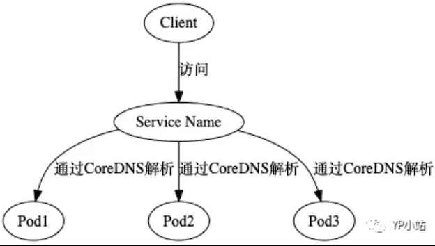
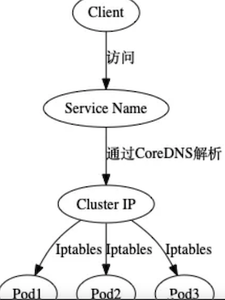

# K8S 之 Headless 浅谈

## Headless Services 简介

有时不需要或不想要**负载均衡**，**以及单独的 `Service IP`**。遇到这种情况，

**可以通过指定 `Cluster IP（spec.clusterIP）`的值为 `"None"` 来创建 `Headless Service`。**

**对 `headless Service` 并不会分配 `Cluster IP`，`kube-proxy` 不会处理它们，而且平台也不会为它们进行负载均衡和路由。**

`DNS` 如何实现自动配置，依赖于 `Service` 是否定义了 `selector`。

### Lable Secector：

* 配置 `Selector`：对定义了 `selector` 的 `Headless Service`，**`Endpoint` 控制器在 `API` 中创建了 `Endpoints` 记录，并且修改 `DNS` 配置返回 `A` 记录（地址**），通过这个地址直接到达` Service` 的后端` Pod`上。见下图：



* 不配置` Selector`：对没有定义 `selector `的 `Headless Service`，`Endpoint` 控制器不会创建 `Endpoints` 记录。

## Service（iptables 代理模式）简介

这种模式，`kube-proxy` 会监视 `Kubernetes` 控制节点对 `Service` 对象和 `Endpoints` 对象的添加和移除。对每个 `Service`，它会安装 `iptables` 规则，从而捕获到达该 `Service` 的 `clusterIP` 和端口的请求，进而将请求重定向到 `Service` 任意一组 `backend pod` 中。

对于每个 `Endpoints` 对象，它也会安装 `iptables`规则，这个规则会选择一个 `backend pod` 组合。

默认的策略是，`kube-proxy` 在 `iptables` 模式下随机选择一个 `backend pod`

下面是一个简图：



## Headless Services 创建

```
$ vim headless_service.yaml
$ kubectl apply -f headless_service.yaml
```

`headless_service.yaml` 配置如下

```

apiVersion: v1
kind: Service
metadata:
  name: nginx-test
  labels:
    app: nginx_test
spec:
  ports:
  - port: 80
    name: nginx-web
  # clusterIP 设置为 None
  clusterIP: None
  selector:
    app: nginx_test

---

apiVersion: apps/v1beta1
kind: StatefulSet
metadata:
  name: nginx-web
spec:
  serviceName: "nginx-test"
  replicas: 2
  template:
    metadata:
      labels:
        app: nginx_test
    spec:
      containers:
      - name: nginx-test
        image: nginx:1.11
        ports:
        - containerPort: 80
          name: nginx-web
```

### Headless Services 验证

```

# 查看 statefulsets nginx-web
$ kubectl get statefulsets nginx-web

NAME        READY   AGE
nginx-web   2/2     93m

# 查看 pods 
$ kubectl get pods -o wide | grep nginx-web

nginx-web-0                         1/1     Running   0          96m    192.168.40.103   it-zabbix   <none>           <none>
nginx-web-1                         1/1     Running   0          96m    192.168.40.96    it-zabbix   <none>           <none>


# 显示 nginx-test Headless Services 详细信息
$ kubectl describe svc nginx-test

Name:              nginx-test
Namespace:         default
Labels:            app=nginx_test
Annotations:       kubectl.kubernetes.io/last-applied-configuration:
                     {"apiVersion":"v1","kind":"Service","metadata":{"annotations":{},"labels":{"app":"nginx_test"},"name":"nginx-test","namespace":"default"},...
Selector:          app=nginx_test
Type:              ClusterIP
IP:                None
Port:              nginx-web  80/TCP
TargetPort:        80/TCP
Endpoints:         192.168.40.103:80,192.168.40.96:80
Session Affinity:  None
Events:            <none>

# 测试 service 域名是否解析出两个 pod ip
$ nslookup nginx-test.default.svc.cluster.local 192.168.16.2

Server:		192.168.16.2
Address:	192.168.16.2#53

Name:	nginx-test.default.svc.cluster.local
Address: 192.168.40.103
Name:	nginx-test.default.svc.cluster.local
Address: 192.168.40.96

# 测试 pod 域名是否解析出对应的 pod ip
$ nslookup nginx-web-0.nginx-test.default.svc.cluster.local 192.168.16.2

Server:		192.168.16.2
Address:	192.168.16.2#53

Name:	nginx-web-0.nginx-test.default.svc.cluster.local
Address: 192.168.40.103

$ nslookup nginx-web-1.nginx-test.default.svc.cluster.local 192.168.16.2

Server:		192.168.16.2
Address:	192.168.16.2#53

Name:	nginx-web-1.nginx-test.default.svc.cluster.local
Address: 192.168.40.96
```

## Headless Services 应用场景

* 第一种：**自主选择权**，**有时候 `client` 想自己来决定使用哪个`Real Server`**，可以通过查询`DNS`来获取 `Real Server ` 的信息。
* 第二种：**`Headless Service` 的对应的每一个 `Endpoints`**，即每一个`Pod`，都会有对应的`DNS`域名，这样`Pod`之间就可以互相访问。