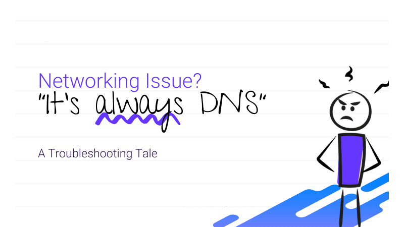
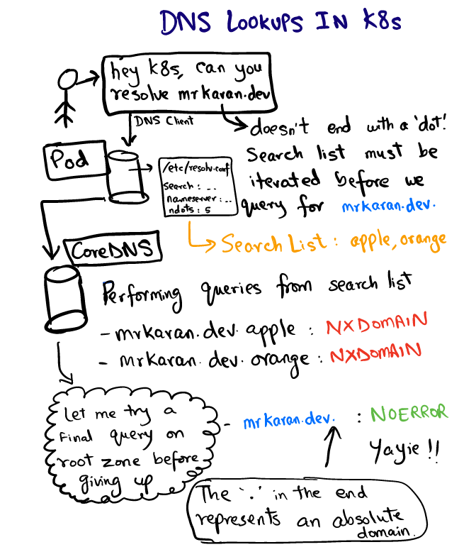

# Kubernetes 中的 DNS 查询


在 Kubernetes 中部署应用的主要优势之一就是可以做到无缝的应用发现。Service 的概念使群集内通信变得容易，Service 代表了支持一组 Pod IP 的虚拟 IP。在 Kubernetes 内部可以直接通过 Service 来访问服务，现在的问题是谁解决了服务的 DNS 查询问题？



**DNS 解析是通过 Kubernetes 集群中配置的 `CoreDNS` 完成的，kubelet 将每个 `Pod` 的 `/etc/resolv.conf` 配置为使用 `coredns pod` 作为 `nameserver`。**

我们可以在任何 `Pod` 中看到 `/etc/resolv.conf` 的内容，如下所示：

```
search hello.svc.cluster.local svc.cluster.local cluster.local
nameserver 10.152.183.10
options ndots:5
```

DNS 客户端使用此配置将 DNS 查询转发到 DNS 服务器， `resolv.conf` 是解析程序的配置文件，其中包含以下信息：

* `nameserver`：`DNS` 查询转发到的服务地址，实际上就是 `CoreDNS` 服务的地址。
* `search`：表示特定域的搜索路径，有趣的是 `google.com` 或 `mrkaran.dev` 不是 `FQDN` 形式的域名。大多数 `DNS` 解析器遵循的标准约定是，如果域名以 `. `结尾（代表根区域），该域就会被认为是` FQDN`。有一些 `DNS` 解析器会尝试用一些自动的方式将` . `附加上。所以， **`mrkaran.dev.` 是 `FQDN`，但` mrkaran.dev` 不是**。
* `ndots`：这是最有趣的一个参数，也是这篇文章的重点，**`ndots `代表查询名称中的点数阈值**，**Kubernetes 中默认为5**，如果查询的域名包含的点 “.” 不到5个，那么进行 DNS 查找，将使用非完全限定名称，如果你查询的域名包含点数大于等于5，那么 DNS 查询默认会使用绝对域名进行查询。

> ndots 点数少于 5个，先走 search 域，最后将其视为绝对域名进行查询；点数大于等于5个，直接视为绝对域名进行查找，只有当查询不到的时候，才继续走 search 域。




`FQDN` 维基解释：完全限定域名（英语：`Fully qualified domain name`），缩写为 `FQDN`，又译为完全资格域名、完整领域名称，又称为绝对领域名称（`absolute domain name`）、 绝对域名，域名的一种，能指定其在域名系统 (`DNS`) 树状图下的一个确实位置。一个完全资格域名会包含所有域名级别，包括 **顶级域名** 和 **根域名**。

完整域名由主机名称与母域名两部分所组成，**例如有一部服务器的本地主机名为 `myhost`，而其母域名为 `example.com`**，那指向该服务器的完整域名就是 `myhost.example.com`。虽然世界上可能有很多服务器的本地主机名是 `myhost`，但 `myhost.example.com` 是唯一的，因此完整域名能识别该特定服务器。

我们来检查一下在 Pod 中查询 `mrkaran.dev` 时会发生什么：

```
$ nslookup mrkaran.dev
Server: 10.152.183.10
Address: 10.152.183.10#53

Non-authoritative answer:
Name: mrkaran.dev
Address: 157.230.35.153
Name: mrkaran.dev
Address: 2400:6180:0:d1::519:6001
```

在当前实验中，我们将 `CoreDNS `日志记录级别设置为 `all`，这样我们看到具体的解析过程，让我们看一下 `coredns pod` 的日志：

```
[INFO] 10.1.28.1:35998 - 11131 "A IN mrkaran.dev.hello.svc.cluster.local. udp 53 false 512" NXDOMAIN qr,aa,rd 146 0.000263728s
[INFO] 10.1.28.1:34040 - 36853 "A IN mrkaran.dev.svc.cluster.local. udp 47 false 512" NXDOMAIN qr,aa,rd 140 0.000214201s
[INFO] 10.1.28.1:33468 - 29482 "A IN mrkaran.dev.cluster.local. udp 43 false 512" NXDOMAIN qr,aa,rd 136 0.000156107s
[INFO] 10.1.28.1:58471 - 45814 "A IN mrkaran.dev. udp 29 false 512" NOERROR qr,rd,ra 56 0.110263459s
[INFO] 10.1.28.1:54800 - 2463 "AAAA IN mrkaran.dev. udp 29 false 512" NOERROR qr,rd,ra 68 0.145091744s
```

上面日志中有两条信息值得我们注意：

* 该查询将遍历所有搜索路径，直到响应中包含 `NOERROR` 信息， `NXDOMAIN` 表示未找到该域名的记录。由于 `mrkaran.dev` 不是 `FQDN`，根据 `ndots=5` 设置，因此解析程序会先查看 `search `路径。
* `A`和 `AAAA`记录会并行触发，这是因为 `/etc/resolv.conf` 中的 `single-request` 选项具有默认配置来并行执行 `IPv4` 和 `IPv6` 查找，我们也可以使用 `single-request` 选项来禁用该功能。

> 注意：可以将 glibc 配置为按顺序发送这些请求，但是 musl 无法发送，所以 Alpine 用户必须要注意这点。


接下来让我们测试一下改变 `ndots` 之后的变化。通过 `ndots` 设置，`DNS` 客户端可以知道一个域名是否是绝对的。例如，如果您仅查询 `google`，`DNS` 客户端会知道这不是一个绝对域，如果您**将 `ndots` 设置为`1`，`DNS` 客户端会说：”哦，google 连一个点都没有，我们来尝试遍历搜索列表查找下“**。但是，如果您查询 `google.com`，则搜索列表将会被完全忽略，因为查询的名称满足 `ndots` 阈值（至少一个点），查询不到的时候才会去搜索列表进行查询

```
$ cat /etc/resolv.conf
options ndots:1
$ nslookup mrkaran
Server: 10.152.183.10
Address: 10.152.183.10#53

** server can't find mrkaran: NXDOMAIN
```

CoreDNS 日志如下所示：

```
[INFO] 10.1.28.1:52495 - 2606 "A IN mrkaran.hello.svc.cluster.local. udp 49 false 512" NXDOMAIN qr,aa,rd 142 0.000524939s
[INFO] 10.1.28.1:59287 - 57522 "A IN mrkaran.svc.cluster.local. udp 43 false 512" NXDOMAIN qr,aa,rd 136 0.000368277s
[INFO] 10.1.28.1:53086 - 4863 "A IN mrkaran.cluster.local. udp 39 false 512" NXDOMAIN qr,aa,rd 132 0.000355344s
[INFO] 10.1.28.1:56863 - 41678 "A IN mrkaran. udp 25 false 512" NXDOMAIN qr,rd,ra 100 0.034629206s
```

由于 mrkaran 没有指定任何内容。因此使用搜索列表来找到答案。

> 注意：ndots 的值默认为 15，在 Kubernetes 中默认为5。


**如果您的应用程序具有大量的外部网络调用，那么在流量繁忙的情况下，DNS 可能会成为瓶颈，因为在触发真正的 DNS 查询之前还会进行很多额外的查询。**

应用程序在域名中附加根域的情况很少见，但可以将这种方式看成一种 `hack `方式，**我们可以将应用程序硬编码为以` . `结尾的域名**，比如** `api.twitter.com.`，而不是使用 `api.twitter.com`，这将会强制 DNS 客户端直接在绝对域上进行查询**。

另外自 Kubernetes 1.14 起， `dnsConfig` 和 `dnsPolicy` 特性已经很稳定了。因此，在部署 Pod 时，**我们可以将 `ndots` 设置为较小的值（例如`3`），甚至可以将其设置为`1`，但是这样的话每个节点内通信现在都必须包含完整的域名**，我们需要在性能和可移植性之间进行一些平衡。如果应用程序不考虑极低的延迟，您根本也不必担心这一点，因为 DNS 结果也会在内部缓存的。


