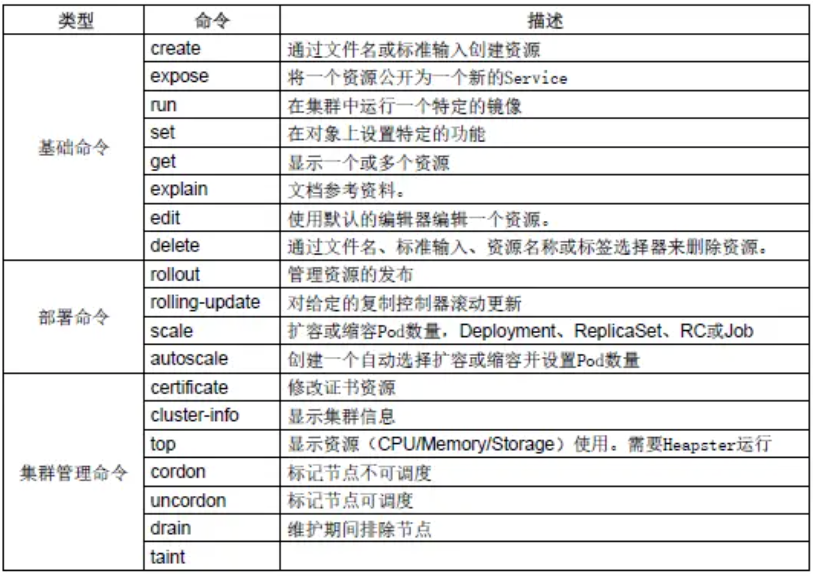
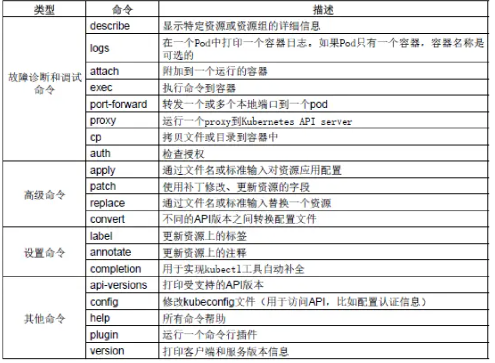

# Kubectl 常用命令大全


### Kubectl 常用参数分类






## 基础命令：create，delete，get，run，expose，set，explain，edit

### `create`命令：根据文件或者输入来创建资源

```
# 创建Deployment和Service资源
kubectl create -f javak8s-deployment.yaml
kubectl create -f javak8s-service.yaml
```

### delete命令：删除资源

```
# 根据yaml文件删除对应的资源，但是yaml文件并不会被删除，这样更加高效
kubectl delete -f javak8s-deployment.yaml 
kubectl delete -f javak8s-service.yaml
# 也可以通过具体的资源名称来进行删除，使用这个删除资源，需要同时删除pod和service资源才行
kubectl delete 具体的资源名称
```

### get命令：获得资源信息

```
# 查看所有的资源信息
kubectl get all
# 查看pod列表
kubectl get pod
# 显示pod节点的标签信息
kubectl get pod --show-labels
# 根据指定标签匹配到具体的pod
kubectl get pods -l app=example
# 查看node节点列表
kubectl get node 
# 显示node节点的标签信息
kubectl get node --show-labels
# 查看pod详细信息，也就是可以查看pod具体运行在哪个节点上（ip地址信息）
kubectl get pod -o wide
# 查看服务的详细信息，显示了服务名称，类型，集群ip，端口，时间等信息
kubectl get svc
[root@master ~]# kubectl get svc
NAME            TYPE        CLUSTER-IP     EXTERNAL-IP   PORT(S)          AGE
go-service      NodePort    10.10.10.247   <none>        8089:33702/TCP   29m
java-service    NodePort    10.10.10.248   <none>        8082:32823/TCP   5h17m
kubernetes      ClusterIP   10.10.10.1     <none>        443/TCP          5d16h
nginx-service   NodePort    10.10.10.146   <none>        88:34823/TCP     2d19h
# 查看命名空间
kubectl get ns
# 查看所有pod所属的命名空间
kubectl get pod --all-namespaces
# 查看所有pod所属的命名空间并且查看都在哪些节点上运行
kubectl get pod --all-namespaces  -o wide
# 查看目前所有的replica set，显示了所有的pod的副本数，以及他们的可用数量以及状态等信息
kubectl get rs
[root@master ~]# kubectl get rs
NAME                          DESIRED   CURRENT   READY   AGE
go-deployment-58c76f7d5c      1         1         1       32m
java-deployment-76889f56c5    1         1         1       5h21m
nginx-deployment-58d6d6ccb8   3         3         3       2d19h
# 查看目前所有的deployment
kubectl get deployment
[root@master ~]# kubectl get deployment
NAME               READY   UP-TO-DATE   AVAILABLE   AGE
go-deployment      1/1     1            1           34m
java-deployment    1/1     1            1           5h23m
nginx-deployment   3/3     3            3           2d19h
# 查看已经部署了的所有应用，可以看到容器，以及容器所用的镜像，标签等信息
 kubectl get deploy -o wide
[root@master bin]# kubectl get deploy -o wide     
NAME    READY   UP-TO-DATE   AVAILABLE   AGE   CONTAINERS   IMAGES       SELECTOR
nginx   3/3     3            3           16m   nginx        nginx:1.10   app=example
```

### `run`命令：在集群中创建并运行一个或多个容器镜像。

```
# 基本语法
run NAME --image=image [--env="key=value"] [--port=port] [--replicas=replicas] [--dry-run=bool] [--overrides=inline-json] [--command] -- [COMMAND] [args...]
# 示例，运行一个名称为nginx，副本数为3，标签为app=example，镜像为nginx:1.10，端口为80的容器实例
kubectl run nginx --replicas=3 --labels="app=example" --image=nginx:1.10 --port=80
其他用法参见：http://docs.kubernetes.org.cn/468.html
```

### `expose`命令：创建一个service服务，并且暴露端口让外部可以访问

```
# 创建一个nginx服务并且暴露端口让外界可以访问
kubectl expose deployment nginx --port=88 --type=NodePort --target-port=80 --name=nginx-service
关于expose的详细用法参见：http://docs.kubernetes.org.cn/475.html
```

### `set`命令： 配置应用的一些特定资源，也可以修改应用已有的资源

```
# 使用kubectl set --help查看，它的子命令，env，image，resources，selector，serviceaccount，subject。
set命令详情参见：http://docs.kubernetes.org.cn/669.html
语法：
resources (-f FILENAME | TYPE NAME) ([--limits=LIMITS & --requests=REQUESTS]
```

### kubectl set resources 命令

这个命令用于设置资源的一些范围限制。

资源对象中的Pod可以指定计算资源需求（CPU-单位m、内存-单位Mi），即使用的最小资源请求（Requests），限制（Limits）的最大资源需求，Pod将保证使用在设置的资源数量范围。

对于每个Pod资源，如果指定了`Limits`（限制）值，并省略了`Requests（请求`），则`Requests`默认为`Limits`的值。

**可用资源对象包括(支持大小写)：replicationcontroller、deployment、daemonset、job、replicaset。**

例如：

```
# 将deployment的nginx容器cpu限制为“200m”，将内存设置为“512Mi”
kubectl set resources deployment nginx -c=nginx --limits=cpu=200m,memory=512Mi
# 为nginx中的所有容器设置 Requests和Limits
kubectl set resources deployment nginx --limits=cpu=200m,memory=512Mi --requests=cpu=100m,memory=256Mi
# 删除nginx中容器的计算资源值
kubectl set resources deployment nginx --limits=cpu=0,memory=0 --requests=cpu=0,memory=0
```

### kubectl set selector命令

设置资源的`selector`（选择器）。如果在调用`"set selector"`命令之前已经存在选择器，则新创建的选择器将覆盖原来的选择器。

`selector`必须以字母或数字开头，最多包含`63`个字符，可使用：字母、数字、连字符" - " 、点"."和下划线" _ "。如果指定了`--resource-version`，则更新将使用此资源版本，否则将使用现有的资源版本。

**注意：目前selector命令只能用于Service对象。**

```
# 语法
selector (-f FILENAME | TYPE NAME) EXPRESSIONS [--resource-version=version]
```

### kubectl set image命令

​ 用于更新现有资源的容器镜像。

可用资源对象包括：pod (po)、replicationcontroller (rc)、deployment (deploy)、daemonset (ds)、job、replicaset (rs)。

```
# 语法
image (-f FILENAME | TYPE NAME) CONTAINER_NAME_1=CONTAINER_IMAGE_1 ... CONTAINER_NAME_N=CONTAINER_IMAGE_N
```

```
# 将deployment中的nginx容器镜像设置为“nginx：1.9.1”。
kubectl set image deployment/nginx busybox=busybox nginx=nginx:1.9.1
# 所有deployment和rc的nginx容器镜像更新为“nginx：1.9.1”
kubectl set image deployments,rc nginx=nginx:1.9.1 --all
# 将daemonset abc的所有容器镜像更新为“nginx：1.9.1”
kubectl set image daemonset abc *=nginx:1.9.1
# 从本地文件中更新nginx容器镜像
kubectl set image -f path/to/file.yaml nginx=nginx:1.9.1 --local -o yaml
```

### explain命令：用于显示资源文档信息

```
kubectl explain rs
```

### edit命令:用于编辑资源信息

```
# 编辑Deployment nginx的一些信息
kubectl edit deployment nginx
# 编辑service类型的nginx的一些信息
kubectl edit service/nginx
```

## 设置命令：label，annotate，completion

**label命令**:用于更新（增加、修改或删除）资源上的 label（标签）

* label 必须以字母或数字开头，可以使用字母、数字、连字符、点和下划线，最长63个字符。
* 如果`--overwrite` 为 `true`，则可以覆盖已有的` label`，否则尝试覆盖 `label `将会报错。
* 如果指定了`--resource-version`，则更新将使用此资源版本，否则将使用现有的资源版本。

```
# 语法
label [--overwrite] (-f FILENAME | TYPE NAME) KEY_1=VAL_1 ... KEY_N=VAL_N [--resource-version=version]
```

```
# 给名为foo的Pod添加label unhealthy=true
kubectl label pods foo unhealthy=true

# 给名为foo的Pod修改label 为 'status' / value 'unhealthy'，且覆盖现有的value
kubectl label --overwrite pods foo status=unhealthy

# 给 namespace 中的所有 pod 添加 label
kubectl label  pods --all status=unhealthy

# 仅当`resource-version=1`时才更新 名为foo的Pod上的label
kubectl label pods foo status=unhealthy --resource-version=1

# 删除名为“bar”的label 。（使用“ - ”减号相连）
kubectl label pods foo bar-
```

**annotate命令**：更新一个或多个资源的Annotations信息。也就是注解信息，可以方便的查看做了哪些操作。

* `Annotations`由`key/value`组成。
* `Annotations`的目的是存储辅助数据，特别是通过工具和系统扩展操作的数据，更多介绍在这里。
* 如果`--overwrite`为`true`，现有的`annotations`可以被覆盖，否则试图覆盖`annotations`将会报错。
* 如果设置了`--resource-version`，则更新将使用此`resource version`，否则将使用原有的`resource version`。

```
# 语法
annotate [--overwrite] (-f FILENAME | TYPE NAME) KEY_1=VAL_1 ... KEY_N=VAL_N [--resource-version=version]
```

```
# 更新Pod“foo”，设置annotation “description”的value “my frontend”，如果同一个annotation多次设置，则只使用最后设置的value值
kubectl annotate pods foo description='my frontend'

# 根据“pod.json”中的type和name更新pod的annotation
kubectl annotate -f pod.json description='my frontend'

# 更新Pod"foo"，设置annotation“description”的value“my frontend running nginx”，覆盖现有的值
kubectl annotate --overwrite pods foo description='my frontend running nginx'

# 更新 namespace中的所有pod
kubectl annotate pods --all description='my frontend running nginx'

# 只有当resource-version为1时，才更新pod ' foo '
kubectl annotate pods foo description='my frontend running nginx' --resource-version=1

# 通过删除名为“description”的annotations来更新pod ' foo '。#不需要- overwrite flag。
kubectl annotate pods foo description-
```

### completion命令：用于设置kubectl命令自动补全

```
$ source <(kubectl completion bash) # setup autocomplete in bash, bash-completion package should be installed first.
$ source <(kubectl completion zsh)  # setup autocomplete in zsh
```

## kubectl 部署命令：rollout，rolling-update，scale，autoscale

### rollout命令:用于对资源进行管理

可用资源包括：deployments，daemonsets。

子命令：

* `history`（查看历史版本）
* `pause`（暂停资源）
* `resume`（恢复暂停资源）
* `status`（查看资源状态）
* `undo`（回滚版本）

```
# 语法
kubectl rollout SUBCOMMAND

# 回滚到之前的deployment
kubectl rollout undo deployment/abc

# 查看daemonet的状态
kubectl rollout status daemonset/foo
```
### `rolling-update`命令:执行指定`ReplicationController`的滚动更新。

该命令创建了一个新的`RC`， 然后一次更新一个`pod`方式逐步使用新的`PodTemplate`，最终实现`Pod`滚动更新，`new-controller.json`需要与之前`RC`在相同的`namespace`下。

```
# 语法
rolling-update OLD_CONTROLLER_NAME ([NEW_CONTROLLER_NAME] --image=NEW_CONTAINER_IMAGE | -f NEW_CONTROLLER_SPEC)
# 使用frontend-v2.json中的新RC数据更新frontend-v1的pod
kubectl rolling-update frontend-v1 -f frontend-v2.json

# 使用JSON数据更新frontend-v1的pod
cat frontend-v2.json | kubectl rolling-update frontend-v1 -f -

# 其他的一些滚动更新
kubectl rolling-update frontend-v1 frontend-v2 --image=image:v2

kubectl rolling-update frontend --image=image:v2

kubectl rolling-update frontend-v1 frontend-v2 --rollback
```

### scale命令：扩容或缩容 Deployment、ReplicaSet、Replication Controller或 Job 中Pod数量

scale也可以指定多个前提条件，如：当前副本数量或 `--resource-version` ，进行伸缩比例设置前，系统会先验证前提条件是否成立。这个就是弹性伸缩策略

```
# 语法
kubectl scale [--resource-version=version] [--current-replicas=count] --replicas=COUNT (-f FILENAME | TYPE NAME)

# 将名为foo中的pod副本数设置为3。
kubectl scale --replicas=3 rs/foo
kubectl scale deploy/nginx --replicas=30

# 将由“foo.yaml”配置文件中指定的资源对象和名称标识的Pod资源副本设为3
kubectl scale --replicas=3 -f foo.yaml

# 如果当前副本数为2，则将其扩展至3。
kubectl scale --current-replicas=2 --replicas=3 deployment/mysql

# 设置多个RC中Pod副本数量
kubectl scale --replicas=5 rc/foo rc/bar rc/baz
```

### `autoscale`命令： 这个比`scale`更加强大，也是弹性伸缩策略 ，它是根据流量的多少来自动进行扩展或者缩容

指定`Deployment`、`ReplicaSet`或`ReplicationController`，并创建已经定义好资源的自动伸缩器。使用自动伸缩器可以根据需要自动增加或减少系统中部署的pod数量。

```
# 语法
kubectl autoscale (-f FILENAME | TYPE NAME | TYPE/NAME) [--min=MINPODS] --max=MAXPODS [--cpu-percent=CPU] [flags]

# 使用 Deployment “foo”设定，使用默认的自动伸缩策略，指定目标CPU使用率，使其Pod数量在2到10之间
kubectl autoscale deployment foo --min=2 --max=10

# 使用RC“foo”设定，使其Pod的数量介于1和5之间，CPU使用率维持在80％
kubectl autoscale rc foo --max=5 --cpu-percent=80
```

## 集群管理命令：certificate，cluster-info，top，cordon，uncordon，drain，taint

certificate命令：用于证书资源管理，授权等

```
[root@master ~]# kubectl certificate --help
Modify certificate resources.

Available Commands:
  approve     Approve a certificate signing request
  deny        Deny a certificate signing request

Usage:
  kubectl certificate SUBCOMMAND [options]

Use "kubectl <command> --help" for more information about a given command.
Use "kubectl options" for a list of global command-line options (applies to all commands).

# 例如，当有node节点要向master请求，那么是需要master节点授权的
kubectl  certificate approve node-csr-81F5uBehyEyLWco5qavBsxc1GzFcZk3aFM3XW5rT3mw node-csr-Ed0kbFhc_q7qx14H3QpqLIUs0uKo036O2SnFpIheM18
```

### cluster-info命令：显示集群信息

```
kubectl cluster-info

[root@master ~]# kubectl cluster-info
Kubernetes master is running at http://localhost:8080
To further debug and diagnose cluster problems, use 'kubectl cluster-info dump'.
```

top命令：用于查看资源的cpu，内存磁盘等资源的使用率

```
kubectl top pod --all-namespaces
它需要heapster运行才行
```

* `cordon`命令：用于标记某个节点不可调度
* `uncordon`命令：用于标签节点可以调度
* `drain`命令： 用于在维护期间排除节点。
* `taint`命令

## 集群故障排查和调试命令：describe，logs，exec，attach，port-foward，proxy，cp，auth

### describe命令：显示特定资源的详细信息

```
# 语法
kubectl describe TYPE NAME_PREFIX
（首先检查是否有精确匹配TYPE和NAME_PREFIX的资源，如果没有，将会输出所有名称以NAME_PREFIX开头的资源详细信息）
支持的资源包括但不限于（大小写不限）：pods (po)、services (svc)、 replicationcontrollers (rc)、nodes (no)、events (ev)、componentstatuses (cs)、 limitranges (limits)、persistentvolumes (pv)、persistentvolumeclaims (pvc)、 resourcequotas (quota)和secrets。
#查看my-nginx pod的详细状态
kubectl describe po my-nginx
```

### logs命令：用于在一个pod中打印一个容器的日志，如果pod中只有一个容器，可以省略容器名

```
# 语法
kubectl logs [-f] [-p] POD [-c CONTAINER]

# 返回仅包含一个容器的pod nginx的日志快照
$ kubectl logs nginx
# 返回pod ruby中已经停止的容器web-1的日志快照
$ kubectl logs -p -c ruby web-1
# 持续输出pod ruby中的容器web-1的日志
$ kubectl logs -f -c ruby web-1
# 仅输出pod nginx中最近的20条日志
$ kubectl logs --tail=20 nginx
# 输出pod nginx中最近一小时内产生的所有日志
$ kubectl logs --since=1h nginx
# 参数选项
  -c, --container="": 容器名。
  -f, --follow[=false]: 指定是否持续输出日志（实时日志）。
      --interactive[=true]: 如果为true，当需要时提示用户进行输入。默认为true。
      --limit-bytes=0: 输出日志的最大字节数。默认无限制。
  -p, --previous[=false]: 如果为true，输出pod中曾经运行过，但目前已终止的容器的日志。
      --since=0: 仅返回相对时间范围，如5s、2m或3h，之内的日志。默认返回所有日志。只能同时使用since和since-time中的一种。
      --since-time="": 仅返回指定时间（RFC3339格式）之后的日志。默认返回所有日志。只能同时使用since和since-time中的一种。
      --tail=-1: 要显示的最新的日志条数。默认为-1，显示所有的日志。
      --timestamps[=false]: 在日志中包含时间戳。
```

### exec命令：进入容器进行交互，在容器中执行命令

```
# 语法
kubectl exec POD [-c CONTAINER] -- COMMAND [args...]
#命令选项
  -c, --container="": 容器名。如果未指定，使用pod中的一个容器。
  -p, --pod="": Pod名。
  -i, --stdin[=false]: 将控制台输入发送到容器。
  -t, --tty[=false]: 将标准输入控制台作为容器的控制台输入。
# 进入nginx容器，执行一些命令操作
kubectl exec -it nginx-deployment-58d6d6ccb8-lc5fp bash
```

### attach命令：连接到一个正在运行的容器。

```
#语法
kubectl attach POD -c CONTAINER
# 参数选项
-c, --container="": 容器名。如果省略，则默认选择第一个 pod
  -i, --stdin[=false]: 将控制台输入发送到容器。
  -t, --tty[=false]: 将标准输入控制台作为容器的控制台输入。

# 获取正在运行中的pod 123456-7890的输出，默认连接到第一个容器
kubectl attach 123456-7890

# 获取pod 123456-7890中ruby-container的输出
kubectl attach 123456-7890 -c ruby-container

# 切换到终端模式，将控制台输入发送到pod 123456-7890的ruby-container的“bash”命令，并将其输出到控制台/
# 错误控制台的信息发送回客户端。
kubectl attach 123456-7890 -c ruby-container -i -t
```

### cp命令：拷贝文件或者目录到pod容器中

用于pod和外部的文件交换,类似于docker 的cp，就是将容器中的内容和外部的内容进行交换。


## 其他命令：api-servions，config，help，plugin，version

### api-servions命令：打印受支持的api版本信息

```
# kubectl api-versions
[root@master ~]# kubectl api-versions
admissionregistration.k8s.io/v1beta1
apiextensions.k8s.io/v1beta1
apiregistration.k8s.io/v1beta1
apps/v1
apps/v1beta1
apps/v1beta2
authentication.k8s.io/v1
authentication.k8s.io/v1beta1
authorization.k8s.io/v1
authorization.k8s.io/v1beta1
autoscaling/v1
autoscaling/v2beta1
batch/v1
batch/v1beta1
certificates.k8s.io/v1beta1
events.k8s.io/v1beta1
extensions/v1beta1
networking.k8s.io/v1
policy/v1beta1
rbac.authorization.k8s.io/v1
rbac.authorization.k8s.io/v1beta1
storage.k8s.io/v1
storage.k8s.io/v1beta1
v1
```

### help命令：用于查看命令帮助

```
# 显示全部的命令帮助提示
kubectl --help
# 具体的子命令帮助，例如
kubectl create --help
```

### `config`:用于修改kubeconfig配置文件（用于访问api，例如配置认证信息）

### `version`命令：打印客户端和服务端版本信息

```
[root@master ~]# kubectl version
Client Version: version.Info{Major:"1", Minor:"15", GitVersion:"v1.15.3", GitCommit:"2d3c76f9091b6bec110a5e63777c332469e0cba2", GitTreeState:"clean", BuildDate:"2019-08-19T11:13:54Z", GoVersion:"go1.12.9", Compiler:"gc", Platform:"linux/amd64"}
Server Version: version.Info{Major:"1", Minor:"9", GitVersion:"v1.9.0", GitCommit:"925c127ec6b946659ad0fd596fa959be43f0cc05", GitTreeState:"clean", BuildDate:"2017-12-15T20:55:30Z", GoVersion:"go1.9.2", Compiler:"gc", Platform:"linux/amd64"}
```

## 高级命令：apply，patch，replace，convert

### apply命令： 通过文件名或者标准输入对资源应用配置

通过文件名或控制台输入，对资源进行配置。 如果资源不存在，将会新建一个。可以使用 JSON 或者 YAML 格式。

```
# 语法
kubectl apply -f FILENAME

# 将pod.json中的配置应用到pod
kubectl apply -f ./pod.json
# 将控制台输入的JSON配置应用到Pod
cat pod.json | kubectl apply -f -

选项
-f, --filename=[]: 包含配置信息的文件名，目录名或者URL。
      --include-extended-apis[=true]: If true, include definitions of new APIs via calls to the API server. [default true]
  -o, --output="": 输出模式。"-o name"为快捷输出(资源/name).
      --record[=false]: 在资源注释中记录当前 kubectl 命令。
  -R, --recursive[=false]: Process the directory used in -f, --filename recursively. Useful when you want to manage related manifests organized within the same directory.
      --schema-cache-dir="~/.kube/schema": 非空则将API schema缓存为指定文件，默认缓存到'$HOME/.kube/schema'
      --validate[=true]: 如果为true，在发送到服务端前先使用schema来验证输入。
```

### patch命令： 使用补丁修改，更新资源的字段，也就是修改资源的部分内容

```
# 语法
kubectl patch (-f FILENAME | TYPE NAME) -p PATCH

# Partially update a node using strategic merge patch
kubectl patch node k8s-node-1 -p '{"spec":{"unschedulable":true}}'
# Update a container's image; spec.containers[*].name is required because it's a merge key
kubectl patch pod valid-pod -p '{"spec":{"containers":[{"name":"kubernetes-serve-hostname","image":"new image"}]}}'
```

### replace命令： 通过文件或者标准输入替换原有资源

```
# 语法
kubectl replace -f FILENAME

# Replace a pod using the data in pod.json.
kubectl replace -f ./pod.json
# Replace a pod based on the JSON passed into stdin.
cat pod.json | kubectl replace -f -
# Update a single-container pod's image version (tag) to v4
kubectl get pod mypod -o yaml | sed 's/\(image: myimage\):.*$/\1:v4/' | kubectl replace -f -
# Force replace, delete and then re-create the resource
kubectl replace --force -f ./pod.json
```

### convert命令： 不同的版本之间转换配置文件

```
# 语法
kubectl convert -f FILENAME

# Convert 'pod.yaml' to latest version and print to stdout.
kubectl convert -f pod.yaml
# Convert the live state of the resource specified by 'pod.yaml' to the latest version
# and print to stdout in json format.
kubectl convert -f pod.yaml --local -o json
# Convert all files under current directory to latest version and create them all.
kubectl convert -f . | kubectl create -f -
```

