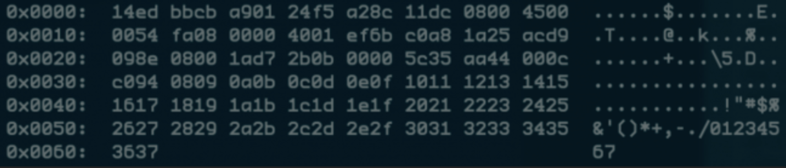

# tcpdump 简明教程

> 原文链接：https://danielmiessler.com/study/tcpdump/

`tcpdump` 毫无无疑是非常重要的网络分析工具，对于任何想深入理解`TCP/IP`的人来说，掌握该工具的使用是非常必要的。

本教程将向您展示如何以各种方式将流量基于 IP、端口、协议、应用程序层协议过滤出来，以确保您尽快找到所需的数据包内容。


## 基础

下面是一些用来配置 `tcpdump` 的选项，它们非常容易被遗忘，也容易和其它类型的过滤器比如 `Wireshark` 等混淆。

**选项**

* `-i any` 监听所有的网卡接口，用来查看是否有网络流量
* `-i eth0` 只监听eth0网卡接口
* `-D` 显示可用的接口列表
* `-n` 不要解析主机名
* `-nn` 不要解析主机名或者端口名
* `-q` 显示更少的输出(更加quiet)
* `-t` 输出可读的时间戳
* `-tttt` 输出最大程度可读的时间戳
* `-X` 以hex和ASCII两种形式显示包的内容
* `-XX` 与`**-X**`类似，增加以太网`header`的显示
* `-v, -vv, -vvv` 显示更加多的包信息
* `-c` 只读取`x`个包，然后停止
* `-s` 指定每一个包捕获的长度，单位是`byte`，使用`-s0`可以捕获整个包的内容
* `-S `输出绝对的序列号
* `-e` 获取以太网`header`
* `-E` 使用提供的秘钥解密`IPSEC`流量

表达式

在 tcpdump 中，可以使用表达式过滤指定类型的流量。有三种主要的表达式类型：`type`，`dir`，`proto`。

* 类型（`type`）选项包含：`host，net，port`
* 方向（`dir`）选项包含：`src，dst`
* 协议（`proto`）选项包含：`tcp，udp，icmp，ah`等

### **示例**

接下来我们介绍一些在实际工作中会经常使用到的命令示例。

**1. 捕获网卡流量**

捕获所有流量

```
tcpdump -i any
```

我们可以使用上面的命令查看所有网卡上发生了什么。运行下面的命令，可以监控一个指定的网络接口:

```
tcpdump -i eth0
```

**2. 基于IP查找流量**

最重要的查询方式之一就是 host，我们可以用如下命令查看 IP `1.1.1.1` 上的进出流量:

```
tcpdump host 1.1.1.1
06:20:25.593207 IP 172.30.0.144.39270 > one.one.one.one.domain: 
12790+ A? google.com. 
(28) 06:20:25.594510 IP one.one.one.one.domain > 172.30.0.144.39270: 
12790 1/0/0 A 172.217.15.78 (44)
```

**3. 根据源和目标进行过滤**

如果你只想看单一方向的流量，可以使用 src 或者 dst:

```
tcpdump src 1.1.1.1
tcpdump dst 1.0.0.1
```

**4. 根据网段进行查找**

如果想查看某一网段或者子网的进出流量，可以使用如下命令:

```
tcpdump net 1.2.3.0/24
```

**5. 使用十六进制输出**

当我们想要检查包的内容是否有问题的时候，十六进制的输出很有帮助：

```
tcpdump -c 1 -X icmp
```

**6. 显示特定端口的流量**

我们可以使用 port 查找特定端口的流量:

```
tcpdump port 3389 
tcpdump src port 1025
```



**7. 显示特定协议的流量**

如果你想查看特定协议的流量，你可以使用 `tcp、udp、icmp` 等各种协议:

```
tcpdump icmp
```

**8. 只显示 ipv6 的流量**

通过协议参数可以查看所有 ipv6 的流量:

```
tcpdump ip6
```

**9. 查看一个端口段的流量**

查看某一范围内的所有端口的流量：

```
tcpdump portrange 21-23
```

**10. 基于包大小进行筛选**

如果你正在查看特定大小的包，你可以使用这个参数。使用 less、greater 或者对应的数学符号进行过滤：

```
tcpdump less 32 
tcpdump greater 64 
tcpdump <= 128
```

**11. 读写文件**

我们经常需要将包存在文件中以便将来分析，这些文件叫做 `PCAP(PEE-cap)` 文件，它们可以被许许多多的工具进行分析，当然也包括 `tcpdump` 自己。使用 `-w `保存到文件:

```
tcpdump port 80 -w capture_file
```
我们也可以使用 `-r` 从文件中读取，可以使用各种参数分析文件中的包，但是不能处理文件中根本不存在的包：

```
tcpdump -r capture_file
```

###  高级功能

前面几个例子我们介绍了 `tcpdump` 基本的功能，接下来我们介绍一些它的高级功能。`tcpdump` 有很多参数可以使用，单独使用一个参数就很强大了，但是 `tcpdump` 的魔力就在于可以创造性的组合参数，以便准确的过滤出你想查找的包。有三种方式可以组合，只要你稍微有点编程基础就很容易理解。

* `AND`：`and` 或者 `&&`
* `OR`：`or `或者说` ||`
* `EXCEPT`：`not` 或者 `!`

**12. 原始数据输出**

使用此组合可查看详细的输出，不解析主机名或端口号，使用绝对序列号，并显示可读性更强的时间戳:

```
tcpdump -ttnnvvS
```
下面是几个组合的例子。

**13. 来自特定的IP,发往特定的端口**

来自`10.5.2.3`，发往任意主机的 `3389` 端口的包:

```
tcpdump -nnvvS src 10.5.2.3 and dst port 3389
```

**14. 从某个网段来，到某个网段去**

我们来查看所有来自 `192.168.x.x` 并进入 `10.x` 或 `172.16.x.x` 的流量，并且显示十六进制输出，没有主机名解析：

```
tcpdump -nvX src net 192.168.0.0/16 and dst net 10.0.0.0/8 or 172.16.0.0/16
```
**15. 到某个IP的非ICMP流量**

发往 `192.168.0.2` 的非 `icmp` 流量：

```
tcpdump dst 192.168.0.2 and src net and not icmp
```

**16. 来自某个主机，不是发往某个端口**

来自`mars`主机，发往非 `SSH` 端口：

```
tcpdump -vv src mars and not dst port 22
```

如你所见，我们可以组合查询所需的所有数据。关键是你要准确弄清楚你要查找什么数据，然后去过滤数据。


注意当你需要一些复杂查询的时候，你可能需要使用引号。单引号告诉 `tcpdump` 忽略特定的特殊字符，如下面的例子中的括号：

```
tcpdump 'src 10.0.2.4 and (dst port 3389 or 22)'
```

**17. 根据 TCP Flags 分离数据**

17.1 例如使用 `TCP RST flag `筛选:

```
tcpdump 'tcp[13] & 4!=0'
tcpdump 'tcp[tcpflags] == tcp-rst'
```

17.2 根据 `TCP SYN flag`筛选

```
tcpdump 'tcp[13] & 2!=0'
tcpdump 'tcp[tcpflags] == tcp-syn'
```

17.3 根据 `TCP SYN`和`ACK flag`筛选

```
tcpdump 'tcp[13]=18'
```

17.4 根据 `TCP URG flag`筛选

```
tcpdump 'tcp[13] & 32!=0'
tcpdump 'tcp[tcpflags] == tcp-urg'
```

17.5 根据 `TCP ACK flag` 筛选

```
tcpdump 'tcp[13] & 16!=0'
tcpdump 'tcp[tcpflags] == tcp-ack'
```

17.6 根据 `TCP PSH flag` 筛选

```
tcpdump 'tcp[13] & 8!=0'
tcpdump 'tcp[tcpflags] == tcp-psh'
```

17.7 根据 `TCP FIN flag` 筛选

```
tcpdump 'tcp[13] & 1!=0'
tcpdump 'tcp[tcpflags] == tcp-fin'
```

**18. 根据 `SYN` 和 `RST` 筛选**

```
tcpdump 'tcp[13] = 6'
```

**19. 发现 HTTP User Agent**

```
tcpdump -vvAls0 | grep 'User-Agent:'
```
**20. GET 请求**

```
tcpdump -vvAls0 | grep 'GET'
```

**21. HTTP Host**

```
tcpdump -vvAls0 | grep 'Host:'
```

**22. HTTP Cookie**

```
tcpdump -vvAls0 | grep 'Set-Cookie|Host:|Cookie:'
```

**23. SSH 连接**

```
tcpdump 'tcp[(tcp[12]>>2):4] = 0x5353482D'
```

**24. DNS流量**

```
tcpdump -vvAs0 port 53
```

**25. FTP流量**

```
tcpdump -vvAs0 port ftp or ftp-data
```

**26. NTP流量**

```
tcpdump -vvAs0 port 123
```

**27. 过滤明文密码**

```
tcpdump port http or port ftp or port smtp or port imap or port pop3 or port telnet -lA | egrep -i -B5 'pass=|pwd=|log=|login=|user=|username=|pw=|passw=|passwd= |password=|pass:|user:|username:|password:|login:|pass |user '
```

**28. 过滤恶意的包**

`IP header` 中有一个 bit 从来没有被用过，我们叫 它`evil bit`，可以过滤设置它的包：

```
tcpdump 'ip[6] & 128 != 0'  
```


