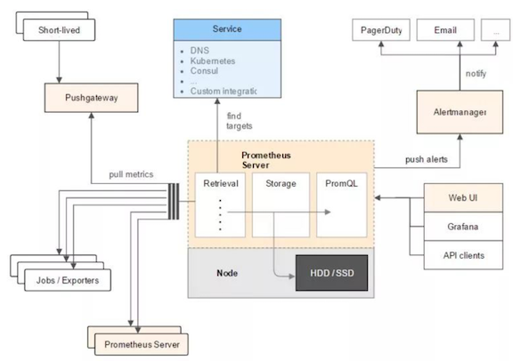
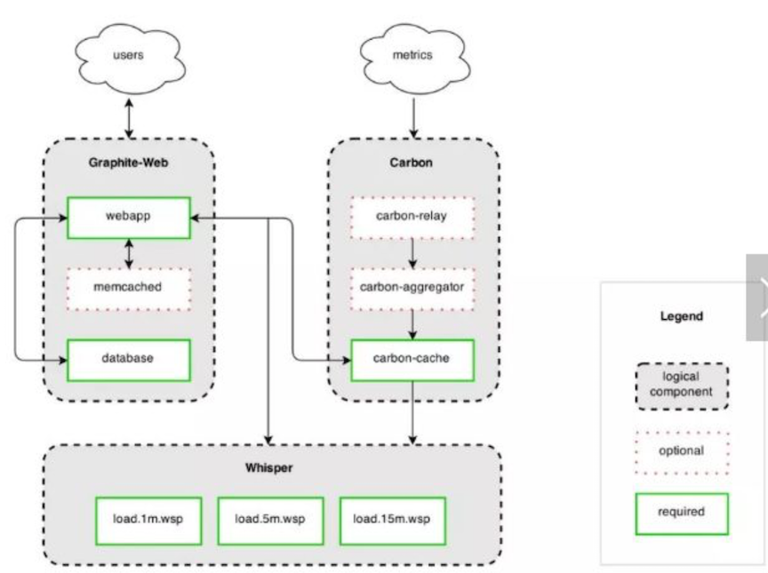
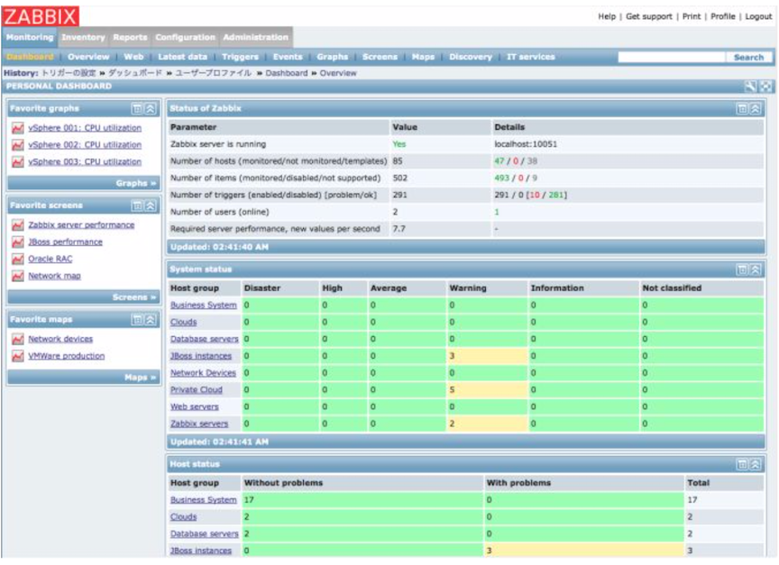
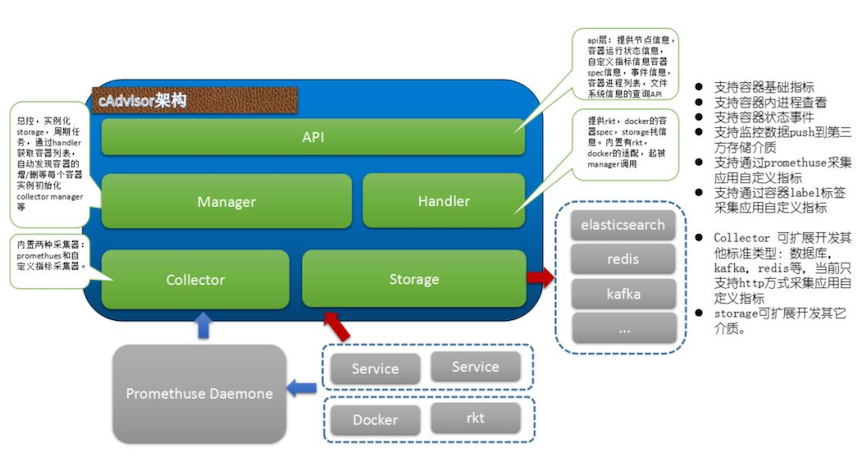
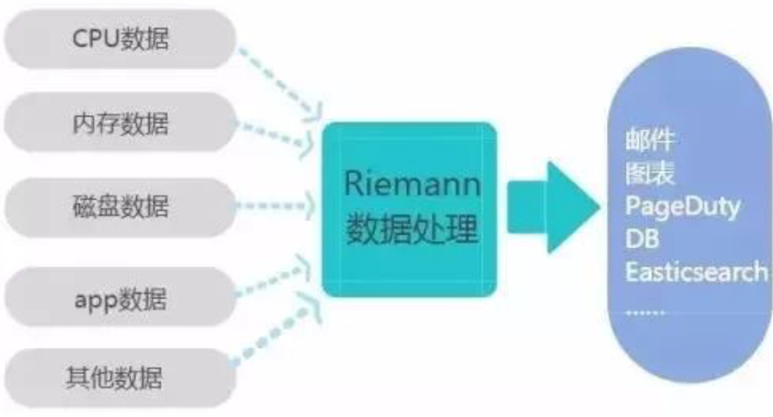
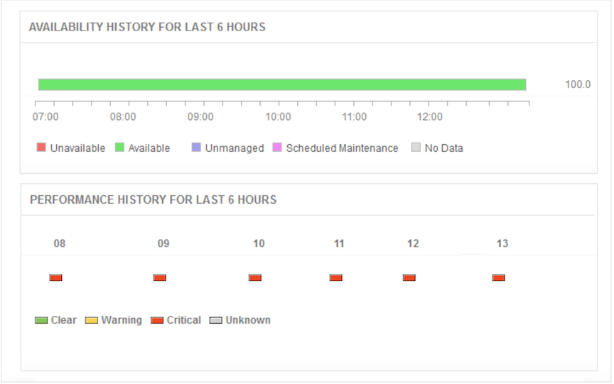

# 7 款你不得不了解的开源云监控工具

云计算作为IT基础设施的交付和使用模式，通过网络以按需、易扩展的方式获得所需的资源。而云平台聚集了大量软硬件资源，并采用虚拟化技术实现动态按需提供需要服务，值得注意的是，随着企业上“云”风潮席卷而来的同时，为了确保云平台的正常运转，云监控工具为开发人员和管理员，监控和管理云应用程序提供了大大的帮助。

在云中，开源工具和应用程序能够提升`DevOps`的效率，日志记录和监视解决方案尤甚。监控云平台，应用程序和组件以及处理和分析日志对于确保高可用性、高性能、低延迟等至关重要。根据RightScale“云计算状况调查报告”报告所指出的，最常见的云优化行为(由45%的企业和中小型企业关注)就是监控。

但是，有些公有云平台提供的原生监控工具，往往存在着无法适当监控和管理云应用程序等不足，此时，开源云监控的优势便得以显现。本文将为大家盘点7款超实用开源云监控工具。

### 1、原生云应用程序中最受认可的时间序列监控解决方案 - `Prometheus`

`Prometheus`功能丰富，它提供一系列定制选项，可与第三方可视化工具（包括`Grafana`）集成，还提供本地可视化引擎。并提供一个`API`，用于将数据发送到外部工具，用户可以使用名为`PromQL`的特殊查询语言准备用于解释的监控数据。 毫不夸张的说，`Prometheus`是当今最强大的开源云监控工具之一。

**`Prometheus`也有自己的不足，例如它不是日志管理工具，不提供自动异常检测，同时，其原生可视化相对基础**。

### 2、开发者最熟悉的开源云监控工具——Graphite

`Graphite` 是应用程序监控度量值的可视化工具，包括三个组件 (`Carbon`, `Whisper`, 和`Graphite-web`),它的开源特性使得它能被方便定制和改进。

`Graphite` 提供了强大的查询访问API和特性丰富的设置。它并不需要设置自身的度量，而是提供`Graphite metric protocol` ，被多种度量采集器选择的事实协议格式。因此，输入给它的数据完全不是问题。使用 Graphite 能使你为你的应用创建各种视图。

### 3、互联网用户中使用最广的监控软件——Zabbix

`Zabbix` 是一个基于WEB界面的提供分布式系统监控以及网络监控功能的企业级开源运维平台，也是目前国内互联网用户中使用最广的监控软件，几乎85%以上用户在使用Zabbix做监控解决方案。

其入门容易、上手简单、功能强大并且开源免费是用户对`Zabbix`的最直观评价，`Zabbix`易于管理和配置，能生成比较漂亮的数据图，其自动发 现功能大大减轻日常管理的工作量，丰富的数据采集方式和`API`接口可以让用户灵活进行数据采集，而分布式系统架构可以支持监控更多的设备。理论上，通过 `Zabbix`提供的插件式架构，可以满足企业的任何需求。

需要告知广大开发者，它也存在着一定的局限性。例如，

* 项目批量修改不方便；
* 社区虽然成熟，但是中文资料相对较少，服务支持有限;
* 深层次需求需要非常熟悉`Zabbix`并进行大量的二次定制开发，难度较大;
* 系统级别报警设置相对比较多，如果不筛选的话报警邮件会很多;
* 并且自定义的项目报警需要自己设置，过程比较繁琐。

当然，经过综合评测，这款开源监控软件仍被定义为五星级推荐。

### 4、鲜为人知但值得考虑的cAdvisor

`cAdvisor`提供了一目了然的单节点多容器的资源监控功能。Google的`Kubernetes`中也缺省地将其作为单节点的资源监控工具，各个节点缺省会被安装上`cAdvisor`。总结起来主要两点：

* 展示 `Host`
* 容器两个层次的监控数据；展示历史变化数据。

美中不足的是，由于 `cAdvisor` 提供的操作界面略显简陋，而且需要在不同页面之间跳转，并且只能监控一个 `host`，这不免会让人质疑它的实用性。但 cAdvisor 的一个亮点是它可以将监控到的数据导出给第三方工具，由这些工具进一步加工处理。我们可以把`cAdvisor` 定位为一个监控数据收集器，收集和导出数据是它的强项，而非展示数据。

### 5、满足大部分人需求的Riemann

`Riemann` 提供了一个单一直接的工具来监控分布式应用程序和基础设施。该开源软件使开发人员可定义需要监控的各种类型的事件，以及流—可在发生特定类型的事件时生成警报。开发人员还可配置流以发送电子邮件通知或通过Slack发送有关事件的警报。

拥有高定制化、事件处理低延迟、持多种语言的客户端、监控数据图形化、告警方式多样化等优点。**但同样存在必须时间同步、内存消耗大、不支持集群等不足。**

### 6、搜索功能最实用的Elasticsearch

`Elasticsearch` 是一个实时的分布式搜索和分析引擎。它可以帮助你用前所未有的速度去处理大规模数据。它可以用于全文搜索，结构化搜索以及分析，也可以将这三者进行组合。作为建立在全文搜索引擎 `Apache Lucene™ `基础上的搜索引擎，可以说`Lucene`是当今最先进，最高效的全功能开源搜索引擎框架。

因为`Elasticsearch`是分布式的，所以，它不需要其他组件，分发是实时的，除此，`Elasticsearch` 完全支持 `Apache Lucene` 的接近实时的搜索。处理多租户不需要特殊配置，而`Solr`则需要更多的高级设置。采用 `Gateway` 的概念，使得完备份更加简单。各节点组成对等的网络结构，某些节点出现故障时会自动分配其他节点代替其进行工作。

**其缺点则是只有一名开发者（当前Elasticsearch GitHub组织已经不只如此，已经有了相当活跃的维护者），且还不够自动（不适合当前新的Index Warmup API）。**

### 7、拥有强大管理中心的Nagios

`Nagios`是一款开源的企业级监控系统，能够实现对系统`CPU`、`磁盘`、`网络`等方面参数的基本系统监控，以及 `SMTP`，`POP3`，`HTTP`，`NNTP`等各种基本的服务类型。适合用户群为复杂IT环境的企业，最大的特点是其强大的管理中心，尽管其功能是监控服务和主机的，但`Nagios`自身并不包括这部分功能代码，**所有的监控、告警功能都是由相关插件完成的。**

**拥有诸多较为明显的优势，出错的服务器、应用和设备会自动重启，自动日志滚动；配置灵活，可以自定义shell脚本，通过分布式监控模式；并支持以冗余方式进行主机监控，报警设置多样，以及命令重新加载配置文件无需打扰`Nagios`的运行。**

**缺点**

* 事件控制台功能很弱，插件易用性差；
* 对性能、流量等指标的处理不给力；
* 看不到历史数据，只能看到报警事件，很难追查故障原因；
* 配置复杂，初学者投入的时间、精力和成本比较大。

总之，任何产品在有优点的同时，一定伴随着缺点，这也为开发者与管理者们提供了较为明确的选择方案。快速迭代的产品需求和良好的用户体验，不仅要求开发者们应加强对云平台的多方监管，更需要大家时刻保障核心业务的稳定。

