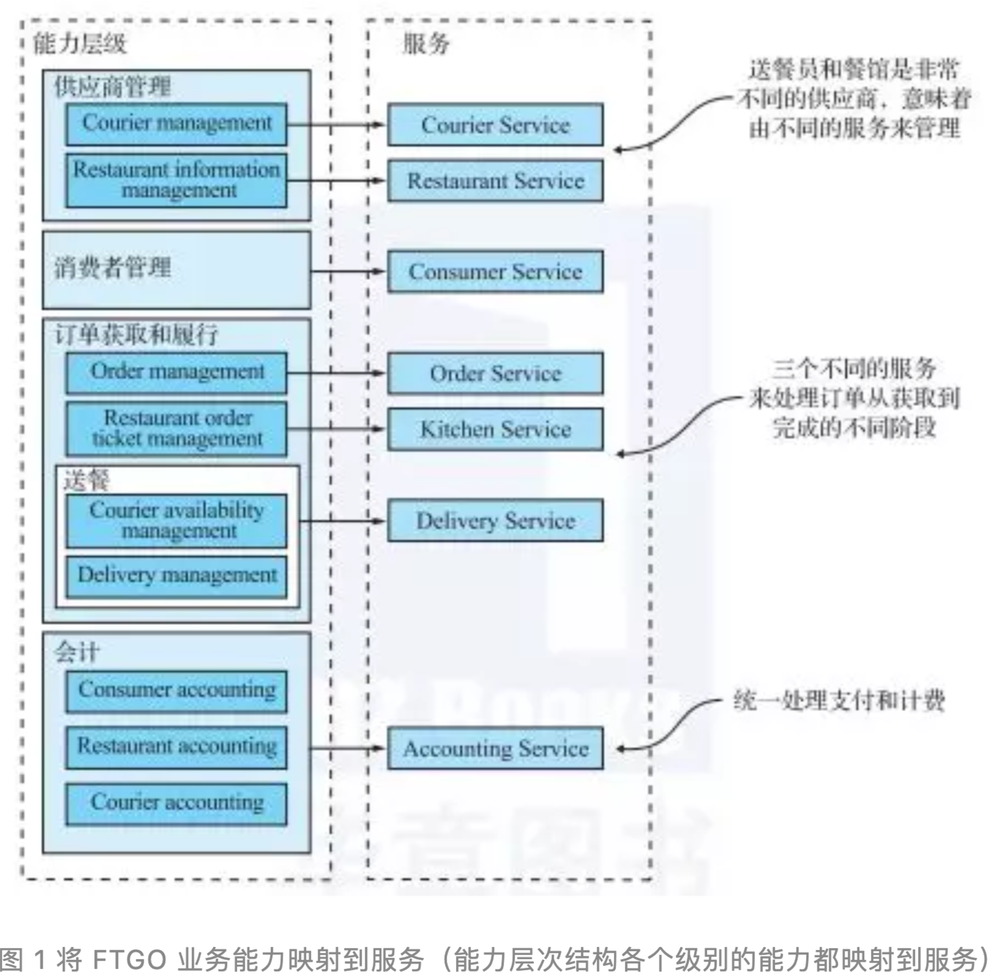
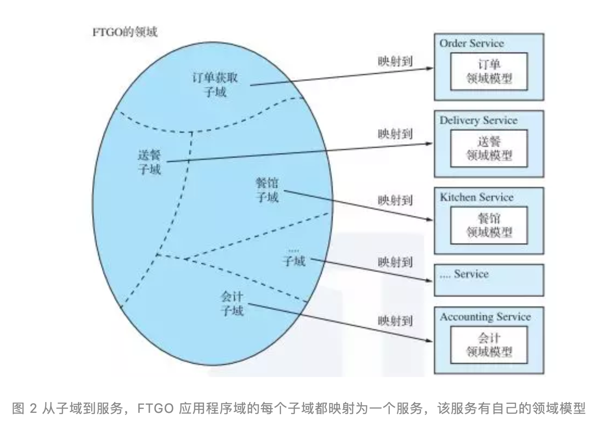
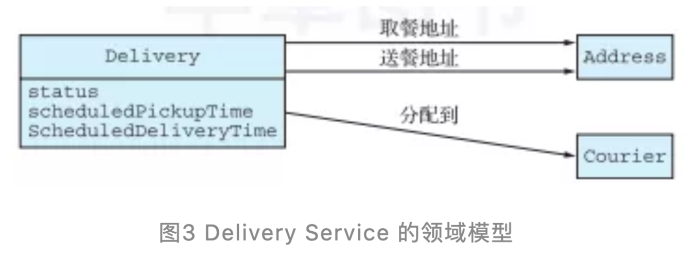

# 微服务需要拆分到什么程度？

## 1 服务拆分策略

### 1.1 根据业务能力进行服务拆分和定义  

创建微服务架构的策略之一就是采用**业务能力进行服务拆分**。

**业务能力是一个来自于业务架构建模的术语。**

它通常指一些能够为公司（或组织）产生价值的商业活动。特定业务的业务能力取决于这个业务的类型。例如，保险公司业务能力通常包括承保、理赔管理、 账务和合规等，在线商店的业务能力则包括订单管理、库存管理和发货，等等。

#### 识别业务能力

**组织的业务能力通常是指这个组织的业务是做什么的，它们通常都是稳定的**。

与之相反，组织采用何种方式来实现它的业务能力，是随着时间不断变化的。这一个组织有哪些业务能力，是通过对组织的目标、结构和商业流程的分析得来的。每一个业务能力都可以被认为是一个服务，除非它是面向业务的而非面向技术的。

**业务能力规范包含多项元素，比如输入和输出、服务等级协议（SLA）**。例如，保险承保能力的输入来自客户的应用程序，这个业务能力的输出是完成核保并报价。

**业务能力通常集中在特定的业务对象上**。例如，理赔业务对象是理赔管理功能的重点。能力通常可以分解为子能力。例如，理赔管理能力具有多个子能力，包括理赔信息管理、理赔审核和理赔付款管理。

把 `FTGO` 的业务能力逐一列出来似乎并不困难，如下所示。

* 供应商管理；
  * `Courier management`：送餐员相关信息管理；
  * `Restaurant information management`：餐馆菜单和其他信息管理，例如营业地址和时间。
* 用户管理：用户有关信息的管理；
* 订单获取和履行；
  * `Order management`：让用户可以创建和管理订单；
  * `Restaurant order management`：让餐馆可以管理订单的生产过程；
  * 物流；
  * `Courier availability management`：管理送餐员的实时状态；
  * `Delivery management`：把订单送到用户手中。
* 会计记账；
  * `Consumer accounting`：管理跟用户相关的会计记账；
  * `Restaurant accounting`：管理跟餐馆相关的会计记账；
  * `Courier accounting`：管理跟送餐员相关的会计记账。
* 其他；
  * 顶级能力包括供应商管理、用户（消费者）管理、订单获取和派送以及会计记账。除此之外，`FTGO` 可能还有许多其他顶级能力，包括与营销相关的能力。大多数顶级能力都会分解为子能力。例如，订单获取和派送被分解为五个子能力。这个能力层次有趣的地方就在于其中有三个餐馆相关的能力：**餐馆信息管理、餐馆订单管理和餐馆会计记账**。那是因为它们代表了餐馆运营的三个截然不同的方面。 接下来，我们将了解如何使用业务能力来定义服务。

#### 从业务能力到服务

一旦确定了业务能力，就可以为每个能力或相关能力组定义服务。图 1 显示了 FTGO 应用程序从能力到服务的映射。决定将哪个级别的能力层次结构映射到服务是一个非常主观的判断，因此我设置了一些特定映射的判断理由：

* 我将供应商管理的子能力映射到两种服务，**因为餐馆和送餐员是不同类型的供应商；**
* **我将订单获取和派送的能力映射到三个服务，每个服务负责该流程的不同阶段**。我将送餐员可用性管理（`Courier availability management`）和交付管理（`Delivery management`）能力结合起来，并将它们映射到单个服务，因为它们交织在一起；
* **我将会计记账能力映射到自己的独立服务，因为不同类型的会计记账看起来很相似。**

围绕能力组织服务的一个关键好处是，因为它们是稳定的，所以最终的架构也将相对稳定。**架构的各个组件可能会随着业务的具体实现方式的变化而发展，但架构仍保持不变。**

**话虽如此，重要的是要记住图 1 中显示的服务仅仅是定义架构的第一次尝试。随着我们对应用程序领域的了解越来越多，它们可能会随着时间的推移而变化，特别是架构定义流程中的一个重要步骤是调查服务如何在每个关键架构服务中协作。**

例如，你可能会发现由于过多的进程间通信而导致特定的分解效率低下，导致你必须把一些服务组合在一起。相反，服务可能会在复杂性方面增长到值得将其拆分为多个服务的程度。

图 2 展示了子域和服务之间的映射，每一个子域都有属于它们自己的领域模型。

**`DDD` 和微服务架构简直就是天生一对。`DDD` 的子域和限界上下文的概念，可以很好地跟微服务架构中的服务进行匹配。**

而且，微服务架构中的自治化团队负责服务开发的概念，也跟 DDD 中每个领域模型都由一个独立团队负责开发的概念吻合。更有趣的是，子域用于它自己的领域模型这个概念，为消除上帝类和优化服务拆分提供了好办法。

### 1.2 根据子域进行拆分  

领域驱动为每一个子域定义单独的领域模型。子域是领域的一部分，领域是 DDD 中用来描述应用程序问题域的一个术语。识别子域的方式跟识别业务能力一样：分析业务并识别业务的不同专业领域，分析产出的子域定义结果也会跟业务能力非常接近。

**FTGO 的子域包括：订单获取、订单管理、餐馆管理、送餐和会计。**

正如你所见：这些子域跟我们之前定义的业务能力非常接近。

`DDD` 把领域模型的边界称为限界上下文（`bounded contest`）。限界上下文包括实现这个模型的代码集合。当使用微服务架构时，每一个限界上下文对应一个或者一组服务。换一种说法，我们可以通过 DDD 的方式定义子域，并把子域对应为每一个服务，这样就完成了微服务架构的设计工作。

**按子域分解和按业务能力分解是定义应用程序的微服务架构的两种主要模式。但是，也有一些有用的拆分指导原则源于面向对象的设计。我们来详细讨论这些原则。**

## 2. 拆分指导原则

### 单一职责原则

> 软件架构和设计的主要目标之一是确定每个软件元素的职责。单一职责原则如下：
> 
> 改变一个类应该只有一个理由。         —Robert C. Marti

类所承载的每一个职责都是对它进行修改的潜在原因。如果**一个类承载了多个职责，并且互相之间的修改是独立的，那么这个类就会变得非常不稳定**。

**遵照 SRP 原则，你所定义的每一个类都应该只有一个职责，因此也就只有一个理由对它进行修改。**

我们在设计微服务架构时应该遵循 `SRP` 原则，设计小的、内聚的、仅仅含有单一职责的服务。这会缩小服务的大小并提升它的稳定性。新的 FTGO 架构是应用 SRP 的一个例子。

为客户获取餐食的每一个方面（订单获取、订单准备、送餐等）都由一个单一的服务承载。

### 闭包原则

> 另外一个有用的原则是闭包原则（CCP）：
> 
> 在包中包含的所有类应该是对同类变化的一个集合，也就是说，如果对包做出修改，需要调整的类应该都在这个包之内。
> 
>  —— Robert C. Martin

**这就意味着，如果由于某些原因，两个类的修改必须耦合先后发生，那么就应该把它们放在同一个包内**。也许，这些类实现了一些特定的业务规则的不同方面。这样做的目标是当业务规则发生变化时，开发者只需要对一个交付包做出修改，而不是大规模地修改（和重新编译）。整个应用采用闭包原则，极大地改善了应用程序的可维护性。

在微服务架构下采用 CCP 原则，这样我们就能把根据同样原因进行变化的服务放在一个组件内。这样做可以控制服务的数量，当需求发生变化时，变更和部署也更加容易。理想情况下，一个变更只会影响一个团队和一个服务。CCP 是解决分布式单体这种可怕的反模式的法宝。

单一职责原则和闭包原则是 Robert C. Martin 制定的十一项原则中的两项。它们在开发微服务架构时特别有用。在设计类和包时可以使用其余的九个原则。有关这些原则的更多信息，请参阅 Robert C. Martin 网站上的文章[《面向对象设计的原则》](http://butunclebob.com/ArticleS.UncleBob.PrinciplesOfOod)。

## 3. 拆分单体应用为服务的难点及解决方案

从表面上看，通过定义与业务能力或子域相对应的服务来创建微服务架构的策略看起来很简单。**但是，你可能会遇到几个障碍**：

* **网络延迟；**
* **同步进程间通信会导致可用性降低；**
* **需要在服务之间维持数据一致性；**
* **需要获取一致的数据视图；**
* **上帝类会阻碍拆分。**

### 网络延迟

网络延迟是分布式系统中一直存在的问题。你可能会发现，对服务的特定分解会导致两个服务之间的大量往返调用。有时，你可以通过实施批处理 API 在一次往返中获取多个对象，从而将延迟减少到可接受的数量。但在其他情况下，**解决方案是把多个相关的服务组合在一起，用编程语言的函数调用替换昂贵的进程间通信。**

### 同步的进程间通信会导致可用性降低

**另一个需要考虑的问题是如何处理进程间通信而不降低系统的可用性。** 例如，实现 `createOrder()` 操作最常见的方式是让 `Order Service` 使用 `REST` 同步调用其他服务。这样做的弊端是 `REST` 这样的协议会降低 `Order Service` 的可用性。

如果任何一个被调用的服务处在不可用的状态下，那么订单就无法创建了。有时候这可能是一个不得已的折中，**但是在学习异步消息之后，你就会发现其实有更好的办法来消除这类同步调用产生的紧耦合并提升可用性。**

### 需要在服务之间维持数据一致性

**另一个挑战是如何在某些系统操作需要更新多个服务中的数据时，仍旧维护服务之间的数据一致性。** 传统的解决方案是使用基于两阶段提交（two phase commit）的分布式事务管理机制。但对于现今的应用程序而言，这不是一个好的选择，你必须使用一种非常不同的方法来处理事务管理，这就是 Saga。Saga 是一系列使用消息协作的本地事务。

**`Saga` 比传统的 `ACID` 事务更复杂，但它们在许多情况下都能工作得很好。`Saga` 的一个限制是它们最终是一致的。如果你需要以原子方式更新某些数据，那么它必须位于单个服务中，这可能是分解的障碍。**

### 需要获取一致的数据视图

**分解的另一个障碍是无法跨多个数据库获得真正一致的数据视图**。在单体应用程序中，`ACID` 事务的属性保证查询会返回数据库的一致视图。相反，**在微服务架构中，即使每个服务的数据库是一致的，你也无法获得全局一致的数据视图**。

**如果你需要一些数据的一致视图，那么它必须驻留在单个服务中，这也是服务分解所面临的问题。**幸运的是，在实践中这很少带来真正的问题。

### 上帝类阻碍了拆分

在分解的过程会存在所谓的上帝类。**上帝类是在整个应用程序中使用的全局类**。**上帝类通常为应用程序的许多不同方面实现业务逻辑**。它有大量字段映射到具有许多列的数据库表。大多数应用程序至少有一个这样的上帝类，每个类代表一个对领域至关重要的概念：银行账户、电子商务订单、保险政策，等等。

**因为上帝类将应用程序的许多不同方面的状态和行为捆绑在一起，所以将使用它的任何业务逻辑拆分为服务往往都是一个不可逾越的障碍。**

Order 类是 FTGO 应用程序中上帝类的一个很好的例子。`Order` 类具有与订单处理、餐馆订单管理、送餐和付款相对应的字段及方法。由于一个模型必须描述来自应用程序的不同部分的状态转换，因此该类还具有复杂的状态模型。在目前情况下，这个类的存在使得将代码分割成服务变得极其困难。

一种解决方案是将 `Order` 类打包到库中并创建一个中央 `Order` 数据库。处理订单的所有服务都使用此库并访问数据库。这种方法的问题在于它违反了微服务架构的一个关键原则，并导致我们特别不愿意看到的紧耦合。例如，对 `Order` 模式的任何更改都要求其他开发团队同步更新和重新编译他们的代码。

**另一种解决方案是将 `Order` 数据库封装在 `Order Service` 中，该服务由其他服务调用以检索和更新订单。** 该设计的问题在于这样的一个 `Order Service` 将成为一个纯数据服务，成为包含很少或没有业务逻辑的贫血领域模型（`anaemic domain model`）。这两种解决方案都没有吸引力，但幸运的是，`DDD` 提供了一个好的解决方案。

更好的方法是应用 `DDD` 并将每个服务视为具有自己的领域模型的单独子域。这意味着 `FTGO` 应用程序中与订单有关的每个服务都有自己的领域模型及其对应的 `Order` 类的版本。`Delivery Service` 是多领域模型的一个很好的例子。如图 3 所示为 `Order`，它非常简单：**取餐地址、取餐时间、送餐地址和送餐时间**。此外，`Delivery Service` 使用更合适的 `Delivery` 名称，而不是称之为 `Order`。`Delivery Service` 对订单的任何其他属性不感兴趣。

除了造成一些技术挑战以外，拥有多个领域模型还会影响用户体验。**在定义微服务架构时必须识别并消除上帝类。**

