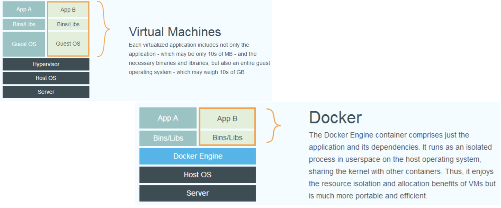
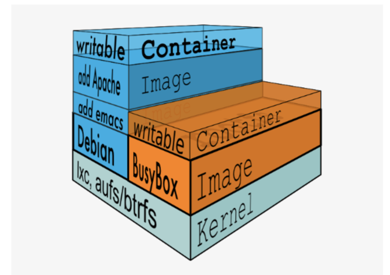

# 1.容器

## Docker

1. 基于 Linux 内核的 **cgroup，namespace**，以及**AUFS** 类的 **Union FS** 等技术，对进程进行封装 隔离，属于 操作系统层面的虚拟化技术。
2. 由于隔离的进程独立于宿主和其它的隔离的进程，因此也称其为容器.
3. 最初实现是基于`LXC`，从0.7以后开始去除LXC，转而使用自行开发的`libcontainer`，从
1.11 开始，则进一步演进为使用 `runC` 和 `containerd`。
4. Docker 在容器的基础上，进行了进一步的封装，从文件系统、网络互联到进程隔离等等， 极大的简化了容器的创建和维护。
5. 使得 Docker 技术比虚拟机技术更为轻便、快捷。

## 为什么要用Docker

* 更高效的利用系统资源 
* 更快速的启动时间
* 一致的运行环境
* 持续交付和部署
* 更轻松的迁移
* 更轻松的维护和扩展

## 虚拟机和容器运行态的对比



## 性能对比


## 容器主要特性


## 隔离性: Linux Namespace(ns)

### pid namespace

* 不同用户的进程就是通过**pid namespace**隔离开的，**且不同 namespace 中可以有相同pid**。
* 有了 `pid namespace`, 每个`namespace`中的`pid`能够相互隔离

### net namespace

* **网络隔离是通过`net namespace`实现的**， 每个`net namespace`有独立的 `network devices`, `IP addresses`, `IP routing tables`, `/proc/net` 目录。
* docker默认采用veth的方式**将container中的虚拟网卡同host上的一个docker bridge: docker0连接在一起**。

### ipc namespace

* container中进程交互还是采用linux常见的进程间交互方法(interprocess communication - IPC), 包括常见的信号量、消息队列和共享内存
* `container` 的进程间交互实际上还是host上具有相同`pid namespace`中的进程间交互，因此需要在IPC资源申请时加入namespace信息 - 每 个IPC资源有一个唯一的 32 位 ID。


### mnt namespace

* `mnt namespace`**允许不同namespace的进程看到的文件结构不同**，这样每个 namespace 中的进程所看到的文件目录就被隔离开了。

### uts namespace

* `UTS("UNIX Time-sharing System") namespace`允许每个`container`拥有独立的`hostname`和`domain name`, **使其在网络上可以被视作一个独立的节点而非Host上的一个进程**。

### user namespace

*  每个container可以有不同的 `user` 和 `group id,` 也就是说可以在container内部用container内部的用户执行程序而非Host上的用户。

## 可配额/可度量 - Control Groups (cgroups)

### cgroups 实现了对资源的配额和度量。

* blkio这个子系统设置限制每个块设备的输入输出控制。例如:磁盘，光盘以及usb等等。 
* cpu 这个子系统使用调度程序为cgroup任务提供cpu的访问。
* cpuacct 产生cgroup任务的cpu资源报告。
* cpuset如果是多核心的cpu，这个子系统会为cgroup任务分配单独的cpu和内存。
* devices 允许或拒绝cgroup任务对设备的访问。
* freezer暂停和恢复cgroup任务。
* memory设置每个cgroup的内存限制以及产生内存资源报告。
* net_cls标记每个网络包以供cgroup方便使用。
* ns名称空间子系统。

## 便携性: Union Fs简介

### Union FS

* 将不同目录挂载到同一个虚拟文件系统下(unite several directories into a single virtual file system)的 文件系统
* 支持为每一个成员目录(类似`GitBranch`)设定`readonly`、`readwrite`和`whiteout-able`权限
* 文件系统分层,对`readonly`权限的`branch`可以逻辑上进行修改(增量地,不影响readonly部分的)。
* 通常`UnionFS`有两个用途,**一方面可以将多个disk挂到同一个目录下,另一个更常用的就是将一个 readonly 的 branch 和一个 writeable 的 branch 联合在一起。**

## Docker的文件系统

**`Docker`支持`Aufs，Devicemapper，Btrfs`和`overlayFS, ZFS, VFS`**

### 典型的Linux文件系统组成

* **bootfs(bootfilesystem)**
 
 ```
  Bootloader - 引导加载kernel
  Kernel - 当kernel被加载到内存中后 umount bootfs。
 ```
* **rootfs(rootfilesystem)**
  
  ```
  /dev，/proc，/bin，/etc等标准目录和文件。
  ```
* 对于不同的linux发行版,bootfs基本是一致的
* 但rootfs会有差别

## Docker启动

### Linux

在启动后，首先将 `rootfs` 设置为 `readonly`, 进行一系列检查, 然后将其切换为 "readwrite" 供用户使用。

### Docker启动

* 初始化时也是将 `rootfs` 以`readonly`方式加载并检查，然而接下来利用 `union mount` 的方式将一个 `readwrite` 文件系统挂载在 readonly 的rootfs之上。
* 并且允许再次将下层的 `FS(file system)` 设定为readonly 并且向上叠加。
* **这样一组`readonly`和一个`writeable`的结构构成一个`container`的运行时态, 每一个FS被称作 一个FS层**



## 安全性: AppArmor, SELinux, GRSEC

### 安全永远是相对的，这里有三个方面可以考虑Docker的安全特性:

1. 由`kernelnamespaces`和`cgroups`实现的Linux系统固有的安全标准;
2. `Docker Deamon`的安全借口;
3. Linux本身的安全加固解决方案,类如**`AppArmor,SELinux,GRSEC`**;

