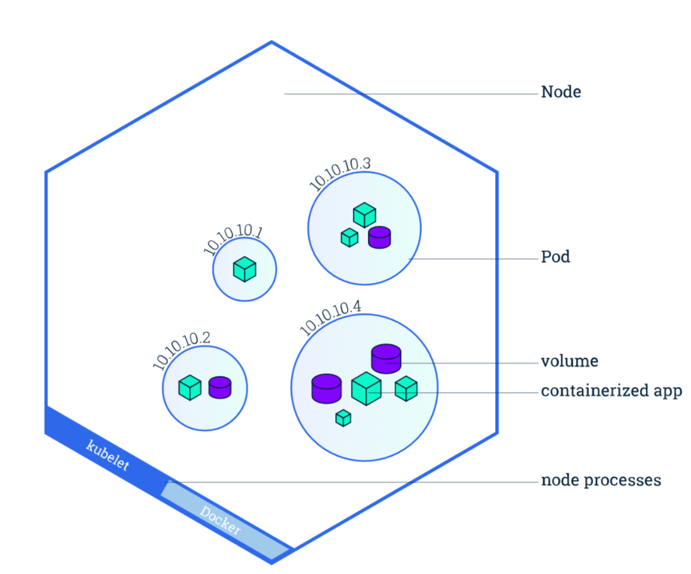

# Kubernetes对象详解 

## Node

### `Node`是Pod真正运行的主机，可以是物理机，也可以是虚拟机。为了管理Pod，每个Node节 点上至少要运行`container runtime`(比如`docker`或者`rkt`)、`kubelet`和`kube-proxy`服务。



## Node管理

* 不像其他的资源(如Pod和Namespace)，Node本质上不是Kubernetes来创建的， `Kubernetes`只是管理Node上的资源。**虽然可以通过`Manifest`创建一个`Node`对象(如下 yaml所示)，但`Kubernetes`也只是去检查是否真的是有这么一个Node，如果检查失败，也不会往上调度Pod**。
* **这个检查是由`Node Controller`来完成的。`Node Controller`负责**
* 维护`Node`状态
* 与`Cloud Provider`同步`Node`
* **给`Node`分配容器`CIDR`**
* **删除带有`NoExecute taint`的`Node`上的`Pods`**
* **默认情况下，`kubelet`在启动时会向`master`注册自己，并创建`Node`资源。**

```
kind: Node 
apiVersion: v1 
metadata:
  name: 10-240-79-157 
  labels:
    name: my-first-k8s-node
```

## Node的状态

每个Node都包括以下状态信息:

* 地址:包括`hostname`、`外网IP`和`内网IP`
* 条件(Condition):包括`OutOfDisk`、`Ready`、`MemoryPressure`和`DiskPressure`
* 容量(Capacity):Node上的可用资源，包括CPU、内存和Pod总数
* 基本信息(Info):包括内核版本、容器引擎版本、OS类型等


## Taints和tolerations

### `Taints`和`tolerations`用于保证`Pod`不被调度到不合适的`Node`上，`Taint`应用于Node上，而 `toleration`则应用于`Pod`上(Toleration是可选的)。

比如，可以使用`taint`命令给`node1`添加`taints`

```
kubectl taint nodes node1 key1=value1:NoSchedule
kubectl taint nodes node1 key1=value2:NoExecute
```

## Node维护模式

标志`Node`不可调度但不影响其上正在运行的`Pod`，这种维护Node时是非常有用的

```
kubectl cordon $NODENAME
```


