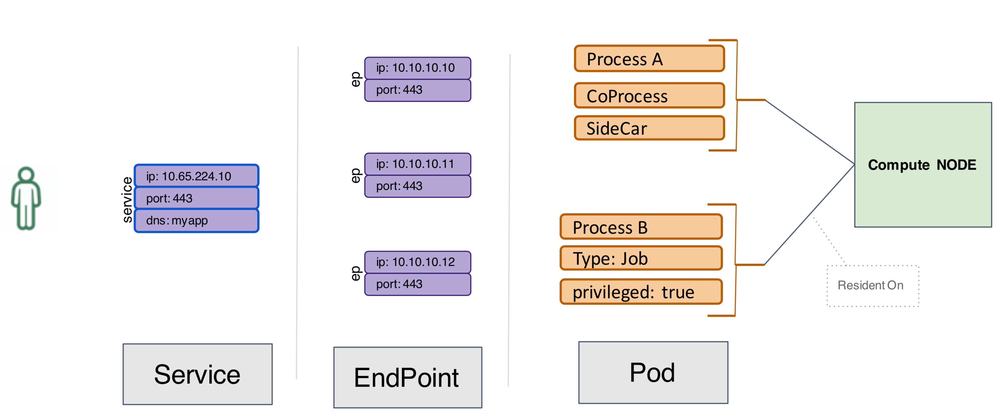

# Kubernetes对象详解 

## 服务发现与负载均衡

Kubernetes在设计之初就充分考虑了针对容器的`服务发现`与`负载均衡`机制，提供了`Service资源`，并通过`kube-proxy`配合`cloud provider`来适应不同的应用场景。随着kubernetes用户的激增，用户场景的不断丰富，又产生了一些新的负载均衡机制。目前，kubernetes中的负载均衡大致可以分为以下几种机制，每种机制都有其特定的应用场景:

### 1. `Service`:直接用`Service`提供`cluster`内部的负载均衡，并借助`cloud provider`提供的`LB`提供外部访问
### 2. `Ingress Controller`:还是用`Service`提供`cluster`内部的负载均衡，但是通过自定义`LB`提供外部访问
### 3. `Service Load Balancer`:把`load balancer`直接跑在容器中，实现`Bare Meta`l的ServiceLoadBalancer
### 4. `Custom Load Balancer`:自定义负载均衡，并替代`kube-proxy`，一般在物理部署Kubernetes时使用 ，方便接入公司已有的外部服务

## Service

**`Service`是对一组提供相同功能的`Pods`的抽象，并为它们提供一个统一的入口**。借助Service，应用可以方便的实现服 务发现与负载均衡，并实现应用的零宕机升级。`Service`通过标签来选取服务后端，一般配合`Replication Controller` 或者`Deployment`来保证后端容器的正常运行。这些匹配标签的`Pod IP`和`端口列表`组成`endpoints`，由`kube-proxy`负责将服务IP负载均衡到这些`endpoints`上。

## Service有四种类型:

### `ClusterIP`:默认类型，自动分配一个仅cluster内部可以访问的`虚拟IP`
### `NodePort`:在`ClusterIP`基础上为`Service`在每台机器上绑定一个`端口`，这样就可以通过`<NodeIP>:NodePort`来访问该服务
### `LoadBalancer`:在`NodePort`的基础上，借助`cloud provider`创建一个外部的负载均衡器，并将请求转发到`<NodeIP>:NodePort`
### `ExternalName`:将服务通过`DNS CNAME`记录方式转发到指定的域名(通过`spec.externlName`设定)。需要`kube-dns`版本在1.7以上。

另外，也可以将已有的服务以`Service`的形式加入到`Kubernetes`集群`selector`，而是在`Service`创建好后手动为其添加`endpoint`


## Service定义

`Service`的定义也是通过`yaml`或`json`，比 如下面定义了一个名为nginx的服务， 将服务的`80`端口语转发到`default namespace`中带有标签`run=nginx`的`Pod` 的`80端口`


```
apiVersion: v1
kind: Service
metadata:
  labels:
    run: nginx
  name: nginx
  namespace: default
spec:
  ports:
  - port: 80
    protocol: TCP
    targetPort: 80
  selector:
    run: nginx
  sessionAffinity: None
  type: ClusterIP
```

## 都发生了什么

```
$ kubectl get services

NAME         TYPE        CLUSTER-IP       EXTERNAL-IP   PORT(S)        AGE
kubernetes   ClusterIP   10.254.0.1       <none>        443/TCP        10d
my-nginx     ClusterIP   10.254.202.35    <none>        80/TCP         7d
myservice    NodePort    10.254.203.104   <none>        80:32077/TCP   3d
nginx-ds     NodePort    10.254.255.59    <none>        80:31053/TCP   10d

```


`# service自动分配了Cluster IP 110.254.202.35`

```
$ kubectl get service my-nginx

NAME       TYPE        CLUSTER-IP      EXTERNAL-IP   PORT(S)   AGE
my-nginx   ClusterIP   10.254.202.35   <none>        80/TCP    7d
```

```
# 自动创建的endpoint
$ kubectl get endpoints my-nginx
NAME       ENDPOINTS                      AGE
my-nginx   172.17.0.10:80,172.17.0.9:80   7d
```

```
# Service自动关联endpoint
$  kubectl describe service my-nginx
Name:              my-nginx
Namespace:         default
Labels:            run=my-nginx
Annotations:       <none>
Selector:          run=my-nginx
Type:              ClusterIP
IP:                10.254.202.35
Port:              <unset>  80/TCP
TargetPort:        80/TCP
Endpoints:         172.17.0.10:80,172.17.0.9:80
Session Affinity:  None
Events:            <none>
```

## Service 和 Endpoints



## 不指定Selectors的服务

在创建`Service`的时候，也可以不指定`Selectors`，用来将`service`转发到`kubernetes`集群外部的服务(而不是Pod)。目前支持两种方法

没有`Selector`，`endpoint`不会被自动创建

## 通过自定义endpoint指定远程服务

自定义`endpoint`，即创建同名的`service`和`endpoint`，在`endpoint`中设置`外部服务的IP`和`端口`

```
kind: Endpoints
apiVersion: v1
metadata:
  name: my-service
subsets:
  - addresses:
      - ip: 1.2.3.4
    ports:
      - port: 9376
```

## 通过DNS转发指定远程服务

通过`DNS`转发，在`service`定义中指定`external Name`。此时`DNS`服务会给`<service- name>.<namespace>.svc.cluster.local`创建一个`CNAME`记录，其值为 `my.database.example.com`。并且，该服务不会自动分配`Cluster IP`，需要通过`service`的DNS来访问(这种服务也称为`Headless Service`)。

```
kind: Service
apiVersion: v1
metadata:
  name: my-service
  namespace: default
spec:
  type: ExternalName
  externalName: my.database.example.com
```

## Headless服务

`Headless服务`即不需要`Cluster IP`的服务，即在创建服务的时候指定`spec.clusterIP=None`。包括两种类型

* 不指定`Selectors`，但设置`externalName`，通过`CNAME`记录处理
* 指定`Selectors`，通过`DNSA`记录设置后端`endpoint`列表

## Headless service示例

```
apiVersion: v1
kind: Service
metadata:
  labels:
    app: nginx
  name: nginx
spec:
  clusterIP: None
  ports:
  - name: tcp-80-80-3b6tl
    port: 80
    protocol: TCP 
    targetPort: 80
selector:
  app: nginx
sessionAffinity: None
type: ClusterIP
```

## 验证headless服务

```
#查询创建的nginx服务

$ kubectl get service --all-namespaces=true
NAMESPACE NAME CLUSTER-IP EXTERNAL-IP PORT(S) AGE 
default nginx None <none> 80/TCP 5m
kube-system kube-dns 172.26.255.70 <none> 53/UDP,53/TCP 1d
```

```
$ kubectl get pod
NAME                    READY  STATUS  RESTARTS AGE  IP         NODE
nginx-2204978904-6o5dg  1/1    Running 0        14s  172.26.2.5 10.0.0.2
nginx-2204978904-qyilx  1/1    Running 0        14s  172.26.1.5 10.0.0.8
```

```
 $ dig @172.26.255.70 nginx.default.svc.cluster.local
 ;;ANSWERSECTION:
 nginx.default.svc.cluster.local. 30 IN A 172.26.1.5
 nginx.default.svc.cluster.local. 30 IN A 172.26.2.5
```

## 保留源IP

* ClusterIPService:使用iptables模式，集群内部的源IP会保留(不做SNAT)。如果client和serverpod在 同一个Node上，那源IP就是client pod的IP地址;如果在不同的Node上，源IP则取决于网络插件是如 何处理的，比如使用flannel时，源IP是node flannel IP地址。

* NodePortService:源IP会做SNAT，serverpod看到的源IP是NodeIP。为了避免这种情况，可以给 service加上annotation service.beta.kubernetes.io/external-traffic=OnlyLocal，让service只代理本地 endpoint的请求(如果没有本地endpoint则直接丢包)，从而保留源IP。

* LoadBalancerService:源IP会做SNAT，serverpod看到的源IP是NodeIP。在GKE/GCE中，添加 annotation service.beta.kubernetes.io/external-traffic=OnlyLocal后可以自动从负载均衡器中删除没有本 地endpoint的Node。

## 工作原理


## Ingress Controller

`Service`虽然解决了服务发现和负载均衡的问题，但它在使用上还是有一些限制，比如

* 只支持4层负载均衡，没有7层功能
* 外部访问的时候，`NodePort`类型需要在外部搭建额外的负载均衡，而`LoadBalancer`要求kubernetes 必须跑在支持的`cloud provider`上面

### 注意`Ingress`本身并不会自动创建负载均衡器，cluster中需要运行一个`ingress controller`来根据 `Ingress`的定义来管理负载均衡器。

目前社区提供了nginx和gce的参考实现。

## Ingress示例

```
spec: 
  rules:
  - host: foo.bar.com
    http:
      paths:
      - backend:
          serviceName: s1
          servicePort: 80
  - host: bar.foo.com
    http:
      paths:
      - backend:
          serviceName: s2
          servicePort: 80
```

        