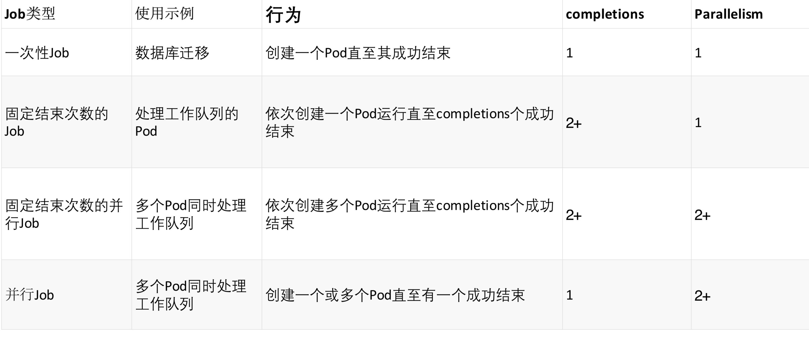

# Kubernetes对象详解 

## Job

`Job`负责批量处理短暂的一次性任务 (`short lived one-off tasks`)，即仅执行一次的任务，它保证批处理任务的一个或多个Pod成功结束。

Kubernetes支持以下几种Job:

### 1.非并行Job: 通常创建一个Pod直至其成功结束
### 2.固定结束次数的Job: 设置`.spec.completions`，创建多个`Pod`，直到`.spec.completions`个`Pod`成功结束
### 3.带有工作队列的并行Job:设置`.spec.Parallelism`但不设置`.spec.completions`，当所有Pod结束并且至少一个成功时，Job就认为是成功

## Job 模式




## Job Spec

*  `spec.template`格式同`Pod`
*  `RestartPolicy`仅支持`Never`或`OnFailure`
*  单个`Pod`时，默认`Pod`成功运行后`Job`即结束
*  `.spec.completions`标志Job结束需要成功运行的`Pod`个数，默认为1
*  `.spec.parallelism`标志并行运行的`Pod`的个数，默认为1
*  `spec.activeDeadlineSeconds`标志失败Pod的重试最大时间，超过这个时间不会继续重试

## CronJob

`CronJob`即定时任务，就类似于Linux系统的crontab，在指定的时间周期运行指定的任务。

在Kubernetes 1.5+，使用CronJob需要开启batch/v2alpha1 API，即--runtime-
config=batch/v2alpha1

从`v1.8`开始，`API`升级到`batch/v1beta1`，并在`apiserver`中默认开启


## CronJob Spec

*   `.spec.schedule`指定任务运行周期，格式同Cron
*   `.spec.jobTemplate`指定需要运行的任务，格式同Job
*   `.spec.startingDeadlineSeconds`指定任务开始的截止期限
*   `.spec.concurrencyPolicy`指定任务的并发策略，支持`Allow`、`Forbid`和`Replace`三个选项

## CronJob 示例

```
kubectl run hello --schedule="*/1 * * * *" --restart=OnFailure --image=busybox -- /bin/sh -c "date; echo Hello from the Kubernetes cluster"
```

```
apiVersion: batch/v1beta1
kind: CronJob
metadata:
  name: hello
spec:
  schedule: "*/1 * * * *"
  jobTemplate:
    spec:
      template:
        spec:
          containers:
          - name: hello
            image: busybox
            args:
            - /bin/sh
            - -c
            - date; echo Hello from the Kubernetes cluster
          restartPolicy: OnFailure
```

