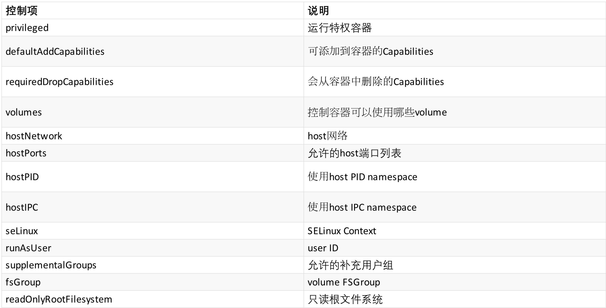

# Kubernetes对象详解

## Service Account

### Service account是为了方便Pod里面的进程调用Kubernetes API或其他外部服务而设计的。它与User account不同

* `User account`是为人设计的，而`service account`则是为Pod中的进程调用`Kubernetes API`而设计;
* `User account`是跨`namespace`的，而`service account`则是仅局限它所在的`namespace`;
* 每个`namespace`都会自动创建一个`default service account`
* `Token controller`检测`service account`的创建，并为它们创建secret
* 开启`ServiceAccount Admission Controller`后
* 每个Pod在创建后都会自动设置`spec.serviceAccountName`为`default`(除非指定了其他ServiceAccout)
* 验证Pod引用的`service account`已经存在，否则拒绝创建
* 如果Pod没有指定`ImagePullSecrets`，则把`service account`的`ImagePullSecrets`加到Pod中
* 每个`container`启动后都会挂载该`service account`的`token`和`ca.crt`到`/var/run/secrets/kubernetes.io/serviceaccount/`
* `$ kubectl exec nginx-3137573019-md1u2 ls /run/secrets/kubernetes.io/serviceaccount`
  *  ca.crt
  *  namespace
  *  token


## 添加ImagePullSecrets

```
apiVersion: v1
kind: ServiceAccount
metadata:
  creationTimestamp: 2015-08-07T22:02:39Z
  name: default
  namespace: default
  selfLink: /api/v1/namespaces/default/serviceaccounts/default
  uid: 052fb0f4-3d50-11e5-b066-42010af0d7b6
secrets:
- name: default-token-uudge
imagePullSecrets:
- name: myregistrykey
```

## 授权

`Service Account`为服务提供了一种方便的认证机制，但它不关心授权的问题。可以配合 `RBAC`来为`Service Account`鉴权:

*  配置 `--authorization-mode=RBAC`和`--runtime-config=rbac.authorization.k8s.io/v1alpha1`
*  配置`--authorization-rbac-super-user=admin`
*  定义`Role`、`ClusterRole`、`RoleBinding`或`ClusterRoleBinding`

## RBAC Sample

```
# This role allows to read pods in the namespace "default"
kind: Role
apiVersion: rbac.authorization.k8s.io/v1alpha1
metadata:
  namespace: default
  name: pod-reader
rules:
  - apiGroups: [""] # The API group "" indicates the core API Group.
    resources: ["pods"]
    verbs: ["get", "watch", "list"]
    nonResourceURLs: []
---
# This role binding allows "default" to read pods in the namespace "default"
kind: RoleBinding
apiVersion: rbac.authorization.k8s.io/v1alpha1
metadata:
  name: read-pods
  namespace: default
subjects:
  - kind: ServiceAccount # May be "User", "Group" or "ServiceAccount"
    name: default
roleRef:
  kind: Role
  name: pod-reader
  apiGroup: rbac.authorization.k8s.io
```

## Security Context

`Security Context`的目的是限制不可信容器的行为，保护系统和其他容器不受其影响。
Kubernetes提供了三种配置Security Context的方法:

* `Container-levelSecurityContext`:仅应用到指定的容器
* `Pod-levelSecurityContext`:应用到Pod内所有容器以及Volume
* `PodSecurityPolicies(PSP)`:应用到集群内部所有Pod以及Volume

## Container-level Security Context

仅应用到指定的容器上，并且不会影响`Volume`。比如设置容器运行在特权模式:

```
apiVersion: v1
kind: Pod
metadata:
  name: hello-world
spec:
  containers:
    - name: hello-world-container
    # The container definition
    # ...
    securityContext:
      privileged: true
```

## Pod-level Security Context

应用到Pod内所有容器，并且还会影响Volume(包括fsGroup和selinuxOptions)。

SELinux Example

```
securityContext:
  seLinuxOptions:
    user: system_u
    role: object_r
    type: svirt_sandbox_file_t
    level: s0:c100,c200

# ps auxZ | grep sleep
```

```
system_u:object_r:svirt_sandbox_file_t:s0:c100,c200 root 8633 0.1 0.0 4348 636 ? Ss 10:12 0:00 sleep 3600
```


## Pod Security Policies(PSP)

* `Pod Security Policies(PSP)`是集群级的Pod安全策略，自动为集群内的Pod和Volume设置 `Security Context`。 
* 使用`PSP`需要`APIServer`开启`extensions/v1beta1/podsecuritypolicy`，并且配置 `PodSecurityPolicyadmission`控制器。

## 支持的控制项



## 示例

### 限制容器的host端又范围为8000-8080:

```
apiVersion: extensions/v1beta1
kind: PodSecurityPolicy
metadata:
  name: permissive
spec:
  seLinux:
    rule: RunAsAny
  supplementalGroups:
    rule: RunAsAny
  runAsUser:
    rule: RunAsAny
  fsGroup:
    rule: RunAsAny
  hostPorts:
  - min: 8000
    max: 8080
  volumes
  - '*'
```

## Hostpath访问白名单

###  定义可访问的主机路径白名单

### 空列表代表无限制

```
apiVersion:extensions/v1beta1
kind: PodSecurityPolicy
metadata:
  name: custom-paths
spec:
  allowedHostPaths:
  # This allows "/foo", "/foo/", "/foo/bar" etc., but disallows "/fool", "/etc/foo" etc.
    - pathPrefix: "/foo"
```

## SELinux

`SELinux (Security-Enhanced Linux)` 是一种强制访问控制(`mandatory access control`)的实现 。它的作法是以最小权限原则(`principle of least privilege`)为基础，在Linux核心中使用 Linux安全模块(`Linux Security Modules`)。**SELinux主要由美国国家安全局开发，并于2000年12月22日发行给开放源代码的开发社区。**

### 可以通过runcon来为进程设置安全策略，ls和ps的-Z参数可以查看文件或进程的安全策略。

## 开启与关闭SELinux

* 修改`/etc/selinux/config`文件方法: 
* 开启:`SELINUX=enforcing`
* 关闭:S`ELINUX=disabled`
* 通过命令临时修改:
* 开启:`setenforce 1`
* 关闭:`setenforce 0`
* 查询SELinux状态: 
  * `getenforce`

## 示例

```
apiVersion: v1
kind: Pod
metadata:
  name: hello-world
spec:
  containers:
  - image: gcr.io/google_containers/busybox:1.24
    name: test-container
    command:
    - sleep
    - "6000"
    volumeMounts:
    - mountPath: /mounted_volume
      name: test-volume
  restartPolicy: Never
  hostPID: false
  hostIPC: false
  securityContext:
    seLinuxOptions:
      level: "s0:c2,c3"
  volumes:
  - name: test-volume
    emptyDir: {}
```

## 效果

这会自动给docker容器生成如下的`HostConfig.Binds`:

```
/var/lib/kubelet/pods/f734678c-95de-11e6-89b0-42010a8c0002/volumes/kubernetes.io~empty- dir/test-volume:/mounted_volume:Z
/var/lib/kubelet/pods/f734678c-95de-11e6-89b0- 42010a8c0002/volumes/kubernetes.io~secret/default-token- 88xxa:/var/run/secrets/kubernetes.io/serviceaccount:ro,Z
/var/lib/kubelet/pods/f734678c-95de-11e6-89b0-42010a8c0002/etc-hosts:/etc/hosts
```

对应的volume也都会正确设置`SELinux`:

```
$ls-Z/var/lib/kubelet/pods/f734678c-95de-11e6-89b0-42010a8c0002/volumes
drwxr-xr-x.rootrootunconfined_u:object_r:svirt_sandbox_file_t:s0:c2,c3kubernetes.io~empty-dir
drwxr-xr-x.rootrootunconfined_u:object_r:svirt_sandbox_file_t:s0:c2,c3kubernetes.io~secret
```


