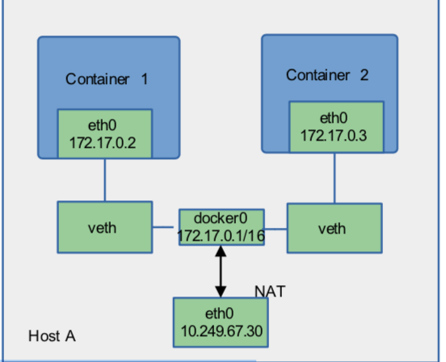
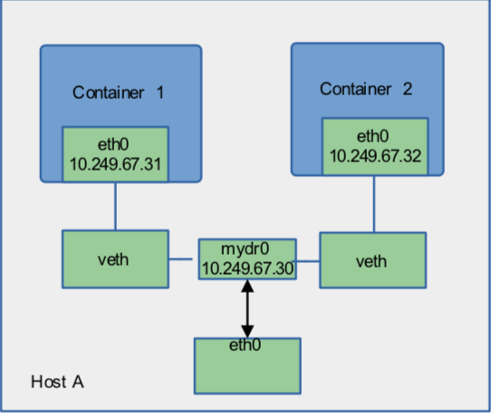
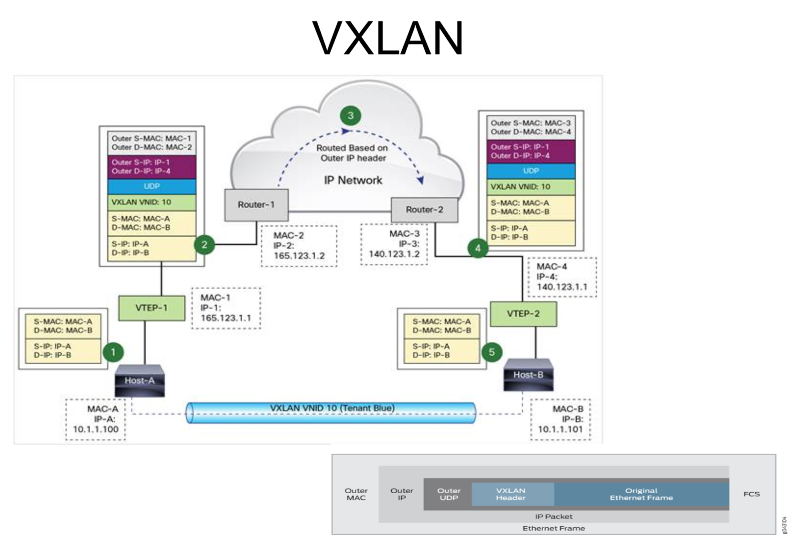
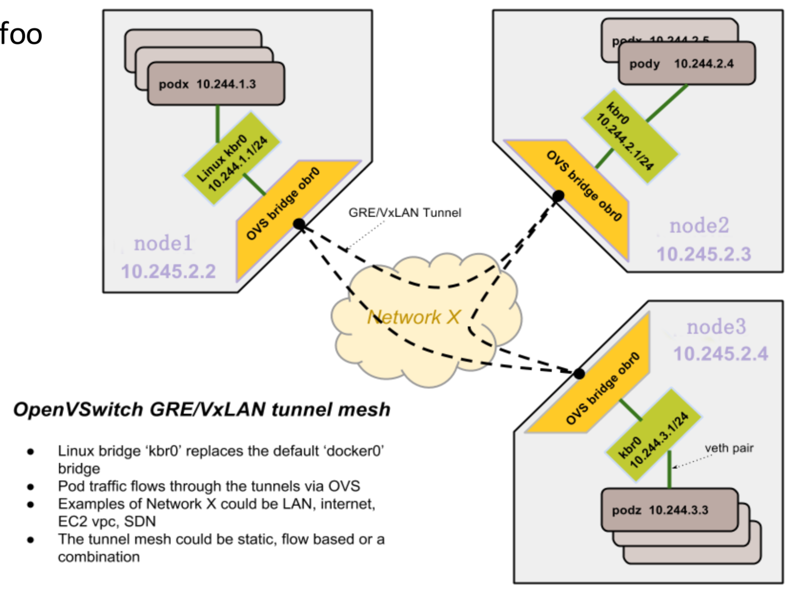
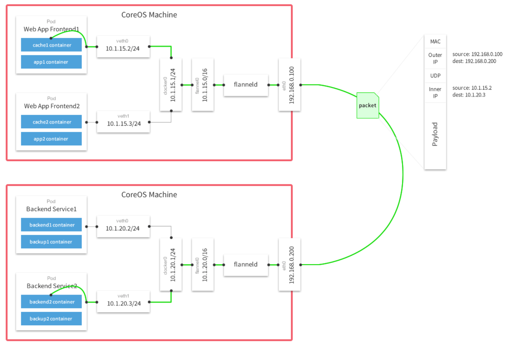
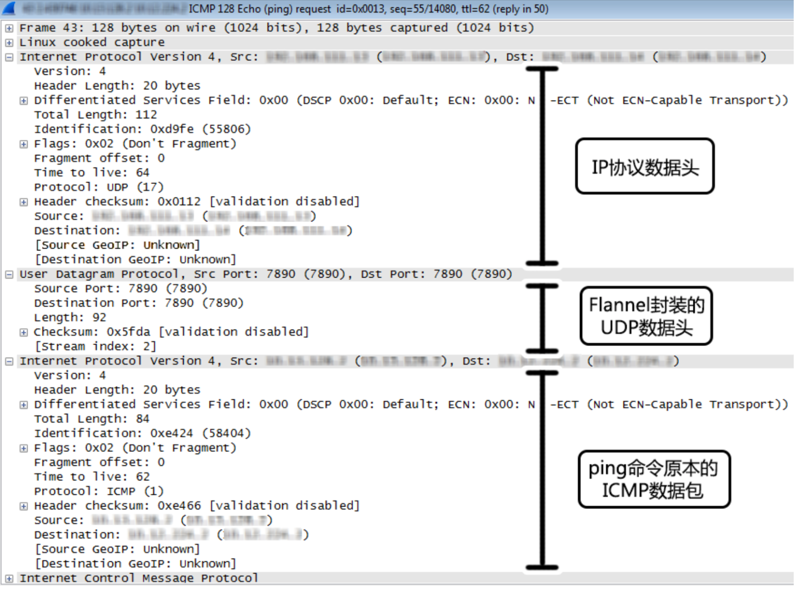

# 2.容器网络

## Docker Net

## Docker支持的网络模式

### Null(--net=None)

* 把容器放入独立的网络空间但不做任何网络配置
* 用户需要通过运行`docker network`命令来完成网络配置

### Host

* 使用主机网络名空间，复用主机网络

### Container

* 重用其他容器的网络

### Bridge(--net=bridge)

* 使用`Linux网桥`和`iptables`提供容器互联，docker在每台主机上创建一个名叫`docker0的网桥`，通过`veth pair`来连接该主机的每一个`endpoint`

### Overlay(libnetwork,libkv)

* 通过网络封包实现

### Remote(`work with remote drivers`)

* **Underlay**

```
使用现有底层网络，为每一个容器配置可路由的网络IP
```
* **Overlay**

```
通过网络封包实现
```

## Null模式

**为主机eth0分配ip 10.249.67.30**

**启动docker daemon，查看主机iptables**

```
POSTROUTING -A POSTROUTING -s 172.17.0.0/16 ! -o docker0 -j MASQUERADE
```

**在主机启动容器**

```
docker run -d --name ssh -p 2333:22 centos-ssh
```

docker会以标准模式配置网络

* 创建vethpair
* 将vethpair的一端连接到docker0网桥
* ethpair的另外一端设置为容器名空间的eth0
* 为容器名空间的eth0分配ip
* 主机上的Iptables规则

```
PREROUTING -A DOCKER ! -i docker0 -p tcp -m tcp --dport 2333 -j DNAT --to-destination 172.17.0.2:22
```




## Underlay


* 采用Linux 网桥设备`(sbrctl)`，通过物理网络连通容器
* 创建新的网桥设备`mydr0`
* 将主机网卡加入网桥
* 把主机网卡的地址配置到网桥，并把默认路由规则转移到网桥mydr0 
* 启动容器
* 创建veth对，并且把一个peer添加到网桥mydr0
* 配置容器把veth的另一个peer分配给容器网卡




## Docker Libnetwork Overlay

* `Docker overlay`网络驱动原生支持多主机网络
* `Libnetwork`是一个内置的基于`VXLAN`的网络驱动





## Docker Overlay 网络示例 – OVS

* Docker需要指定分布式`KVstore`启动

* OVS plugin

```
• Docker有内置的OVS驱动
• 实现了Docker网络驱动API
• 通过指定OVSdriver创建网络
• docker network create -d openvswitch --subnet=192.168.1.0/24 foo
• 通过指定网络名来创建容器
  docker run -itd --net=foo --name=busybox busybox
```




## Overlay network sample – Flannel





## 创建docker镜像

### 定义dockerfile

```
FROM ubuntu
# so apt-get doesn't complain
ENV DEBIAN_FRONTEND=noninteractive
RUN sed -i 's/^exit 101/exit 0/' /usr/sbin/policy-rc.d
RUN \
apt-get update && \
apt-get install -y ca-certificates && \ apt-get install -y curl && \
rm -rf /var/lib/apt/lists/*
ADD ./bin/eic eic ENTRYPOINT ["/eic"]
```

## Docker镜像管理

* docker save/load 
* docker tag
* docker push/pull

## 镜像仓库

### Docker hub

[https://hub.docker.com/](https://hub.docker.com/)

### 创建私有镜像仓库

```
sudo docker run -d -p 5000:5000 registry
```

## 容器操作

### 启动

**docker run **

```
docker run
           • -it交互
           • -d 后台运行
           • -p 端又映射
           • -v 磁盘挂载
```

**启动已终止容器**

```
docker start
```

**停止容器**

```
docker stop
```

**进入容器**

```
1. docker attach
2. 通过nsenter
   PID=$(docker inspect --format "{{ .State.Pid }}" <container>)
   $ nsenter --target $PID --mount --uts --ipc --net --pid
```

## Docker优势

### 与宿主机共享内核:

```
  • 不需要再启动内核，所以应用扩缩容时可以秒速启动。
  • 资源利用率高，直接使用宿主机内核调度资源，性能损失小。 
  • 方便的CPU、内存资源调整。
  • 能实现秒级快速回滚。
```

### 封装性:

```
• 一键启动所有依赖服务，测试不用为搭建环境犯愁，PE也不用为建站复杂担心。 
• 镜像一次编译，随处使用
• 测试、生产环境高度一致(数据除外)。
```

### 隔离性

```
• 应用的运行环境和宿主机环境无关，完全由镜像控制，一台物理机上部署多种环境的镜像测试。 
• 多个应用版本可以并存在机器上。
```

**镜像增量分发， 由于采用了Union FS， 简单来说就是支持将不同的目录挂载到同一个虚拟文件系统下，并实现一种layer的概念， 每次发布只传输变化的部分，节约带宽**。


### 社区活跃

**Docker命令简单、易用，社区十分活跃，且周边组件丰富。**


