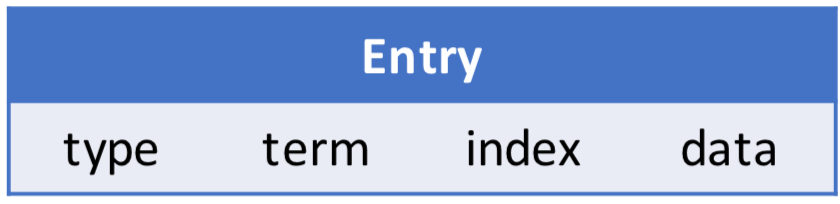
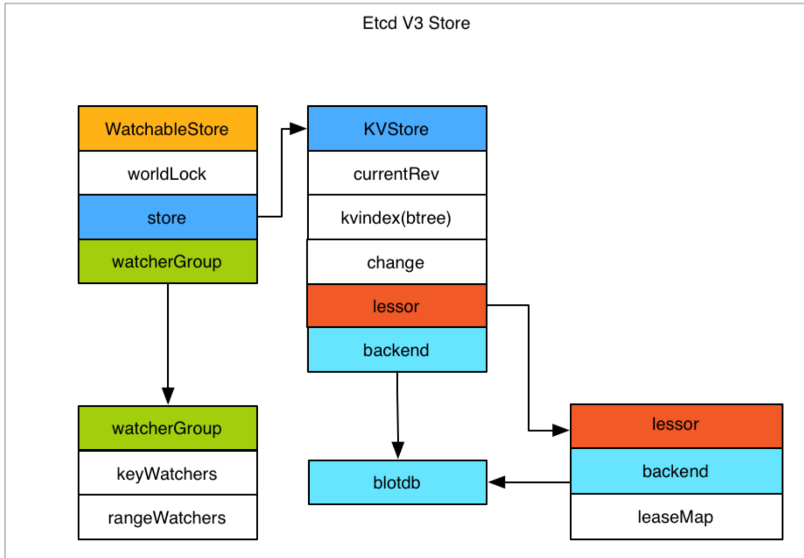

# Kubernetes高阶(设计和实现)

## Etcd

`Etcd`是CoreOS基于Raft开发的分布式`key-value`存储，可用于服务发现、共享配置以及一致性保障(如`数据库选主`、`分布式锁`等)。

## 主要功能

### 1.基本的key-value存储
### 2.监听机制
### 3.key的过期及续约机制，用于监控和服务发现
### 4.原子CAS和CAD，用于分布式锁和leader选举

## Etcd基于RAFT的一致性

### 选举方法:

1) **初始启动时**，节点处于`follower`状态并被设定一个`election timeout`，如果在这一时间周期内没有收到来自 `leader` 的 `heartbeat`，节点将发起选举:将自己切换为 `candidate` 之后，向集群中其它 `follower` 节点发送请求， 询问其是否选举自己成为 `leader`。

2) **当收到来自集群中过半数节点的接受投票后**，节点即成为 `leader`，开始接收保存 `client` 的数据并向其它的 follower 节点同步日志。如果没有达成一致，则candidate随机选择一个等待间隔(150ms ~ 300ms)再次发起 投票，得到集群中半数以上follower接受的candidate将成为leader

3) **`leader`节点依靠定时向 `follower` 发送`heartbeat`来保持其地位。**

4) 任何时候如果其它 `follower` 在 `election timeout` 期间都没有收到来自 `leader` 的 `heartbeat`，同样会将自己的状态切换为 `candidate` 并发起选举。每成功选举一次，新 `leader` 的任期(Term)都会比之前 `leader` 的任期大1。

## 日志复制

当接Leader收到客户端的日志(事务请求)后先把该日志追加到本地的Log中，然后通过 heartbeat把该Entry同步给其他Follower，Follower接收到日志后记录日志然后向Leader发送 ACK，当Leader收到大多数(n/2+1)Follower的ACK信息后将该日志设置为已提交并追加 到本地磁盘中，通知客户端并在下个heartbeat中Leader将通知所有的Follower将该日志存储 在自己的本地磁盘中。

## 安全性

* 安全性是用于保证每个节点都执行相同序列的安全机制，如当某个`Follower`在当前`Leader commit Log`时变得不可用了，稍后可能该Follower又会被选举为Leader，这时新Leader可能会用新的Log覆盖先前已committed的Log，这就是导致节点执行不同序列;Safety就是用于保证选举出来的`Leader`一定包含先前 `committed Log`的机制;

* 选举安全性(`Election Safety`):每个任期(`Term`)只能选举出一个`Leader`

* Leader完整性(LeaderCompleteness):指Leader日志的完整性，当Log在任期Term1被 Commit后，那么以后任期Term2、Term3...等的Leader必须包含该Log;Raft在选举阶段就 使用Term的判断用于保证完整性:当请求投票的该Candidate的Term较大或Term相同Index 更大则投票，否则拒绝该请求。

## 失效处理

* **Leader失效**:其他没有收到`heartbeat`的节点会发起新的选举，而当`Leader`恢复后由于步进数小会自动成为`follower`(日志也会被新leader的日志覆盖)

* **follower节点不可用**:`follower`节点不可用的情况相对容易解决。因为集群中的日志内容始终是从 leader 节点同步的，只要这一节点再次加入集群时重新从 leader 节点处复制日志即可。

* **多个candidate**:冲突后`candidate`将随机选择一个等待间隔(`150ms ~ 300ms`)再次发起投票，得到集群中半数以上`follower`接受的`candidate`将成为`leader`

## wal日志

**wal日志**是二进制的，解析出来后是以上数据结构LogEntry。其中第一个字段type，只有两 种，一种是0表示Normal，1表示ConfChange(ConfChange表示 Etcd 本身的配置变更同步， 比如有新的节点加入等)。第二个字段是term，每个term代表一个主节点的任期，每次主 节点变更term就会变化。第三个字段是index，这个序号是严格有序递增的，代表变更序号。 第四个字段是二进制的data，将raft request对象的pb结构整个保存下。Etcd 源码下有个 tools/etcd-dump-logs，可以将wal日志dump成文本查看，可以协助分析raft协议。

**raft协议**本身不关心应用数据，也就是data中的部分，一致性都通过同步wal日志来实现， 每个节点将从主节点收到的data apply到本地的存储，raft只关心日志的同步状态，如果本 地存储实现的有bug，比如没有正确的将data apply到本地，也可能会导致数据不一致。

 
## Etcd v3 存储，Watch以及过期机制

## 存储机制

* `Etcd v3 store` 分为两部分，**一部分是内存中的索引，`kvindex`**，是基于google开源的一个 golang的btree实现的，另外一部分是**后端存储。按照它的设计，backend可以对接多种存储， 当前使用的`boltdb`**。boltdb是一个单机的支持事务的kv存储，Etcd 的事务是基于boltdb的事 务实现的。Etcd在boltdb中存储的key是reversion，value是 Etcd 自己的key-value组合，也就 是说 Etcd 会在boltdb中把每个版本都保存下，从而实现了多版本机制。

* `reversion`主要由两部分组成，第一部分`main rev`，每次事务进行加一，第二部分`sub rev`，同一个事务中的每次操作加一。

* Etcd 提供了命令和设置选项来控制compact，同时支持put操作的参数来精确控制某个key的 历史版本数。

* 内存`kvindex`保存的就是`key`和`reversion`之前的映射关系，用来加速查询。

## Watch机制

* Etcd v3 的watch机制支持watch某个固定的key，也支持watch一个范围(可以用于模拟目录 的结构的watch)，所以 watchGroup 包含两种watcher，一种是 key watchers，数据结构是每 个key对应一组watcher，另外一种是 range watchers, 数据结构是一个 IntervalTree，方便通 过区间查找到对应的watcher。

* 同时，每个 WatchableStore 包含两种 watcherGroup，一种是synced，一种是unsynced，前者 表示该group的watcher数据都已经同步完毕，在等待新的变更，后者表示该group的watcher 数据同步落后于当前最新变更，还在追赶。

* 当 Etcd 收到客户端的watch请求，如果请求携带了revision参数，则比较请求的revision和 store当前的revision，如果大于当前revision，则放入synced组中，否则放入unsynced组。同时 Etcd 会启动一个后台的goroutine持续同步unsynced的watcher，然后将其迁移到synced组。 也就是这种机制下，Etcd v3 支持从任意版本开始watch，没有v2的1000条历史event表限制 的问题(当然这是指没有compact的情况下)

