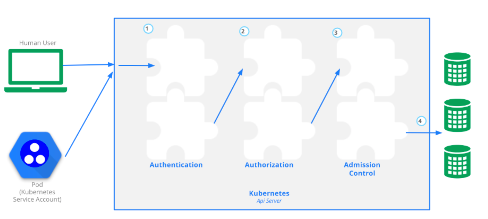
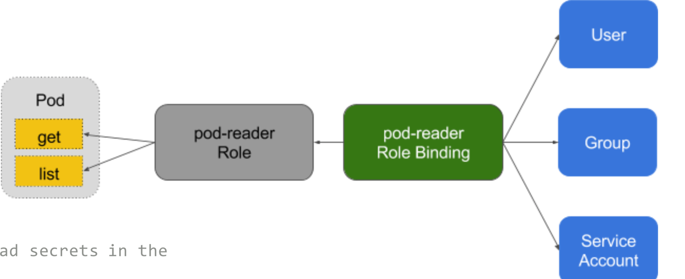
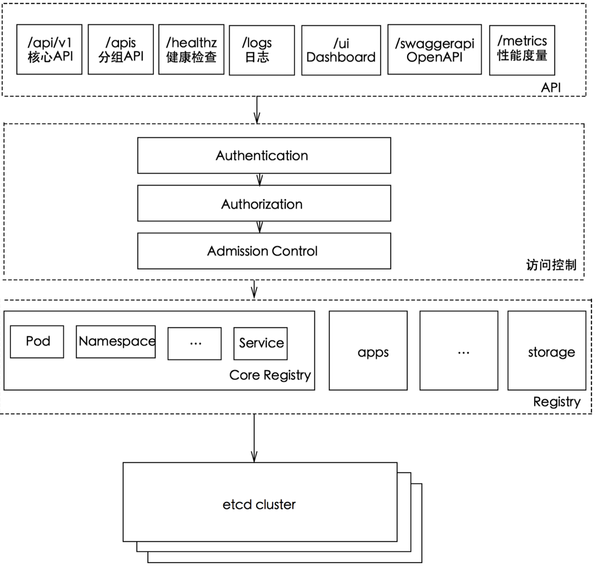

# Kubernetes高阶(设计和实现)

## API Server

`kube-apiserver`是`Kubernetes`最重要的核心组件之一，主要提供以下的功能

### 1.提供集群管理的REST API接口，包括认证授权、数据校验以及集群状态变更等
### 2.提供其他模块之间的数据交互和通信的枢纽(其他模块通过`API Server`查询或修改数据，只有`API Server`才直接操作`etcd`)

## 访问控制

### `Kubernetes API`的每个请求都会经过多阶段的访问控制之后才会被接受，这包括`认证`、`授权` 以及`准入控制`Admission Control)`等



## 认证

开启`TL`S时，所有的请求都需要首先认证。Kubernetes支持多种认证机制，并支持同时开启多个认证插件(只要有一个认证通过即可)。如果认证成功，则用户的username会传入授权模块做进一步授权验证;而对于认证失败的请求则返回HTTP 401。

## 认证插件

### X509证书

使用X509客户端证书只需要`API Server`启动时配置`--client-ca-file=SOMEFILE`。在证书认证时，其
`CN`域用作用户名，而组织机构域则用作`group`名。

### 静态Token文件

* 使用静态`Token`文件认证只需要`APIServer`启动时配置`--token-auth-file=SOMEFILE`。
* 该文件为csv格式，每行至少包括三列`token`,`username`,`userid`，

### 引导Token

* 引导`Token`是动态生成的，存储在`kube-systemname space`的Secret中，用来部署新的`Kubernetes`集群 
* 使用引导`Token`需要`APIServer`启动时配置`--experimental-bootstrap-token-auth`，并且`Controller Manager`开启`TokenCleaner --controllers=*`,`tokencleaner`,`bootstrapsigner`。

### 使用`kubeadm`部署`Kubernetes`时，`kubeadm`会自动创建默认`token`，可通过`kubeadm token list`命令查询。

### 静态密码文件

需要`API Server`启动时配置`--basic-auth-file=SOMEFILE`，文件格式为`csv`，每行至少三列`password`, `user`,`uid`，后面是可选的`group`名，如

password,user,uid,"group1,group2,group3”

###  ServiceAccount

`ServiceAccount`是`Kubernetes`自动生成的，并会自动挂载到容器的

`/run/secrets/kubernetes.io/serviceaccount`目录中。

### OpenID

`OAuth2`的认证机制

### OpenStack Keystone密码

需要`API Server`在启动时指定`--experimental-keystone-url=<AuthURL>`，而`https`时还需要设置`--
experimental-keystone-ca-file=SOMEFILE`。

###  匿名请求

如果使用·AlwaysAllow·以外的认证模式，则匿名请求默认开启，但可用`--anonymous-auth=false`禁止匿名请求。


## 授权

**授权主要是用于对集群资源的访问控制，通过检查请求包含的相关属性值，与相对应的访问策略相比较，API请求必须满足某些策略才能被处理**。跟认证类似，Kubernetes也支持多种授权机制，并支持同时开启多个授权插件(只要有一个验证通过即可)。如果授权成功，则用户的请求会发送到准入控制模块做进一步的请求验证;对于授权失败的请求则返回`HTTP 403`。

Kubernetes授权仅处理以下的请求属性:

* user, group, extra
* API、请求方法(如get、post、update、patch和delete)和请求路径(如/api)
* 请求资源和子资源
* Namespace
* API Group

目前，Kubernetes支持以下授权插件:

* ABAC
* RBAC
* Webhook 
* Node

## RBAC vs ABAC

1.`ABAC`(`Attribute Based Access Control`)本来是不错的概念，但是在 Kubernetes 中的实现比较难于管理和理解，而且需要对 Master 所在节点的 SSH 和文件系统权限，而且要使得对授 权的变更成功生效，还需要重新启动 API Server。

2.而 `RBAC` 的授权策略可以利用 `kubectl` 或者 `Kubernetes API` 直接进行配置。**`RBAC` 可以授权给用户，让用户有权进行授权管理，这样就可以无需接触节点，直接进行授权管理**。`RBAC` 在 `Kubernetes` 中被映射为 `API` 资源和操作。

## Role与ClusterRole

`Role(角色)`是一系列权限的集合，例如一个角色可以包含**读取 `Pod` 的权限**和**列出 `Pod` 的权限**。

1. **Role只能用来给某个特定namespace中的资源作鉴权**，
2. 对多`namespace`和`集群级的资源`或者是`非资源类`的`API`(如`/healthz`)使用`ClusterRole`。

```
# Role示例
kind: Role
apiVersion: rbac.authorization.k8s.io/v1
metadata:
  namespace: default
  name: pod-reader
rules:
- apiGroups: [""] # "" indicates the core API group
  resources: ["pods"]
  verbs: ["get", "watch", "list"]
```

```
# ClusterRole示例
kind: ClusterRole
apiVersion: rbac.authorization.k8s.io/v1
metadata:
  # "namespace" omitted since ClusterRoles are not namespaced
  name: secret-reader
rules:
- apiGroups: [""]
  resources: ["secrets"]
  verbs: ["get", "watch", "list"]
```

## binding

```
# RoleBinding示例(引用ClusterRole)
# This role binding allows "dave" to read secrets in the "development" namespace.

kind: RoleBinding
apiVersion: rbac.authorization.k8s.io/v1
metadata:
  name: read-secrets
  namespace: development # This only grants permissions within the "development" namespace.
subjects:
- kind: User
  name: dave
  apiGroup: rbac.authorization.k8s.io
roleRef:
  kind: ClusterRole
  name: secret-reader
  apiGroup: rbac.authorization.k8s.io
```




## 准入控制

**准入控制(`Admission Control`)在授权后对请求做进一步的验证或添加默认参数**。不同于授权和认证只关心请求的用户和操作，**准入控制还处理请求的内容，并且仅对创建、更新、 删除或连接(如代理)等有效，而对读操作无效**。

准入控制支持同时开启多个插件，它们依次调用，只有全部插件都通过的请求才可以放过进入系统。

## 准入控制插件


* AlwaysAdmit: 接受所有请求。
* AlwaysPullImages: 总是拉取最新镜像。在多租户场景下非常有用。
* DenyEscalatingExec: 禁止特权容器的exec和attach操作。
* ImagePolicyWebhook: 通过webhook决定image策略，需要同时配置--admission-control-config-file，配置文件格式见这里。
* ServiceAccount:自动创建默认ServiceAccount，并确保Pod引用的ServiceAccount已经存在
* SecurityContextDeny:拒绝包含非法SecurityContext配置的容器
* ResourceQuota:限制Pod的请求不会超过配额，需要在namespace中创建一个ResourceQuota对象
* LimitRanger:为Pod设置默认资源请求和限制，需要在namespace中创建一个LimitRange对象
* InitialResources:根据镜像的历史使用记录，为容器设置默认资源请求和限制
* NamespaceLifecycle:确保处于termination状态的namespace不再接收新的对象创建请求，并拒绝请求不存在的namespace
* DefaultStorageClass:为PVC设置默认StorageClass(见这里
* DefaultTolerationSeconds:设置Pod的默认forgiveness toleration为5分钟
* PodSecurityPolicy:使用Pod Security Policies时必须开启
* NodeRestriction:限制kubelet仅可访问node、endpoint、pod、service以及secret、configmap、PV和PVC等相关的资源

## 启动apiserver示例

```
kube-apiserver --feature-gates=AllAlpha=true --runtime-config=api/all=true \ 
--requestheader-allowed-names=front-proxy-client \ 
--client-ca-file=/etc/kubernetes/pki/ca.crt \
--allow-privileged=true \
--experimental-bootstrap-token-auth=true \
--storage-backend=etcd3 \
--requestheader-username-headers=X-Remote-User \ 
--requestheader-extra-headers-prefix=X-Remote-Extra- \ 
--service-account-key-file=/etc/kubernetes/pki/sa.pub \ 
--tls-cert-file=/etc/kubernetes/pki/apiserver.crt \ 
--tls-private-key-file=/etc/kubernetes/pki/apiserver.key \ 
--kubelet-client-certificate=/etc/kubernetes/pki/apiserver-kubelet-client.crt \ 
--requestheader-client-ca-file=/etc/kubernetes/pki/front-proxy-ca.crt \ 
--insecure-port=8080 \
--admission- control=NamespaceLifecycle,LimitRanger,ServiceAccount,PersistentVolumeLabel,DefaultStorageClass, ResourceQuota,DefaultTolerationSeconds \
--requestheader-group-headers=X-Remote-Group \ 
--kubelet-client-key=/etc/kubernetes/pki/apiserver-kubelet-client.key \ 
--secure-port=6443 \ 
--kubelet-preferred-address-types=InternalIP,ExternalIP,Hostname \ 
--service-cluster-ip-range=10.96.0.0/12 \
--authorization-mode=RBAC \
--advertise-address=192.168.0.20 
--etcd-servers=http://127.0.0.1:2379
```

## kube-apiserver工作原理

