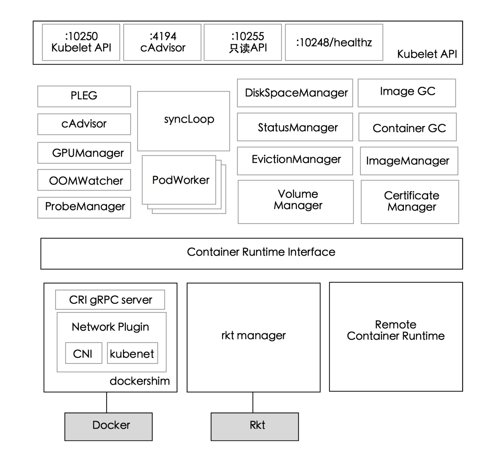

# Kubernetes高阶(设计和实现)

## Kubelet

### 1.每个节点上都运行一个`kubelet服务进程`，默认监听`10250`端口，接收并执行`master`发来的指令，管理`Pod`及`Pod`中的容器。

### 2.每个`kubelet`进程会在`API Server上`注册节点自身信息，定期向 `master`节点汇报节点的资源使用情况，并通过`cAdvisor`监控节点和容器的资源。

## 节点管理

### 节点管理主要是`节点自注册`和`节点状态更新`:

1. Kubelet可以通过设置启动参数`--register-node`来确定是否向APIServer注册自己;
2. 如果`Kubelet`没有选择自注册模式，则需要用户自己**配置Node资源信息**，同时需要**告知Kubelet集群上的API Server的位置**;
3. `Kubelet`在启动时通过`APIServer`注册节点信息，并定时向APIServer发送节点新消息，**APIServer在接收到新消息后，将信息写入etcd.**

## Pod管理

### 获取Pod清单

* 文件:启动参数`--config`指定的配置目录下的文件(默认`/etc/kubernetes/manifests/`)。该文件每`20 秒`重新检查一次(可配置)
* `HTTPendpoint(URL)`:启动参数`--manifest-url`设置。每20秒检查一次这个端点(可配置)。
* `API Server`:通过`API Server`监听`etcd`目录，同步Pod清单。
* `HTTP server`:`kubelet`侦听`HTTP`请求，并响应简单的API以提交新的Pod清单。

## 通过API Server获取Pod清单及创建Pod的过程

1. `Kubelet`通过`API Server Client`(Kubelet启动时创建)使用`Watch`加`List`的方式监听 `"/registry/nodes/$当前节点名"`和`“/registry/pods”`目录，将获取的信息同步到本地缓存中。
2. Kubelet监听etcd，所有针对Pod的操作都将会被Kubelet监听到。如果发现有新的绑定到本节 点的Pod，则按照Pod清单的要求创建该Pod。
3. 如果发现本地的Pod被修改，则`Kubelet`会做出相应的修改，比如删除Pod中某个容器时，则通过`Docker Client`删除该容器。 如果发现删除本节点的`Pod`，则删除相应的`Pod`，并通过 `Docker Client`删除`Pod`中的容器。

## Kubelet读取监听到的信息，如果是创建和 修改Pod任务，则执行如下处理:

1. 为该Pod创建一个数据目录;
2. 从APIServer读取该Pod清单;
3. 为该Pod挂载外部卷;
4. 下载Pod用到的Secret;
5. 检查已经在节点上运行的Pod，如果该Pod没有容器或Pause容器没有启动，则先停止Pod里所有容器的进程。如果在Pod中有需要删除的容器，则删除这些容器;
6. 用“kubernetes/pause”镜像为每个Pod创建一个容器。Pause容器用于接管Pod中所有其他容器的网络。每创建一个新的Pod，Kubelet都会先创建一个Pause容器，然后创建其他容器。
7. 为Pod中的每个容器做如下处理:
   1. 为容器计算一个hash值，然后用容器的名字去Docker查询对应容器的hash值。若查找到容器，且两者 hash值不同，则停止Docker中容器的进程，并停止与之关联的Pause容器的进程;若两者相同，则不做 任何处理;
   2. 如果容器被终止了，且容器没有指定的restartPolicy，则不做任何处理;
   3. 调用Docker Client下载容器镜像，调用Docker Client运行容器。

##  Static Pod
 
所有以非`API Server`方式创建的`Pod`都叫`Static Pod`。`Kubelet`将`Static Pod`的状态汇报给`API Server`，`API Server`为该`Static Pod`创建一个`Mirror Pod`和其相匹配。`Mirror Pod`的状态将真实反映`Static Pod`的状态。当`Static Pod`被删除时，与之相对应的`Mirror Pod`也会被删除

## 容器健康检查

* `Kubernetes`集群中，应用程序的执行情况可以在不同的级别上监测到，这些级别包括:`容器`、 `Pod`、`Service`和`整个集群`。

* Heapster项目为Kubernetes提供了一个基本的监控平台，它是集群级别的监控和事件数据集 成器(Aggregator)。Heapster以Pod的方式运行在集群中，Heapster通过Kubelet发现所有运行 在集群中的节点，并查看来自这些节点的资源使用情况。Kubelet通过cAdvisor获取其所在 节点及容器的数据。Heapster通过带着关联标签的Pod分组这些信息，这些数据将被推到一 个可配置的后端，用于存储和可视化展示。支持的后端包括InfluxDB(使用Grafana实现可视 化)和Google Cloud Monitoring。

* cAdvisor是一个开源的分析容器资源使用率和性能特性的代理工具，已集成到Kubernetes代 码中。cAdvisor自动查找所有在其所在节点上的容器，自动采集CPU、内存、文件系统和网 络使用的统计信息。cAdvisor通过它所在节点机的Root容器，采集并分析该节点机的全面使 用情况。

* cAdvisor通过其所在节点机的4194端又暴露一个简单的UI。

## Kubelet组件

