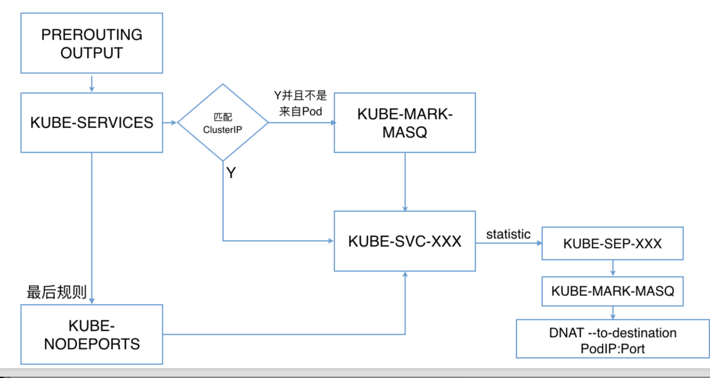
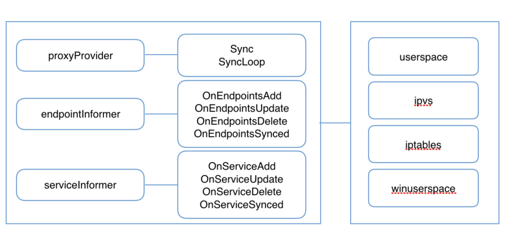
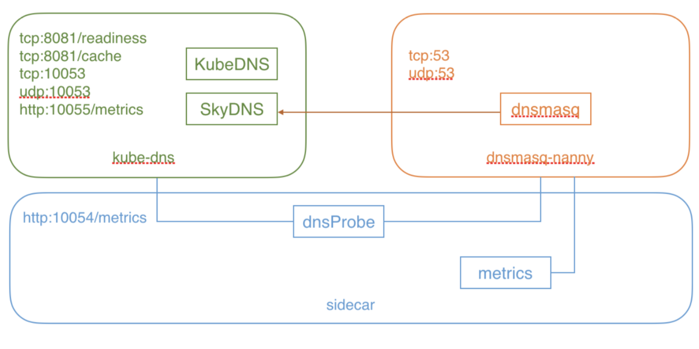
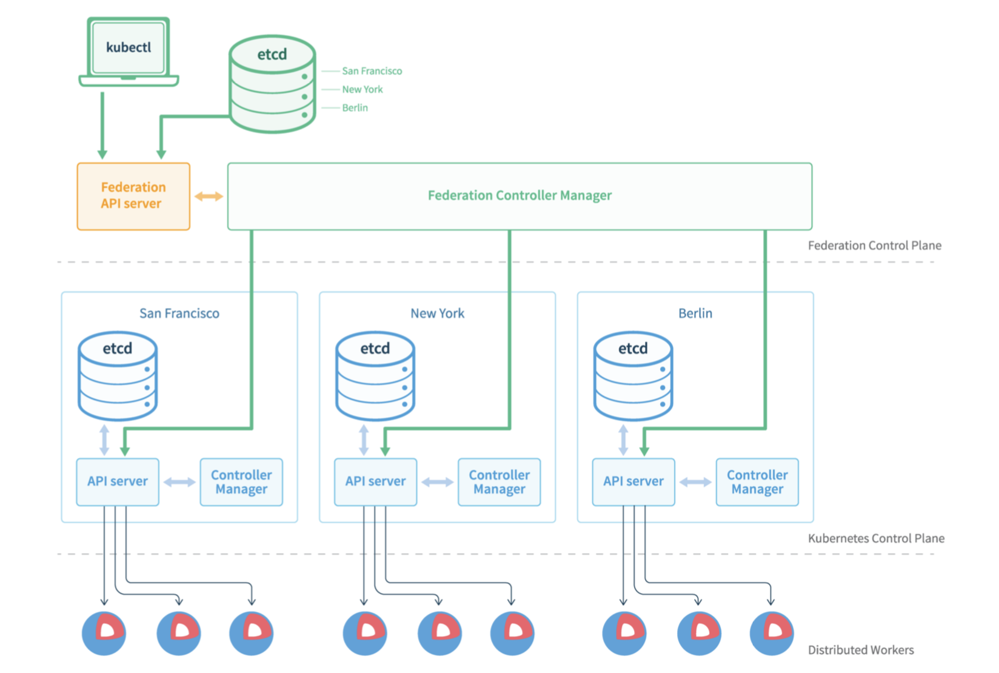

# Kubernetes高阶(设计和实现)
## kube-proxy

### 每台机器上都运行一个`kube-proxy`服务，它监听`API server`中`service`和`endpoint`的变化情况， 并通过`iptables`等来为服务配置负载均衡(仅支持TCP和UDP)。

### `kube-proxy`可以直接运行在物理机上，也可以以`static pod`或者`daemonset`的方式运行。

### kube-proxy当前支持一下几种实现

* `userspace`:最早的负载均衡方案，它在用户空间监听一个端口，所有服务通过iptables转发到这个端口，然后在其内部负载均衡到实际的Pod。该方式最主要的问题是效率低，有明显的性能瓶颈。
* `iptables`:目前推荐的方案，完全以iptables规则的方式来实现`service`负载均衡。该方式最主要的问题是在服务多的时候产生太多的`iptables`规则，非增量式更新会引入一定的时延，大规模情况下 ]有明显的性能问题
* `ipvs`:为解决iptables模式的性能问题，`v1.8`新增了`ipvs`模式，采用增量式更新，并可以保证`service` 更新期间连接保持不断开
* `winuserspace`:同`userspace`，但仅工作在windows上

###  Kubernetes Iptables规则



### Iptables示例

```
-A KUBE-MARK-DROP -j MARK --set-xmark 0x8000/0x8000
-A KUBE-MARK-MASQ -j MARK --set-xmark 0x4000/0x4000
-A KUBE-POSTROUTING -m comment --comment "kubernetes service traffic requiring SNAT" -m mark --mark 0x4000/0x4000 -j MASQUERADE
-A KUBE-SEP-55QZ6T7MF3AHPOOB -s 10.244.1.6/32 -m comment --comment "default/http:" -j KUBE-MARK-MASQ
-A KUBE-SEP-55QZ6T7MF3AHPOOB -p tcp -m comment --comment "default/http:" -m tcp -j DNAT --to-destination 10.244.1.6:80
-A KUBE-SEP-KJZJRL2KRWMXNR3J -s 10.244.1.5/32 -m comment --comment "default/http:" -j KUBE-MARK-MASQ
-A KUBE-SEP-KJZJRL2KRWMXNR3J -p tcp -m comment --comment "default/http:" -m tcp -j DNAT --to-destination 10.244.1.5:80
-A KUBE-SERVICES -d 10.101.85.234/32 -p tcp -m comment --comment "default/http: cluster IP" -m tcp --dport 80 -j KUBE-SVC-7IMAZDGB2ONQNK4Z
-A KUBE-SVC-7IMAZDGB2ONQNK4Z -m comment --comment "default/http:" -m statistic --mode random --probability 0.50000000000 -j KUBE-SEP-KJZJRL2KRWMXNR3J
-A KUBE-SVC-7IMAZDGB2ONQNK4Z -m comment --comment "default/http:" -j KUBE-SEP-55QZ6T7MF3AHPOOB
```


###  kube-proxy工作原理




## kube-dns

### 支持的DNS格式

### Service

`A record`:生成`my-svc.my-namespace.svc.cluster.local`，解析IP分为两种情况

```
普通Service解析为Cluster IP
Headless Service解析为指定的Pod IP列表
```

`SRV record`:生成`_my-port-name._my-port-protocol.my-svc.my-namespace.svc.cluster.local`

### Pod

* `A record`:`pod-ip-address.my-namespace.pod.cluster.local`
* 指定`hostname`和`subdomain:hostname.custom-subdomain.default.svc.cluster.local`

### 私有DNS服务器和上游DNS服务器

### kube-dns由三个容器构成:

1.`kube-dns`:DNS服务的核心组件，主要由`KubeDNS`和`SkyDNS`组成

```
1.KubeDNS负责监听Service和Endpoint的变化情况 ，并将相关的信息更新到SkyDNS中
2. SkyDNS负责DNS解析，监听在10053端又 (tcp/udp)，同时也监听在10055端又提供metrics
3. kube-dns还监听了8081端又，以供健康检查使用
```

2.`dnsmasq-nanny`:负责启动`dnsmasq`，并在配置发生变化时重启`dnsmasq`

```
dnsmasq的upstream为SkyDNS，即集群内部的 DNS解析由SkyDNS负责
```

3.sidecar:负责健康检查和提供`DNS metrics`(监听在`10054端口`)




## Federation

### 在云计算环境中，服务的作用距离范围从近到远一般可以有:同主机(`Host，Node`)、跨主机同可用区(`Available Zone`)、跨可用区同地区(`Region`)、跨地区同服务商(`Cloud Service Provider`)、跨云平台。

### `K8s`的设计定位是单一集群在同一个地域内，因为同一个地区的网络性能才能满足`K8s`的调度和计算存储连接要求。而集群联邦(`Federation`)就是为提供跨`Region`跨服务商`K8s`集群服务而设计的。

### 每个`Federation`有自己的分布式存储、`API Server`和`Controller Manager`。用户可以通过 `Federation`的`API Server`注册该`Federation`的成员`K8s Cluster`。当用户通过`Federation`的`API Serve`r创建、更改`API`对象时，`Federation API Server`会在自己所有注册的子`K8s Cluster`都创建一份对应的`API`对象。在提供业务请求服务时，`K8s Federation`会先在自己的各个子 `Cluster`之间做负载均衡，而对于发送到某个具体`K8s Cluster`的业务请求，会依照这个`K8s Cluster`独立提供服务时一样的调度模式去做`K8s Cluster`内部的负载均衡。而`Cluster`之间的负载均衡是通过域名服务的负载均衡来实现的。


## Federation 架构



### 注册集群和查询

**`kubernetes`集群可以通过`kubefed join`命令加入集群联邦:**

```
 $kubefed join federation –cluster-context=myclustercontext
```

**查询注册到`Federation`的`kubernetes`集群列表**

```
 $kubectl --context=federation get clusters
```

### 集群联邦使用

```
• Federated ConfigMap 
• Federated Service
• Federated DaemonSet 
• Federated Deployment 
• Federated Ingress
• Federated Namespaces
• Federated ReplicaSets
• Federated Secrets
• Federated Events(仅存在federation控制平面) 
• Federated Jobs(v1.8+)
• Federated Horizontal Pod Autoscaling (HPA，v1.8+)
```

### ClusterSelector

`federation.alpha.kubernetes.io/cluster-selector`为新对象选择`kubernetes`集群

```
metadata: 
  annotations:
    federation.alpha.kubernetes.io/cluster-selector: '[{"key": "pci", "operator": "In", "values": ["true"]}, {"key": "environment", "operator": "NotIn", "values": ["test"]}]'
```

