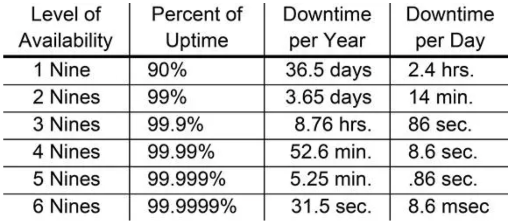
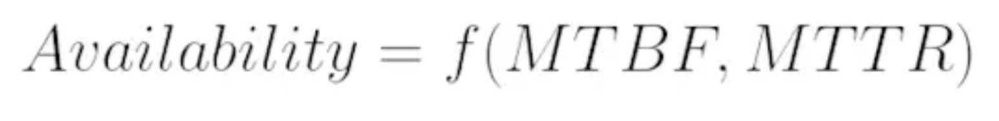

# Kubernetes高阶(设计和实现)

## 高可用(99.999)

### 1.永远记住，硬件是不可靠的
### 2.按照经验，最容易发生故障的点是:


## 高可用

### 高可用

* 英文原文为`High Availability`，简称`HA`，简单的说，集群(`cluster`)就是一组计算机，它们作为一个整体向用户提供一组⺴络资源。这些单个的 计算机系统 就是集群的节点(`node`)。高可用性集群(`HA cluster`)是指如单系统一样地运行并支持(计算机)持续正常运行的一个主机群。

* 高可用集群的出现是为了使集群的整体服务尽可能可用，从而减少由计算机 硬件和软件易错性所带来的损失。如果某个节点失效，它的备援节点将在几 秒钟的时间内接管它的职责。因此，对于用户而言，集群永远不会停机。高 可用集群软件的主要作用就是实现故障检查和业务切换的自动化。

* 可用性(`availability`)是关于系统可供使用时间的表述，以不可用的时间为 衡量指标。不可用时间越短，可用性越高。通常用n个9来描述。比如4个9的可用性(`99.99%`)，是指一年中不可用时间在52分钟内，平均每周不可用时间在1分钟。



* 要谈可用性，首先必须承认所有东⻄都有不可用的时候，只是不可用程度而已。一般来说，我们的观念里一个服务至少要做到99.9% 才称为基本上可用， 是合格性产品。否则基本很难被别人使用。

* 从3个9迈向4个9，从8小时一下缩短到52.6分钟的不可用时间，是一个很大的进步。

### 高可用是一个系统性问题，需要从上到下的系统化解决

```
– 供电
– 存储
– ⺴络
– 计算节点 
– 服务容错 
– 部署
– 负载均衡 
– 自我修复 
– 发布流程 
– 变更控制 
– 运维成熟度 
– 流量切换
– 。。。。。。
```

`MTBF: Mean time between Failures`。用通俗的话讲，就是一个东⻄有多不可靠，多⻓时间坏一次.

`MTTR: Mean time to recover`。意思就是一旦坏了，恢复服务的时 间需要多⻓。



一个服务的可用度，取决于`MTBF`和`MTTR`这两个因子。从这个公式出发，结合实际情况，就很好理清高可用架构的基本路数了。那就是: 要么提高`MTBF`, 要么降低 `MTTR`。

## 高可用性方案

### 1.提高冗余度，多实例运行，用资源换可用性
### 2. N+2

```
– N+2就是说平时如果一个服务需要1个实例正常提供服务，那么我们就在生产环 境上应该部署1 + 2 = 3个节点。大家可能觉得N + 1很合理，也就是有个热备份系 统，比较能够接受。但是你要想到，服务N + 1部署只能提供热备容灾，发布的时 候就失去保护了。
– 从另一个角度来讲，服务N+2说的是在丢失两个最大的实例的同时，依然可以维 持业务的正常运转。
– 这其实就是最近常说的两地三中心的概念有点像。
```
### 3.实例之间对等、独立

一大一小，或者相互依赖都不是真的N+2。如果两地三中心的一个中心是需要几小时才能迁移过去的，那他就不是一个高可用性部署，顶多算异地灾备。

### 4.流量控制

* 想做到高可用，必须拥有一套非常可靠的流量控制系统。这套系统按常⻅的维度， 最好能按业务维度来调度流量。
* 静态流控:主要针对客户端访问速率进行控制，它通常根据服务质量等级协定 (SLA)中约定的QPS做全局流量控制。
* 动态流控:它的最终目标是为了保命，并不是对流量或者访问速度做精确控制。 当系统负载压力非常大时，系统进入过负载状态，可能是CPU、内存资源已经过 载，也可能是应用进程内部的资源几乎耗尽，如果继续全量处理业务，可能会导 致⻓时间的Full GC、消息严重积压或者应用进程宕机，最终将压力转移到集群其 它节点，引起级联故障。触发动态流控的因子是资源，资源又分为系统资源和应 用资源两大类，根据不同的资源负载情况，动态流控又分为多个级别，每个级别 流控系数都不同，也就是被拒绝掉的消息比例不同。每个级别都有相应的流控阈 值，这个阈值通常支持在线动态调整。


### 5.线下测试(Offline Test)
* 线下测试永远比线上调试容易一百倍，也安全一百倍。
* 可用性的阶段性提高，不是靠运维团队，而是靠产品团队。能在线下完成的测试，绝不到线上去实验。

### 6.灰度发布

* 灰度发布是速度与安全性作为妥协。他是发布众多保险
* 的最后一道，而不是唯一的一道。如果 只是为了灰度而灰度，故意人为的拖慢进度，反而造成线上多版本⻓期间共存，有可能会引入 新的问题。
* 测试代码要充足。
* 监控体系要成熟。
* 平台要支持。


### 7.服务必须对回滚提供支持， 这点不允许商量!

### 8.不允许没有监控的系统上线!

## Kubernetes HA

### Kubernetes本身的HA

*  etcd
*  apiserver
*  scheduler
*  controller-manager

### Kubernetes提供的HA

*  podprobe
*  replicationcontroller 
*  service
*  federation