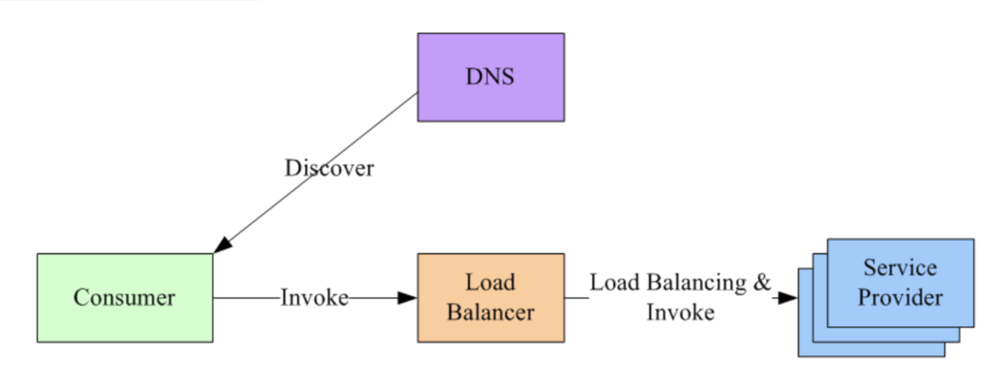
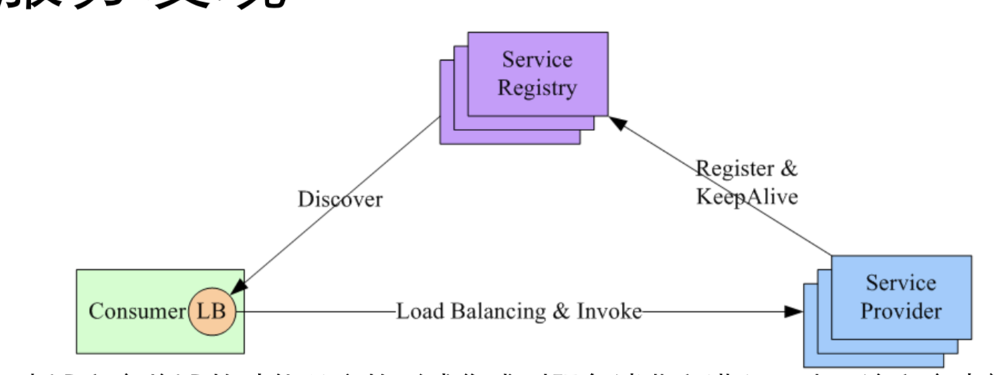
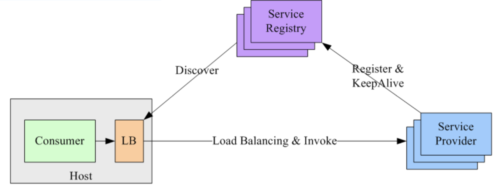
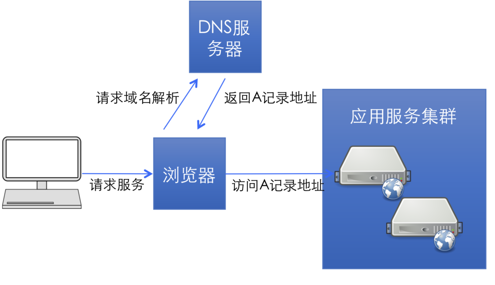
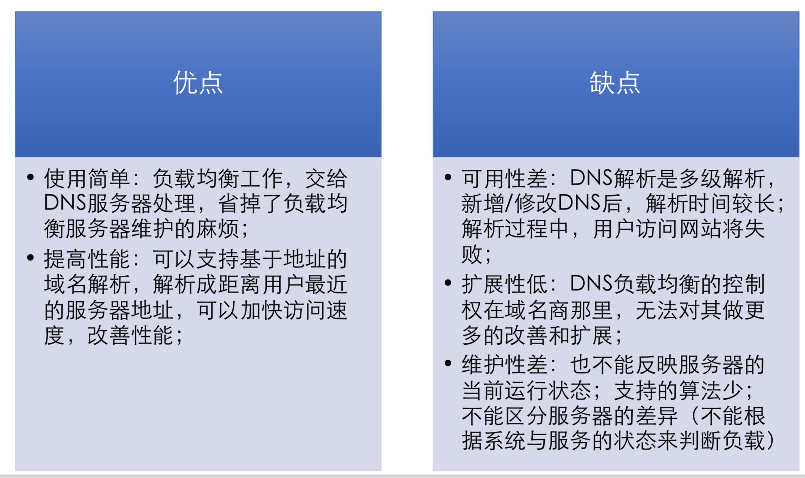
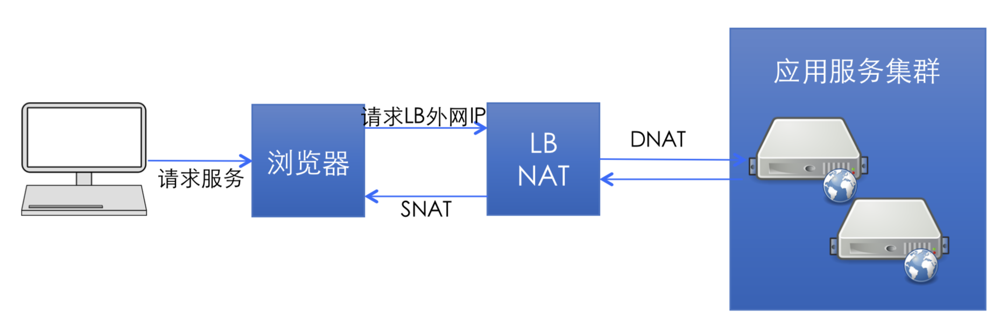
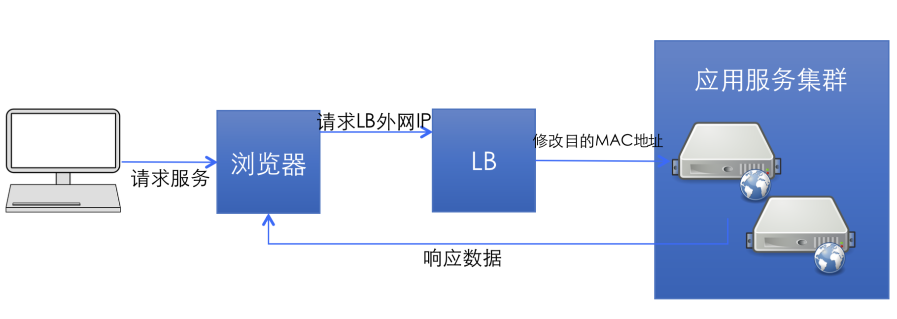
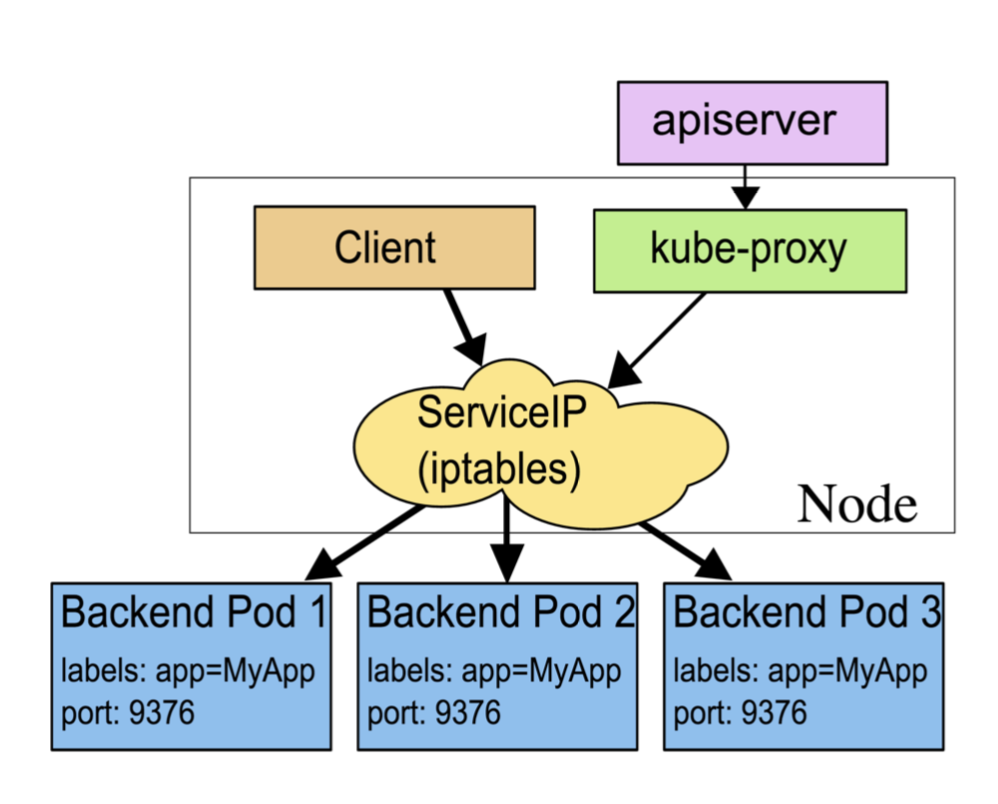
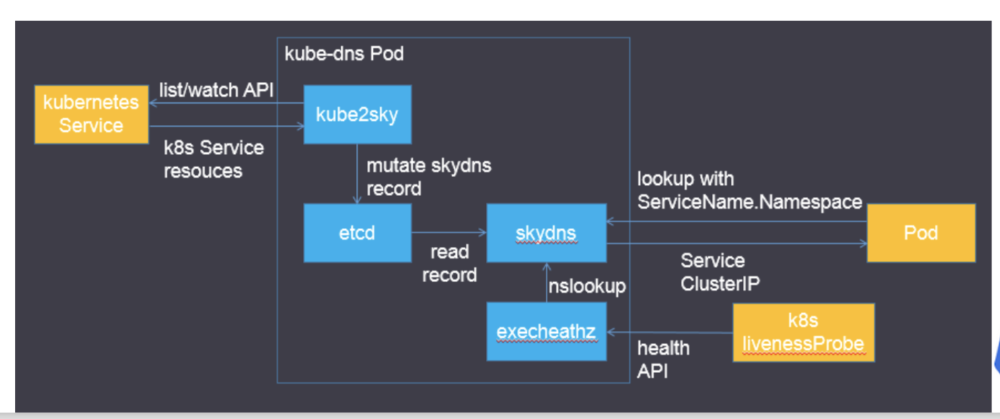
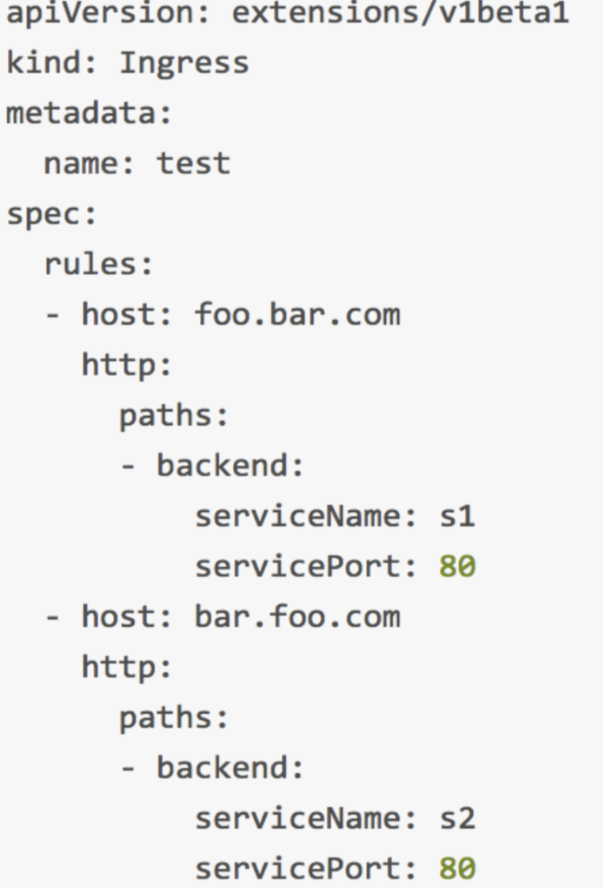

# Kubernetes高阶(设计和实现)

## 服务发现

微服务架构是由一系列职责单一的细粒度服务构成的分布 式网状结构，服务之间通过轻量机制进行通信，这时候必 然引入一个服务注册发现问题，也就是说服务提供方要注 册通告服务地址，服务的调用方要能发现目标服务。

同时服务提供方一般以集群方式提供服务，也就引入了`负载均衡`和`健康检查`问题。



## 集中式LB服务发现

### 1.在服务消费者和服务提供者之间有一个独立的LB。
### 2.LB上有所有服务的地址映射表，通常由运维配置注册
### 3.当服务消费方调用某目标服务时，它向LB发起请求，由LB以某种策略(比 如Round-Robin)做负载均衡后将请求转发到目标服务。
### 4.LB一般具备健康检查能力，能自动摘除不健康的服务实例。
### 5.服务消费方通过DNS发现LB，运维人员为服务配置一个DNS域名，这个域名 指向LB。
### 6.集中式LB方案实现简单，在LB上也容易做集中式的访问控制，这一方案目前还是业界主流。
### 7.集中式LB的主要问题是单点问题，所有服务调用流量都经过LB，当服务数量和调用量大的时候，LB容易成为瓶颈， 且一旦LB发生故障对整个系统的影响是灾难性的。
### 8.LB在服务消费方和服务提供方之间增加了一跳(hop)，有 一定性能开销。

## 进程内LB服务发现



1. 进程内LB方案将LB的功能以库的形式集成到服务消费方进程里头，该方案也被称为客户端负载方案。
2. 服务注册表(Service Registry)配合支持服务自注册和自发现，服务提供方启动时，首先将服 务地址注册到服务注册表(同时定期报心跳到服务注册表以表明服务的存活状态)。
3. 服务消费方要访问某个服务时，它通过内置的LB组件向服务注册表查询(同时缓存并定期刷 新)⺫标服务地址列表，然后以某种负载均衡策略选择一个⺫标服务地址，最后向目标服务发起请求。
4. 这一方案对服务注册表的可用性(Availability)要求很高，一般采用能满足高可用分布式一致 的组件(例如Zookeeper, Consul, Etcd等)来实现。
5. 进程内LB是一种分布式模式，LB和服务发现能力被分散到
每一个服务消费者的进程内部，同时服务消费方和服务提 供方之间是直接调用，没有额外开销，性能比较好。该方 案以客户库(Client Library)的方式集成到服务调用方进程 里头，如果企业内有多种不同的语言栈，就要配合开发多 种不同的客户端，有一定的研发和维护成本。
6. 一旦客户端跟随服务调用方发布到生产环境中，后续如果 要对客户库进行升级，势必要求服务调用方修改代码并重 新发布，所以该方案的升级推干有不小的阻力。

## 独立LB进程服务发现



* 针对进程内LB模式的不足而提出的一种折中方案，原理和第二种方案基本类似。
* 不同之处是，将LB和服务发现功能从进程内移出来，变成主机上的一个独立进程，主机上的 一个或者多个服务要访问⺫标服务时，他们都通过同一主机上的独立LB进程做服务发现和负 载均衡。
* LB独立进程可以进一步与服务消费方进行解耦，以独立集群的形式提供高可用的负载均衡服 务
* 这种模式可以称之为真正的“软负载(Soft Load Balancing)”。
* 独立LB进程也是一种分布式方案，没有单点问题，一个LB 进程挂了只影响该主机上的服务调用方。
* 服务调用方和LB之间是进程内调用，性能好。
* 简化了服务调用方，不需要为不同语言开发客户库，LB的升级不需要服务调用方改代码。
* 不足是部署较复杂，环节多，出错调试排查问题不方便。


## 负载均衡

系统的扩展可分为纵向(垂直)扩展和横向(水平)扩展。

### 纵向扩展，
是从单机的角度通过增加硬件处理能力，比如CPU处理能力， 内存容量，磁盘等方面，实现服务器处理能力的提升，不能满足大型分 布式系统(网站)，大流量，高并发，海量数据的问题。

### 横向扩展，
通过添加机器来满足大型网站服务的处理能力。比如:一台 机器不能满足，则增加两台或者多台机器，共同承担访问压力，这就是 典型的集群和负载均衡架构。
     
  
### 负载均衡的作用(解决的问题):

* 解决并发压力，提高应用处理性能，增加吞吐量，加强网络处理能力;
* 提供故障转移，实现高可用;
* 通过添加或减少服务器数量，提供网站伸缩性，扩展性;
* 安全防护，负载均衡设备上做一些过滤，黑白名单等处理;


## DNS负载均衡

最早的负载均衡技术，利用域名解析实现负载均衡，在DNS服务器，配置多个A记录，这些A记录对应的服务器构成集群。



### DNS负载均衡



## IP负载均衡

在网络层通过修改请求目标地址进行负载均衡。



* 用户请求数据包，到达负载均衡服务器后，负载均衡服务器在操作系统内核 进程获取网络数据包，根据负载均衡算法得到一台真实服务器地址，然后将 请求目的地址修改为，获得的真实ip地址，不需要经过用户进程处理。

* 真实服务器处理完成后，响应数据包回到负载均衡服务器，负载均衡服务器， 再将数据包源地址修改为自身的ip地址，发送给用户浏览器。

* 优点: 在内核进程完成数据分发，比在应用层分发性能更好;
  
* 缺点: 所有请求响应都需要经过负载均衡服务器，集群最大吞吐量受限于负载均衡服务器网卡带宽;

## 链路层负载均衡

在通信协议的数据链路层修改mac地址进行负载均衡。



* 数据分发时，不修改ip地址，指修改目标mac地址，配置真实物理服务器集 群所有机器虚拟ip和负载均衡服务器ip地址一致，达到不修改数据包的源地 址和目标地址，进行数据分发的目的。
* 实际处理服务器ip和数据请求目的ip一致，不需要经过负载均衡服务器进行 地址转换，可将响应数据包直接返回给用户浏览器，避免负载均衡服务器网卡带宽成为瓶颈。也称为直接路由模式(DR模式)。

* 优点:性能好;
* 缺点:配置复杂;

## Kubernetes中的服务发现，负载均衡

* Kubernetes在设计之初就充分考虑了针对 容器的服务发现与负载均衡机制，提供了 Service资源，并通过kube-proxy配合 cloud provider来适应不同的应用场景。

* 在k8s集群中，服务是运行在Pod中的，在 集群内可以通过获取Pod的IP来访问Pod提 供的服务。但是IP并不是Durable的资源。

* 通过Service可以解决这个问题，但访问 Service也需要对应的IP，因此又引入了 Service发现的问题。

* Service同时能够提供集群内的L4负载均衡。




## Kubernetes中的服务发现，负载均衡

* 基于kube-dns插件，k8s将Service的名称当做域名注册到kube-dns 中，可以通过域名来访问集群内的Service，解决了Service发现的问题。

* 为了让Pod中的容器可以使用`kube-dns`来解析域名，k8s会修改容器 的`/etc/resolv.conf`配置。



## Kubernetes中的Ingress

Service虽然解决了服务发现和负载均衡的问题，但它在使用上还是有一些限制:

```
1.只支持4层负载均衡，没有7层功能;
2.对外访问的时候，NodePort类型需要在外部搭建 额外的负载均衡，而LoadBalancer要求 kubernetes必须跑在支持的
cloud provider上面;
```

Ingress就是为了解决这些限制而引入的新 资源，主要用来将服务暴露到cluster外面， 并且可以自定义服务的访问策略。比如想 要通过负载均衡器实现不同子域名到不同 服务的访问。


