# Kubernetes高阶(设计和实现)

## 监控和日志

## 数据系统构建

### 1.日志收集与分析 
### 2.监控系统构建

## 日志

日志可能是一种最简单的不能再简单的存储抽象，只能追加、按照时 间完全有序(totally-ordered)的记录序列。日志看起来的样子

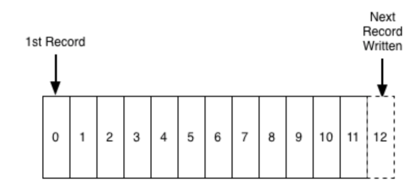


* 在日志的末尾添加记录，读取日志记录则从左到右。每一条记录都指定了一个唯一的顺序的日志记录编号。
* 日志记录的次序(ordering)定义了“时间”概念，因为位于左边的日志记录表 示比右边的要早。 日志记录编号可以看作是这条日志记录的“时间戳” 。
* 把次序直接看成是时间概念，刚开始你会觉得有点怪异，但是这样的做法有个便利的性质:解耦了时间和任一特定的物理时钟(`physical clock`)。 在分布式微服务系统中，这会成为一个必不可少的性质。
* 日志就是程序写进本地文件里的无结构的错误信息或者追踪信息?
* 在起初确实是这样的。
* 而现在由人去阅读某个机器上的日志这样的想法有些落伍过时了。 当涉及很 多服务和服务器时，这样的做法很快就变得难于管理， 我们的⺫的很快就变 成输入查询和输出用于理解多台机器的行为的图表。
* 另外日志也不紧紧局限于应用程序的输出:

```
- 程序输出
- 事件
- Metrics
- Alerts
- Data Logs(在数据库中为了保证操作的原子性和持久性，在对数据库维护的所有各种数据结 构做更改之前，数据库会把要做的更改操作的信息写入日志 。)
- Write Ahead Log(是一种数据存储方式。除了在内存中存有所有数据的状态以及节点的索 引以外，通过WAL进行持久化存储。WAL中，所有的数据提交前都会事先记录日志。)
```

## 微服务架构下的日志

微服务的特点决定了功能模块的部署是分布式的，以往在单应用环境下，所有的业务都在同一个服务器上，如果服务器出现错误和异常，我们只要盯住 一个点，就可以快速定位和处理问题，但是在微服务的架构下，大部分功能 模块都是单独部署运行的，彼此通过总线交互，都是无状态的服务，这种架构下，前后台的业务流会经过很多个微服务的处理和传递，我们难免会遇到 这样的问题:

```
– 分散在各个服务器上的日志怎么处理?
– 如果业务流出现了错误和异常，如何定位是哪个点出的问题? 
– 如何快速定位问题?
– 如何跟踪业务流的处理顺序和结果?
```

以前在单应用下的日志监控很简单，在微服务架构下却成为了一个大问题， 如果无法跟踪业务流，无法定位问题，我们将耗费大量的时间来查找和定位 问题，在复杂的微服务交互关系中，我们就会非常被动。

## 我们希望从日志中得到什么?

### • 查看程序运行状态 
### • 查看出错信息
### • 查看服务健康状态 
### • 异常告警
### • 知识挖掘

## 常用数据系统构建模式

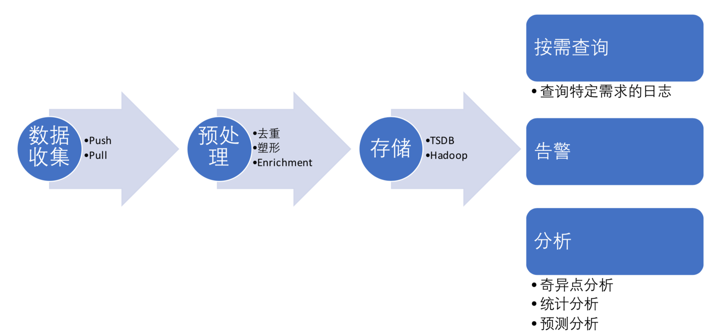

## 在Kubernetes集群中的日志系统

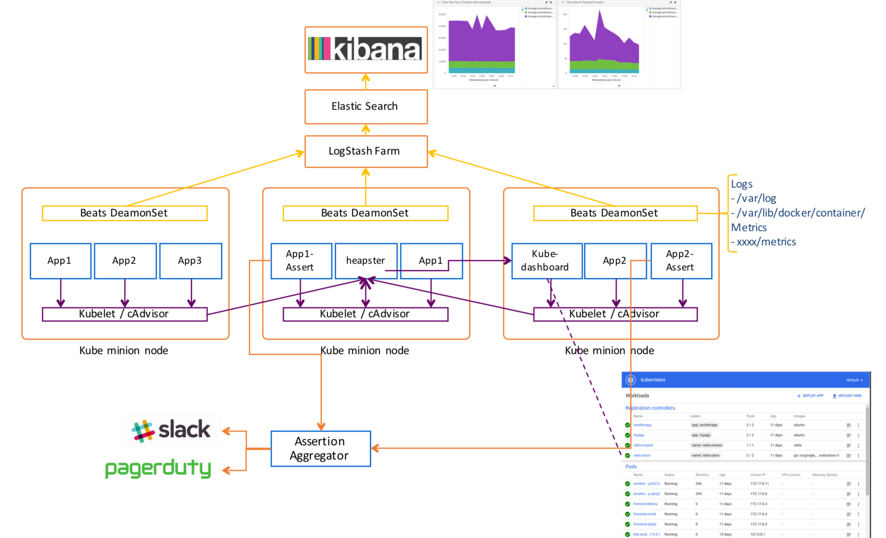

## 在Kubernetes集群中的日志系统

### cAdvisor

cAdvisor is an open source container resource usage and performance analysis agent. It is purpose built for containers and supports Docker containers natively. In Kubernetes, cadvisor is integrated into the Kubelet binary. cAdvisor auto-discovers all containers in the machine and collects CPU, memory, filesystem, and network usage statistics.

### Heapster

Heapster is a cluster-wide aggregator of monitoring and event data. It currently supports Kubernetes natively and works on all Kubernetes setups. Heapster runs as a pod in the cluster, similar to how any Kubernetes application would run. The Heapster pod discovers all nodes in the cluster and queries usage information from the nodes’ Kubelets, the on-machine Kubernetes agent.

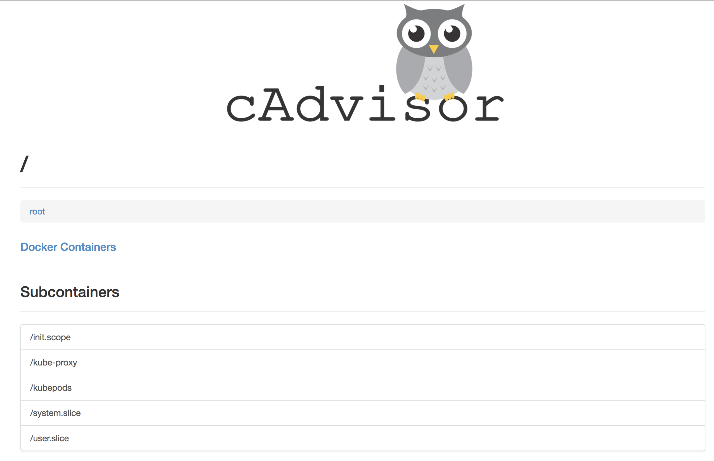
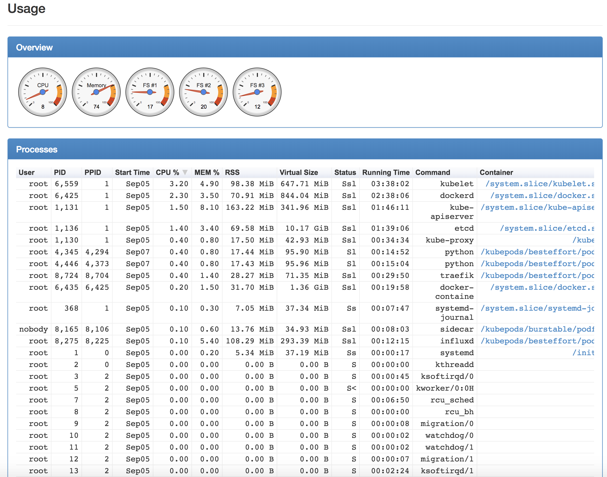
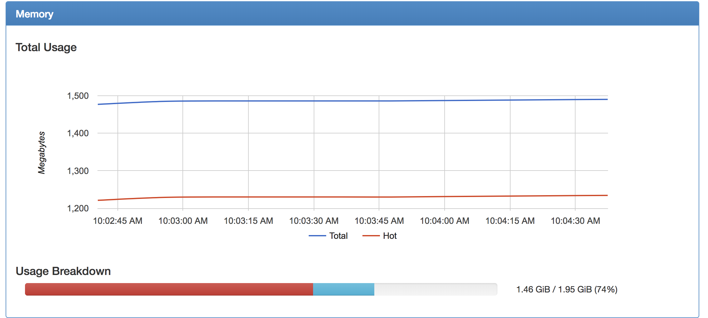
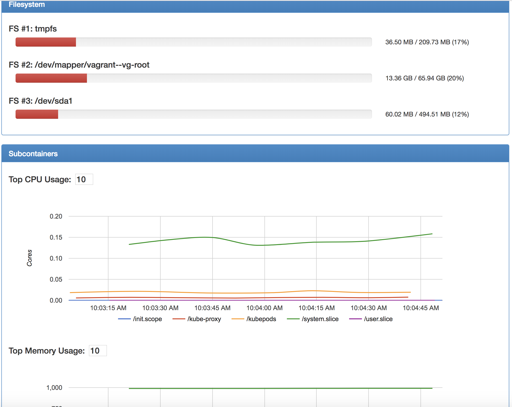

## 在Kubernetes集群中的日志系统

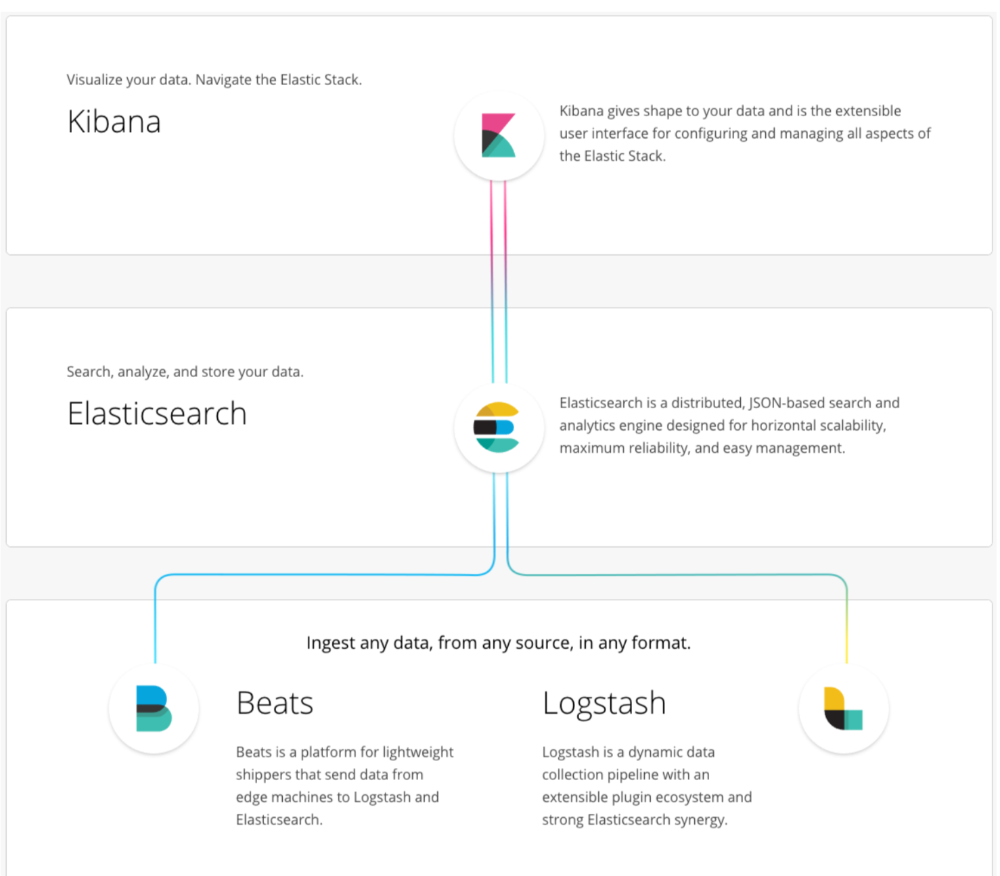

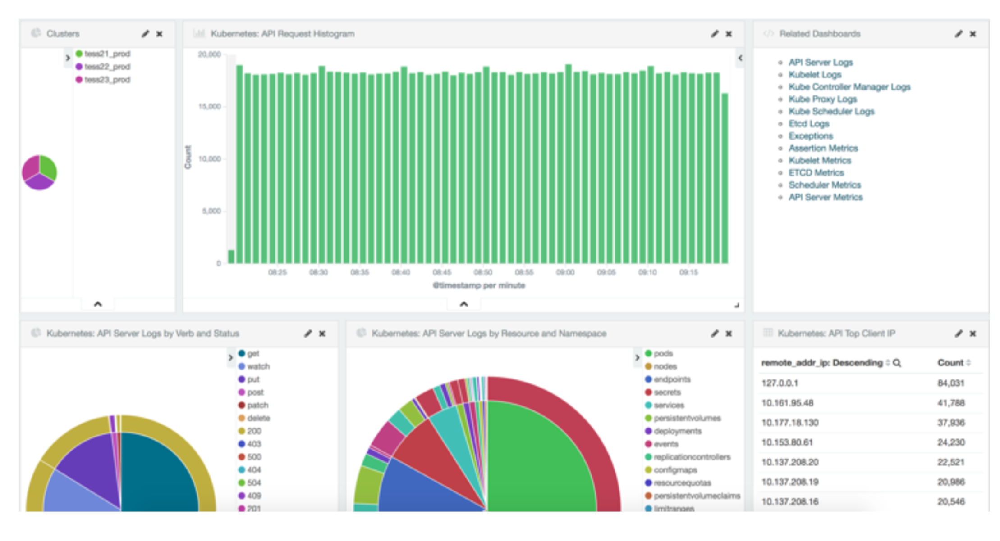

### Prometheus format:

```
– Standardmetricsformat
– Alreadyintegratedwithkubelet
```

```
etcd_debugging_mvcc_db_compaction_pause_duration_milliseconds_bucket{le="1"} 0
etcd_debugging_mvcc_db_compaction_pause_duration_milliseconds_bucket{le="2"} 0 
etcd_debugging_mvcc_db_compaction_pause_duration_milliseconds_bucket{le="4"} 0 
etcd_debugging_mvcc_db_compaction_pause_duration_milliseconds_bucket{le="8"} 0 
etcd_debugging_mvcc_db_compaction_pause_duration_milliseconds_bucket{le="16"} 0 
etcd_debugging_mvcc_db_compaction_pause_duration_milliseconds_bucket{le="32"} 0 
etcd_debugging_mvcc_db_compaction_pause_duration_milliseconds_bucket{le="64"} 0 
etcd_debugging_mvcc_db_compaction_pause_duration_milliseconds_bucket{le="128"} 0 
etcd_debugging_mvcc_db_compaction_pause_duration_milliseconds_bucket{le="256"} 0 
etcd_debugging_mvcc_db_compaction_pause_duration_milliseconds_bucket{le="512"} 0 
etcd_debugging_mvcc_db_compaction_pause_duration_milliseconds_bucket{le="1024"}0 
etcd_debugging_mvcc_db_compaction_pause_duration_milliseconds_bucket{le="2048"}0 
etcd_debugging_mvcc_db_compaction_pause_duration_milliseconds_bucket{le="4096"}0 
etcd_debugging_mvcc_db_compaction_pause_duration_milliseconds_bucket{le="+Inf"} 0 
etcd_debugging_mvcc_db_compaction_pause_duration_milliseconds_sum 0 
etcd_debugging_mvcc_db_compaction_pause_duration_milliseconds_count 0
```

## 监控系统

### 为什么监控，监控什么内容?

1. 对自己系统的运行状态了如指掌，有问题及时发现，而不让让用户先发现我们系统不能使用。
2. 我们也需要知道我们的服务运行情况。例如，slowsql处于什么水平，平均响应时间超过`200ms`的占比有百分
之多少?

### 我们为什么需要监控我们的服务?

1. 需要监控工具来提醒我服务出现了故障，比如通过监控服务的负载来决定扩容或缩容。如果机器普遍负载不 高，则可以考虑是否缩减一下机器规模，如果数据库连接经常维持在一个高位水平，则可以考虑一下是否可 以进行拆库处理，优化一下架构。
2. 监控还可以帮助进行内部统制，尤其是对安全比较敏感的行业，比如证券银行等。比如服务器受到攻击时， 我们需要分析事件，找到根本原因，识别类似攻击，发现没有发现的被攻击的系统，甚至完成取证等工作。

### 监控目的

1. 减少宕机时间
2. 扩展和性能管理 
3. 资源计划
4. 识别异常事件 
5. 故障排除、分析


##  在Kubernetes集群中的监控系统

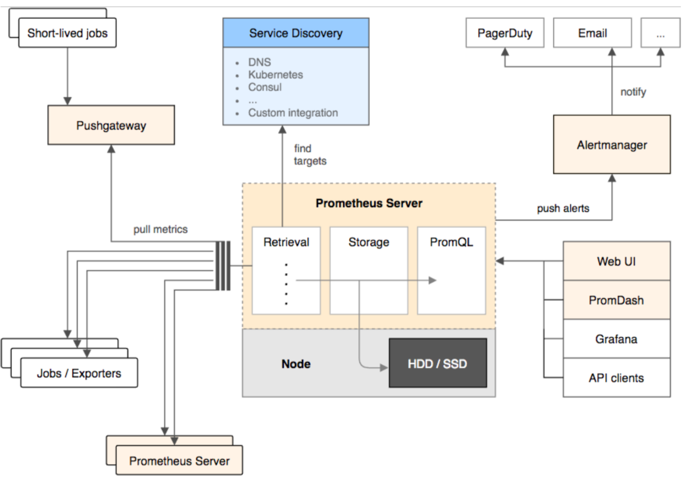

### 1.每个节点的kubelet(集成了`cAdvisor`)会收集当前节点host上所有信息，包括cpu、内存、磁盘 等。`Prometheus`会`pull`这些信息，给每个节点打上标签来区分不同的节点。

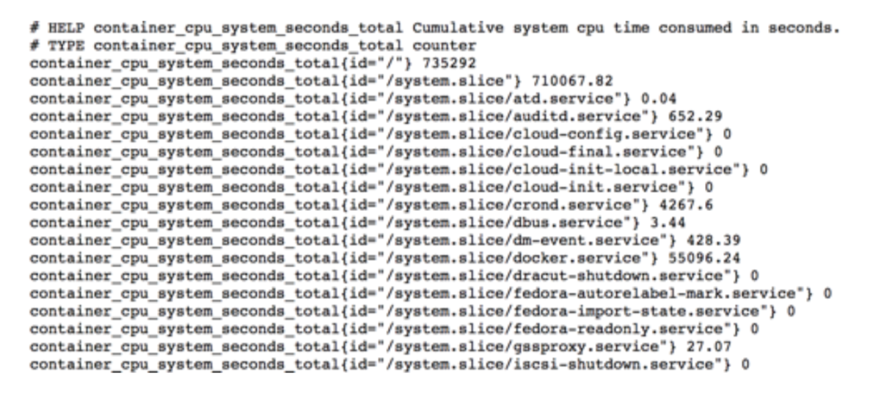

### 2.Kubernetes的`control panel`包括各种`controller`都原生的暴露`Prometheus`格式的`metrics`。

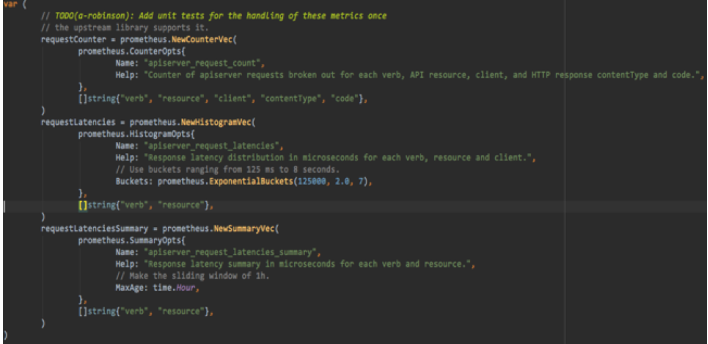

### 3.Grafana dashboard


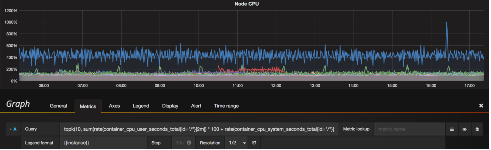

### 4.运营监控界面

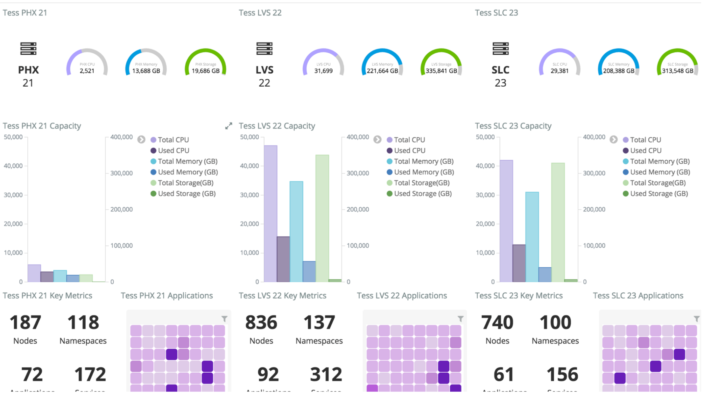

### 5.运营监控界面

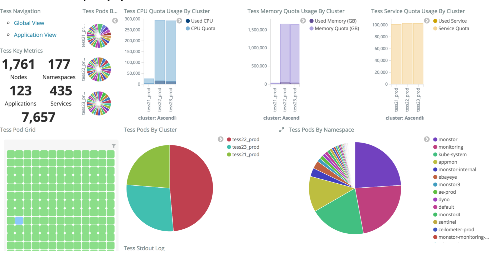

### 6.在Kubernetes集群中的告警系统

**Prometheus alert rule example**

```
ALERT Example
  IF metricsCPU > 0.9
  FOR 10m
  LABELS {severity="High"}
  ANNOTATIONS {description="Node CPU too high: {{ $labels.instance }} CPU {{$value}}", summary="Node
CPU too high"}
```

