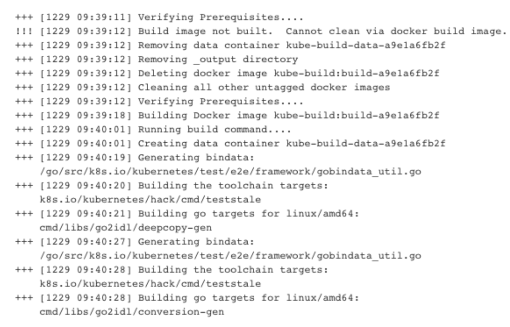
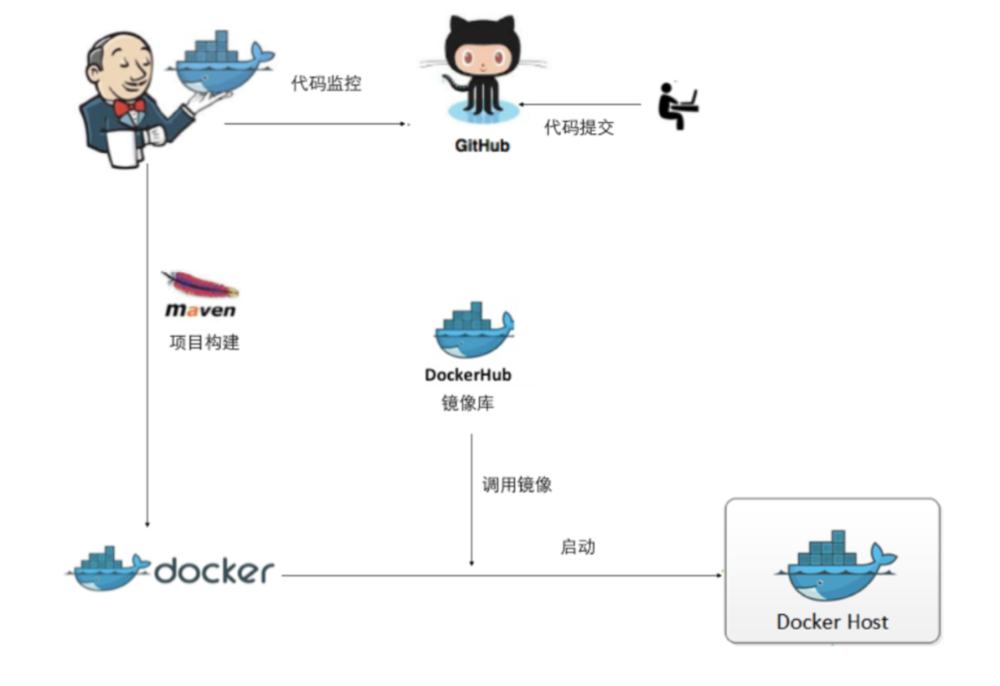
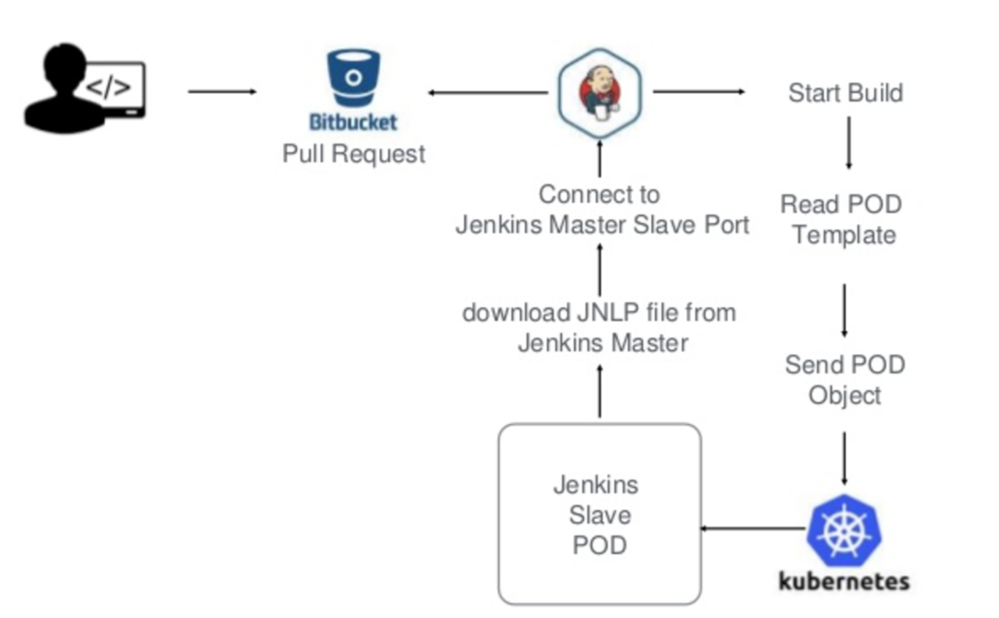

# Kubernetes高阶(设计和实现)

## 建立持续交付的服务体系

### 传统的开发运维模式下，存在的问题:

1. 从需求到版本上线中间是个黑箱子，⻛险不可控;
2. 开发设计时未过多考虑运维，导致后续部署及维护的困难;
3. 开发各自为政，烟囱式开发，未考虑共享重用、联调，开发的资产 积累不能快速交移到运维手中;

### 应对这样的问题，我们通常倡导的解决之道是:运维前移， 统一运维，建立持续交付服务体系

## 基于Docker的开发模式驱动持续集成

* Docker首先是一个容器级虚拟化技术，相比传统虚拟化技术，容器级的虚拟技术是操作系统内核层的虚拟，所以能节省更多资源、提升性能，意味着单位 机器资源消耗下，能承载更复杂更庞大的应用系统架构。
* 启动速度更快，毫秒级的启动速度，这对于快速部署开发测试及运维环境非常有利。
* 镜像分层，部署时可以按需获取镜像生成容器并快速启动运行，因此有利于快 速的部署扩容，解决运维中水平扩容的问题。
* 由于Docker镜像的天然可移植性，就像集装箱一样快速打包应用以及依赖项， 在开发、测试、运维之间移动，所以可以推进 开发-测试-运维 环境的统一，持续集成(CI)能发挥更大的作用，例如通过CI构建应用、检查代码，打包到 Docker、分发部署到测试和准生产环境，进行各类测试，都可以更方便快捷和统一。

### 开发测试环境容器化 
### 持续集成容器化
### 应用交付容器化

## 开发测试环境容器化

* 容器化微服务解决的更多的是架构设计的问题，按软件工 程来讲，设计之后的下一步就是开发实现的事情了，在这 个阶段，传统的开发测试会有不少的问题，最突出的就是 环境的问题:

```
– 依赖版本不一致。
– 软件安装麻烦、来源不一致、安装方式不一致。
– 共用一个服务器开发环境，隔离性差，互相冲突。
– 可移植性差，和生产环境不一致，开发人员之间也无法共享。 – 新人入职通常又折腾一遍开发环境，无法快速搭建。
```

* 传统的开发模式下，有了代码库和IDE，开发人员就进行各 自的开发，并在本地进行编译，测试;
* 随着开源社区的发展，⺫前开发一套服务需要依赖大量的 组件或者代码库，甚至编译环境也有多种选择;
* 在容器化环境中，除了代码库，你还需要准备:

```
– 构建环境容器化
– 代码打包镜像化
```

## 实例:Kubernetes的构建



## 持续集成容器化



* 最主要解决的问题是保证CI构建环境和开发构建环境的统一。
* 使用容器作为标准的构建环境，将代码库作为Volume挂载进构建容器。
* 由于构建结果是`Docker`镜像，所以要在构建容器中执行“`docker build`”命令，需要注意`DIND`的问题。

## 基于Kubernetes的持续集成



## 小结

### Kubernetes相对于其他编排系统的优势是什么?

* 先进的设计理念

```
• 打破IaaS/PaaS壁垒
• 以应用为中心(Application Central)，对业务抽象
```

* 成熟和活跃的社区

```
• 最活跃的github项目
```

* 项目发起人的社区领导力

```
• 生态系统:
• Helm等上层生态应用
• 插件化，降低混合云门槛，避免供应商锁定 
• 标准化，CNCF, CNI, CRI
```

* 众多的商业化showcase

```
• Huawei
• Redhat
• 众多互联网公司: ebay，vip
```


