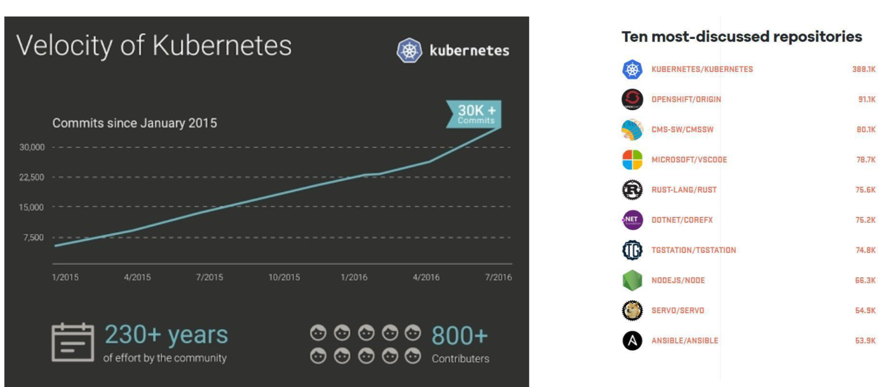

# 3.kubernetes架构基础

## kubernetes的崛起




## 什么是Kubernetes (k8s)?

`Kubernetes`是谷歌开源的容器集群管理系统，是Google多年大规模容器管理技术 Borg的开源版本，主要功能包括:

```
• 基于容器的应用部署、维护和滚动升级
• 负载均衡和服务发现
• 跨机器和跨地区的集群调度 
• 自动伸缩
• 无状态服务和有状态服务
• 广泛的Volume支持
• 插件机制保证扩展性
```


## Kubernetes采用与Borg类似架构


## 主要组件


## Kubernetes 的主节点(Master Node)

**API服务器(APIServer)**: 这是Kubernetes控制面板中唯一带有用户可访问API以及用户可交互的组件。API服务器会暴露一个restful的Kubernetes API并使用JSON格式的清单文件(manifest files)。

**集群的数据存储(Cluster Data Store)**: Kubernetes使用“etcd”。这是一个强大的、稳定的、高可 用的键值存储，被Kubernetes用于长久储存所有的API对象。可以认为它就是集群的“真相之源”。

**控制管理器(Controller Manager)**:被称为“kube-controller manager”，它运行着所有处理集群 日常任务的控制器。包括了`节点控制器、副本控制器、端点(endpoint)控制器以及服务账户和令牌控制器`。每一个控制器都独立工作以维护其所需的状态。

**调度器(Scheduler)**:调度器会监控新建的pods(一组或一个容器)并将其分配给节点。

**仪表板(Dashboard)(可选)**:Kubernetes提供网页UI来简化用户与API服务器(API Server) 的交互。


## Kubernetes的工作节点(Worker Node)


1. Kubernetes中第二重要的部分就是工作节点。鉴于主节点负责管理集群，工作节点就负责运行容器， 并提供Kubernetes的运行环境。
2. 工作节点包含了一个`kubelet`。**它是主节点代理(primarynodeagent)**。它会监控已被分配给该节点的**pods中的API服务器**。**Kuberet执行任务并维护一个将pod状态报告给主节点的渠道。**
3. **每个pod里都有容器**，**kubelet通过Docker(拉取镜像、启动和停止容器等)来运行这些容器**。它还会定期执行被请求的容器的健康探测程序。除了Docker之外，Kubernetes也支持RKT，此外社区也正在 积极努力的支持OCI。
4. 工作节点里的另一个组件是`kube-proxy`。它负责节点的网络，在主机上维护网络规则并执行连接转发。它还负责对正在服务的pods进行负载平衡。


## 集群联邦

### 集群联邦(Federation)用于跨 可用区的Kubernetes集群。


## 核心组件

### 1. etcd保存了整个集群的状态;
### 2. apiserver提供了资源操作的唯一入口，并提供认证、授权、访问控制、API注册和发现等机制;
### 3. controller manager负责维护集群的状态，比如故障检测、自动扩展、滚动更新等
### 4. scheduler负责资源的调度，按照预定的调度策略将Pod调度到相应的机器上;
### 5. kubelet负责维持容器的生命周期，同时也负责Volume(CVI)和网络(CNI)的管理;
### 6. Container runtime负责镜像管理以及Pod和容器的真正运行(CRI);
### 7. kube-proxy负责为Service提供cluster内部的服务发现和负载均衡;


## 推荐的Add-ons

### kube-dns负责为整个集群提供DNS服务 
### Ingress Controller为服务提供外网入口
### Heapster提供资源监控
### Dashboard提供GUI
### Federation提供跨可用区的集群
### Fluentd-elasticsearch提供集群日志采集、存储与查询


## 各组件之间如何协同工作?

就像所有好用的自动化工具一样，Kubernetes使用了对象说明或蓝图来管理系统该如何运行。 你只需告诉Kubernetes你想要发生些什么事，其他的事情它自己就会处理。就好比是雇佣一 个承包商来翻修你的厨房。你并不需要知道他们具体在做什么。您只需指定好结果，批准 施工蓝图就可以让他们去处理剩下的部分。Kubernetes也以同样的方式工作。Kubernetes的 操作基于声明式模型，在清单文件(manifest file)中定义的对象说明表明了集群该怎么运行。用不到使用一堆的命令，Kubernetes会做所需要的事情来完成给定的目标。

## 命令式(Imperative) vs 声明式(Declarative)

### 命令式系统关注 “如何做”
在软件工程领域，命令式系统是写出解决某个问题，完成某个 任务，或者达到某个目标的的明确步骤。此方法明确写出系统 应该执行某指令，并且期待系统返回期望结果。

### 声明式系统关注“做什么”
在软件工程领域，声明式系统指程序代码描述系统应该做什么 而不是怎么做。仅限于描述要达到什么目的，如何达到目的交 给系统。

## 声明式(Declaritive)系统规范

### 命令式的
* **我要你做什么，怎么做，请严格按照我说的做。**

### 声明式

* **我需要你帮我做点事，但是我只告诉你我需要你做什么，不是你应该怎么做。**
* **直接声明  我直接告诉你我需要什么**
* **间接声明  我不直接告诉你我的需求，我会把我的需求放在特定的地方，请在方便的时候拿出来处理。**

### 幂等性

* **状态固定，每次我我要你做事，请给我返回相同结果。**

### 面向对象的

* **把一切抽象成对象**

