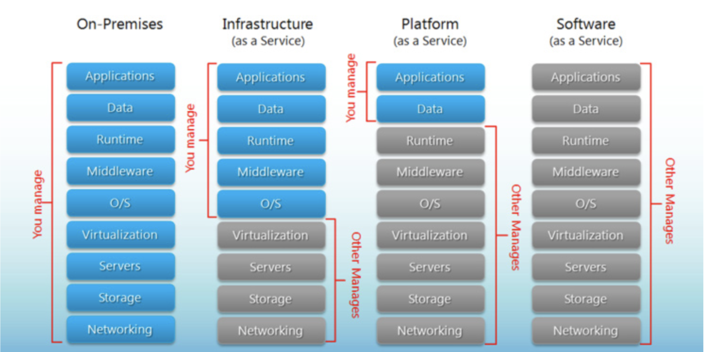
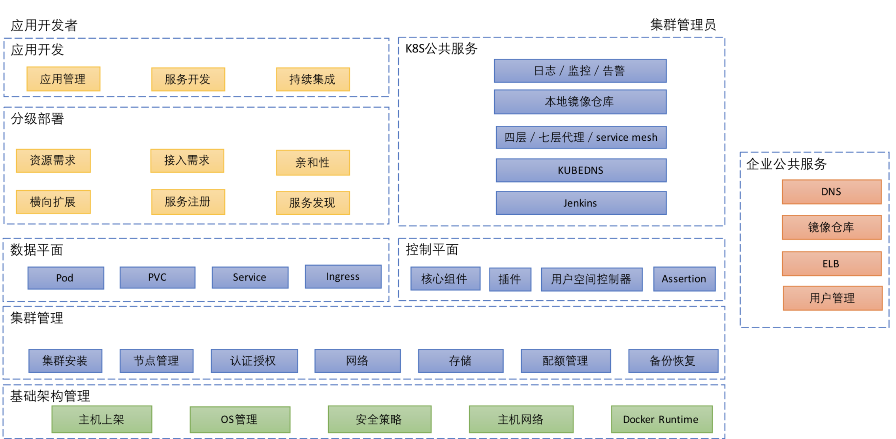
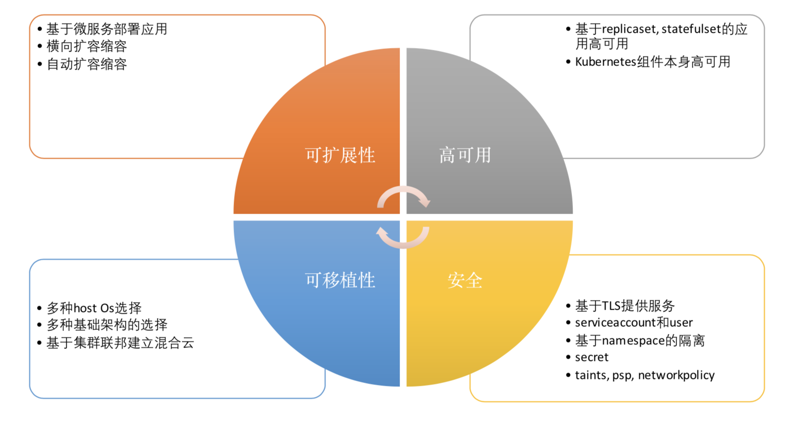
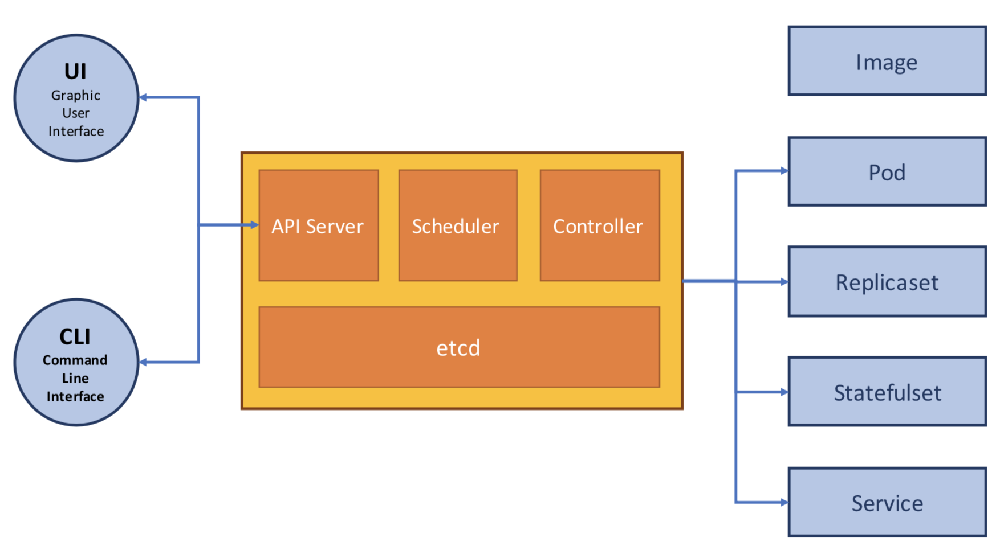
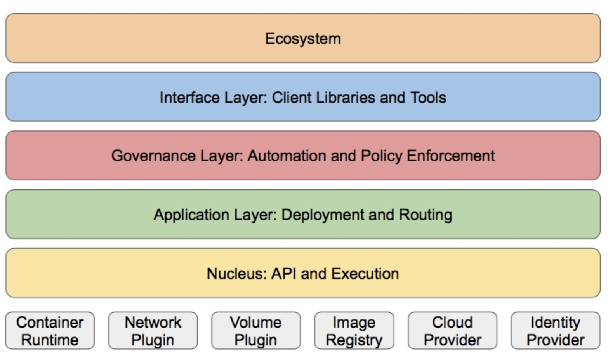
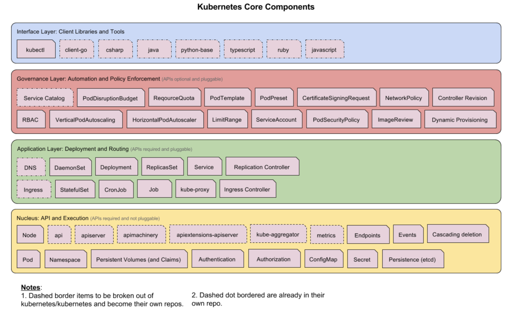
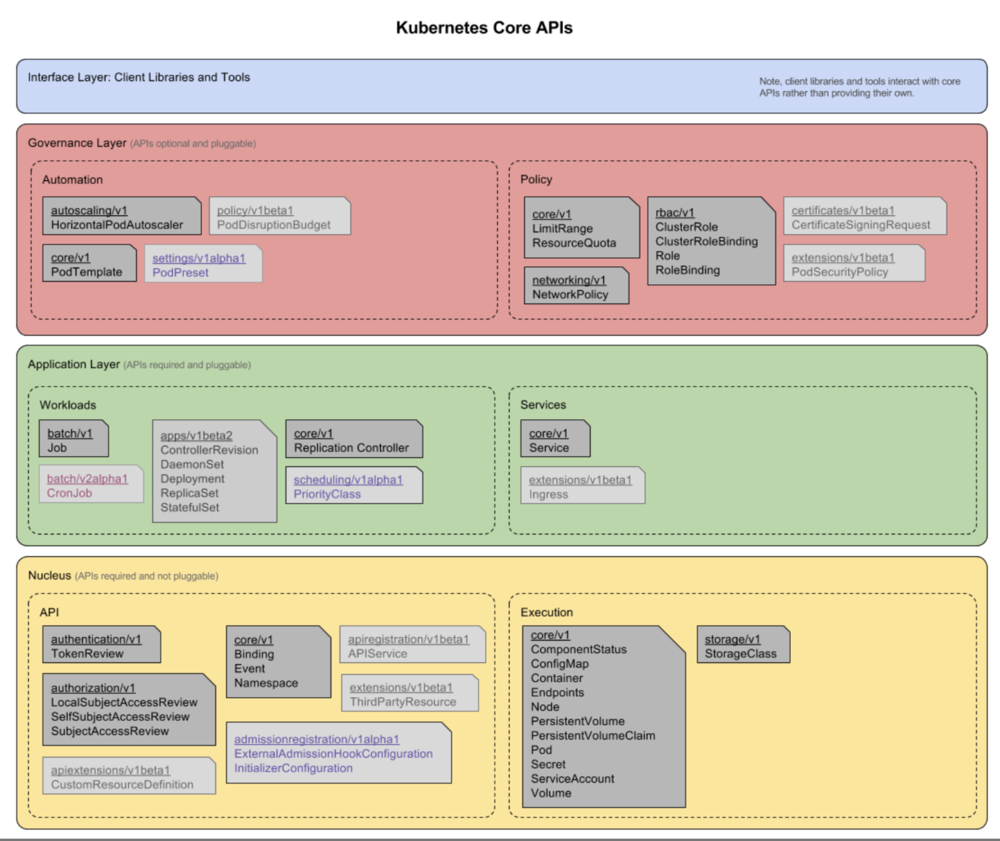
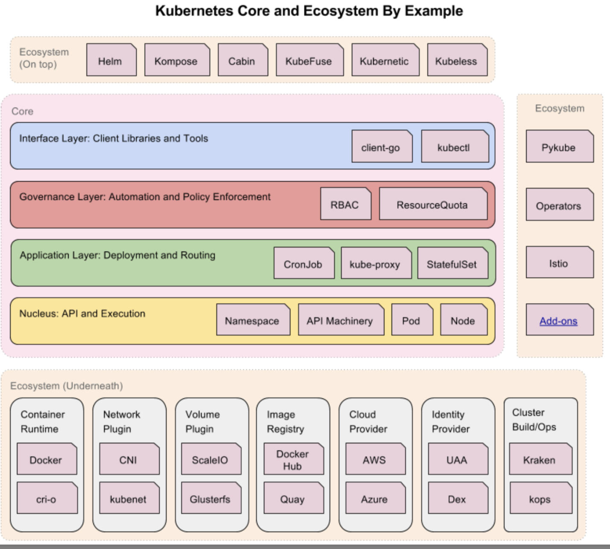

# 理解Kubernetes

##  云计算的传统分类



## Kubernetes生态系统



## Kubernetes设计理念



## Kubernetes Master



## 分层架构

### 核心层:

```
Kubernetes最核心的功能，对外提供API构建高层的应用，对内提供插件式应用执行环境
```

### 应用层:

```
部署(无状态应用、有状态应用、批处理任务、集群应用等)和路由(服务发现、DNS解析等)
```

### 管理层:

```
系统度量(如基础设施、容器和网络的度量)，自动化(如自动扩展、动态Provision等)以及策略管理 (RBAC、Quota、PSP、
NetworkPolicy等)
```

### 接口层:

```
kubectl命令行工具、客户端SDK以及集群联邦
```

### 生态系统:

```
在接口层之上的庞大容器集群管理调度的生态系统，可以划分为两个范畴:
```

```
Kubernetes外部:日志、监控、配置管理、CI、CD、Workflow、FaaS、OTS应用、ChatOps等
```

```
Kubernetes内部:CRI、CNI、CVI、镜像仓库、Cloud Provider、集群自身的配置和管理等
```

## 分层架构










## Kubernetes设计理念

### 设计理念与分布式系统

```
分析和理解Kubernetes的设计理念可以使我们更深入地了解Kubernetes系统，更好地利用它管理 分布式部署的云原生应用，
另一方面也可以让我们借鉴其在分布式系统设计方面的经验。
```

### 架构设计原则

```
1. 只有apiserver可以直接访问etcd存储，其他服务必须通过Kubernetes API来访问集群状态
```
```
2. 单节点故障不应该影响集群的状态
```
```
3. 在没有新请求的情况下，所有组件应该在故障恢复后继续执行上次最后收到的请求(比如 网络分区或服务重启等)
```
```
4. 所有组件都应该在内存中保持所需要的状态，apiserver将状态写入etcd存储，而其他组件则 通过apiserver更新并监听
所有的变化
```
```
5. 优先使用事件监听而不是轮询
```


## 引导(Bootstrapping)原则

* Self-hosting是目标
* 减少依赖，特别是稳态运行的依赖
* 通过分层的原则管理依赖
* 循环依赖问题的原则


## 核心技术概念和API对象

1.**API对象是K8s集群中的管理操作单元**。K8s集群系统每支持一项新功能，引入一项新技术，一定会新引入对应的API对象，支持对该功能的管理操作。例如副本集`Replica Set`对应的API对象是`RS`。
2.每个API对象都有3大类属性:`元数据metadata`、`规范spec`和`状态status`。

```
元数据是用来标识API对象的， 每个对象都至少有3个元数据:namespace，name和uid;除此以外还有各种各样的标签labels
用来标识 和匹配不同的对象，例如用户可以用标签env来标识区分不同的服务部署环境，分别用env=dev、 env=testing、
env=production来标识开发、测试、生产的不同服务。
```
```
规范描述了用户期望K8s集群中的分布式系统达到的理想状态(Desired State)，例如用户可以通过复制控制器
Replication Controller设 置期望的Pod副本数为3;
```
```
status描述了系统实际当前达到的状态(Status)，例如系统当前实际的Pod副本数为2;那么复制控制器当前的程序逻辑就是
自动启动新的Pod，争取达到副本数为3。
```

3.**K8s中所有的配置都是通过API对象的spec去设置的，也就是用户通过配置系统的理想状态来改变系统**， 这是k8s重要设计理念之一，**即所有的操作都是声明式(Declarative)的而不是命令式(Imperative) 的**。声明式操作在分布式系统中的好处是稳定，不怕丢操作或运行多次，例如设置副本数为3的操作运行多次也还是一个结果，而给副本数加1的操作就不是声明式的，运行多次结果就错了。

