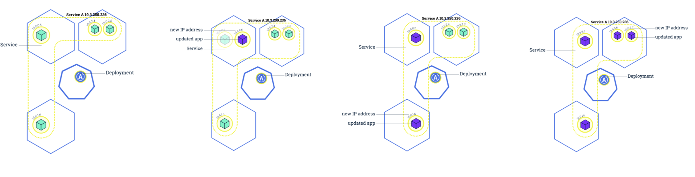

# Pod控制器

## Pod

K8s有很多技术概念，同时对应很多API对象，最重要的也是最基础的是微服务Pod。**Pod是在K8s集群中运行部署应用或服务的最小单元，它是可以支持多容器的**。Pod的设计理念是支持**多个容器在一个Pod中共享网络地址和文件系统**，可以通过进程间通信和文件共享这种简单高效的方式组合完成服务。Pod对多容器的支持是K8s最基础的 设计理念。

```
比如你运行一个操作系统发行版的软件仓库，一个Nginx容器用来发布软件，另一个容器专门用来从源仓库做同步，这两个容器的镜像不太可能是一个团队开发的，但是他们一块儿工作才能提供一个微服务;这种情况下，不同的团队各自开发构建自己的容器镜像，在部署的时候组合成一个微服务对外提供服务。
```

**Pod**是K8s集群中所有业务类型的基础，**可以看作运行在K8s集群中的小机器人**，不同类型的业务就需要不同类型的小机器人去执行。目前K8s中的业务主要可以分为**长期伺服型(long-running)、批处理型(batch)、节点后台支撑型(node-daemon)和有状态应用型(stateful application)**;分别对应的小机器人控制器为`Deployment`、`Job`、 `DaemonSet`和`StatefulSet`，本文后面会一一介绍。

## 复制控制器(Replication Controller，RC)

RC是K8s集群中最早的保证Pod高可用的API对象。***通过监控运行中的Pod来保证集群中运行指定数目的Pod副本***。

指定的数目可以是多个也可以是1个;少于指定数目，RC就会启动运行新的Pod副本; 多于指定数目，RC就会杀死多余的Pod副本。即使在指定数目为1的情况下，通过RC运行Pod也比直接运行Pod更明智，因为RC也可以发挥它高可用的能力，保证永远有1个Pod在运行。

**RC是K8s较早期的技术概念，只适用于长期伺服型的业务类型，比如控制小机器人提供高可用的Web服务。**


## 副本集(Replica Set，RS)

RS是新一代RC，提供同样的高可用能力，区别主要在于RS后来居上，**能支持更多种类的匹配模式**。**副本集对象一般不单独使用，而是作为Deployment的理想状态参数使用。**


## 部署(Deployment)

**部署表示用户对K8s集群的一次更新操作**。

部署是一个比RS应用模式更广的API对象，可以是创建一个新的服务，更新一个新的服务，也可以是滚动升级一个服务。滚动升级一个服务，实际是创建一个新的RS，然后逐渐将新RS中副本数增加到理想状态，将旧RS中的副本数减小到0的复合操作;

这样一个复合操作用一个RS是不太好描述的，所以用一个更通用的 Deployment来描述。以K8s的发展方向，未来对所有长期伺服型的的业务的管理，都会通过 Deployment来管理

## 服务(Service)

**RC、RS和Deployment只是保证了支撑服务的微服务Pod的数量，但是没有解决如何访问这些服务的问题**。一个Pod只是一个运行服务的实例，随时可能在一个节点上停止，在另一个节点以一个新的IP启动一个新的Pod，因此不能以确定的IP和端又号提供服务。要稳定地提供服务需要服务发现和负载均衡能力。服务发现完成的工作，是针对客户端访问的服务， 找到对应的的后端服务实例。

在K8s集群中，客户端需要访问的服务就是Service对象。每个Service会对应一个集群内部有效的虚拟IP，集群内部通过虚拟IP访问一个服务。**在K8s集群中微服务的负载均衡是由Kube-proxy实现的。Kube-proxy是K8s集群内部的负载均衡器。**它是一个分布式代理服务器，在K8s的每个节点上都有一个; 这一设计体现了它的伸缩性优势，**需要访问服务的节点越多，提供负载均衡能力的Kube-proxy就越多，高可用节点也随之增多。**与之相比，我们平时在服务器端使用反向代理作负载均衡，还要进一步解决反向代理 的高可用问题。

## 任务(Job)

**Job是K8s用来控制批处理型任务的API对象。**

批处理业务与长期伺服业务的主要区别是批处理业务的运行有头有尾，而长期伺服业务在用户不停止的情况下永远运行。Job管理的Pod根据用户的设置把任务成功完成就自动退出了。成功完成的标志根据不同的 spec.completions策略而不同:单Pod型任务有一个Pod成功就标志完成;定数成功型任务保 证有N个任务全部成功;工作队列型任务根据应用确认的全局成功而标志成功。

## 后台支撑服务集(DaemonSet)

长期伺服型和批处理型服务的核心在业务应用，可能有些节点运行多个同类业务的Pod，有些节点上又没有这类Pod运行;

### 而后台支撑型服务的核心关注点在K8s集群中的节点(物理机或虚拟机)，要保证每个节点上都有一个此类Pod运行。

节点可能是所有集群节点也可能是通过`nodeSelector`选定的一些特定节点。典型的后台支撑型服务包括，存储，日志和监控 等在每个节点上支撑K8s集群运行的服务。


## 有状态服务集(StatefulSet)

### k8s从1.5版本开始重命名为StatefulSet。 

在云原生应用的体系里，有下面两组近义词;

	第一组是无状态(stateless)、牲畜(cattle)、无 名(nameless)、可丢弃(disposable);
	第二组是有状态(stateful)、宠物(pet)、有名 (having name)、不可丢弃(non-disposable)。

**RC和RS主要是控制提供无状态服务的**，其所控制的Pod的名字是随机设置的，一个Pod出故障了就被丢弃掉，在另一个地方重启一个新的Pod，名字变了、名字和启动在哪儿都不重要，重要的只是Pod总数;

**而StatefulSet是用来控制有状态服务**，StatefulSet中的每个Pod的名字都是事先确定的，不能更改。

**对于RC和RS中的Pod，一般不挂载存储或者挂载共享存储**，保存的是所有Pod共享的状态，Pod像牲畜一样没有分别(这似乎也确实意味着失去了人性特征);

**对于StatefulSet中的Pod，每个Pod挂载自己独立的存储**，如果一个Pod出现故障，从其他节点启动一个同样名字的Pod，要挂载上原来Pod的存储继续以它的状态提供服务。

适合于StatefulSet的业务包括数据库服务MySQL和PostgreSQL，集群化管理服务Zookeeper、etcd 等有状态服务。StatefulSet的另一种典型应用场景是作为一种比普通容器更稳定可靠的模拟虚拟 机的机制。传统的虚拟机正是一种有状态的宠物，运维人员需要不断地维护它，容器刚开始流行时，我们用容器来模拟虚拟机使用，所有状态都保存在容器里，而这已被证明是非常不安全、 不可靠的。使用StatefulSet，Pod仍然可以通过漂移到不同节点提供高可用，而存储也可以通过 外挂的存储来提供高可靠性，StatefulSet做的只是将确定的Pod与确定的存储关联起来保证状态 的连续性。StatefulSet还只在Alpha阶段，后面的设计如何演变，我们还要继续观察。


## 集群联邦(Federation)

K8s在1.3版本里发布了beta版的Federation功能。在云计算环境中，服务的作用距离范围从 近到远一般可以有: **同主机(Host，Node)、跨主机同可用区(Available Zone)、跨可用 区同地区(Region)、跨地区同服务商(Cloud Service Provider)、跨云平台**。K8s的设计定位是单一集群在同一个地域内，因为同一个地区的网络性能才能满足K8s的调度和计算存储 连接要求。而联合集群服务就是为提供跨Region跨服务商K8s集群服务而设计的。

每个K8s Federation有自己的分布式存储、API Server和Controller Manager。用户可以通过 Federation的API Server注册该Federation的成员K8s Cluster。当用户通过Federation的API Server创建、更改API对象时，Federation API Server会在自己所有注册的子K8s Cluster都创 建一份对应的API对象。在提供业务请求服务时，K8s Federation会先在自己的各个子 Cluster之间做负载均衡，而对于发送到某个具体K8s Cluster的业务请求，会依照这个K8s Cluster独立提供服务时一样的调度模式去做K8s Cluster内部的负载均衡。而Cluster之间的负 载均衡是通过域名服务的负载均衡来实现的。

**所有的设计都尽量不影响K8s Cluster现有的工作机制，这样对于每个子K8s集群来说，并不需要更外层的有一个K8s Federation，也就是意味着所有现有的K8s代码和机制不需要因为 Federation功能有任何变化。**

## 存储卷(Volume)

K8s集群中的存储卷跟Docker的存储卷有些类似，**只不过Docker的存储卷作用范围为一个容器，而K8s的存储卷的生命周期和作用范围是一个Pod**。每个Pod中声明的存储卷由Pod中的 所有容器共享。K8s支持非常多的存储卷类型，特别的，支持多种公有云平台的存储，包括 AWS，Google和Azure云;支持多种分布式存储包括GlusterFS和Ceph;也支持较容易使用的 主机本地目录hostPath和NFS。**K8s还支持使用Persistent Volume Claim即PVC这种逻辑存储**，使用这种存储，使得存储的使用者可以忽略后台的实际存储技术(例如AWS，Google或 GlusterFS和Ceph)，**而将有关存储实际技术的配置交给存储管理员通过Persistent Volume来配置**。

## 持久存储卷(Persistent Volume，PV)和持久存储卷声明(Persistent Volume Claim，PVC)

PV和PVC使得K8s集群具备了存储的逻辑抽象能力，使得在配置Pod的逻辑里可以忽略对实际后台存储技术的配置，而把这项配置的工作交给PV的配置者，即集群的管理者。

存储的PV和PVC的这种关系，跟计算的Node和Pod的关系是非常类似的;**PV和Node是资源的提供者，根据集群的基础设施变化而变化，由K8s集群管理员配置;**

**而PVC和Pod是资源的使用者，根据业务服务的需求变化而变化，由K8s集群的使用者即服务的管理员来配置。**

## 节点(Node)

K8s集群中的计算能力由Node提供，最初Node称为服务节点Minion，后来改名为Node。 K8s集群中的Node也就等同于Mesos集群中的Slave节点，是所有Pod运行所在的工作主机， 可以是物理机也可以是虚拟机。不论是物理机还是虚拟机，工作主机的统一特征是上面要 运行kubelet管理节点上运行的容器。

## 密钥对象(Secret)

Secret是用来保存和传递密码、密钥、认证凭证这些敏感信息的对象。使用Secret的好处是 可以避免把敏感信息明文写在配置文件里。在K8s集群中配置和使用服务不可避免的要用到 各种敏感信息实现登录、认证等功能，例如访问AWS存储的用户名密码。为了避免将类似 的敏感信息明文写在所有需要使用的配置文件中，可以将这些信息存入一个Secret对象，而 在配置文件中通过Secret对象引用这些敏感信息。这种方式的好处包括:意图明确，避免重 复，减少暴漏机会。

## 用户帐户(User Account)和服务帐户(Service Account)

顾名思义，用户帐户为人提供账户标识，而服务账户为计算机进程和K8s集群中运行的Pod 提供账户标识。用户帐户和服务帐户的一个区别是作用范围;

**用户帐户对应的是人的身份，人的身份与服务的namespace无关，所以用户账户是跨namespace的; 而服务帐户对应的是一个运行中程序的身份，与特定namespace是相关的。**

## 名字空间(Namespace)

**名字空间为K8s集群提供虚拟的隔离作用**，

K8s集群初始有两个名字空间，**分别是默认名字空间default和系统名字空间kube-system**，除此以外，管理员可以创建新的名字空间满足需要。

## RBAC访问授权

K8s在1.3版本中发布了alpha版的基于角色的访问控制(Role-based Access Control，RBAC) 的授权模式。相对于基于属性的访问控制(Attribute-based Access Control，ABAC)， RBAC主要是引入了角色(Role)和角色绑定(RoleBinding)的抽象概念。在ABAC中，K8s 集群中的访问策略只能跟用户直接关联;而在RBAC中，访问策略可以跟某个角色关联，具 体的用户在跟一个或多个角色相关联。显然，RBAC像其他新功能一样，每次引入新功能， 都会引入新的API对象，从而引入新的概念抽象，而这一新的概念抽象一定会使集群服务管 理和使用更容易扩展和重用。

## 扩展应用

1. 通过修改Deployment中副本的数量(replicas)，可以动态扩展或收缩应用:
2. 这些自动扩展的容器会自动加入到service中，而收缩回收的容器也会自动从service中删除
3. `kubectl scale --replicas=3 deployment/nginx-app`
4. `kubectl get deploy`


## 滚动升级

```
kubectl rolling-update frontend-v1 frontend-v2 --image=image:v2
```



在滚动升级的过程中，如果发现了失败或者配置错误，还可以随时回滚:

```
kubectl rolling-update frontend-v1 frontend-v2 --rollback
```

## 资源限制

`Kubernetes`通过`cgroups`提供容器资源管理的功能，可以限制每个容器的CPU和内存使用，比如对于刚才创建的deployment，可以通过下面的命令限制nginx容器最多只用50%的CPU和 128MB的内存:

```
$ kubectl set resources deployment nginx-app -c=nginx --limits=cpu=500m,memory=128Mi
```

deployment "nginx" resource requirements updated

这等同于在每个Pod中设置resources limits

```
apiVersion: v1 
kind: Pod 
metadata:
 name: nginx 
 labels:
  app: nginx 
spec:
 containers:
 - name: nginx
   image: nginx 
   ports:
    - containerPort: 80
   resources:
    limits:
     cpu: "500m"
     memory: "128Mi"
```

## 健康检查

微服务由于其松耦合的特性使得各个服务之间的访问基于:

```
– 网络 
– 协议 
– SLA
```

对于要发布的服务，需要两个级别的健康检查:

```
– 节点健康指标:CPU，内存，⺴络吞吐;
– 应用级别健康指标:
   • Selfclosure 
   • External
   • Functional
- LB上的TCP/ECVcheck   
```

1. Kubernetes作为一个面向应用的集群管理工具，需要确保容器在部署后确实处在正常的运行 状态。**Kubernetes提供了两种探针(Probe，支持exec、tcpSocket和http方式)来探测容器的状态**。
2. **LivenessProbe:探测应用是否处于健康状态，如果不健康则删除并重新创建容器**
3. **ReadinessProbe:探测应用是否启动完成并且处于正常服务状态，如果不正常则不会接收来自Kubernetes Service的流量**
4. 对于已经部署的deployment，可以通过`kubectl edit deployment/nginx-app`来更新manifest，增加健康检查部分:

## 健康检查spec

```
apiVersion: extensions/v1beta1 
kind: Deployment
metadata:
 labels:
  app: nginx
 name: nginx-default 
spec:
 replicas: 3 
 selector:
  matchLabels: 
  app: nginx
template: 
 metadata:
  labels:
   app: nginx
```


```
spec: 
   containers:
   - image: nginx
   imagePullPolicy: Always
   name: http
   resources: {}
   terminationMessagePath: /dev/termination-log 
   terminationMessagePolicy: File
   resources:
    limits:
      cpu: "500m" 
      memory: "128Mi"
```

```
livenessProbe: 
 httpGet:
  path: /
  port: 80 
 initialDelaySeconds: 15 
 timeoutSeconds: 1
readinessProbe: 
 httpGet:
  path: /ping
  port: 80 
 initialDelaySeconds: 5 
 timeoutSeconds: 1
```

