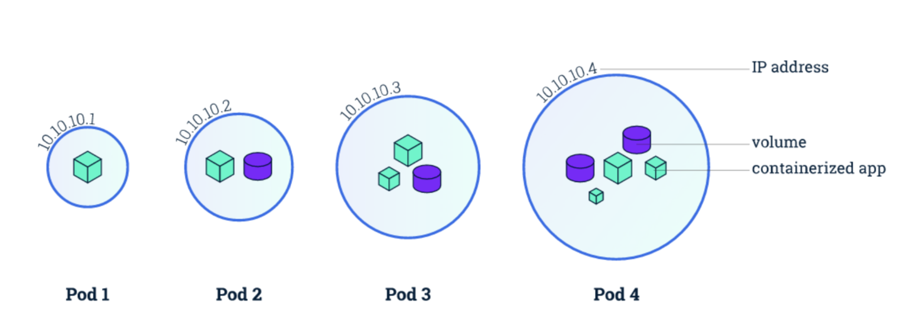
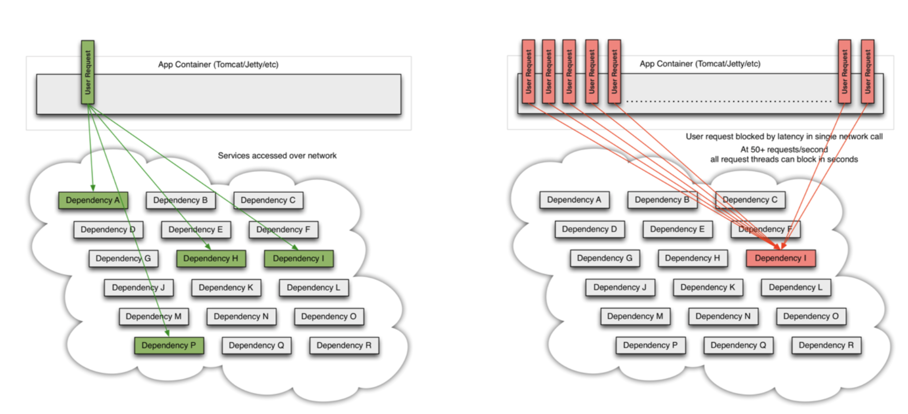

# Kubernetes对象详解 

### Pod是一组紧密关联的容器集合，
它们共享**IPC**、**Network**和**UTC namespace**，是Kubernetes 调度的基本单位。
**Pod的设计理念是支持多个容器在一个Pod中共享网络和文件系统**，可以通过进程间通信和文件共享这种简单高效的方式组合完成服务



## Pod的特征

* 包含多个共享`IPC`、`Network`和`UTC namespace`的容器，可直接通过`localhost`通信
* 所有`Pod`内容器都可以访问共享的`Volume`，可以访问共享数据
* 无容错性:直接创建的`Pod`一旦被调度后就跟`Node`绑定，即使`Node`挂掉也不会被重新调度 (而是被自动删除)，因此**推荐使用`Deployment`、`Daemonset`等控制器来容错**
* 优雅终止:`Pod`删除的时候先给其内的进程发送`SIGTERM`，等待一段时间(grace period) 后才强制停止依然还在运行的进程
* 特权容器(通过SecurityContext配置)具有改变系统配置的权限(在网络插件中大量应用)

## Pod

* 共享资源的操作系统进程组
* 计算节点的本地进程
* 可以按照OCI标准格式打包，提供更好的敏捷性，不可变形，安全性，和高效部署

## Pod Spec

```
apiVersion: v1
kind: Pod
metadata:
  name: nginx
  labels:
    app: nginx
spec:
  containers:
  - name: nginx
    image: nginx 
    ports:
    - containerPort: 80
```

## 使用Volume

### Volume可以为容器提供持久化存储，比如:

```
apiVersion: v1 
kind: Pod 
metadata:
  name: redis
spec:
  containers:
  - name: redis
    image: redis
    volumeMounts:
    - name: redis-storage
      mountPath: /data/redis
  volumes:
  - name: redis-storage 
    emptyDir: {}    
```

## RestartPolicy

* 支持三种`RestartPolicy`
* `Always`:只要退出就重启
* `OnFailure`:失败退出(exit code不等于0)时重启
* `Never`:只要退出就不再重启

### 注意，这里的重启是指在Pod所在Node上面本地重启，并不会调度到其他Node上去。

## 环境变量 (env)

环境变量为容器提供了一些重要的资源，包括容器和Pod的基本信息以及集群中服务的信息等:

### (1) hostname

**`HOSTNAME`环境变量保存了该`Pod`的`hostnames`**

### (2)容器和Pod的基本信息

`Pod的名字`、`命名空间`、`IP`以及`容器的计算资源限制`等可以`Download API`的方式获取并存储到环境变量中。

```
apiVersion: v1 
kind: Pod 
metadata:
  name: test
spec:
  containers:
  - name: test-container
    image: gcr.io/google_containers/busybox
    command: [ "sh", "-c"]
    args:
    - env
    resources:
     requests:
       memory: "32Mi"
       cpu: "125m"
     limits:
       memory: "64Mi"
       cpu: "250m"

env:
   - name: MY_NODE_NAME
     valueFrom:
       fieldRef:
         fieldPath: spec.nodeName
   - name: MY_POD_NAME
     valueFrom:
       fieldRef:
         fieldPath: metadata.name   
   - name: MY_POD_NAMESPACE
     valueFrom:
       fieldRef:
         fieldPath: metadata.namespace
   - name: MY_POD_IP
     valueFrom:
       fieldRef:
         fieldPath: status.podIP
   - name: MY_POD_SERVICE_ACCOUNT
     valueFrom:
       fieldRef:
         fieldPath: spec.serviceAccountName    
   - name: MY_CPU_REQUEST
     valueFrom:
       resourceFieldRef:
         containerName: test-container 
         resource: requests.cpu
   - name: MY_CPU_LIMIT
     valueFrom:
       resourceFieldRef:
         containerName: test-container
         resource: limits.cpu
   - name: MY_MEM_REQUEST
     valueFrom:
       resourceFieldRef:
         containerName: test-container
         resource: requests.memory
   - name: MY_MEM_LIMIT
     valueFrom:
       resourceFieldRef:
         containerName: test-container
         resource: limits.memory
restartPolicy: Never
```

### (3) 集群中服务的信息

容器的环境变量中还可以引用容器运行前创建的所有服务的信息，比如默认的kubernetes服 务对应以下环境变量:

```
KUBERNETES_PORT_443_TCP_ADDR=10.0.0.1
KUBERNETES_SERVICE_HOST=10.0.0.1
KUBERNETES_SERVICE_PORT=443
KUBERNETES_SERVICE_PORT_HTTPS=443
KUBERNETES_PORT=tcp://10.0.0.1:443
KUBERNETES_PORT_443_TCP=tcp://10.0.0.1:443 KUBERNETES_PORT_443_TCP_PROTO=tcp KUBERNETES_PORT_443_TCP_PORT=443
```

## ImagePullPolicy

支持三种`ImagePullPolicy`

* `Always`:不管镜像是否存在都会进行一次拉取
* `Never`:不管镜像是否存在都不会进行拉取
* `IfNotPresent`:只有镜像不存在时，才会进行镜像拉取

### 1.默认为`IfNotPresent`，但`:latest`标签的镜像默认为Always。
### 2.拉取镜像时docker会进行校验，如果镜像中的MD5码没有变，则不会拉取镜像数据。
### 3.生产环境中应该尽量避免使用`:latest`标签，而开发环境中可以借助`:latest`标签自动拉取最新的镜像。

## 访问DNS的策略

###  通过设置`dnsPolicy`参数，设置`Pod`中容器访问DNS的策略

* ClusterFirst:优先基于clusterdomain后缀，通过kube-dns查询(默认策略)
* Default:优先从kubelet中配置的DNS查询

## 使用主机命名空间

* 通过设置`spec.hostIPC`参数为true，使用**主机的IPC命名空间**，默认为false。
* 通过设置`spec.hostNetwork`参数为true，使用**主机的网络命名空间**，默认为false。 
* 通过设置`spec.hostPID`参数为true，使用**主机的PID命名空间**，默认为false。

### 使用主机名空间

```
apiVersion: v1
kind: Pod
metadata:
  name: busybox1
  labels:
    name: busybox
spec:
  hostIPC: true 
  hostPID: true 
  hostNetwork: true
  containers:
  - image: busybox
```

## 设置Pod的hostname

* 通过`spec.hostname`参数实现，如果未设置默认使用m`etadata.name`参数的值作为Pod的hostname。
* 设置Pod的子域名
* 过`spec.subdomain`参数设置Pod的子域名，默认为空。
* 指定`hostname`为`busybox-2`和`subdomain`为`default-subdomain`，完整域名为`busybox-2.default-subdomain.default.svc.cluster.local`，也可以简写为`busybox-2.default-subdomain.default`
* 还需要在`default namespace`中创建一个名为`default-subdomain`(即 `subdomain`)的`headless service`，否则其他Pod无法通过完整域名访问 到该Pod

```
apiVersion: v1 
kind: Pod 
metadata:
  name: busybox2
  labels:
    name:busybox
spec:
  hostname: busybox-2
  subdomain: default-subdomain
  containers:
  - image: busybox
    command:
     - sleep
     - "3600"
    name: busybox
```

## 资源限制
* `Kubernetes`通过`cgroups`限制容器的CPU和内存等计算资源，包括`requests`(请求，调度器保证调度到资源充足的 Node上，如果无法满足会调度失败)和`limits`(上限)等:
* `spec.containers[].resources.limits.cpu`:CPU上限，可以**短暂超过，容器也不会被停止**
* `spec.containers[].resources.limits.memory`:**内存上限，不可以超过;如果超过，容器可能会被终止或调度到其他资源充足的机器上**
* `spec.containers[].resources.requests.cpu`:CPU请求，也是调度CPU资源的依据，可以超过
* `spec.containers[].resources.requests.memory`:内存请求，也是调度内存资源的依据，可以超过;但如果超过，容器 可能会在Node内存不足时清理
* `spec.containers[].resources.requests.memory`:内存请求，也是调度内存资源的依据，可以超过;但如果超过，容器 可能会在Node内存不足时清理
* CPU 的单位是 CPU 个数，可以用 millicpu (m) 表示少于1个CPU的情况，如 500m = 500millicpu = 0.5cpu，而一个 CPU相当于:

```
  - AWS 上的一个 vCPU
  - GCP 上的一个 Core
  -  Azure 上的一个 vCore
  - 物理机上开启超线程时的一个超线程
```
* 内存的单位则包括E,P,T,G,M,K,Ei,Pi,Ti,Gi,Mi,Ki等。

## 资源限制示例

```
apiVersion: v1
kind: Pod
metadata:
  labels:
    app: nginx
  name: nginx
spec:
  containers:
    - image: nginx
      name: nginx
      resources:
        requests:
          cpu: "300m"
          memory: "56Mi"
        limits:
          cpu:"1"
          memory: "128Mi"
```

## 健康检查  

微服务由于其松耦合的特性使得各个服务之间的访问基于:

```
– 网络
– 协议 
– SLA
```

对于要发布的服务，需要两个级别的健康检查:

```
– 节点健康指标:CPU，内存，网络吞吐;
– 应用级别健康指标: Selfclosure External Functional
- LB上的TCP/ECV check
```

## 服务容错

当企业微服务化以后，服务之间会有错综复杂的依赖关系，例如，一个前端请求一般 会依赖于多个后端服务。在实际生产环境中，服务往往不是百分百可靠，服务可能会 出错或者产生延迟，如果一个应用不能对其依赖的故障进行容错和隔离，那么该应用 本身就处在被拖垮的风险中。在一个高流量的网站中，某个单一后端一旦发生延迟， 可能在数秒内导致所有资源被耗尽，造成所谓的雪崩效应，严重时可致整个网站瘫痪。



## 服务容错

* 电路熔断器模式(Circuit Breaker Patten)
* 舱壁隔离模式(Bulkhead Isolation Pattern)
* 限流(Rate Limiting/Load Shedder)

```
 服务总有容量限制，没有限流机制的服务很容易在突发流量(秒杀，大促)时被冲垮。 限流通常指对服务限定并发访问量，比如
 单位时间只允许100个并发调用，对超过 这个限制的请求要拒绝并回退。
```

* 回退(fallback)

```
在熔断或者限流发生的时候，应用程序的后续处理逻辑是什么?回退是系统的弹 性恢复能力，常见的处理策略有，直接抛出异
常，也称快速失败(Fail Fast)，也可 以返回空值或缺省值，还可以返回备份数据，如果主服务熔断了，可以从备份服 务获
取数据。
```

## 健康检查

为了确保容器在部署后确实处在正常运行状态，Kubernetes提供了**两种探针(Probe)**来探测容器的状态:

* `LivenessProbe`:探测应用是否处于健康状态，**如果不健康则删除并重新创建容器**
* `ReadinessProbe`:探测应用是否启动完成并且处于正常服务状态，如果**不正常则不会接收来自`Kubernetes Service`的流量**

### Kubernetes支持三种方式来执行探针:

* `exec`:在容器中执行一个命令，**如果命令退出码返回0则表示探测成功，否则表示失败**
* `tcpSocket`:对指定的容器IP及端又执行一个TCP检查，`如果端又是开放的则表示探测成功，否则表示失败`
* `httpGet`:对指定的`容器IP`、`端口`及`路径`执行`一个HTTP Get请求`，如果返回的状态码在[200,400)之间则表示探测成功，否则表示失败


## 健康检查示例

```
apiVersion: v1
kind: Pod
metadata:
  labels:
    app: nginx
  name: nginx
spec:
  containers:
  - image: nginx
    imagePullPolicy: Always
    name: http
    livenessProbe:
    	httpGet:
    	  path: /
    	  port: 80
    	  httpHeaders:
    	  - name: X-Custom-Header
    	    value: Awesome
       initialDelaySeconds: 15
       timeoutSeconds: 1
    readinessProbe:
      exec:
      	command:
      	- cat
      	- /usr/share/nginx/html/index.html
      initialDelaySeconds: 5
      timeoutSeconds: 1
  - name: goproxy
  	   image: gcr.io/google_containers/goproxy:0.1
      	ports:	  
       - containerPort: 8080
       readinessProbe:
        tcpSocket:
          port: 8080
        initialDelaySeconds: 5
        periodSeconds: 10
       livenessProbe:
        tcpSocket:
        	port: 8080
        initialDelaySeconds: 15
        periodSeconds: 20      	
```


## 初始化容器

### `InitContainer`在所有容器运行之前执行(`run-to-completion`)，常用来初始化配置。

```
apiVersion: v1
kind: Pod
metadata:
  name: init-demo
spec:
  containers:
  - name: nginx
    image: nginx
    ports:
    - containerPort: 80
    volumeMounts:
    - name: workdir
      mountPath: /usr/share/nginx/html

# These containers are run during pod initialization
initContainers:
- name: install
  image: busybox
  command:
  - wget
  - "-O"
  - "/work-dir/index.html" - http://kubernetes.io
  volumeMounts:
  - name: workdir
    mountPath: "/work-dir"
  dnsPolicy: Default
  volumes:
  - name: workdir
    emptyDir: {}
```

## 容器生命周期钩子

容器生命周期钩子(`Container Lifecycle Hooks`)监听容器生命周期的特定事件，并在事件发生时执行已注册的回调函数。支持两种钩子:

* `postStart`: 容器创建后立即执行，注意由于是异步执行，它无法保证一定在ENTRYPOINT之前运行。如果失败， 容器会被杀死，并根据RestartPolicy决定是否重启
* `preStop`:容器终止前执行，常用于资源清理。如果失败，容器同样也会被杀死

### 而钩子的回调函数支持两种方式:

`exec`:在容器内执行命令，如果命令的退出状态码是0表示执行成功，否则表示失败
`httpGet`:向指定URL发起GET请求，如果返回的HTTP状态码在[200, 400)之间表示请求成功，否则表示失败

## postStart和preStop钩子示例

```
apiVersion: v1
kind: Pod
metadata:
  name: lifecycle-demo
spec:
  containers:
  - name: lifecycle-demo-container
    image: nginx
    lifecycle:
    	postStart:
    	  httpGet:
    	    path:/
    	    port: 80
    	preStop:
    	  exec:
    	    command: ["/usr/sbin/nginx","-s","quit"]
```

## 使用Capabilities

* 默认情况下，容器都是以非特权容器的方式运行。比如，不能在容器中创建虚拟网卡、配置虚拟网络。
* Kubernetes提供了修改`Capabilities`的机制，可以按需要给容器增加或删除。

### Capabilities示例

```
apiVersion: v1
kind: Pod
metadata:
  name: cap-pod
spec:
  containers:
  - name: friendly-container
    image: "alpine:3.4"
    command: ["/bin/sleep", "3600"]
    securityContext:
      capabilities:
        add:
        - NET_ADMIN
        drop:
        - KILL  	
```

## 限制网络带宽

* 可以通过给Pod增加`kubernetes.io/ingress-bandwidth`和`kubernetes.io/egress-bandwidth`这两个annotation来限制Pod的网络带宽
* 目前只有kubenet网络插件支持限制网络带宽， 其他CNI网络插件暂不支持这个功能。

```
apiVersion: v1
kind: Pod
metadata:
  name: qos
  annotations:
  	kubernetes.io/ingress-bandwidth: 3M
  	kubernetes.io/egress-bandwidth: 4M
spec:
  containers:
  - name: iperf3
    image: networkstatic/iperf3
    command:
    - iperf3
    - -s
```

## 限制网络带宽原理

### kubenet的网络带宽限制其实是通过tc来实现的

*   #setupqdisc(onlyonce)
*   tcqdiscadddevcbr0roothandle1:htbdefault30 • #downloadrate
*   tcclassadddevcbr0parent1:classid1:2htbrate3Mbit
*   tcfilteradddevcbr0protocolipparent1:0prio1u32matchipdst10.1.0.3/32flowid1:2 
*   #uploadrate
*   tcclassadddevcbr0parent1:classid1:3htbrate4Mbit
*   tcfilteradddevcbr0protocolipparent1:0prio1u32matchipsrc10.1.0.3/32flowid1:3


## 自定义hosts
默认情况下，容器的`/etc/hosts`是kubelet自动生成的，并且仅包含 `localhost`和`podName`等。不建议在容器内直接修改`/etc/hosts`文件，**因为在Pod启动或重启时会被覆盖**。

默认的`/etc/hosts`文件格式如下，其中`nginx-4217019353-fb2c5`是`podName`:

```
$ kubectl exec nginx-4217019353-fb2c5 -- cat /etc/hosts # Kubernetes-managed hosts file.
127.0.0.1 localhost
::1 localhost ip6-localhost ip6-loopback
fe00::0 ip6-localnet
fe00::0 ip6-mcastprefix
fe00::1 ip6-allnodes
fe00::2 ip6-allrouters
10.244.1.4 nginx-4217019353-fb2c5
```

## Pod spec对host的支持

从v1.7开始，可以通过 `pod.Spec.HostAliases`来增加hosts内容

```
apiVersion: v1
kind: Pod
metadata:
  name: hostaliases-pod
spec:
  hostAliases:
  - ip: "127.0.0.1"
    hostnames:
    - "foo.local"
    - "bar.local"
  - ip: "10.1.2.3"
    hostnames:
    - "foo.remote" 
    - "bar.remote"
  containers:
  - name: cat-hosts
    image: busybox
    command:
    - cat
    args:
    - "/etc/hosts" 
```

## HugePages

* **v1.8+**支持给容器分配HugePages，资源格式为`hugepages-<size>`(如hugepages-2Mi )。使用前要配置
* 开启`--feature-gates="HugePages=true"`
* 在所有Node上面预分配好`HugePage`， 以便 `Kubelet` 统计所在 `Node`的 `HugePage` 容量

```
apiVersion: v1
kind: Pod
metadata:
  generateName: hugepages-volume-
spec:
  containers:
  - image: fedora:latest
    command:
    - sleep
    - inf
    name: example
    volumeMounts:
    - mountPath: /hugepages
      name: hugepage
    resources:
      limits:
        hugepages-2Mi: 100Mi
  volumes:
  - name: hugepage
    emptyDir:
      medium: HugePages
```

## Finalizer

`Finalizer`用于实现控制器的异步预删除钩子，可以通过`metadata.finalizers`来指定Finalizer。
`Finalizer`指定后，客户端删除对象的操作只会设置`metadata.deletionTimestamp`而不是直接删除。这会触发正在监听CRD的控制器，控制器执行一些删除前的清理操作，从列表中删除 自己的finalizer，然后再重新发起一个删除操作。此时，被删除的对象才会真正删除。