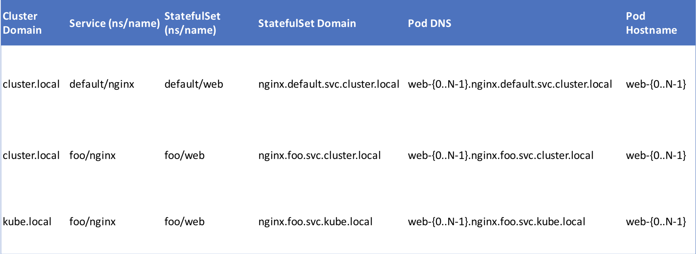

# Kubernetes对象详解 

## 静态Pod

**静态Pod来在每台机器上运行指定的Pod，这需要kubelet在启动的时候指定manifest目录**:

`kubelet --pod-manifest-path=/etc/kubernetes/manifests` 然后将所需要的Pod定义文件放到指定的manifest目录中.

**注意:静态Pod不能通过`API Server`来删除，但可以通过删除manifest文件来自动删除对应的 Pod。**


## ReplicationController/ReplicaSet

* `ReplicationController(`也简称为`rc`)**用来确保容器应用的副本数始终保持在用户定义的副本数，即如果有容器异常退出，会自动创建新的Pod来替代;而异常多出来的容器也会自动回收**。ReplicationController的典型应用场景包括确保健康Pod的数量、弹性伸缩、滚动升级以及应用多版本发布跟踪等。

* **在新版本的Kubernetes中建议使用`ReplicaSet(也简称为rs)`来取代`ReplicationController`**。 `ReplicaSet`跟`ReplicationController`没有本质的不同，只是名字不一样，**并且ReplicaSet支持集合式的selector(ReplicationController仅支持等式)**
* **虽然也`ReplicaSet`可以独立使用，但建议使用`Deployment`来自动管理`ReplicaSet`，这样就无需担心跟其他机制的不兼容问题**(比如`ReplicaSet`不支持`rolling-update`但`Deployment`支持)， 并且还**支持版本记录、回滚、暂停升级等高级特性**。

## StatefulSet

**`StatefulSet`是为了解决有状态服务的问题**(对应`Deployments`和`ReplicaSets`是为无状态服务而设计)，其应用场景包括

* 稳定的持久化存储，即Pod重新调度后还是能访问到相同的持久化数据，基于PVC来实现
* 稳定的网络标志，即Pod重新调度后其PodName和HostName不变，基于HeadlessService(即没有Cluster IP的Service)来实现
* 有序部署，有序扩展，即Pod是有顺序的，在部署或者扩展的时候要依据定义的顺序依次依序进 行(即从0到N-1，在下一个Pod运行之前所有之前的Pod必须都是Running和Ready状态)，基于 init containers来实现
* 有序收缩，有序删除(即从N-1到0)


## StatefulSet由以下几个部分组成

* 用于定义网络标志(`DNSdomain`)的`HeadlessService`
* 用于创建`PersistentVolumes`的`volumeClaimTemplates`
* 定义具体应用的`StatefulSet`
* StatefulSet中每个`Pod`的`DNS`格式为`statefulSetName-{0..N-1}.serviceName.namespace.svc.cluster.local`， 其中 
 * `serviceName`为`HeadlessService`的名字
 * `0..N-1`为`Pod`所在的序号，从`0开始到N-1`
 * `statefulSetName`为`StatefulSet`的名字
 * `namespace`为服务所在的`namespace`，`HeadlessService`和`StatefulSet`必须在相同的`namespace`
 * `.cluster.local`为`ClusterDomain`，

## 示例

```
apiVersion: v1
kind: Service
metadata:
  name: nginx
  labels:
    app: nginx
spec:
  ports:
  - port: 80
    name: web
  clusterIP: None
  selector:
  	app: nginx
```

```
apiVersion: apps/v1beta1
kind: StatefulSet
metadata:
  name: web
spec:
  serviceName: "nginx"
  replicas: 2
  template:
    metadata:
      labels:
        app: nginx
    spec:
    	containers:
    	- name: nginx
    	  image: gcr.io/google_containers/nginx-slim:0.8
    	  ports:
    	  - containerPort: 80
           name: web
         volumeMounts:
         - name: www
           mountPath: /usr/share/nginx/html
volumeClaimTemplates:
- metadata:
   name: www
   annotations:
   	 volume.alpha.kubernetes.io/storage-class: anything
  spec:
  	accessModes: [ "ReadWriteOnce" ]
  	resources:
  	 requests: 
  	   storage: 1Gi          
```

## Statefulset创建的对象

 # 查看创建的`headless service`和`statefulset`
 
```
$ kubectl get service nginx

NAME CLUSTER-IP EXTERNAL-IP PORT(S) AGE 
nginx None      <none>      80/TCP 1m

$ kubectl get statefulset web

NAME DESIRED CURRENT AGE
web  2       2       2m
```

 # 根据`volumeClaimTemplates`自动创建`PV`C(在GCE中会自动创建`kubernetes.io/gce-pd`类型的`volume`)
 
 ```
 $ kubectl get pvc
 
 NAME      STATUS VOLUME                                   CAPACITY ACCESSMODES AGE
 www-web-0 Bound pvc-d064a004-d8d4-11e6-b521-42010a800002  1Gi      RWO         16s
 www-web-1 Bound pvc-d06a3946-d8d4-11e6-b521-42010a800002  1Gi      RWO         16s
 ```

 # 查看创建的Pod，他们都是有序的
 
 ```
 $ kubectl get pods -l app=nginx
 
NAME READY STATUS RESTARTS AGE 
web-0 1/1 Running 0 5m
web-1 1/1 Running 0 4m
 ```

##  Dns 配置



## StatefulSet的更新策略

### OnDelete:

当`.spec.template`更新时，**并不立即删除旧的Pod，而是等待用户手动删除这些旧Pod后自动创建新Pod**。这是默认的更新策略，兼容v1.6版本的行为

### RollingUpdate:

* 当`.spec.template`更新时，**自动删除旧的Pod并创建新Pod替换**。在更新时，这些Pod是按逆序的方式进行，依次删除、创建并等待Pod变成Ready状态才进行下一个Pod的更新。

* `RollingUpdate`还支持`Partitions`，通过`.spec.updateStrategy.rollingUpdate.partition`来设置。当 `partition`设置后，只有序号大于或等于`partition`的Pod会在`.spec.template`更新的时候滚动更新，而其余的Pod则保持不变(即便是删除后也是用以前的版本重新创建)。


## Statefulset Pod管理策略

### OrderedReady:

**默认的策略，按照Pod的次序依次创建每个Pod并等待Ready之后才创建后面的Pod**

### Parallel:

**并行创建或删除Pod(不等待前面的Pod Ready就开始创建所有的Pod)**

## DaemonSet

DaemonSet保证在每个Node上都运行一个容器副本，**常用来部署一些集群的日志、监控或者其他系统管理应用。典型的应用包括**:

### 日志收集
**比如fluentd，logstash等**

### 系统监控
**比如Prometheus Node Exporter，collectd，New Relic agent，Ganglia gmond等**

### 系统程序
**比如kube-proxy, kube-dns, glusterd, ceph等**

## Daemonset更新策略

### OnDelete:

默认策略，更新模板后，**只有手动删除了旧的Pod后才会创建新的Pod**

### RollingUpdate:

* 更新DaemonSet模版后，**自动删除旧的Pod并创建新的Pod**
* 在使用RollingUpdate策略时，还可以设置
  *  `.spec.updateStrategy.rollingUpdate.maxUnavailable`, **默认1**
  *  `spec.minReadySeconds`，**默认0**

## 回滚

###  #查询历史版本

```
$ kubectl rollout history daemonset <daemonset-name>
```

### #查询某个历史版本的详细信息

```
$ kubectl rollout history daemonset <daemonset-name> --revision=1
```

### #回滚

```
 $ kubectl rollout undo daemonset <daemonset-name> --to-revision=<revision>
```

###  #查询回滚状态

```
$ kubectl rollout status ds/<daemonset-name>
```

