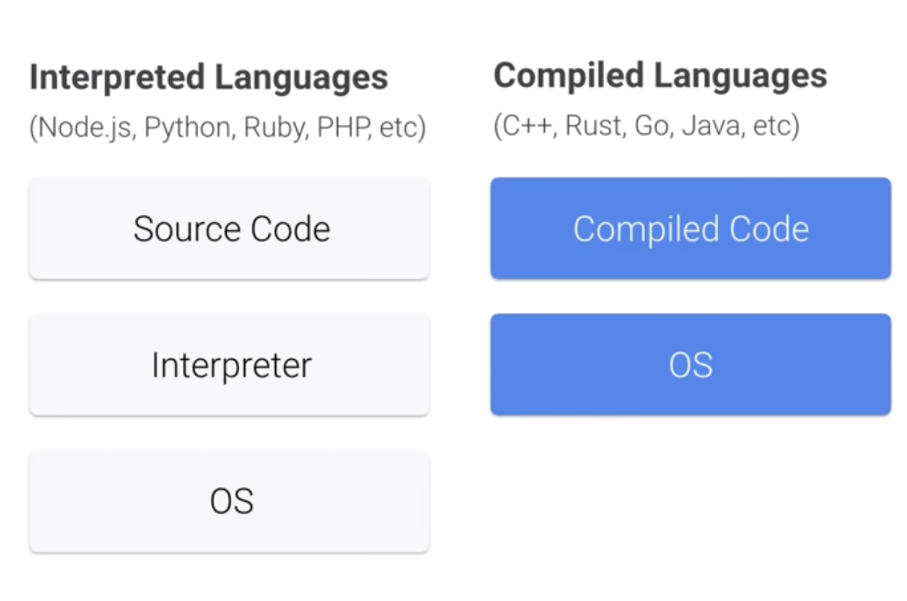
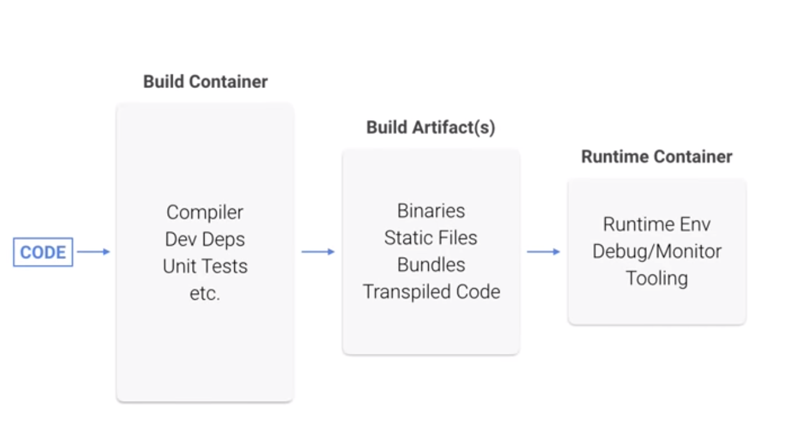
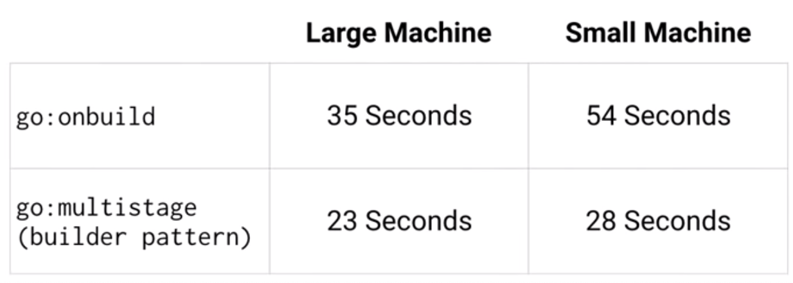
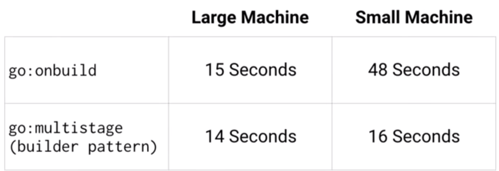
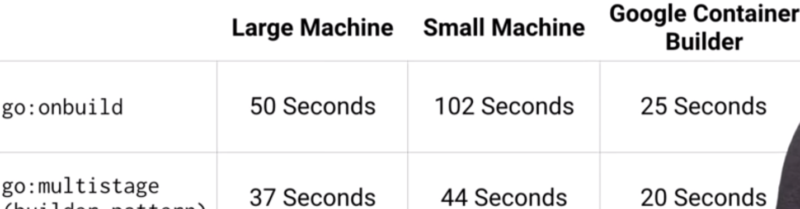
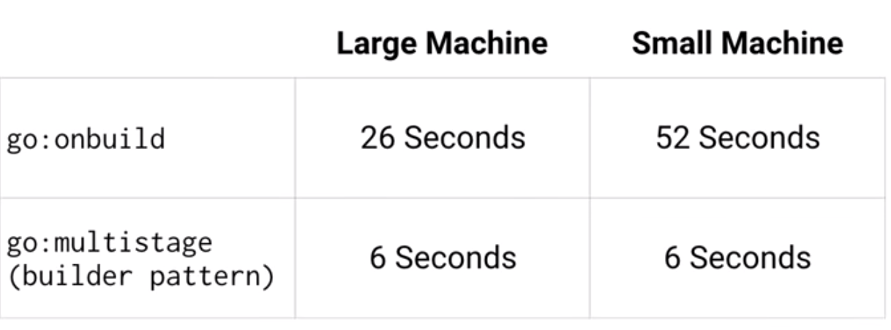
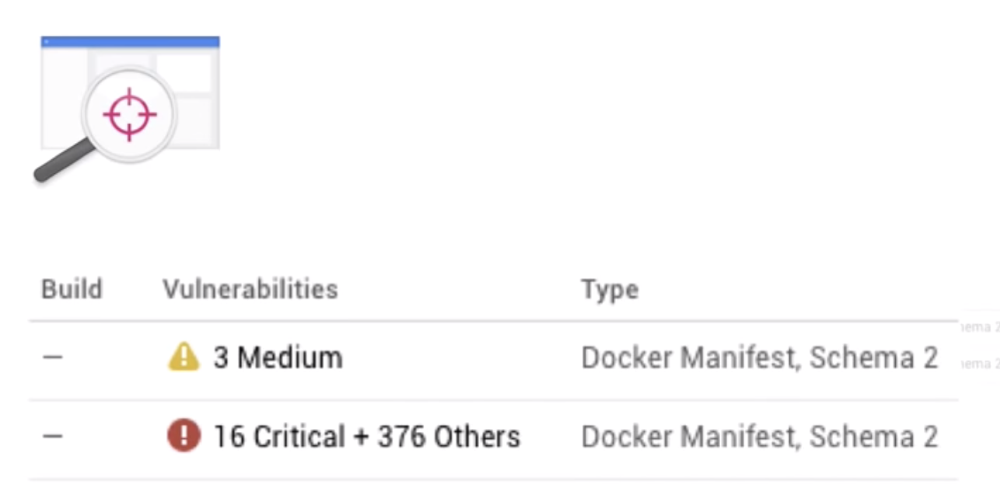

# Building Small Containers 

### Small Base Image
### Builder Pattern

## 1.Small Base Image

### Docker Base Images: 

* node:8        —> ~670MB 
* node:8-wheezy —> ~520MB 
* node:8-slim   -> ~225MB 
* **node:8-alpine —> ~65MB**


### before optimization

```
FROM node:onbuild
EXPOSE 8080
```

### After optimization

```
FROM node:alpine 
WORKDIR /app                             # add work dir
COPY package.json /app/package.json     
RUN npm install --production             # install dependency
COPY server.js /app/server.js 
EXPOSE 8080 CMD                          # expose port
npm start              
```


## 2.Builder Pattern



### Use multi-stage build pattern



Why multi-stage is better and how to use it, please my another article(mandarin): [docker multi-stage build pattern](https://github.com/Chao-Xi/JacobTechBlog/blob/master/docker/10docer_stages.md) 

### before optimization

```
FROM golang:alpine 
WORKDIR /app 
ADD . /app 
RUN cd /app && go build -o goapp 
EXPOSE 8080 
ENTRYPOINT ./goapp 
```

### After optimization

```
FROM golang:alpine AS build-env 
WORKDIR /app 
ADD . /app
RUN cd /app && go build -o goapp 

FROM alpine 
RUN apk update && apk add ca-certificates && rm -rf /var/cache/apk/* 
WORKDIR /app 
COPY --from=build-env /app/goapp /app 

EXPOSE 8080 
ENTRYPOINT ./goapp 
```

#### This new multistage Docker file contains a container image just 12MB

#### The original container image was 700MB


## Be small be better ?!

### 1.Performance

1. Time to Build
2. Time to Push
3. Time to pull


#### Performance - Building the container



#### Performance - Pushing the container



#### Performance - Build + Push




### Performance of Pulling is Critical

**Pulling image is Critical, because recover from node crash, pulling big image will take too long to back to work**

#### So minimizing pull times becomes key

#### Performance - Pulling is Critical



### 2.Security



**Big images have more critical security problems well small image only have 3 medium security problem**