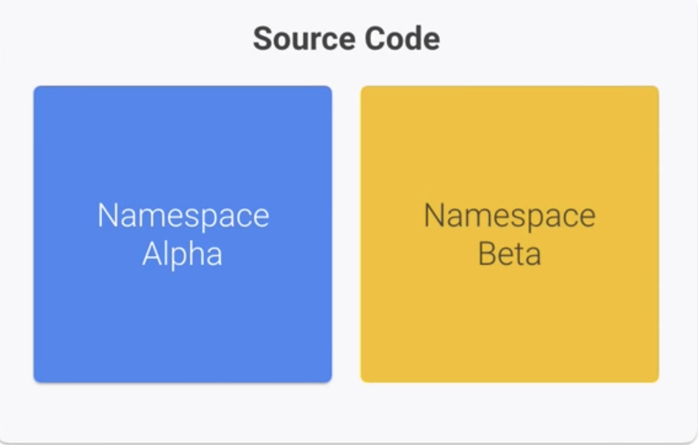
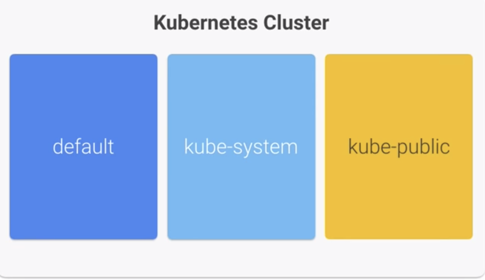
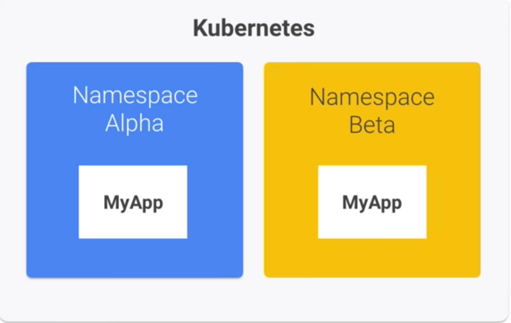
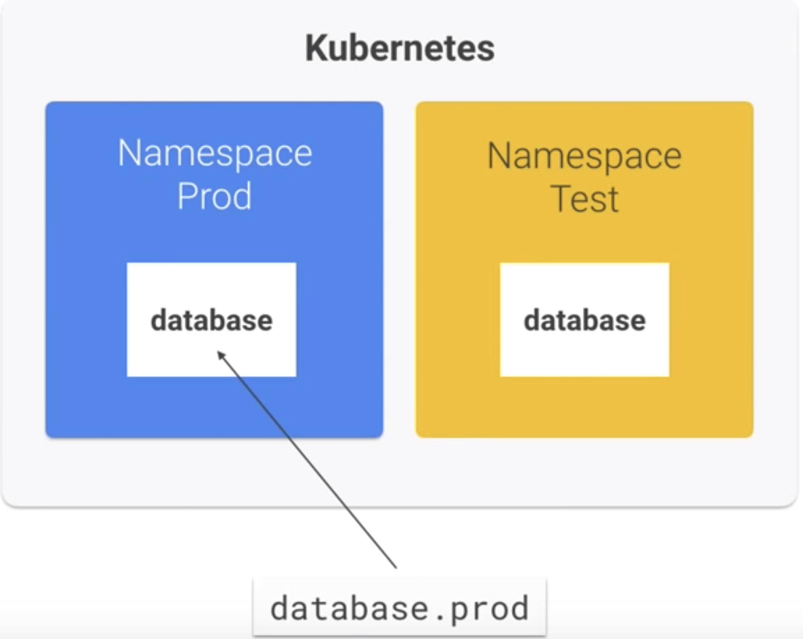
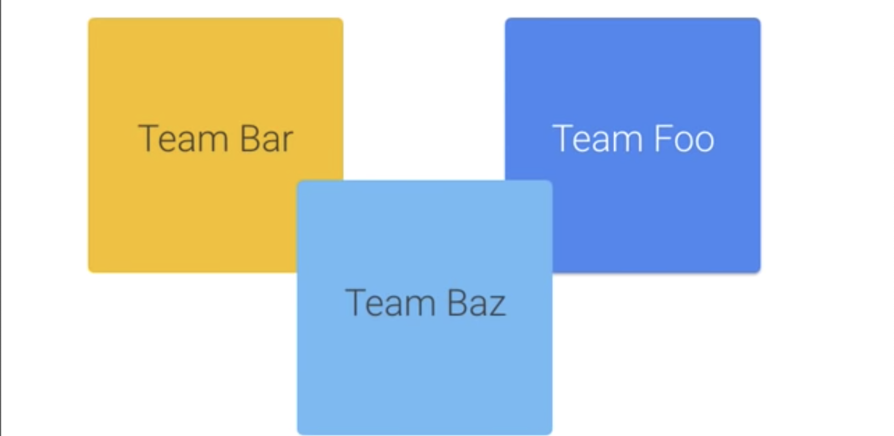
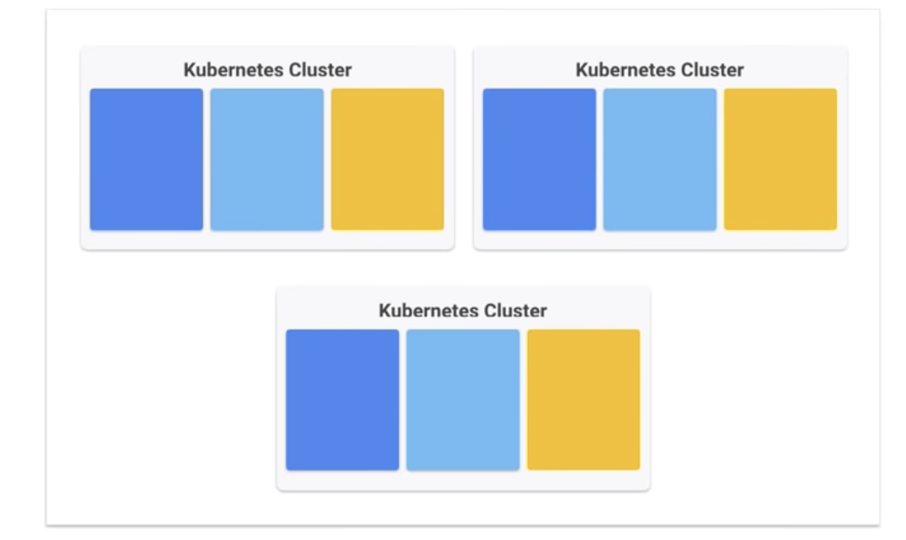

# Organizing Kubernetes with Namespaces

### What is a namespace?

**Namespace is `virtual cluster` inside your Kubernetes cluster**, and you can have multiple namespace inside one single cluster. They are isolated from each other



### The "default" Namespace

 

* **default**

* **kube-system**

* **kube-public**: is not available now


#### You should create multiple namespaces and use them to segment your service into manageable chunks

### Creating Namespaces

```
$ kubectl create namespace test 


> test.yaml 

kind: Namespace 
apiVersion: v1 
metadata: 
  name: test 
  labels: 
    name: test 
    
$ kubectl apply -f test.yaml 
```


### Creating Resources inside Namespaces

#### Option 1

```
apiVersion: v1
kind: Pod 
metadata: 
  name: mypod 
  labels: 
    name: mypod 
spec: 
  containers: 
  - name: mypod 
    image: nginx 
```

```
$ kubectl apply -f pod.yaml --namespace=test
```
#### Option 2

```
apiVersion: v1
kind: Pod 
metadata: 
  name: mypod 
  namespace: test
  labels: 
    name: mypod 
spec: 
  containers: 
  - name: mypod 
    image: nginx 

```

### Viewing Resources inside Namespaces

```
$ kubectl get pods

No resource found

$ kubectl get pods --namespace=test

NAME    READY   STATUS     RESTARTS  AGE
mypod   1/1     Running    0         10s
```


### Managing Namespaces

```
$ kubens

default       *
kube-public
kube-system
test
```

```
$ kubens 
test Context "gke" modified. 
Active namespace is "test". 

$ kubens 
default 
kube-public 
kube-system 
test         *

$ kubectl get pods

NAME    READY   STATUS     RESTARTS  AGE
mypod   1/1     Running    0         10s
```

## Cross Namespace Communication

 

#### You can create a service for same name in multiple namespaces


```
<Service Name>.<Namespace Name>.svc.cluster.local

<Service Name>.<Namespace Name>
```

#### If you web service want to call prod database service

 


## Name Granularity 

### The Small Team

 

### Rapidly growing teams and the large company

 

### Enterprise

 


