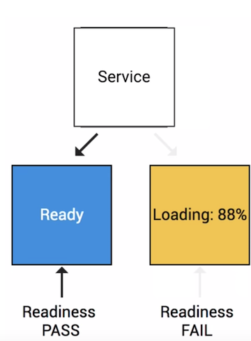
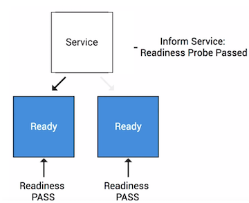
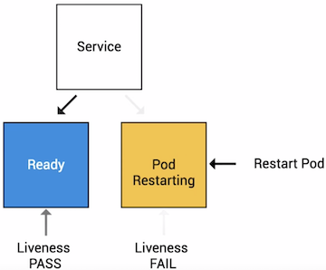

# Kubernetes Health Checks with Readiness and Liveness Probes 

## Types of Health Checks

### 1.Readiness Probe

Readiness is designed to let Kubernetes know when your app is ready to serve traffic. 

**Kubernetes will make sure the readiness probe passes before allowing the service to send traffic to the pod. If a readiness probe starts to fail, Kubernetes will stop sending traffic to the pod until it pass again**






### 2.Liveness Probe

**Liveness probes lets kubernetes know if your app is alive and dead. If your app is alive, then Kubernetes will leave it alone. If your app is dead, then Kubernetes will remove the pod and start new one to replace it**



## Types of Probes

### 1.HTTPS

```
spec: 
  containers:
  - name: liveness 
    livenessProbe: 
      httpGet: 
        path: /healthz 
        port: 8080 
```

### 2.Command

```
spec: 
  containers: 
  - name: liveness 
    livenessProbe: 
      exec: command: 
      - myprogram 
```

### 3.TCP

```
spec: 
  containers: 
  - name: liveness 
    livenessProbe: 
      tcpSocket: 
      port: 8080 
```


## Configuring Probes


* **initialDelaySeconds** 
* periodSeconds 
* timeoutSeconds 
* successThreshold 
* failureThreshold 


