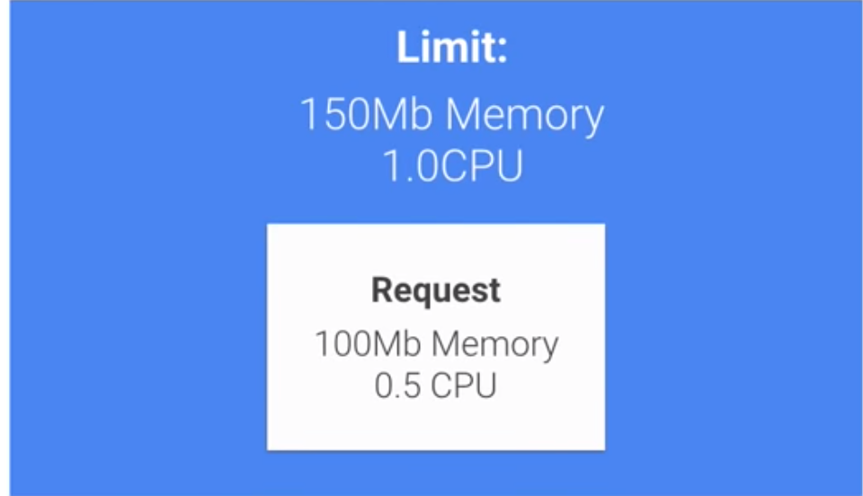
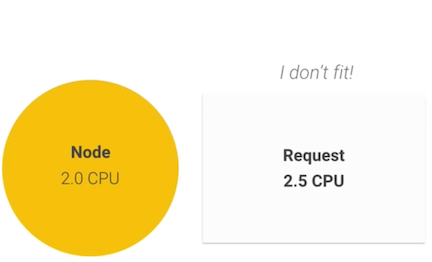
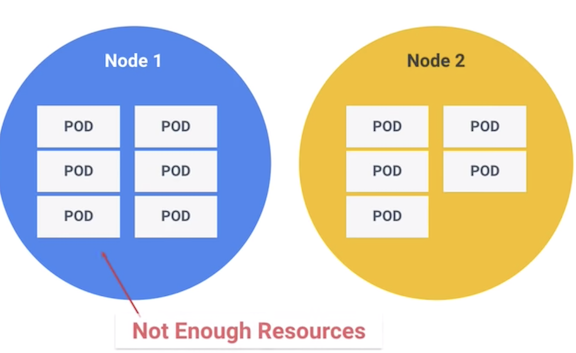
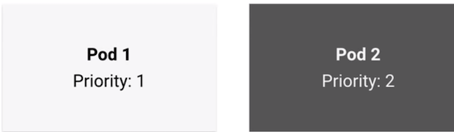
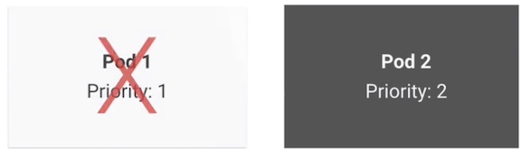

# Setting Resource Requests and Limits in Kubernetes 

[kubernetes 的资源配额控制器](https://github.com/Chao-Xi/JacobTechBlog/blob/master/k8s_tutorial/k8s_adv8_resource_quotation.md)

## Requests and Limits



### In kubernets CPU and Memory

#### container settings

```
containers: 
  - name: containerl 
    image: busybox 
    resources: 
      requests: 
        memory: "32Mi" 
        cpu: "200m" 
      limits: 
        memory: "64Mi" 
        cpu: "250m
```

**CPU is consider a compressible resource, if your app starts hitting your CPU limits, Kubernets will start to throttle your container. This means your CPU will be artificially restricted, giving your app potentially worse performance. However, it won't be terminated or evicted**

**Memory resource are defined in bytes. Normally, you give a mebibyte value from your memory. Just like CPU, if you put a memory request that's larger than the amount of memory on your nodes, the pod never be scheduled**

**Now unlike CPU resource, memory is not compressible. Because there's no way to throttle memory usage, if a container goes past its memory limit, it will be terminated**




## Namespace Settings

1. **ResourceQuota**
2. **LimitRange**

### ResourceQuota

```
apiVersion: v1 
kind: ResourceQuota 
metadata: 
  name: demo 
spec: 
  hard: 
    requests.cpu: 500m 
    requests.memory: 100Mib 
    limits.cpu: 700m 
    limits.memory: 500Mib 
```

### LimitRange

**Unlike a quota, which looks at the whole namespace, a limit range enforces itself on individual containers.**

```
apiVersion: v1
kind: LimitRange 
metadata: 
  name: demo 
spec: 
  limits: 
  - default: 
    cpu: 600m 
    memory: 100Mib
  defaultRequest: 
    cpu: 100m 
    memory: 50Mib 
  max: 
    cpu: 1000m 
    memory: 200Mib
  min: 
    cpu: 10m 
    memory: 10Mib 
  type: Container 
```

### The kubernetets schedule will use round robin load balancing to pick a node to run your workload. 


## The Kubernetes Pod Lifecycle




### Node1 not enough resources will send pod to another node

**If none of the nodes in the system have resource left to fill the request, the pods go inyo a pending state**


## Overcommitment


### Limit is higher than the request



**K8S will rank these pods by priority, and then terminate the lowest priority pods first**


