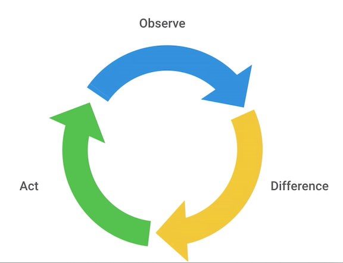
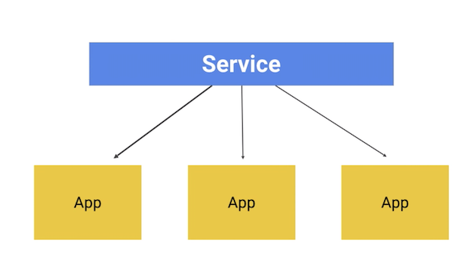
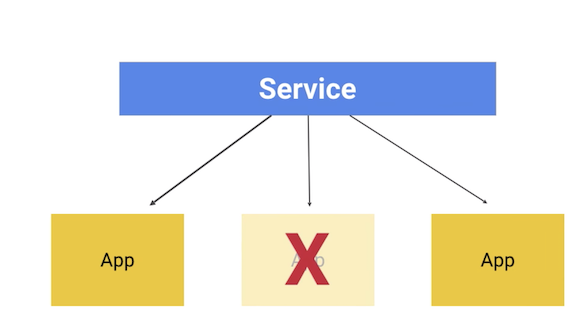
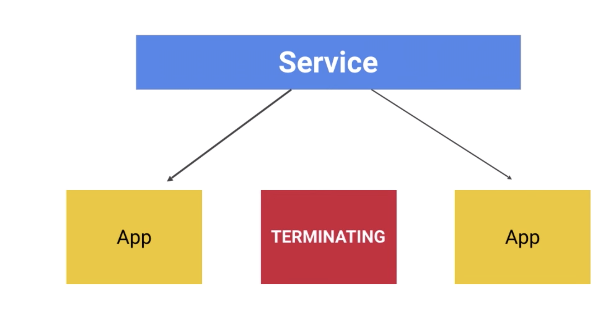
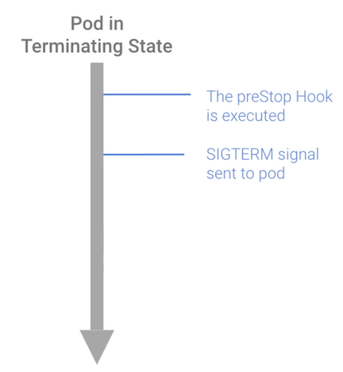
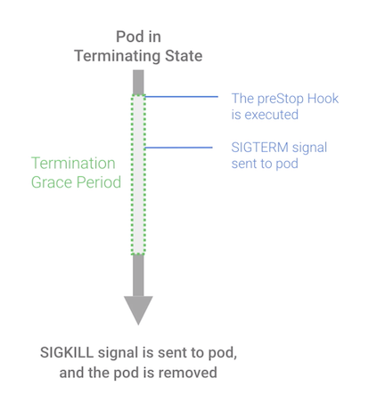

# K8S Terminating with Grace 



Kubernetes uses an **invent loop** to make sure that resources are **healthy from containers to nodes themselves.**This means you no longer need to manually run these monitoring process. 

If a resource has failed the health check, **Kubernetes will just automatically spin up a replacement**.


## Kubernetes Termination Lifecycle
  
#### Kubernetes might terminate a perfectly healthy container Like you update your deployment with a rolling update, kubernetes will slowly terminate old pods, while spinning up a new one. 


If drain a node, Kubernetes will terminate all pods in that node. And if a node runs out of resources, kubernetes will terminate pods to free those resources.

**So it's important that your application can handle termination gracefully so, that if there is minimal impact on the end user and there's a minimal impact on the time to recovery.**


When the service receives termination message, it should begin to shut down. Once Kubernetes decides to terminate your pod, a series events takes place.





**At this point, the pod will stop getting new traffic**



**Containers running in the pod will not be affected, but all new traffic will preventing from coming in.**

## Prestop hook


The prestop hook is a **special command or HTTP request** that is sent to the container in the pod. You can **use this hook to trigger a graceful shutdown**.

So now, at this point, **Kubernetes will send the sigterm signal to the containers in the pod.** This containers know that **they're going to be shut down soon**. 


[How to use Prestop hook](https://github.com/Chao-Xi/JacobTechBlog/blob/master/k8s_tutorial/k8s_adv21_pod_hook.md#%E7%A4%BA%E4%BE%8B2-%E4%BC%98%E9%9B%85%E5%88%A0%E9%99%A4%E8%B5%84%E6%BA%90%E5%AF%B9%E8%B1%A1)

```
apiVersion: v1
kind: Pod
metadata:
  name: hook-demo2
spec:
  containers:
  - name: hook-demo2
    image: nginx
    lifecycle:
      preStop:
        exec:
          command: ["/usr/sbin/nginx","-s","quit"]
```

**Turn off Nginx before terminating the pod**


**So your code should listen for this event and then start shutting down cleanly at this point. So this may include stopping and love-lived connections, like a database connection or a WebSocket stream, saving the current state, and doing things like that.**



## terminationGracePeriodSeconds

```
apiVersion: v1 
kind: Pod 
metadata: 
  name: my-pod 
spec: 
  containers: 
  - name: my-container 
    image: busybox 
  terminationGracePeriodSeconds: 60 
```



At this point, kubernetes will wait for a specified time called the termination grace period.**By default, this 30 seconds**. It's important to note that this happens in parallel to the prestop hook and the sigterm signal. **Kubernetes will not wait for the prestop hook or the sigterm signal to finish**. 

**If your app finishes shutting down before the termination, grace period is done, Kubernetes will just move to the next step immediately.**

#### Now if your pod takes longer than 30 seconds to shut down, make sure increase the grace period.

```
terminationGracePeriodSeconds: 60 
```

**If the container are still running after the grace period,** they are sent the **sigkill** and **then forcebly removed. And this point, Kubernetes cleans up all the object as well**


