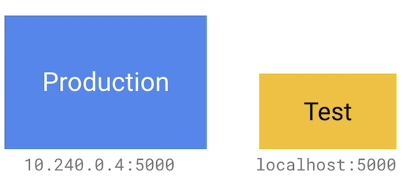
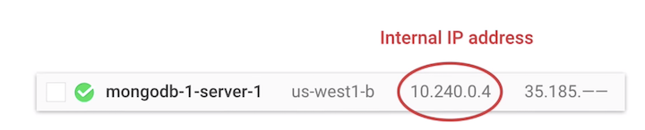
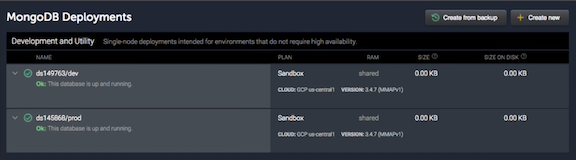
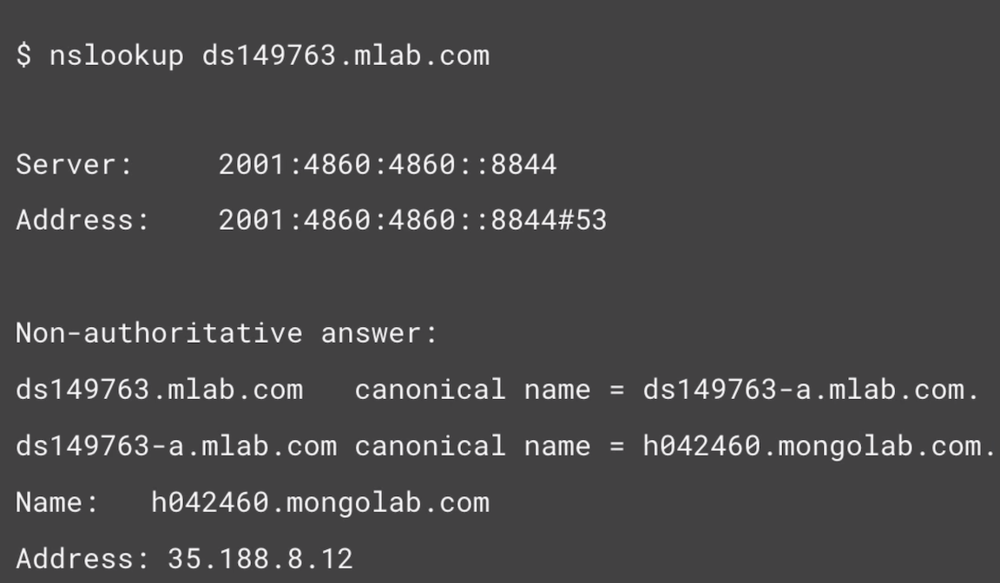

# K8S Mapping External Services

#### Mapping external source to internal ones, give you flexibility to bring these services into the cluster in the future while minimizing refactor efforts

## Connecting to External Services

One common service that's good example of external example of an external service is a database running outside of your Kubernetes cluster.

**Most databases have separate endpoints for different instances**



**You might have a big machine for production data and maybe a little one for the test environment. Like Mysql and MongoDB, usually prescribe that you connect to the different instances for different environments. But each of these will have different IP address or domain name, and you don't want to change your code from environment to environment.**

**So instead of hard-coding these address, you can actually use the build-in Kubernetes, DNS-based service discovery for these external services just like you can for native Kubernetes services.**


## External Services with IP addresses


Thankfully, you can use **static Kubernetes** services to solve this problem. So in this example, I created a MongoDB server. So because it's created in the same network, or VPC, as the Kubernetes cluster, it can be accessed using the high-performance internal IP address. 



The first step is to create a service. 

### Create Kubernetes Services

```
kind: Service 
apiVersion: v1
metadata: 
  name: mongo 
Spec: 
  type: ClusterIP 
  ports: 
  - port: 27017 
    targetPort: 27017 
``` 

#### This allows you to manually create the endpoints that'll receive traffic from the service

### Create Kubernetes Endpoints

```
kind: Endpoints 
apiVersion: v1 
metadata: 
  name: mongo 
subsets: 
  - addresses: 
      - ip: 10.240.0.4 
    ports: 
      - port: 27017 
```

#### You can see that the endpoints manually define the IP address for the databases and it uses the `same name` as a service. 

#### Kubernetes will use all the IP addresses to find the endpoints as if they were regular Kubernetes pods. 

So now you can access the database with a simple connection string. No need to to use IP addresses in your code at all. If the IP addresses change in the future, you can just update the endpoints with the new IP address, and you applications won't need to make any changes. 

**If you're using a hosted database from a thirds party, chances are give you a URI that you can connect to. If they give you IP address, you can just use the previous method.**


## External Services with Domain Names




So in this this example, I have two MongoDB databases with Domain Name hosted on **mLab**.

One of them is by dev database, and another is production. The connections string for these database are as follows.


**Now, mLab gives you a dynamic URI and dynamic port. And you can see that they are both different.**

So let's connect to the dev database. You can create external name Kubernetes service

### External Name Services

```
kind: Service 
apiVersion: v1 
metadata: 
  name: mongo 
spec: 
  type: ExternalName 
  externalName: ds149763.mlab.com 
```

**This will five you a static Kubernetes service that redirects traffic to the external service. This service will do a simple CNAME redirect at the kernel level so there's very minimal impact on your performance**


**So now you can use a much more simplified connection string. But because external name uses a CNAME redirection, it can't do port remapping. So this may be OK with services with static ports, but unfortunately it falls short in this example where the port is port is dynamic. mLab's free tier gives you a dynamic port number, and you can't change it. This means you need a different connection string for development and production, and you need to hard-core values for the port, which is bad**

### So how can get port remapping to work?

#### This first step is to get the IP address from the URI

#### URIs with port remapping




**If you turn `nslookup`, `hostname`, or the `ping` command against the URI, you can get the IP address of the database. If the services gives you back multiple IP addresses, you can actually use all of them in the endpoints object.**

#### The key thing to remember is that IP address behinds the URI can change without notice. This method is kind of risky to use in production if you aren't sure the IP address won't change 


### Create Endpoints

```
kind: Service 
apiVersion: v1 
metadata: 
  name: mongo 
spec: 
  ports: 
  - port: 27017 
    targetPort: 49763 
```

```
kind: Endpoints 
apiVersion: v1 
metadata: 
  name: mongo 
subsets: 
  - addresses: 
      - ip: 35.188.8.12 
    ports: 
      - port: 49763 
```


**With this, you can connect to the remote database, without needing to specify the port. Kubernetes service transparently does the port remapping.**


