# Upgrading your Cluster with Zero Downtime

Upgrading your Cluster there are two parts need to be upgraded 

## The two parts of a cluster 

1. Master
2. Node

The master need to be updated first, and then the nodes can follow, **Google Kubernetes Engine(GKE)** will automatically upgrade the master as point releases are released, however, it usually wont upgrade to a new version, for example, 1.7 70 1.8 automatically.

## Upgrading the Master with GKE

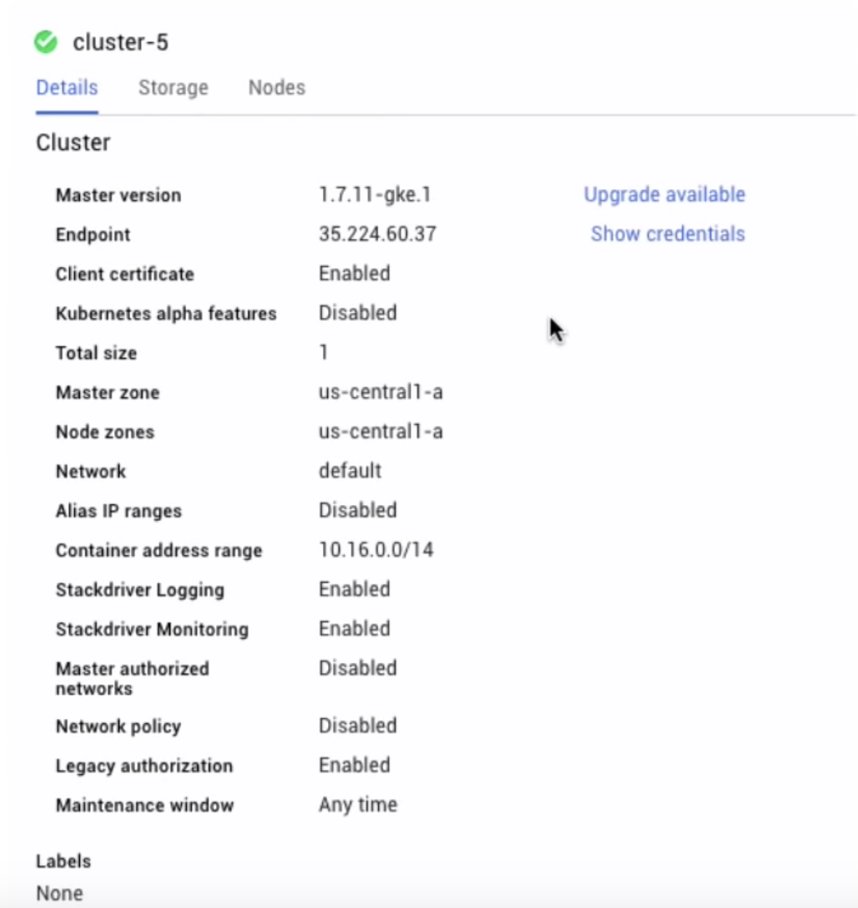

### Upgrading K8S master may take several minutes down time

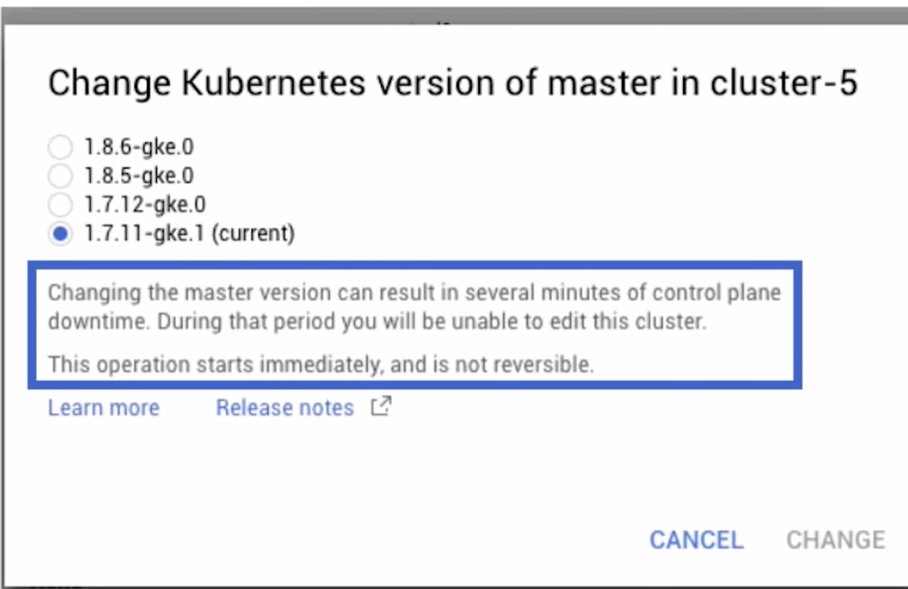

so how do you update the master with zero downtime? While the standard zonal GKE cluster can only have one master backing them, you can actually **create regional clusters that provide multi-zone high-availability masters.** 

#### So when you creating you cluster, be sure to select the regional option

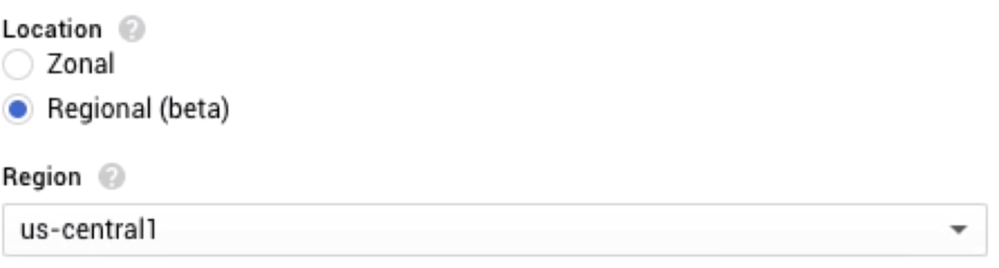

## Upgrading Nodes with Zero Downtime

1. Rolling Update
2. Migration with Node Pools


## Rolling Update

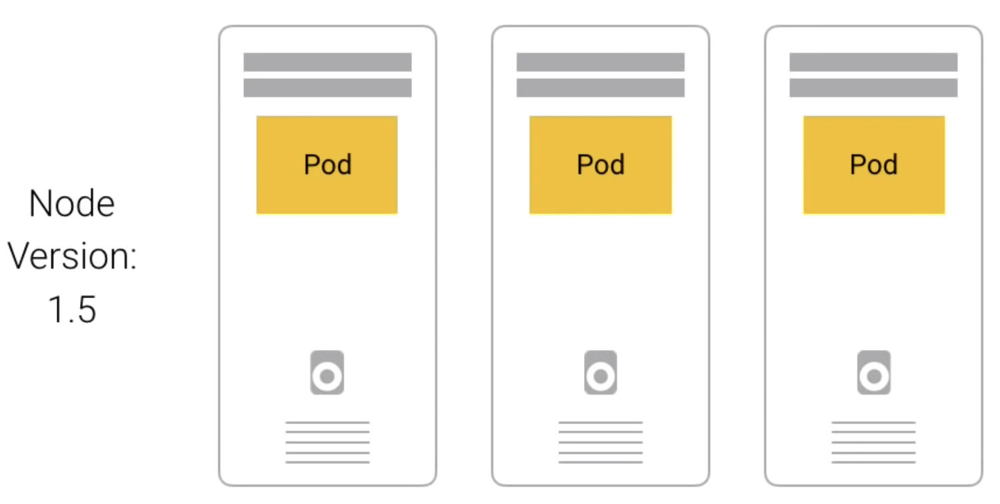

One by one, a mode is drained and cordoned, so that there are no more pods running on that node. 

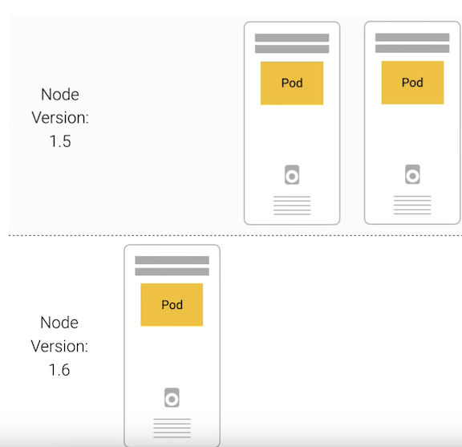

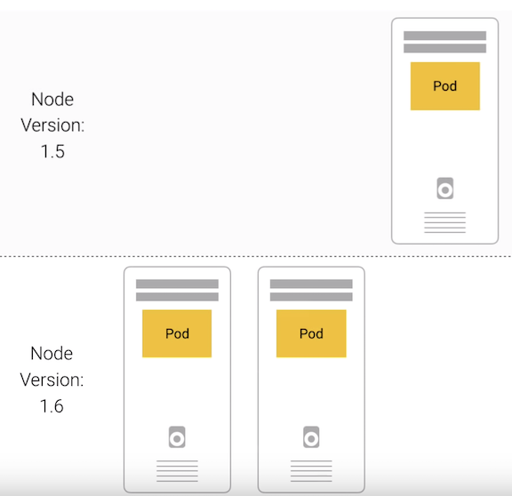

**Then the node is deleted, and the new node is created with the updated Kubernetes version**

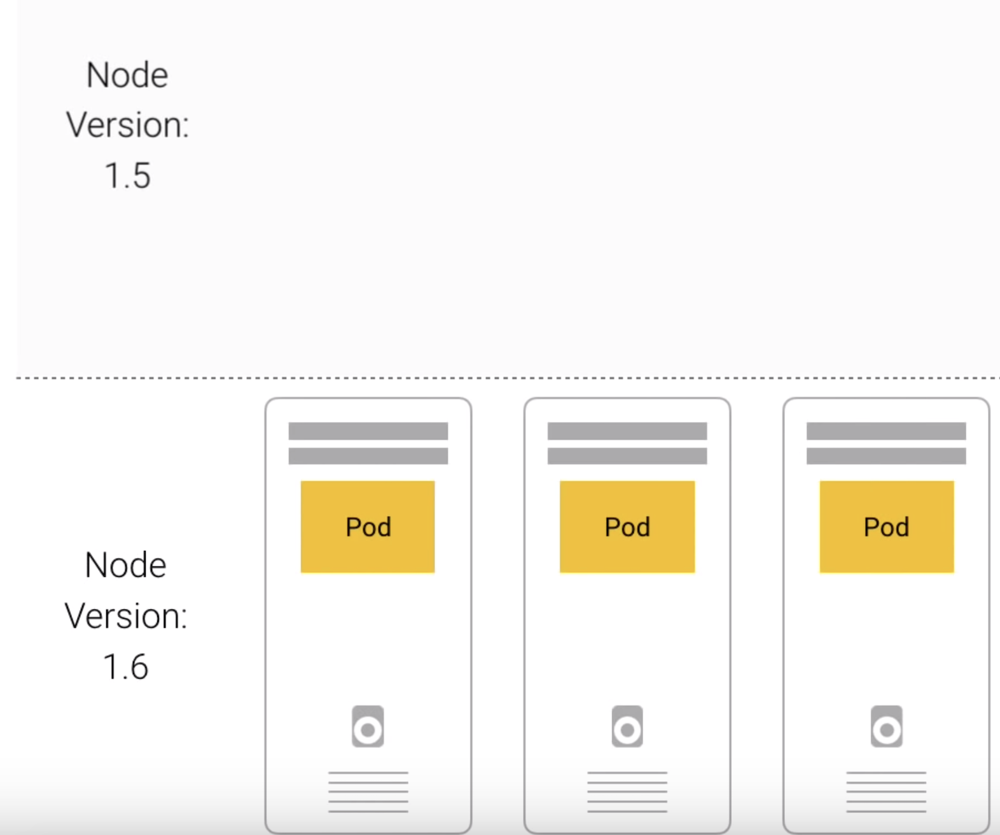

### Enable Rolling Update

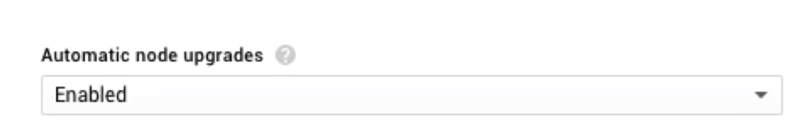

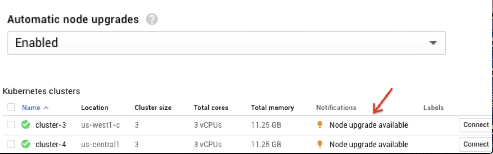


## Migration with Node Pools

So instead of upgrading the active node pool, as you would with the rolling update, **you created a brand new fresh node pool, wait for all the nodes to be running, and then migrate workloads over one node at a time**

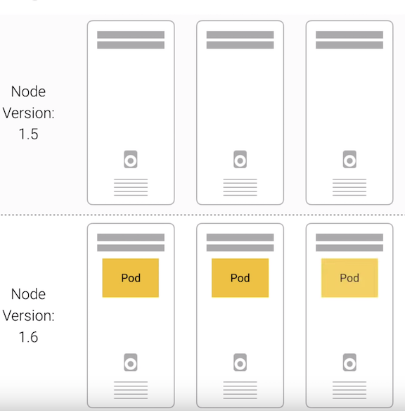

Because you're running these commands yourself, you have more control over the migration process, but GKE is tilling managing the nodes for you

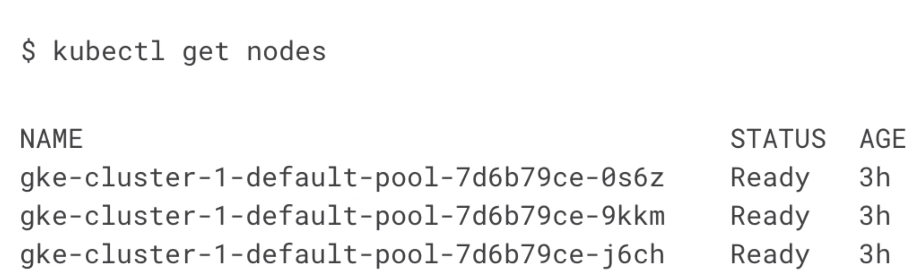

```
$ gcloud container node-pools create pool-two
```


**Notice that there's three more nodes with the new pool name. However, the pods will still be on the old nodes**

1. Cordon each of the old nodes. This will prevent node pods from being scheduled onto them.
2. **Once all the old nodes are cordoned, pods can only be scheduled onto the new nodes.**
3. This means you can start to remove pods from the old nodes and k8s will automaticallt schedule them into the new nodes
4. Then we need drain each node.
5. So this will delete all the pods on that node. After you drain a node, make sure the new pods are up and running before moving on to the next one 
6. If you have any issues during migration, uncordon the old pool, and then cordon and drain the new pool, and the pods will automatically get rescheduled back to get the old pool.
7. Once all the pods are safely rescheduled, **it's just time to delete the old poll**


```
$ Kubectl cordon <Noe_name)
$ kubectl drain <node_name> --force
$ gcloud container node-peel delet define-pool
```