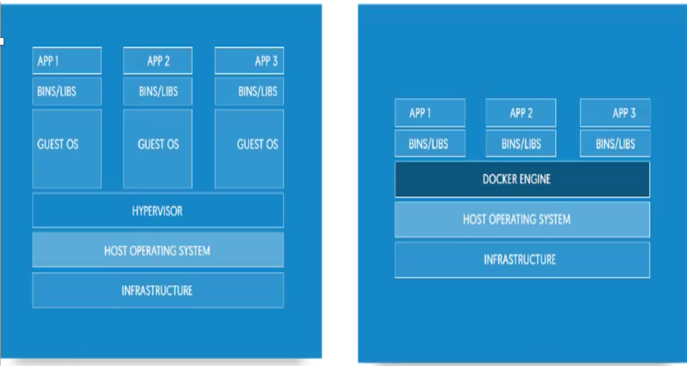

# 从进程说容器

* 容器技术的兴起源于`PaaS`技术的普及；
* `Docker`公司发布的`Docker`项目具有里程碑式的意义；
* `Docker`项目通过“容器镜像”，解决了应用打包这个根本性难题。

## 容器本身没有价值，有价值的是“容器编排”

我们知道容器其实是一种沙盒技术，能够像一个集装箱一样，把应用“装”起来的技术。这样，应用与应用之间，就因为有了边界而不至于相互干扰；而被装进集装箱的应用，也可以被方便地搬来搬去，这不就是PaaS最理想的状态嘛。

不过，这两个能力说起来简单，但要用技术手段去实现它们，可能大多数人就无从下手了。

**所以，我就先来跟你说说这个“边界”的实现手段。**

假如，现在你要写一个计算加法的小程序，这个程序需要的输入来自于一个文件，计算完成后的结果则输出到另一个文件中。

由于计算机只认识0和1，所以无论用哪种语言编写这段代码，最后都需要通过某种方式翻译成二进制文件，才能在计算机操作系统中运行起来。

而为了能够让这些代码正常运行，我们往往还要给它提供数据，比如我们这个加法程序所需要的输入文件。这些数据加上代码本身的二进制文件，放在磁盘上，就是我们平常所说的一个“程序”，也叫**代码的可执行镜像（executable image)**。

然后，我们就可以在计算机上运行这个“程序”了。

#### 1.操作系统从“程序”中发现输入数据保存在一个文件中，所以这些`数据`就被会加载到`内存`中待命。

#### 2.同时，操作系统又读取到了计算加法的指令，这时，它就需要指示`CPU完成加法操作`

#### 3.而CPU与内存协作进行加法计算，又会使用`寄存器存放数值`、`内存堆栈保存执行的命令和变量`

#### 4.计算机里还有被`打开的文件`，以及各种`各样的I/O设备`在不断地调用中修改自己的状态。

就这样，一旦“程序”被执行起来，它就从磁盘上的二进制文件，变成了计算机`内存中的数据`、`寄存器里的值`、`堆栈中的指令`、`被打开的文件`，以及`各种设备的状态信息`的一个集合

### 像这样一个程序运起来后的计算机执行环境的总和，就是我们今天的主角：进程。


所以，对于`进程`来说，**它的静态表现就是程序**，平常都安安静静地待在磁盘上；**而一旦运行起来，它就变成了计算机里的数据和状态的总和，这就是它的动态表现.**

### 而容器技术的核心功能，就是通过约束和修改进程的动态表现，从而为其创造出一个“边界”。


对于`Docker`等大多数`Linux`容器来说，

* `Cgroups` 技术是用来**制造约束**的主要手段，
* `Namespace`技术则是用来**修改进程**视图的主要方法。

你可能会觉得Cgroups和Namespace这两个概念很抽象，别担心，接下来我们一起动手实践一下，你就很容易理解这两项技术了。

假设你已经有了一个Linux操作系统上的`Docker`项目在运行，比如我的环境是`Ubuntu 16.04`和`Docker CE 18.05`。

接下来，让我们首先创建一个容器来试试。

```
$ docker run -it busybox /bin/sh
/ #
```

这个命令是Docker项目最重要的一个操作，即大名鼎鼎的**docker run**。

### 而`-it`参数告诉了Docker项目在启动容器后，需要给我们分配一个`文本输入/输出环境`，也就是`TTY`,

跟容器的标准输入相关联，这样我们就可以和这个`Docker`容器进行交互了。而`/bin/sh`就是我们要在Docker容器里运行的程序。

所以，上面这条指令就是：请帮我启动一个容器，**在容器里执行/bin/sh，并给我分配一个命令行终端跟这个容器交互**。

所以，上面这条指令就是：请帮我启动一个容器，在容器里执行`/bin/sh`，**并给我分配一个命令行终端跟这个容器交互**。

此时，如果我们在容器里执行一下ps指令，就会发现一些更有趣的事情

```
/ # ps
PID  USER   TIME COMMAND
  1 root   0:00 /bin/sh
  10 root   0:00 ps
```

可以看到，我们在`Docker`里最开始执行的`/bin/sh`，就是这个容器内部的**第1号**进程`（PID=1）`，而这个容器里一共只有两个进程在运行。这就意味着，前面执行的`/bin/sh`，以及我们刚刚执行的`ps`，已经被`Docker`隔离在了一个跟宿主机完全不同的世界当中。

本来，每当我们在宿主机上运行了一个`/bin/sh`程序，**操作系统都会给它分配一个进程编号**，比如`PID=100`。这个编号是进程的唯一标识，就像员工的工牌一样。所以`PID=100`，可以粗略地理解为这个`/bin/sh`是我们公司里的第100号员工，而第1号员工就自然是比尔 · 盖茨这样统领全局的人物。


而现在，我们要通过Docker把这个/bin/sh程序运行在一个容器当中。这时候，Docker就会在这个第100号员工入职时给他施一个“障眼法”，让他永远看不到前面的其他99个员工，更看不到比尔 · 盖茨。这样，他就会错误地以为自己就是公司里的第1号员工。


这种机制，其实就是对被隔离应用的进程空间做了手脚，使得这些进程只能看到重新计算过的进程编号，比如`PID=1`。可实际上，他们在宿主机的操作系统里，还是原来的第100号进程。

### 这种技术，就是Linux里面的Namespace机制

而`Namespace`的使用方式也非常有意思：它其实只是`Linux`创建新进程的一个可选参数。我们知道，在`Linux`系统中创建线程的系统调用是`clone()`，比如：

```
int pid = clone(main_function, stack_size, SIGCHLD, NULL); 
```

这个系统调用就会为我们创建一个新的进程，并且返回它的进程号`pid`。

而当我们用`clone()`系统调用创建一个新进程时，就可以在参数中指定`CLONE_NEWPID`参数，比如：

```
int pid = clone(main_function, stack_size, CLONE_NEWPID | SIGCHLD, NULL); 
```

这时，新创建的这个进程将会“看到”一个全新的进程空间，在这个进程空间里，它的PID是1。之所以说“看到”，是因为这只是一个“障眼法”，在宿主机真实的进程空间里，这个进程的PID还是真实的数值，比如100。

当然，我们还可以多次执行上面的`clone()`调用，这样就会创建多个`PID Namespace`，而每个`Namespace`里的应用进程，都会认为自己是当前容器里的第1号进程，它们既看不到宿主机里真正的进程空间，也看不到其他`PID Namespace`里的具体情况。

#### 而除了我们刚刚用到的PID Namespace，Linux操作系统还提供了Mount、UTS、IPC、Network和User这些Namespace，用来对各种不同的进程上下文进行“障眼法”操作。

比如，

* `Mount Namespace`，用于让被隔离进程只看到当前`Namespace`里的挂载点信息；

* `Network Namespace`，用于让被隔离进程看到当前`Namespace`里的网络设备和配置。


实际上是在**创建容器进程时**，指定了**这个进程所**需要启用的一组`Namespace参数`。这样，容器就只能“看”到当前**Namespace所限定的资源、文件、设备、状态，或者配置**。而对于**宿主机**以及**其他不相关的程序**，它就完全看不到了。


## 所以说，容器，其实是一种特殊的进程而已。


谈到为“进程划分一个独立空间”的思想，相信你一定会联想到虚拟机。而且，你应该还看过一张虚拟机和容器的对比图。




这幅图的左边，画出了虚拟机的工作原理。其中，名为`Hypervisor`的软件是虚拟机最主要的部分。**它通过硬件虚拟化功能，模拟出了运行一个操作系统需要的各种硬件，比如`CPU`、`内存`、`I/O设备`等等**。

**然后，它在这些虚拟的硬件上安装了一个新的操作系统，即`Guest OS`**。


而这幅图的右边，则用一个名为`Docker Engine`的软件替换了`Hypervisor`。这也是为什么，很多人会把Docker项目称为“轻量级”虚拟化技术的原因，实际上就是把虚拟机的概念套在了容器上。

#### 可是这样的说法，却并不严谨。

在理解了`Namespace`的工作方式之后，你就会明白，**跟真实存在的虚拟机不同**，在使用`Docker`的时候，并没有一个真正的“Docker容器”运行在宿主机里面。`Docker`项目帮助用户启动的，还是原来的应用进程，只不过在创建这些进程时，`Docker`为它们加上了各种各样的`Namespace`参数。

这时，这些进程就会觉得自己是各自`PID Namespace`里的第`1号进程`，**只能看到各自Mount Namespace里挂载的目录和文件**，**只能访问到各自Network Namespace里的网络设备**，就仿佛运行在一个个“容器”里面，与世隔绝。

